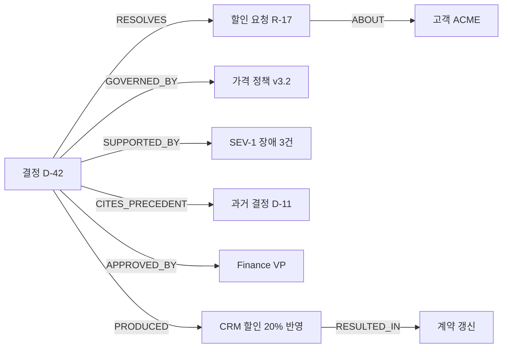
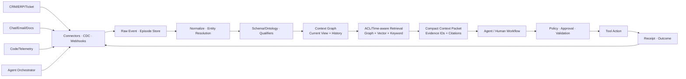
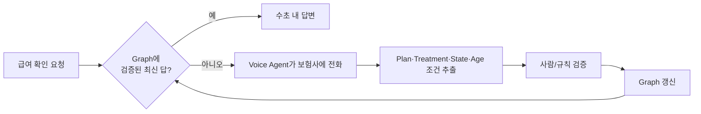

# [사전 조사] Context Graph란?

- 작성일: 2026-09-06
- 조사 범위: Context Graph의 개념, 용어의 계보, 관련 기술, 구현 구조, 공개 사례와 한계
- 대상 포스트: 후속 `Context Graph란?` 포스트
- 포스트 성격: 기술적 깊이는 유지하되 **산업 현장의 AX 도입 사례와 실제 성과를 우선**
- 독자 가정: AI와 데이터 기술에는 관심이 있지만 지식 그래프나 에이전트 아키텍처를 깊게 공부하지 않은 경영진·기획자
- 조사 원칙: 논문, 표준, 공식 기술 문서, 당사자 자료를 우선하고 제품사의 수치와 투자사의 전망은 그 성격을 따로 표시함
- 기준 시점: 2026-09-06

---

## 0. 조사 결론 먼저

### 가장 중요한 결론

`Context Graph`는 아직 합의된 단일 표준 용어가 아니다. 2024년 학술 논문에서는 시간·장소·출처 같은 맥락을 사실에 덧붙인 지식 그래프를 뜻했고, 2025년 말부터 확산된 기업 AI 담론에서는 정책·승인·예외·선례·결과를 잇는 업무 및 의사결정 기록을 뜻한다. 2026년 제품 시장에서는 에이전트 메모리, 업무 프로세스 그래프, API·도구 카탈로그까지 같은 이름으로 부른다.

따라서 포스트에서 먼저 **이 글에서 사용할 정의**를 밝혀야 한다.

> 이 글에서 Context Graph는 조직의 사람·업무 객체·정책과, 이들을 바꾼 행동·판단·승인·예외·결과를 시간·출처·권한과 함께 연결해, 에이전트와 사람이 현재 상태를 판단하고 과거의 의사결정 경로를 재구성할 수 있게 만든 동적인 관계 모델을 뜻한다.

이 정의의 핵심은 `그래프 데이터베이스`가 아니라 다음 다섯 가지다.

1. 고객·문서 같은 명사뿐 아니라 승인·반려·변경 같은 **행위와 결정도 일급 객체**로 다룬다.
2. 최종 상태만 보존하지 않고 그 상태에 이른 **경로와 당시 조건**을 남긴다.
3. 모든 사실과 관계에 **시간, 출처, 버전, 신뢰도**를 붙인다.
4. 원천 시스템의 **접근 권한**을 검색 시점에도 지킨다.
5. 기록을 다시 검색하고 재생해 다음 판단에 쓰고, 새 실행의 결과를 다시 기록하는 **폐쇄 루프**를 만든다.

### 한 문장으로 더 쉽게 말하면

> 기존 업무 시스템이 `결과가 무엇인가`를 저장한다면, Context Graph는 `누가 어떤 근거와 규칙을 보고 어떤 경로로 그 결과에 도달했는가`를 연결해 둔 조직의 운영 기억이다.

다만 `왜`를 완벽하게 저장한다는 표현은 과장될 수 있다. 실제로 확실히 남길 수 있는 것은 다음과 같다.

- 어떤 입력과 문서를 봤는가
- 어떤 정책 버전을 적용했는가
- 어떤 도구와 시스템을 거쳤는가
- 누가 제안하고 승인하거나 거절했는가
- 어떤 예외가 명시적으로 기록됐는가
- 무엇을 실행했고 결과가 어땠는가

사람의 머릿속 동기나 모델의 실제 내부 추론까지 자동으로 알 수 있는 것은 아니다. Glean도 `why를 직접 포착하기보다 how의 반복 패턴으로 probable why를 추정한다`고 선을 긋는다. Foundation Capital 역시 Context Graph를 모델의 chain-of-thought가 아니라 외부에서 관찰·재생 가능한 decision trace로 정의한다.

### 이 용어의 신선함과 기술의 신선함을 구분해야 한다

Context Graph가 해결하려는 문제는 새롭지 않다.

- 지식 그래프와 온톨로지: 객체와 관계의 의미
- temporal knowledge graph: 사실의 유효 시간
- RDF named graph·reification·PROV-O: 진술의 출처와 한정자
- event sourcing: 상태 변경 이력과 재생
- process mining: 실제 이벤트에서 업무 흐름 발견
- distributed tracing: 실행 경로와 인과적으로 연결된 호출
- data lineage: 데이터가 어디서 왔고 어떻게 변했는지
- agent memory: 세션을 넘어 유지되는 경험과 사실

2025~2026년 기업 AI 담론의 새로움은 이 재료들을 발명한 데 있지 않다. **에이전트가 실제 업무의 실행 경로에 들어온 순간, 흩어진 재료를 의사결정 중심으로 묶어 다음 에이전트 실행의 컨텍스트로 되돌려 주자**는 제품·아키텍처 관점에 있다.

### 권장 중심 논지

> Context Graph는 새로운 종류의 그래프 DB라기보다, 조직의 결정과 실행 문맥을 시간·출처·권한과 함께 자산화하여 에이전트가 다시 사용할 수 있게 만드는 운영 기억 계층에 가깝다.

---

## AX 사례를 먼저 읽는 요약

이 포스트에서 사례는 기술을 장식하는 예시가 아니라 중심 증거로 다룬다. 다만 `Context Graph`라는 명칭이 2025년 말부터 빠르게 확산됐기 때문에, 실제 현장에는 **같은 구조를 knowledge layer, enterprise graph, Teamwork Graph, operational ontology라고 부르며 먼저 운영한 사례**가 더 많다.

사례는 다음 두 축으로 판별한다.

- **개념 직접성**: 당사자가 실제로 Context Graph라고 부르는가, 아니면 구조가 유사한 인접 사례인가?
- **현장 증거**: named customer, 실제 업무, production 여부, 전후 수치, 측정 범위가 공개됐는가?

### 우선 검토할 산업 사례

| 우선 | 조직·산업 | 실제로 바꾼 업무 | Context Graph의 역할 | 공개 성과 | 해석 시 주의 |
|---|---|---|---|---|---|
| 1 | **Zuora / B2B SaaS** | 고객 장애 조사, L3 escalation, code review | code·ticket·telemetry·고객 issue·운영 지식을 잇는 production context graph | L3 escalation 90% 감소, 월 60+건을 engineering 없이 해결, code review·error isolation 시간 87.5% 감소 | 공급사 PlayerZero가 작성한 named-customer 사례 |
| 2 | **Mercedes-Benz / 자동차** | 차량 software defect intake·triage·중복 탐지 | Teamwork Graph가 사람·work·context를 조직 기억으로 연결하고 Rovo agent를 grounding | defect report 품질 90% 개선, duplicate detection 속도 85% 향상, 50,000+ 사용 기반 | Context Graph라는 일반명 대신 Atlassian 제품명 사용, 전체 10x delivery 수치와 단일 agent 효과를 구분 |
| 3 | **Infinitus / 헬스케어** | 보험 급여·처방 coverage 확인 | 이전 AI 전화에서 검증한 payer-plan-treatment-state-age 규칙과 예외를 graph에 축적, 다음 요청에서 재사용 | 복잡한 규칙 query 1초 미만, 사람 4~5일 → AI 전화 1~2일 → graph로 call을 피하면 수초, 두 자릿수 비율 instant verification | Neo4j 공급사 사례이며 `knowledge layer`라는 명칭 사용 |
| 4 | **Pinterest / 데이터 분석** | table 탐색, reusable query 발견, text-to-SQL | 과거 SQL의 분석 의도·join/filter pattern을 governance·freshness·ownership과 결합한 공용 context layer | 출시 2개월 내 analyst의 40% 사용, 사내 #1 agent, 다음 agent보다 사용량 10배 | Pinterest Engineering이 직접 architecture와 한계를 공개. full decision graph보다 analytics context graph에 가까움 |
| 5 | **GT Golf / 유통** | email·PDF·Excel·손글씨 주문을 NetSuite draft order로 변환 | 15명 업무의 screen trace에서 customer/SKU matching, 창고 선택, 예외 관행을 추출해 agent context로 사용 | 주문 한 건 10분+ → 30초 이내 draft, 전달된 email order의 82% 자동화, 사람 최종 승인 | process capture는 구체적이나 graph 저장 구현은 공개가 제한적 |
| 6 | **미국 자산운용사 / 금융** | portfolio reconciliation과 compliance monitoring | Snowflake·Salesforce·Databricks entity를 graph로 통합하고 규칙·transaction path를 Gemini 답변의 근거로 사용 | 예상 6개월이던 production 도입을 6주에 완료, 연 $1.2M 절감, 370% ROI | 고객명 비공개, Arhasi·Neo4j가 발표한 공급사 수치 |
| 7 | **General Mills / 소비재·공급망** | 물류 제약·capacity·network cost를 반영한 주문별 추천 | 200개 master/operational table을 Palantir Ontology로 연결해 AIP execution에 제공 | 추천의 70%+를 사람이 수용, 하루 $40K·연 $14M 절감, 일부 network에서의 결과 | `Context Graph` 명칭 등장 전의 operational ontology 선행 사례 |
| 8 | **Covered California·DBS·Mediafly / 공공·금융·B2B** | 정책 탐색, 법안 분석, HR·invoice·support·CRM workflow | permission-aware Enterprise Graph와 connector 위에서 부서별 agent 운영 | Covered California 50명 pilot→1,500명, 주 4~6시간 절감 보고; DBS 40,000+ users·최대 업무시간 10% 절감; Mediafly 90% adoption | Glean이 작성한 고객 사례이며 graph만의 순효과로 분리된 수치는 아님 |
| 9 | **Rockwell Automation·PACCAR / 제조** | license-설비-customer 연결, chassis-component-wear-service 관계 통합 | IndyKite가 provenance·temporal validity·access control을 포함한 Context Graph 제공 | under/over-licensing 및 installed-base visibility, service operation 개선 사례 공개 | 직접 Context Graph 사례지만 정량 성과는 공개되지 않음 |

### 포스트의 주 사례로 가장 적합한 조합

1. **Zuora**: Context Graph를 실제 운영 모델의 이름으로 쓰며 조직 경계까지 바꾼 직접 사례
2. **Infinitus**: 한 번의 agent 실행이 다음 실행의 검증된 memory가 되는 폐쇄 루프
3. **Mercedes-Benz**: 대규모 제조·software 조직에서 graph-grounded agent가 구체적 품질 KPI를 바꾼 사례
4. **Pinterest**: 현업이 남긴 query history를 조직의 재사용 가능한 판단 방식으로 바꾼 직접 engineering 사례
5. **GT Golf**: 거대한 전사 data project가 아니라 좁은 업무 관찰에서 시작한 중견·중소 조직용 사례

이 다섯 사례를 쓰면 `support/engineering`, `healthcare`, `manufacturing`, `analytics`, `operations`가 겹치지 않고, Context Graph가 하나의 제품 모양이 아니라 **AX의 서로 다른 문제를 푸는 공통 구조**라는 점을 보여줄 수 있다.

### 사례가 보여주는 AX 패턴

```text
1. 흩어진 데이터 연결       → Rockwell, PACCAR, Pinterest
2. 현업의 실제 처리 방식 포착 → GT Golf
3. agent가 필요한 근거 제공   → Mercedes-Benz, Arhasi
4. human/agent 실행           → Zuora, Infinitus, General Mills
5. 결과와 예외를 다시 축적     → Zuora, Infinitus, Pinterest
6. 검증된 범위부터 확장        → Covered California, Mercedes-Benz
```

경영진 관점에서 가장 중요한 공통점은 모두 **전사 그래프를 먼저 만든 것이 아니라, 비용이 크고 반복되며 여러 시스템을 오가는 한 업무에서 시작했다**는 점이다.

---

## 1. 왜 정의가 여러 개인가

### 1-1. 학술적 의미: 맥락이 붙은 지식 그래프

2024년 `Context Graph` 논문은 일반적인 triple 기반 지식 그래프의 사실에 관계 맥락을 추가한다. 저자들이 드는 맥락은 다음과 같다.

- 사실이 유효한 시간
- 사실과 관련된 지리적 위치
- 수량
- 출처와 근거 문서
- 신뢰도
- 사건별 세부 정보
- 엔티티 설명·별칭·외부 링크·이미지 등

논문은 Context Graph를 대략 다음처럼 정의한다.

- 일반 KG의 사실: `(head, relation, tail)`
- Context Graph의 사실: `(head, relation, tail, relation context)`
- 엔티티 자체에도 `entity context`를 붙임

이어 CGR³라는 Retrieve → Rank → Reason 절차를 제시해 KG completion과 KG question answering에 활용한다. 이 계보에서 Context Graph는 **표현력이 풍부해진 지식 그래프와 그 위의 추론 방법**이다.

출처:

- [Context Graph (Xu et al., 2024)](https://arxiv.org/html/2406.11160)

### 1-2. 기업 AI 의미: 의사결정과 업무의 추적 가능한 기억

2025년 12월 Foundation Capital의 글이 현재 기업 AI 시장에서 쓰이는 의미를 크게 확산시켰다. 이 글은 CRM, ERP, 티켓 시스템 같은 기존 system of record가 최종 상태는 저장하지만 다음을 놓친다고 주장한다.

- 정책에서 벗어난 예외와 override
- 과거의 유사한 판단과 선례
- 여러 시스템에서 모은 근거의 조합
- 시스템 밖에서 일어난 승인
- 선택하지 않은 대안과 갈등 해결
- 당시 적용한 정책 버전

이 글의 정의는 `여러 엔티티와 시간에 걸쳐 이어진 decision trace의 살아 있는 기록`이다. 새 시스템은 `what`을 위한 기존 system of record를 없애기보다 `why was this allowed`를 설명하는 decision system of record가 된다는 투자 논지다.

출처:

- [Foundation Capital — AI’s trillion-dollar opportunity: Context graphs](https://foundationcapital.com/ideas/context-graphs-ais-trillion-dollar-opportunity)

### 1-3. 프로세스 의미: why보다 how를 관찰하는 업무 그래프

Glean은 Foundation의 정의에 중요한 수정을 제안한다.

- 사람의 머릿속에 있는 `why`는 안정적으로 포착할 수 없다.
- 대신 디지털 업무에는 누가 무엇을 열고 수정하고 승인하고 넘겼는지에 대한 `how`가 남는다.
- 시간순 action trace를 묶고 반복되는 프로세스와 이탈 경로를 찾으면 probable why를 추정할 수 있다.

Glean의 정의에서 Context Graph는 사람·문서·티켓·시스템 같은 엔티티를 시간에 따른 행동·이벤트 trace와 연결하고, 여기서 실행 가능한 process insight를 만드는 모델이다. 단순한 decision ledger보다 **process discovery와 agent execution learning**에 가깝다.

출처:

- [Glean — Context is the next data platform](https://www.glean.com/blog/context-data-platform)
- [Glean — How do you build a context graph?](https://www.glean.com/blog/how-do-you-build-a-context-graph)

### 1-4. 에이전트 메모리 의미: 계속 변하는 시간 지식 그래프

Zep의 오픈소스 프로젝트 Graphiti는 Context Graph를 `엔티티, 관계, 사실로 구성된 temporal knowledge graph`라고 정의한다.

- raw message·text·JSON을 episode로 보존
- episode에서 entity와 fact를 추출
- 사실이 현실에서 유효했던 시간과 시스템에 기록된 시간을 구분
- 새 사실이 이전 사실과 충돌하면 과거 사실을 삭제하지 않고 유효 기간을 닫음
- vector, BM25, graph traversal을 섞어 검색

이 의미에서는 의사결정 기록이 필수는 아니다. 사용자 선호와 대화, 비즈니스 데이터처럼 **에이전트가 기억해야 할 변화하는 사실**이면 Context Graph가 된다.

출처:

- [Graphiti GitHub](https://github.com/getzep/graphiti)
- [Zep: A Temporal Knowledge Graph Architecture for Agent Memory](https://arxiv.org/html/2501.13956)

### 1-5. API·시스템 구조 의미: 에이전트가 사용할 환경의 연결 지도

Apollo GraphOS는 Context Graph를 GraphQL 기반 middleware로 부른다.

- API, tool, data source를 한 semantic graph에 연결
- agent와 service identity를 관리
- field-level least privilege를 집행
- 호출과 토큰 사용을 관찰

Clientell은 CRM·warehouse·code 등의 schema, automation, dependency를 연결한 환경 지도를 Context Graph라고 부른다. 이들은 `왜 이 결정을 했는가`보다 `이 필드를 바꾸면 어느 자동화와 대시보드가 영향받는가` 같은 dependency path에 집중한다.

둘 다 쓸모 있는 구조지만 Foundation식 decision-trace graph와 같은 물건은 아니다.

출처:

- [Apollo GraphOS — The Context Graph for Enterprise AI](https://www.apollographql.com/context-graph)
- [Clientell — Context Graph / AI Context Layer](https://www.getclientell.com/ai-context-layer)

### 1-6. 시장에서도 정의가 다름을 인정한다

AlphaSense는 자사 설명 첫머리에서 업계가 Context Graph를 서로 다르게 사용한다고 직접 밝힌다. 투자사는 decision trace, 업무 소프트웨어사는 workplace activity graph를 뜻하고, AlphaSense 자신은 knowledge graph 위에 memory·tools·skills를 합친 agent working context라는 의미를 쓴다.

Gartner의 2026년 유료 리서치 공개 초록은 Context Graph를 전통적 KG에서 발전해 decision logic, workflow, event tracing, state management까지 다루는 agent grounding 구조로 요약한다. Thoughtworks Technology Radar는 decision, policy, exception, precedent, evidence, outcome을 연결 노드로 모델링하는 기법으로 소개하면서 `Assess` 단계에 놓았다.

이 상황을 종합하면 2026년 현재 Context Graph는 표준 데이터 모델 이름이라기보다 **여러 인접 기술이 합쳐지는 신생 아키텍처 범주**라고 보는 것이 정확하다.

출처:

- [AlphaSense — The Context Graph](https://www.alpha-sense.com/resources/product-articles/context-graph/)
- [Gartner — How Context Graphs Are Solving AI’s Institutional Memory Problem](https://www.gartner.com/en/documents/7436862) — 공개 초록만 확인 가능
- [Thoughtworks Technology Radar — Context graph](https://www.thoughtworks.com/radar/techniques/context-graph)

---

## 2. 이 포스트에서 쓸 작업 정의

### 권장 정의

> Context Graph는 조직의 엔티티와, 그 엔티티를 둘러싸고 일어난 사실·행위·결정·정책·예외·근거·결과를 시간과 출처, 권한까지 포함해 연결한 동적 그래프다. 현재 상태를 찾는 데 그치지 않고, 그 상태가 만들어진 경로를 검색하고 재생해 사람과 에이전트의 다음 판단에 제공한다.

### 이 정의에 반드시 들어갈 구성요소

| 구성요소 | 질문 | 예 |
|---|---|---|
| Entity | 무엇에 대한 일인가? | 고객, 계약, 티켓, 서비스, 제품 |
| Actor | 누가 관여했는가? | 직원, 팀, agent, 외부 고객 |
| Event/Action | 무슨 일이 일어났는가? | 생성, 수정, 에스컬레이션, 배포 |
| Decision | 무엇을 선택했는가? | 할인 승인, 롤백 결정, 환불 거부 |
| Policy/Rule | 어떤 기준을 적용했는가? | 할인 한도 정책 v3.2 |
| Evidence | 무엇을 보고 판단했는가? | 장애 3건, 계약 조항, 대화 |
| Exception/Precedent | 정상 경로에서 왜 벗어났는가? | VP 승인, 과거 유사 사례 |
| Outcome | 결과가 어땠는가? | 갱신 성공, 재발, MTTR 감소 |
| Time | 언제 사실이었고 언제 알았는가? | valid time, recorded time |
| Provenance | 어디에서 온 주장인가? | CRM API, Slack message, 사람 입력 |
| Access | 누가 이 맥락을 볼 수 있는가? | tenant, row/field ACL, sensitivity |

### Context Graph가 아닌 것

- 예쁜 network visualization만 있는 것
- 문서 chunk를 단순히 노드로 바꾼 vector RAG
- 모든 대화 로그를 한곳에 쌓은 data lake
- 모델의 숨은 chain-of-thought를 저장한 것
- 업무 workflow의 실행 순서만 표현한 DAG
- 그래프 데이터베이스를 도입했다는 사실 자체
- 출처·시간·권한 없이 LLM이 추출한 triple 모음

### 최소 판별 기준

어떤 제품이나 시스템을 Context Graph라고 부르려면 적어도 다음 질문에 답할 수 있어야 한다.

1. `지금 유효한 사실은 무엇인가?`
2. `이 사실은 어느 원문과 어느 시점에서 왔는가?`
3. `어떤 사건·결정이 현재 상태를 만들었는가?`
4. `그때 적용된 정책과 승인은 무엇인가?`
5. `이 질문자 또는 agent가 볼 수 있는 범위는 어디까지인가?`
6. `과거 시점의 상태와 당시 agent에게 제공된 맥락을 재생할 수 있는가?`
7. `이후 실제 결과가 어땠는지 연결되어 있는가?`

일부 제품은 이 중 일부만 충족한다. 따라서 `완전한 Context Graph인가`를 논쟁하기보다 **어떤 context를 그래프로 만들고 어떤 질문에 답하는지**를 확인하는 편이 실용적이다.

---

## 3. `why`를 저장한다는 말의 정확한 의미

### 네 단계로 나누면 혼동이 줄어든다

| 수준 | 저장 가능한 것 | 신뢰 수준 |
|---|---|---|
| 1. Observable trace | 조회한 데이터, tool call, 정책 평가, 승인, action, 결과 | 실제 로그가 있으면 높음 |
| 2. Declared rationale | 사람이 입력하거나 승인 메시지에 남긴 이유 | 진술 자체는 관찰 가능하나 진짜 동기와 같다는 보장은 없음 |
| 3. Inferred rationale | 반복 경로·문서·대화에서 모델이 추정한 이유 | 가설이며 출처·신뢰도 표시 필요 |
| 4. Internal cognition | 사람의 머릿속 동기, 모델의 실제 내부 계산 | 일반적으로 직접 포착했다고 주장할 수 없음 |

Context Graph가 강하게 보장할 수 있는 것은 주로 1번이며, 명시적으로 기록되면 2번까지다. 3번은 유용할 수 있지만 `inferred`라고 표시해야 한다. 4번을 저장한다고 말하면 안 된다.

### 모델의 chain-of-thought와 decision trace는 다르다

Foundation Capital은 둘을 명시적으로 구분한다. 이 구분은 기술적으로도 중요하다.

- chain-of-thought: 모델이 생성한 자연어 추론 표현
- decision trace: 모델 밖에서 관찰한 입력, 근거 ID, 정책 판정, tool call, 승인, action receipt, outcome

Anthropic의 연구는 모델이 말로 제시한 chain-of-thought가 실제 답을 만든 과정의 충실한 설명인지 보장되지 않으며, 모델과 과제에 따라 크게 달라진다고 보고한다. 따라서 감사와 규제 대응을 위해서는 모델이 쓴 `설명`보다 시스템이 남긴 **외부 증거와 실행 기록**이 우선이다.

출처:

- [Anthropic — Measuring Faithfulness in Chain-of-Thought Reasoning](https://www.anthropic.com/research/measuring-faithfulness-in-chain-of-thought-reasoning)
- [Anthropic — Reasoning models don’t always say what they think](https://www.anthropic.com/research/reasoning-models-dont-say-think)

### 시간 순서는 인과관계가 아니다

`A 메시지 뒤에 B 변경이 일어났다`는 sequence 또는 association이다. `A 때문에 B가 일어났다`는 causal claim이다. 관찰 데이터와 시간적 근접성만으로 두 문장을 같게 취급하면 잘못된 자동화 선례가 쌓일 수 있다.

Judea Pearl의 causal hierarchy는 관찰된 연관, 개입의 효과, 반사실 질문이 서로 다른 정보 수준을 필요로 한다고 구분한다. Context Graph에서 edge type도 이를 반영하는 편이 안전하다.

- `FOLLOWED_BY`: 시간 순서가 확인됨
- `CORRELATED_WITH`: 통계적 연관이 관찰됨
- `REPORTED_CAUSE_OF`: 누군가 그렇게 진술함
- `SUPPORTED_CAUSE_OF`: 별도 검증이나 개입 증거가 있음
- `INFERRED_CAUSE_OF`: 모델 또는 분석이 추정함

출처:

- [Judea Pearl — Causal Inference](https://proceedings.mlr.press/v6/pearl10a.html)

---

## 4. 기존 개념과 무엇이 다른가

### 비교표

| 개념 | 주로 저장·통제하는 것 | Context Graph와 겹치는 점 | 남는 차이 |
|---|---|---|---|
| Knowledge Graph | 엔티티, 의미 있는 관계, 온톨로지 | 관계 기반 지식 표현의 토대 | 동적 사건·결정·업무 실행과 시간성이 필수는 아님 |
| Temporal KG | 시간에 따라 유효한 사실과 관계 | 현재/과거 사실, 변화 추적 | 승인·정책·근거·결과를 하나의 decision trace로 묶는지는 별도 설계 |
| GraphRAG | 문서에서 추출한 entity·relation·community를 검색 | multi-hop retrieval, 구조적 검색 | 대개 문서 corpus를 batch indexing하며 live workflow의 write-back은 핵심이 아님 |
| Vector RAG | 질문과 의미가 비슷한 text chunk | 원문 근거를 agent에 공급 | 관계 경로, 상태 변화, 정책 버전, 정확한 dependency에 약함 |
| Event Sourcing | entity 상태를 만든 append-only event | replay, audit, temporal state | 여러 시스템의 의미·엔티티 연결과 검색용 semantic layer는 따로 필요 |
| Process Mining | case/activity/timestamp event log에서 실제 프로세스 발견 | 반복 경로, bottleneck, deviation 분석 | 원래는 decision evidence·policy·agent memory를 제공하는 serving layer가 아님 |
| Distributed Tracing | 한 요청의 span, parent-child, 시간, status | 실행 경로, correlation, observability | 애플리케이션 호출 중심이며 장기 조직 정책·선례 의미는 보통 없음 |
| Data Lineage | 데이터의 원천과 transformation | provenance와 영향 분석 | 사람의 승인·업무 판단·outcome까지는 보통 다루지 않음 |
| Agent Memory | 세션 간 사실·경험·선호 | 지속성, temporal recall | 개인 대화 중심일 수 있고 조직 전체의 정책·권한·process는 선택 사항 |
| Workflow Graph | 앞으로 실행할 node·edge·branch·join | agent 실행이 trace를 생성 | workflow graph는 `해야 할 경로`, context graph는 `세계와 실제로 지나온 경로` |
| Context Engineering | 이번 model call에 넣을 정보 선택 | graph에서 relevant subgraph를 꺼내 context packet 생성 | context window는 일회성 working set, graph는 외부의 durable state |
| Operational Ontology/Digital Twin | 현실 객체, 관계, action, logic, security | 가장 가까운 기존 아키텍처 | `Context Graph`는 agent retrieval·decision trace·memory를 더 전면에 내세움 |

### Knowledge Graph와의 관계

가장 안전한 설명은 `Context Graph는 Knowledge Graph와 완전히 다른 발명`이 아니라 **특정 목적에 맞게 시간·출처·행위·결정·권한을 강조한 지식 그래프 계열의 응용 아키텍처**라는 것이다.

기존 포스트에 있는 다음 취지의 문장은 수정이 필요하다.

> 기존 triple 기반 지식 그래프는 시간·위치·출처 같은 맥락 정보를 표현하는 데 한계가 있었다.

`단순한 (subject, predicate, object) triple만` 사용하면 사실에 붙는 한정자를 표현하기 번거롭다는 뜻이라면 맞다. 그러나 기존 지식 그래프 기술 자체가 이를 표현하지 못했다는 뜻은 아니다.

- RDF 1.1은 여러 출처나 snapshot을 분리하는 named graph를 지원했다.
- W3C PROV-O는 Entity, Activity, Agent와 생성·사용·책임 관계로 provenance를 표현한다.
- 2026년 표준인 RDF 1.2는 triple term과 reification으로 진술 자체에 대한 정보를 더 직접적으로 표현한다.
- temporal knowledge graph 연구는 사실의 유효 시간을 quadruple 등으로 모델링해 왔다.
- labeled property graph에서는 node와 edge에 timestamp, source, confidence 같은 property를 붙일 수 있다.
- 복잡한 n-ary 관계는 event/decision을 별도 node로 승격해 오래전부터 모델링할 수 있었다.

따라서 기술적 차이보다 **무엇을 의무적으로 기록하고, 언제 포착하며, 누구에게 다시 제공하는가**가 더 중요한 차이다.

출처:

- [W3C — RDF 1.2 Concepts and Abstract Data Model](https://www.w3.org/TR/rdf12-concepts/)
- [W3C — RDF 1.1 Concepts: RDF datasets and named graphs](https://www.w3.org/TR/rdf11-concepts/)
- [W3C — PROV-O: The PROV Ontology](https://www.w3.org/TR/prov-o/)
- [IJCAI 2023 — Temporal Knowledge Graph Completion: A Survey](https://www.ijcai.org/proceedings/2023/734)

### GraphRAG와의 관계

Microsoft GraphRAG의 표준 pipeline은 문서를 text unit으로 나누고 LLM으로 entity, relationship, claim을 추출한 뒤 community와 community report를 만든다. Query 시에는 다음 전략을 쓴다.

- Local Search: 특정 entity 주변 graph와 raw text chunk
- Global Search: community report를 map-reduce
- DRIFT 등 기타 검색

Context Graph도 graph retrieval을 쓸 수 있지만 목적과 갱신 방식이 다르다.

| 항목 | 일반적인 GraphRAG | 기업 업무 Context Graph |
|---|---|---|
| 주된 입력 | 비교적 정적인 문서 corpus | 업무 event, 상태 변경, 대화, agent run, 문서 |
| 주된 목적 | 질문에 필요한 문서 지식 검색·요약 | 현재 상태 판단, 과거 결정 재생, 다음 action 지원 |
| 갱신 | batch/re-index 비중이 큼 | incremental·event-driven 갱신이 중요 |
| 시간 | 문서 metadata 수준일 수 있음 | fact·edge의 유효 기간과 기록 시점이 핵심 |
| write-back | 보통 핵심이 아님 | agent action과 outcome이 다시 graph를 갱신 |
| 권한 | corpus filter로 구현 가능 | source ACL과 action authorization까지 연결 필요 |

둘은 경쟁 기술이 아니다. Context Graph의 검색기 중 하나로 GraphRAG 방식을 쓸 수 있다.

출처:

- [Microsoft GraphRAG — Indexing methods](https://microsoft.github.io/graphrag/index/methods/)
- [Microsoft GraphRAG — Query engine](https://microsoft.github.io/graphrag/query/overview/)

### Process Mining과의 관계

전통적인 process mining event log의 최소 요소는 Case ID, Activity, Timestamp다. Object-Centric Event Log는 하나의 event를 여러 객체와 연결해 단일 case 개념의 한계를 줄인다. 이 구조는 Context Graph의 process trace와 매우 가깝다.

Context Graph가 추가로 강조하는 것은 다음이다.

- entity identity를 여러 시스템에 걸쳐 resolution
- 정책과 승인, 근거를 event와 연결
- 자연어와 문서를 원문 provenance로 연결
- 현재 질문자에게 허용된 subgraph를 agent context로 제공
- agent 실행과 outcome을 다시 기록

즉 process mining은 Context Graph를 만드는 강력한 입력·분석 기술이지만 동의어는 아니다.

출처:

- [ProcessMining.org — Event Data](https://www.processmining.org/event-data.html)
- [Celonis — Event Logs](https://docs.celonis.com/en/event-logs--file-upload-)

### Event Sourcing과의 관계

Event sourcing은 현재 row를 overwrite하는 대신 entity 상태를 바꾼 event를 순서대로 append하고, event를 replay해 현재 상태를 복원한다. Context Graph의 `당시 상태 재생`에 매우 적합하다.

하지만 event store만으로는 `Salesforce의 ACME와 Zendesk의 Acme Inc가 같은 고객`인지, `이 정책이 이 승인에 적용됐다`는 semantic link를 자동으로 제공하지 않는다. 흔한 구현은 다음처럼 둘을 분리한다.

1. append-only raw event store를 감사와 재처리의 원본으로 둔다.
2. 그 위에 entity-resolved graph projection을 만든다.
3. graph가 잘못되면 raw event에서 재구축한다.
4. 현재 상태용 materialized view와 historical trace를 함께 제공한다.

Event sourcing은 query가 복잡하고 CQRS 및 eventual consistency가 필요할 수 있다는 비용도 있다.

출처:

- [Microservices.io — Event Sourcing pattern](https://microservices.io/patterns/data/event-sourcing.html)

### Distributed Tracing과의 관계

OpenTelemetry trace는 한 request가 지나간 path를 span의 parent-child 관계, timestamp, attributes, event, status로 남긴다. Context propagation은 process와 service 경계를 넘어 span을 연결한다. 이는 agent tool execution trace의 좋은 기반이다.

그러나 `HTTP call A가 DB call B를 호출했다`는 기술 실행 기록만으로 `왜 이 고객에게 예외 할인을 승인했는가`를 설명하지는 못한다. Context Graph는 trace에 업무 entity·policy·decision·outcome의 의미를 더하는 상위 모델로 볼 수 있다.

출처:

- [OpenTelemetry — Traces](https://opentelemetry.io/docs/concepts/signals/traces/)
- [OpenTelemetry — Context propagation](https://opentelemetry.io/docs/concepts/context-propagation/)

### 앞선 포스트의 Graph Engineering과 혼동하지 않기

이 블로그의 앞선 포스트에서 다룬 `Graph Engineering`은 agent workflow의 분기·합류·병렬 실행·승인 경로를 만드는 **control-flow graph**다. 이번 `Context Graph`은 사람, 정책, 문서, 상태, 과거 사건을 나타내는 **data/knowledge graph**다.

둘은 연결되지만 다르다.

```text
Workflow graph: 앞으로 어떤 node를 어떤 순서와 조건으로 실행할 것인가
Context graph : 그 node가 판단할 세계와 과거 실행을 어떻게 연결해 둘 것인가

workflow 실행 → decision/action trace 생성 → context graph 갱신
context graph 조회 → evidence packet 생성 → workflow의 다음 판단
```

Google Cloud Community 글에서 말하는 Graph Engineering 역시 workflow topology를 뜻한다. 이를 Context Graph의 동의어로 쓰면 안 된다.

출처:

- [Google Cloud Community — From Prompt to Production](https://medium.com/google-cloud/from-prompt-to-production-how-prompt-context-loop-graph-and-harness-engineering-fit-together-76c5e748a1e7)

---

## 5. 왜 필요한가

### 5-1. 최종 상태만으로는 다음 판단을 반복할 수 없다

CRM에는 `할인율 20%`가 남지만 다음은 사라질 수 있다.

- 당시 기본 상한은 10%였음
- 최근 SEV-1 장애 세 건이 있었음
- 고객이 해지 의사를 밝힌 support escalation이 있었음
- 지난 분기에 유사한 예외가 승인됐음
- Finance VP가 서비스 장애 예외로 승인함

다음 갱신 협상에서 agent가 CRM의 최종 수치만 본다면 20%를 정상 정책으로 오해하거나, 반대로 정당한 예외를 놓친다.

### 5-2. 조직의 중요한 판단은 시스템 사이에서 일어난다

Foundation Capital은 RevOps, DevOps, Security Ops 같은 `glue function`에 주목한다. 이 직무는 하나의 system of record가 갖지 못한 맥락을 사람의 머릿속에서 조합하기 때문에 생긴다.

- support lead: CRM의 고객 등급 + Zendesk escalation + PagerDuty incident + Slack 대화
- deal desk: opportunity + 가격 정책 + 과거 계약 + Finance 승인
- production engineer: code + deploy + telemetry + ticket + 고객 행동

Context Graph의 기회는 한 시스템의 데이터를 더 잘 검색하는 데보다 **시스템 사이의 판단 경로**를 잡는 데 있다.

### 5-3. 에이전트는 컨텍스트 창보다 오래 일한다

모델의 context window는 한 번의 inference에 들어간 token 집합이다. 장기 업무의 durable state가 아니다. Context engineering은 매 호출마다 작은 high-signal working set을 만드는 일이고, Context Graph는 그 working set을 만들 수 있는 외부 기억 중 하나다.

Anthropic도 context를 유한한 attention budget으로 설명하며 필요한 데이터를 just-in-time으로 불러오고, 장기 기억은 context window 밖에 저장하도록 권한다.

출처:

- [Anthropic — Effective context engineering for AI agents](https://www.anthropic.com/engineering/effective-context-engineering-for-ai-agents)

### 5-4. 자율성에는 재생과 책임 소재가 필요하다

agent가 조회만 할 때는 답변 품질이 중심이다. 가격 변경, 계정 잠금, 환불, 배포처럼 외부 상태를 바꾸기 시작하면 다음이 필요하다.

- 어떤 data와 policy version을 봤는가
- 누가 어떤 권한으로 승인했는가
- 어떤 tool argument가 실행됐는가
- 외부 시스템은 실제로 commit했는가
- 같은 action이 재시도되어 중복됐는가
- 결과가 좋았는가

Context Graph는 이 질문에 답할 data model을 줄 수 있다. 단, 실제 멱등성·권한 집행·recovery는 graph만으로 해결되지 않고 harness와 policy engine이 맡아야 한다.

### 5-5. 반복되는 예외가 선례와 개선 데이터가 된다

한 번의 예외는 특수 사례다. 비슷한 조건에서 같은 예외가 반복된다면 다음 중 하나일 수 있다.

- 공식 정책이 현실과 맞지 않음
- 특정 segment에 별도 정책이 필요함
- 직원이 임의 관행을 굳힘
- 데이터 품질 문제 때문에 우회함
- 정상 경로의 tool 또는 approval flow가 불편함

Context Graph는 `예외를 자동으로 정답으로 승격`하는 장치가 아니라, 반복 패턴을 찾아 정책 담당자가 검토하게 하는 근거가 되어야 한다.

---

## 6. 데이터 모델

### 6-1. 행위와 결정을 node로 승격하는 이유

`고객 — 할인받음 → 20%`처럼 관계 하나로만 적으면 여러 참여자와 조건을 붙이기 어렵다. 할인 결정 자체를 node로 만들면 n-ary event를 자연스럽게 표현할 수 있다.



이렇게 하면 결정 node에 `결정 시점, 상태, 요청자, 명시된 이유, risk tier`를 붙이고, 정책·근거·승인·action·outcome을 각각 독립적으로 versioning할 수 있다.

### 6-2. 권장 node taxonomy

| Node type | 의미 | 예시 속성 |
|---|---|---|
| BusinessEntity | 판단의 대상 | id, type, source_ids, owner |
| Person/Team | 인간 actor와 책임 주체 | role, team, identity mappings |
| Agent/AgentRun | agent 및 개별 실행 | agent_version, model, prompt_version |
| Task/WorkflowCase | 업무 단위 | status, priority, SLA, correlation_id |
| Event | 관찰된 사건 | event_type, occurred_at, source |
| Action | 실행된 변화 | tool, arguments_hash, receipt, status |
| Decision | 선택과 판정 | decision_type, selected_option, status |
| PolicyVersion | 적용 기준 | policy_id, version, valid interval |
| Evidence | 판단에 사용한 근거 pointer | source_uri, content_hash, observed_at |
| Approval/Override | 사람 또는 rule의 허가 | approver, scope, expiry, rationale |
| Outcome | 사후 결과 | metric, value, observed_at, evaluator |
| Claim/Fact | 세계에 대한 진술 | assertion_status, confidence, validity |

모든 action을 반드시 node로 만들 필요는 없다. 단순하고 metadata가 거의 없는 관계는 edge가 더 효율적이다. 다음에 해당하면 node로 승격할 가치가 크다.

- 세 개 이상의 entity가 관여함
- 자체 lifecycle 또는 상태가 있음
- 근거, 승인, 정책, 결과를 연결해야 함
- 별도 권한이나 retention rule이 있음
- 그 사건 자체를 검색·집계해야 함

### 6-3. 권장 edge taxonomy

```text
ABOUT / AFFECTS / OWNED_BY / ASSIGNED_TO
PART_OF / DEPENDS_ON / BLOCKS / SUPERSEDES
OBSERVED_IN / DERIVED_FROM / SUPPORTED_BY / CONTRADICTED_BY
GOVERNED_BY / EXEMPTED_BY / APPROVED_BY / REJECTED_BY
PROPOSED_BY / EXECUTED_BY / PRODUCED_ACTION / RESULTED_IN
CITES_PRECEDENT / SIMILAR_TO / FOLLOWED_BY
VISIBLE_TO / RESTRICTED_BY
```

`CAUSED` 같은 강한 관계는 검증된 경우에만 쓴다. 단순 시간 순서, 사람이 보고한 원인, 모델이 추정한 원인을 별도 type과 status로 나누는 것이 안전하다.

### 6-4. 사실과 edge에 붙여야 할 공통 metadata

```yaml
id: fact-982
subject_id: account-acme
predicate: HAS_RISK_LEVEL
object: high

valid_from: 2026-08-29T10:00:00Z
valid_to: null
recorded_at: 2026-08-29T10:03:11Z
observed_at: 2026-08-29T10:02:54Z

source_system: zendesk
source_object_id: ticket-481
source_version: 17
source_uri: ...
content_hash: sha256:...

assertion_status: extracted
confidence: 1.0
extractor_version: zendesk-connector-4.2
model_version: null

tenant_id: tenant-7
sensitivity: confidential
acl_ref: acl-712

supersedes: fact-911
correlation_id: renewal-2026-acme
```

핵심은 value만 남기지 않는 것이다. 같은 `high risk`라도 source, 시간, 상태, 권한이 다르면 다른 사실이다.

### 6-5. 상태의 권위 수준

서로 다른 종류의 주장을 같은 edge로 취급하지 않는 편이 좋다.

| 상태 | 의미 | 자동 action에 사용 |
|---|---|---|
| observed/extracted | API·DB·서명된 event에서 직접 읽음 | 원천 신뢰도와 freshness가 충족되면 가능 |
| declared | 사람이 명시적으로 입력함 | 역할·승인 범위를 확인 |
| inferred | 규칙·ML·LLM이 추론함 | 제한적으로 사용, 근거와 confidence 필요 |
| ambiguous/disputed | 충돌 중이거나 entity resolution 불확실 | 자동 action 금지, review |
| verified | 독립 근거 또는 담당자가 확인함 | 정책 범위 안에서 사용 가능 |
| superseded/expired | 과거에는 유효했으나 현재는 아님 | historical query에만 사용 |
| rejected | 검토 결과 틀린 주장 | 학습 및 재발 방지용 보존 가능 |

Clientell도 EXTRACTED, INFERRED, AMBIGUOUS를 구분한다고 설명한다. 이 아이디어는 제품 고유 기능이라기보다 Context Graph 전반에 유용한 설계 원칙이다.

---

## 7. 시간 모델

### 7-1. timestamp 하나로는 부족하다

다음 두 질문은 다르다.

1. 현실에서 언제부터 언제까지 사실이었는가?
2. 시스템은 그 사실을 언제 알았는가?

예를 들어 직원이 8월 1일에 팀을 옮겼지만 HR sync 오류로 8월 5일에 graph에 들어왔다면:

```text
valid_from  = 2026-08-01  # 현실에서 효력이 생긴 시점
recorded_at = 2026-08-05  # graph가 알게 된 시점
```

이 두 축을 보존하면 다음을 구분할 수 있다.

- `8월 3일 현재 실제 담당자는 누구였나?`
- `8월 3일 당시 agent가 알고 있던 담당자는 누구였나?`

후자는 incident audit와 agent replay에 특히 중요하다.

### 7-2. Graphiti의 bitemporal 구현

Zep/Graphiti 논문은 현실 event timeline과 data ingestion transaction timeline을 구분하고, fact edge에 네 시간을 둔다.

- 현실 유효 시작·종료
- 시스템 생성·만료 시점

새로운 fact가 기존 fact와 충돌하면 이전 edge를 삭제하지 않고 invalid 시점을 기록한다. 이 방식은 `현재 진실`과 `당시 알고 있던 진실`을 모두 질의할 수 있게 한다.

출처:

- [Zep paper — Episodes and Temporal Extraction](https://arxiv.org/html/2501.13956)

### 7-3. 결정·정책에는 더 많은 시간이 필요할 수 있다

```text
requested_at
evidence_observed_at
decided_at
approved_at
effective_at
executed_at
outcome_observed_at
expires_at
recorded_at
```

모든 node에 전부 넣기보다 domain event의 의미를 schema로 정해야 한다. `created_at` 하나로 모든 시간을 대체하면 과거 replay가 부정확해진다.

### 7-4. 늦게 도착한 event와 correction

- event는 발생 순서와 도착 순서가 다를 수 있다.
- 원천 system이 과거 record를 수정할 수 있다.
- extraction model이 같은 원문에서 다른 fact를 만들 수 있다.
- entity merge가 과거 edge의 연결 대상을 바꿀 수 있다.

권장 원칙:

1. raw event와 원문 pointer는 불변으로 남긴다.
2. derived graph assertion은 version을 가진다.
3. correction은 과거 기록 삭제보다 supersede/retract edge로 표현한다.
4. 현재 view와 as-of view를 분리한다.
5. extractor·ontology 변경 시 재처리 가능하게 한다.

---

## 8. 전체 기술 아키텍처

### 8-1. 권장 reference architecture



### 8-2. 단계별 책임

#### 1. Capture

가능한 입력:

- database CDC와 audit log
- SaaS webhook와 API polling
- message, email, meeting transcript
- document revision과 comment
- source code, PR, CI, deployment
- OpenTelemetry trace와 agent span
- orchestrator의 state transition
- human approval form과 explicit rationale
- tool request, response, external action receipt

가장 값진 decision trace는 사후 ETL이 아니라 **결정이 이뤄지는 execution path에서** 포착된다. 당시 조회한 data version과 정책 결과를 함께 남길 수 있기 때문이다.

#### 2. Raw evidence preservation

LLM이 추출한 triple만 남기면 나중에 오류를 고치기 어렵다. raw episode 또는 source pointer, content hash, source version을 보존해야 한다.

- 원문 전체를 graph DB에 복제할 필요는 없다.
- graph에는 immutable URI와 hash만 두고 원문은 기존 저장소에 남길 수 있다.
- retention과 삭제 요청을 원천 시스템과 동기화해야 한다.
- source가 바뀌거나 사라질 가능성에 따라 snapshot 정책을 결정한다.

#### 3. Normalization과 entity resolution

실무 난이도가 가장 높은 부분 중 하나다.

- `ACME`, `Acme Inc.`, CRM account 182, billing customer C-77이 같은 대상인가?
- 결혼 전 성과 다른 email의 사용자가 같은 사람인가?
- 같은 `Apollo`가 회사, 프로젝트, API platform 중 무엇인가?

방법:

- 원천의 stable ID와 foreign key를 최우선
- email, domain, external ID 같은 deterministic rule
- text/link/time/co-occurrence 기반 후보 생성
- embedding·LLM을 통한 fuzzy match
- confidence threshold와 human review
- merge뿐 아니라 잘못 합쳐진 entity를 split할 수 있는 lineage

Glean도 서로 다른 source의 고객 identity를 맞추는 과정을 Context Graph 기반의 핵심으로 설명한다.

#### 4. Schema와 ontology mapping

완전히 고정된 ontology는 변화에 느리고, 완전히 자유로운 LLM extraction은 relation이 폭발한다.

권장 혼합:

- 핵심 entity, policy, action, decision type은 prescribed schema
- domain별 확장 속성은 flexible property
- 새 relation은 임시 inferred namespace에서 시작
- 사용량과 품질이 검증되면 canonical type으로 승격
- schema와 extractor를 versioning
- SHACL, JSON Schema, Pydantic 등으로 구조 validation

구조가 맞는다고 사실이 맞는 것은 아니므로 semantic validation과 source check가 별도로 필요하다.

#### 5. Graph construction과 projection

Context Graph는 물리 저장소 하나일 필요가 없다.

- 원본 event: object store 또는 event log
- current operational state: relational DB
- relationship traversal: property graph 또는 RDF store
- text retrieval: full-text index
- semantic retrieval: vector index
- 정책: policy engine
- ACL: source authorization service

여러 저장소를 하나의 logical Context Graph service로 노출할 수 있다. Glean도 pure graph의 경직성과 raw text의 탐색 한계를 피하려 entity ID가 들어간 text segment를 섞는 hybrid model을 공개했다.

#### 6. Retrieval

질문을 받으면 전체 graph를 context window에 넣는 것이 아니다.

1. task와 user/agent identity 확인
2. anchor entity와 time scope resolution
3. query-time ACL filter
4. graph path·motif·k-hop 후보 검색
5. keyword/BM25와 vector 후보 결합
6. freshness, authority, confidence, policy relevance로 rerank
7. source citation과 contradiction을 포함한 작은 context packet 생성
8. 부족하면 추가 탐색하거나 abstain

Graphiti는 cosine similarity, BM25, breadth-first traversal을 결합하고 reranker로 precision을 높인다. Anthropic의 context engineering 원칙과도 맞는다. 모델에는 가능한 많은 정보가 아니라 **결정에 필요한 가장 작은 high-signal subgraph**를 줘야 한다.

#### 7. Decision과 write-back

안전한 lifecycle:

```text
PROPOSED
→ EVIDENCE_COMPLETE
→ POLICY_CHECKED
→ HUMAN_APPROVED 또는 AUTO_APPROVED
→ EXECUTION_STARTED
→ EXTERNAL_COMMITTED
→ OUTCOME_OBSERVED
→ VERIFIED / REVERSED / FAILED
```

agent의 `성공했습니다`라는 문장을 outcome으로 쓰면 안 된다. 외부 API receipt, 재조회, 독립 evaluator, 사람 확인 같은 observable evidence가 필요하다.

#### 8. Feedback

결정과 결과를 연결해야 `선례가 좋았는가`를 평가할 수 있다.

- 승인됐지만 고객이 해지했다
- rollback으로 장애가 사라졌다
- 자동 분류 후 사람이 40%를 수정했다
- 할인 예외가 이후 모든 거래에서 오용됐다

outcome 없는 decision graph는 과거 관행을 복제할 뿐 더 나은 판단을 학습하기 어렵다.

---

## 9. 저장 기술 선택

### 9-1. Labeled Property Graph

적합한 경우:

- operational traversal이 중심
- node와 edge에 다양한 property를 붙임
- path query와 neighborhood 탐색이 많음
- application developer가 Cypher/GQL류를 선호

장점:

- 개발자가 이해하기 쉬운 node-edge model
- multi-hop path와 graph algorithm
- temporal/source/confidence를 property로 추가하기 쉬움

주의:

- ontology reasoning과 표준 간 interoperability는 별도 설계
- edge에 너무 많은 의미를 넣으면 schema가 느슨해짐
- n-ary event는 event node로 reify하는 편이 나음

Graphiti 오픈소스는 Neo4j, FalkorDB, Amazon Neptune 등의 backend를 지원한다.

### 9-2. RDF·OWL·SPARQL

적합한 경우:

- 표준 ontology와 semantic interoperability가 중요
- 여러 조직·domain vocabulary를 연결
- provenance와 statement-level qualifier가 중요
- 규칙 기반 reasoning이 필요

관련 표준:

- RDF 1.2 triple term·reification
- named graph와 dataset
- OWL ontology
- PROV-O provenance model
- SPARQL query

주의:

- team의 학습 비용
- application 개발 편의와 operational latency
- named graph semantics 및 reification pattern을 조직적으로 통일할 필요

TrustGraph는 RDF·OWL·named graph를 이용한 hypergraph 접근을 택한 공개 구현이다. 다만 `결정론적 outcome`, `hallucination 제거` 같은 표현은 제품사의 주장으로 봐야 한다.

### 9-3. Relational/Event Store + Graph Projection

이미 Kafka, CDC, warehouse, PostgreSQL에 event가 있다면 graph DB부터 도입할 필요가 없다.

- append-only event와 current table을 원본으로 유지
- 필요한 entity/edge만 materialized view로 구축
- recursive CTE, search index, graph extension 또는 별도 graph service 사용
- 가치가 확인된 use case부터 graph-specific storage로 확장

장점:

- 기존 운영과 governance 재사용
- rebuild와 audit가 쉬움
- 좁은 MVP에 적합

주의:

- multi-hop query가 깊어지면 성능과 query 복잡도 증가
- graph와 source view 사이 consistency 정책 필요

### 9-4. Hybrid가 현실적인 기본값

구조적 관계만으로는 원문 nuance를 잃고, text만으로는 정확한 path를 잃는다.

권장 역할 분담:

- graph: entity identity, 관계, time, policy, source pointer, ACL
- text store: 원문 evidence
- vector/full text: 후보 검색
- event log: history와 replay
- relational view: operational current state
- policy engine: 실행 시점의 권한과 제약

Context Graph는 이 물리 저장소들을 숨기는 **logical context service**가 될 수 있다.

---

## 10. 검색과 에이전트 제공 방식

### 10-1. query 유형

#### 현재 상태

- 지금 ACME 계약의 유효 할인 정책은?
- 현재 이 incident의 owner는 누구인가?

#### historical/as-of

- 8월 29일 승인 당시 agent는 어떤 고객 위험도를 알고 있었나?
- 정책 v3.2가 적용되던 기간의 예외는?

#### decision replay

- 왜 20% 할인이 승인되었나?
- 어떤 evidence와 precedent가 쓰였고 누가 승인했나?

#### dependency/impact

- 이 CRM field를 없애면 어떤 flow와 dashboard가 깨지는가?
- 이 service를 배포하면 어떤 고객 SLA가 영향받는가?

#### process

- P1 incident가 보통 어떤 경로로 해결되는가?
- 표준 경로에서 반복적으로 벗어나는 단계는?

#### proactive

- 7일 내 만료인데 renewal task가 없는 계약
- 14일간 update가 없고 owner가 있는 deal
- 장애가 dependency를 통해 전파됐지만 responder가 없는 service

### 10-2. context packet 예시

```yaml
task: review_discount_request
subject: request-R17
as_of: 2026-08-29T10:05:00Z
viewer: agent-renewal-2

current_policy:
  id: pricing-policy
  version: "3.2"
  standard_cap: 0.10

exception_evidence:
  - id: incident-811
    type: sev1
    source: pagerduty
  - id: escalation-44
    type: churn_risk
    source: zendesk

precedents:
  - decision: D-11
    similarity_basis: [segment, service_impact, renewal]
    outcome: renewed
    confidence: 0.82

constraints:
  requires_human_approval: true
  authorized_approver_role: finance_vp

contradictions: []
omissions:
  - raw_slack_thread
citations:
  - evidence_id: incident-811
    source_version: 3
```

좋은 packet은 다음을 포함한다.

- answer에 필요한 사실
- 그 사실의 시간과 source
- inferred/ambiguous 여부
- 반대 근거와 충돌
- 누락된 정보
- 권한과 action constraint

### 10-3. serving interface

- application API
- GraphQL
- query service
- MCP tools
- agent SDK
- orchestrator node

MCP를 쓴다는 사실이 Context Graph를 만들어 주지는 않는다. MCP는 agent가 graph query를 호출하는 protocol/interface일 뿐이다. Graphiti, Clientell, Apollo 모두 MCP 또는 agent-facing interface를 제공하지만 내부 모델은 서로 다르다.

### 10-4. proactive agent로 확장

2026년 `Context Graphs for Proactive Enterprise Agents` preprint는 graph state change를 delta event로 만들고 다음 pipeline을 제안한다.

```text
state delta
→ threshold rule
→ candidate insight
→ urgency + relevance + persona fit + confidence score
→ dedup/cooldown
→ LLM이 알림 문장 생성
```

좋은 설계 포인트:

- LLM이 graph 판단 전체를 맡지 않고 structured snapshot을 말로 바꾸는 역할에 제한됨
- urgency·relevance·confidence를 명시
- 알림 중복과 cooldown을 다룸
- k-hop subgraph만 model에 제공

하지만 논문 결과는 실제 기업 배포가 아니다. 세 domain에서 각 50~150 nodes, 80~200 edges, 200 simulated delta events를 만든 synthetic evaluation이다. 공개된 Precision@5 0.83, FPR 0.11, 평균 surfacing 0.3분은 연구 prototype의 가능성을 보여줄 뿐 일반적인 production 성능으로 인용하면 안 된다.

출처:

- [Context Graphs for Proactive Enterprise Agents (2026)](https://arxiv.org/html/2607.07721)

---

## 11. 보안과 거버넌스

### 11-1. Context Graph는 권한을 우회하는 통합 검색창이 아니다

여러 시스템을 연결할수록 기존 silo의 경계도 함께 연결된다. `graph에 들어왔으니 모두 검색 가능`하게 만들면 가장 위험한 data aggregation layer가 된다.

필수 원칙:

1. user와 agent identity를 query마다 확인
2. source의 row·document·field 권한을 graph node·edge·property에 전파
3. context packet을 만들기 **전에** 권한 filter
4. cache와 embedding index에도 tenant/security boundary 유지
5. retrieval 권한과 action 권한을 분리
6. graph traversal로 restricted node의 존재 자체가 새지 않게 함
7. source ACL 변경과 퇴사·조직 변경을 빠르게 동기화
8. break-glass access와 감사 기록

Apollo는 field-level least privilege를, Palantir는 object·property·action과 source data를 함께 고려한 runtime authorization을, Glean은 connector 단계부터 content permission을 강조한다. 제품 선택과 무관하게 필요한 설계다.

출처:

- [Apollo Context Graph](https://www.apollographql.com/context-graph)
- [Palantir — Why create an Ontology?](https://www.palantir.com/docs/foundry/ontology/why-ontology)
- [Palantir — Object permissioning](https://www.palantir.com/docs/foundry/object-permissioning/overview)

### 11-2. 사람의 업무 행동은 민감한 데이터다

누가 언제 어떤 문서를 열고, 누구와 대화하고, 어느 단계에서 오래 머물렀는지는 process data인 동시에 employee monitoring data다.

검토 사항:

- 명확한 목적과 사용 범위
- 직원 고지와 필요한 경우 동의
- 개인 성과 평가에 사용하는지 여부
- 개인 식별자가 꼭 필요한지
- 집계 시 k-anonymity 또는 최소 표본 threshold
- raw message를 보존할지 coarse action만 남길지
- 노사·개인정보·지역별 법률 검토
- 개인 graph와 enterprise graph의 경계

Glean의 공개 내부 pilot은 opt-in personal graph를 쓰고, aggregate trace에는 raw text·user ID·customer secret을 싣지 않으며 일정 수 이상의 사용자와 독립 trace에서 나타난 패턴만 사용했다고 설명한다. 좋은 참고점이지만 모든 법적·윤리적 문제를 자동 해결하는 것은 아니다.

### 11-3. provenance 없는 추론을 선례로 만들지 않는다

악순환:

```text
LLM이 근거 없이 relation 추출
→ graph에 canonical fact로 저장
→ 다음 agent가 authoritative context로 사용
→ action 실행
→ 그 action이 새 precedent가 됨
```

완화:

- raw source와 derived assertion 분리
- extractor/model version 기록
- confidence와 assertion status
- high-impact edge의 human validation
- graph poisoning test
- source revocation과 retraction
- 제안·승인·실행·결과 상태 분리
- 자기 생성 trace만으로 confidence를 올리지 않기

### 11-4. immutable audit와 삭제권의 충돌

감사에는 append-only 기록이 좋지만 개인정보와 계약에는 삭제·보존 기한이 필요하다.

- PII를 직접 node property로 복제하기보다 token/pointer 사용
- source deletion을 tombstone/retraction으로 전파
- audit용 hash와 내용 보존을 분리
- legal hold와 일반 retention 구분
- backup, vector index, cache까지 삭제 범위에 포함

### 11-5. 정책 versioning

과거 decision을 현재 정책으로 재평가하면 당시 판단을 오해한다.

- policy ID만이 아니라 immutable version 연결
- valid/effective interval
- exception scope와 만료
- 누가 배포·승인했는지
- machine-readable rule과 사람이 읽는 원문 둘 다 연결
- policy 변경이 기존 자동화에 미치는 영향 평가

---

## 12. 대표 실패 모드와 완화

| 실패 모드 | 어떤 문제가 생기는가 | 완화 |
|---|---|---|
| Graph rot | 실제 업무와 graph가 달라짐 | 자동 capture, freshness SLO, source reconciliation |
| 잘못된 entity merge | 다른 고객·사람의 맥락이 섞임 | stable ID 우선, confidence, human review, split lineage |
| Relation explosion | LLM이 같은 의미의 edge type을 계속 만듦 | canonical ontology, candidate namespace, schema review |
| Missing dark matter | 전화·회의·머릿속 판단이 기록되지 않음 | 명시적 approval UI, transcript, `unknown rationale` 허용 |
| False why | sequence나 설명을 실제 원인으로 오해 | observed/reported/inferred/verified cause 구분 |
| Exception laundering | 한 번의 예외가 정상 policy처럼 재사용됨 | scope·expiry·approver·outcome 연결, 자동 승격 금지 |
| Survivorship bias | 성공한 실행만 남고 실패·취소가 빠짐 | 모든 terminal state와 reversal 기록 |
| Feedback contamination | agent가 만든 오류가 다음 학습 자료가 됨 | independent verification, quarantined inferred edges |
| Permission leakage | 연결 경로로 비공개 정보가 유출됨 | query-time ACL, security-aware traversal, cache partition |
| Stale ACL | 퇴사·조직 이동 후 과거 권한 유지 | identity event sync, short TTL, deny-by-default |
| Context overload | 큰 subgraph가 model 집중력을 떨어뜨림 | task-specific traversal, rerank, token budget |
| Supernode | `Company`, `Slack` 같은 node 주변이 폭발 | relation-specific index, partition, bounded traversal |
| Alert fatigue | proactive signal이 너무 많음 | relevance threshold, cooldown, digest, feedback |
| Replay illusion | 현재 graph로 과거 실행을 재현한다고 착각 | bitemporal state, context manifest, versioned retrieval |
| Missing outcome | 관행은 보이나 좋은 판단인지 모름 | action receipt와 사후 business metric 연결 |
| Vendor lock-in | ontology와 trace가 특정 platform에 갇힘 | export format, stable IDs, source URI, open standards |

### CMDB의 교훈

Graphlit의 비판적 글은 Context Graph의 기반 기술이 수십 년간 존재했으며, `새 이름을 붙였다고 발명된 것은 아니다`라고 지적한다. 특히 수동으로 유지하던 CMDB가 실제 환경과 어긋나며 썩었던 사례를 경고한다.

중요한 교훈:

- graph를 만드는 것보다 계속 맞게 유지하는 일이 더 어렵다.
- manual data entry에 의존하면 사용자가 update하지 않는다.
- provenance, lifecycle, versioning, access control은 부가 기능이 아니라 핵심이다.
- 자동 ingestion도 entity resolution과 conflict reconciliation 문제를 없애지는 못한다.

출처:

- [Graphlit — Context Graphs, Honestly](https://www.graphlit.com/blog/context-graphs-honestly)

---

## 13. AX 사례 조사 기준

### 13-1. 이름보다 구조와 운영 결과를 본다

`Context Graph`라는 명칭은 늦게 유행했다. 그래서 사례를 정확한 단어 일치로만 찾으면 2026년 vendor demo만 남고, 실제 현장에서 수년간 운영된 중요한 선행 사례를 놓친다.

이 조사에서는 다음 세 부류를 구분했다.

1. **직접 사례**
   - 고객이나 공급사가 실제 운영 기반을 Context Graph라고 부름
2. **구조적 동등 사례**
   - Enterprise Graph, Teamwork Graph, knowledge layer, operational ontology 같은 다른 이름을 쓰지만 entity·relation·policy·history·agent action을 같은 방식으로 연결
3. **기술 기반 사례**
   - graph/digital twin/metadata layer가 업무 자동화에 기여하지만 decision trace 또는 agent feedback loop는 아직 약함

이 셋을 모두 `Context Graph 도입 사례`라고 뭉뚱그리지는 않는다. 각 사례마다 어디까지 같은지 표시한다.

### 13-2. 증거 등급

| 등급 | 공개 조건 | 해석 |
|---|---|---|
| A | 도입 기업이 직접 architecture, 한계, adoption을 공개 | 가장 우선 |
| B | named customer와 담당자 인용, 실제 업무·전후 지표가 있으나 공급사가 작성 | 중요한 현업 증거, vendor bias 표시 |
| C | 고객명 비공개 또는 aggregate telemetry이지만 production 범위·수치 공개 | 방향성 증거 |
| D | 내부 pilot, benchmark, synthetic scenario, demo | 기술 가능성, 도입 성과로 일반화 금지 |

공개된 사례의 대부분은 A 또는 B가 아니라 **공급사와 고객이 함께 만든 marketing case study**다. 수치를 버릴 이유는 없지만, 독립 연구처럼 다루면 안 된다.

### 13-3. 사례별로 확인한 항목

- 도입 전 병목
- 연결한 시스템과 객체
- graph에 저장한 context의 종류
- agent가 읽기만 했는지 action도 했는지
- human-in-the-loop와 권한 경계
- 실행 결과가 다시 graph로 돌아오는지
- 사용 규모
- business/operational metric
- 출처와 수치의 한계

---

## 14. 산업 현장의 AX 도입 사례

### 14-1. Zuora: support·engineering 사이의 맥락을 공동 운영 자산으로

- **산업:** B2B SaaS·billing
- **분류:** 직접 Context Graph 사례
- **증거:** B — named customer, CEO·SVP Engineering·VP Support 인용과 구체적 수치, 공급사 PlayerZero 작성

#### 도입 전

Zuora의 billing, revenue, payments, consumption 제품은 고객의 돈 흐름에 직접 연결된다. production issue가 발생하면 support가 조사한 뒤 engineering에 escalation하고, 답을 기다렸다가 다시 고객에게 전달했다.

- 해결에 수 시간 또는 수일
- code repository, ticket, documentation, telemetry, senior engineer 경험이 분리
- support는 customer 증상을 알고 engineering은 code를 알지만 공통된 production view가 없음
- 고객별 CPQ·Revenue integration code review가 engineering 병목

Zuora CEO Tien Tzuo는 핵심 문제를 `모든 context가 사람의 머릿속에 있었다`고 설명했다.

#### 구현

PlayerZero가 다음을 연결해 `self-learning living model of production reality`를 구성했다.

- code
- ticket
- telemetry
- customer issue
- operational knowledge
- release와 과거 incident

Support가 고객 code를 넣으면 시스템은 logic diagram, 오류 가능 지점, 관련 code path를 보여준다. 문제가 engineering으로 넘어갈 때도 vague ticket이 아니라 evidence-backed bug report가 된다. Engineering은 repository 사이 dependency를 따라 change impact를 release 전에 simulation한다.

#### 업무 방식의 변화

가장 중요한 변화는 검색 속도보다 **역할 경계**다.

- support가 복잡한 문제를 직접 조사·해결
- engineering은 모든 ticket의 통역자가 아니라 고난도 문제와 제품 개발에 집중
- support, QA, engineering이 하나의 production context를 공유
- release와 incident가 다음 분석의 memory가 됨

Tzuo는 자사 업무를 `PlayerZero context graph를 중심으로 설계한다`고 표현했다. Context Graph가 단순 backend 기술을 넘어 operating model이 된 직접 사례다.

#### 공개 성과

- L3 escalation **90% 감소**
- 매월 **60건 이상**의 복잡한 조사를 engineering 없이 해결
- code review와 error isolation 소요 시간 **87.5% 감소**, 약 2시간 → 15분
- senior support resource의 **100%가 매일 사용**
- 수천 시간의 engineering capacity를 제품 개발로 전환했다는 고객 주장

#### 무엇을 입증하는가

- Context Graph의 가장 좋은 초기 지점은 `전사 지식`이 아니라 support-engineering handoff 같은 glue function일 수 있음
- 같은 graph를 다른 직군이 사용하면 조직 구조와 escalation flow도 바뀜
- 사건을 해결한 뒤 history를 남기는 것이 다음 예방·simulation으로 연결될 수 있음

#### 남는 질문

- 90% 감소의 기간, raw escalation count, control group이 모두 공개되지는 않음
- context graph schema, temporal model, false positive rate는 비공개
- code simulation 성능과 decision trace 기여를 분리한 실험은 없음

출처:

- [PlayerZero — How Zuora Reclaimed Thousands of Engineering Hours](https://playerzero.ai/resources/how-zuora-reclaimed-thousands-of-engineering-hours-with-playerzero)

#### 같은 제품군의 반복 사례

| 고객 | 도입 업무 | 공개 성과 | Context Graph 관점의 의미 |
|---|---|---|---|
| Higher Logic | Zendesk·Jira·code를 연결해 support가 defect 조사·제한된 수정 | 2개월에 50건 production fix, engineering 250시간 회수, 해당 fix delivery 4~6주→1~2주 | graph context와 별도로 engineering이 safe area·review rule을 정의해야 함 |
| Cayuse | code repository·observability·ticket·session 연결, proactive defect detection | customer-facing issue 90% 사전 발견·수정, resolution time 80% 감소 | 여러 source의 관찰을 issue 하나에 연결하는 operational context |
| Cyrano Video | AWS stack의 session·log·customer behavior·code를 support와 engineering이 공유 | debugging 관련 engineering hour 80% 감소, CS가 40%를 dev escalation 없이 해결 | context가 전문성의 조직 내 이동을 가능하게 함 |

Higher Logic 사례는 특히 중요하다. Support가 code change까지 할 수 있게 하되 engineering guild가 다음을 정했다.

- support가 고칠 수 있는 code 영역
- 추가 review가 필요한 change
- 항상 engineering으로 보내야 하는 민감·고복잡 영역

즉 **Context Graph가 권한 경계를 없앤 것이 아니라, 더 많은 context와 명시적인 guardrail을 함께 줘 역할 경계를 안전하게 이동시켰다.**

출처:

- [PlayerZero — Higher Logic case study](https://playerzero.ai/resources/case-study-higher-logic-support-active-defect-resolution)
- [PlayerZero — Cayuse case study](https://playerzero.ai/resources/case-study-cayuse)
- [PlayerZero — Cyrano Video case study](https://framer.playerzero.ai/resources/case-study-cyrano)

---

### 14-2. Mercedes-Benz: 자동차 결함 context를 Rovo agent에 연결

- **산업:** 자동차·software-defined vehicle
- **분류:** 구조적 동등 사례 — Atlassian `Teamwork Graph`
- **증거:** B — named customer와 50,000+ 규모, 구체적 workflow·KPI, Atlassian 작성

#### 도입 전

Mercedes-Benz는 MB.OS와 software-defined vehicle 전환 과정에서 R&D·IT의 수많은 project와 tool silo를 안고 있었다. 한 car line에서 test 중 수천 개 defect가 생길 수 있고 여러 line이 동시에 시험되면서 duplicate defect가 많아졌다.

문제는 defect text만 분류하는 것이 아니었다.

- 동일·유사 defect가 이미 있는지
- trace와 log가 충분히 첨부됐는지
- 다른 시스템에 비슷한 anomaly가 있는지
- car model, variant, component 중 무엇이 영향받는지
- 어느 engineer가 무엇을 봐야 하는지

#### 구현

Mercedes-Benz의 Atlassian 기반은 다음으로 구성된다.

- Jira: work와 defect
- Confluence: knowledge
- Jira Service Management: service workflow
- Assets: car model·variant·component metadata
- Forge: domain-specific connector와 application
- Teamwork Graph: people·work·context의 unified organizational memory
- Rovo: graph context를 읽고 action하는 agent

Defect intake agent는 report가 들어오면:

1. 내용을 분석
2. duplicate 검색
3. 필요한 trace와 log가 붙었는지 확인
4. 별도 시스템에서 유사 anomaly 조회
5. 다음 조사 지점을 engineer에게 제안

Atlassian의 별도 2026 발표는 Mercedes-Benz가 custom Forge connector로 defect-management, requirements-traceability, release system을 연결해 `defect → requirement → test case → component → vehicle model → engineering discussion/decision` 관계를 Teamwork Graph에 넣었다고 설명한다.

#### 공개 성과

- defect intake·triage report 품질 **90% 개선**
- duplicate defect detection 속도 **85% 향상**
- Atlassian platform을 쓰는 technical/business 직원 **50,000+**
- platform 전체 차원에서 일부 delivery workflow **10배 개선** 사례
- maintenance·fix·update에 쓰던 load capacity의 **80%를 전환**했다는 고객 인용

주의할 점:

- 90%와 85%는 defect Rovo agent의 수치다.
- 10x delivery와 80% capacity는 광범위한 cloud/platform transformation 결과다.
- 이를 모두 Teamwork Graph 하나의 순효과로 더하면 안 된다.

#### AX 관점의 교훈

1. graph가 먼저 `car defect`라는 domain object와 관계를 알아야 agent가 정확히 작동한다.
2. generic SaaS connector만으로 부족해 제조사의 specialized system을 custom connector로 연결했다.
3. AI가 report를 대신 쓰는 데서 끝나지 않고 duplicate와 dependency를 찾아 triage flow를 바꿨다.
4. 조직 기억과 operational asset graph가 함께 있어야 software와 hardware 영향 분석이 가능하다.

출처:

- [Atlassian — Mercedes-Benz customer story](https://www.atlassian.com/customers/mercedes-benz)
- [Atlassian — Teamwork Graph: the context engine behind your AI](https://www.atlassian.com/blog/company-news/teamwork-graph-team-26)

---

### 14-3. Infinitus: AI가 한 전화의 결과를 다음 전화가 필요 없는 지식으로

- **산업:** 헬스케어·보험 benefits verification
- **분류:** 구조적 동등 사례 — `knowledge layer`
- **증거:** B — named company·담당자 인용·production metric, Neo4j 작성

#### 도입 전

약 처방이나 치료 전에 provider는 payer에 전화해 다음을 확인한다.

- 특정 plan이 특정 treatment를 보장하는가
- state mandate가 적용되는가
- age와 provider network 조건은 무엇인가
- prior authorization이 필요한가

Infinitus는 이미 voice AI로 이 전화를 자동화해 1억 분 이상의 통화를 처리했다. 그러나 agent가 같은 규칙을 열 번 확인하고도 열한 번째 환자에게 다시 전화해야 했다. 통화 자동화는 됐지만 **실행에서 얻은 지식이 재사용되는 조직 기억**은 없었다.

기존 PostgreSQL은 payer rule과 state-specific condition을 JSON blob에 넣었다. 관계가 복잡해질수록 여러 hop을 파싱하는 latency가 커졌다.

#### 구현

Infinitus는 다음 관계를 Neo4j graph에 모델링했다.

```text
Payer
→ Plan
→ Treatment
→ State constraint
→ Age constraint
→ Provider network
→ verification history
```

새 요청의 flow:

1. agent가 graph를 tool call
2. Payer + Plan + Treatment + Demographics 조합의 검증된 답 확인
3. 신뢰도와 freshness가 충분하면 즉시 답하고 전화 생략
4. 없거나 stale하면 voice agent가 payer에 전화
5. 새로 확인한 rule과 exception을 graph에 update

예를 들어 49개 주에서는 보장되지만 Hawaii에서는 보장되지 않는 반복 pattern을 과거 통화에서 rule-mining해 다음 Hawaii 요청에 적용한다.

#### 공개 성과

- 복잡한 rule query **1초 미만**
- 사람의 backlog에서는 평균 **4~5일**
- voice AI가 전화하면 **1~2일**
- graph에 검증된 답이 있어 전화를 피하면 **수초**
- 전체 volume 중 **두 자릿수 비율**을 instant verification으로 전환

#### 이 사례가 Context Graph를 가장 잘 보여주는 이유

```text
agent action(전화)
→ 외부 세계에서 사실 확인
→ 조건과 예외를 graph에 축적
→ 다음 요청의 context
→ 충분하면 action 자체를 생략
```

단순히 더 빨리 검색한 것이 아니다. **실행 비용이 드는 업무를 통해 얻은 경험을 구조화해 다음 실행을 없앴다.** Context Graph의 compounding loop를 가장 직관적으로 보여준다.

#### 한계

- coverage rule의 정확도·expiry·payer 변경 대응 기준은 공개되지 않음
- graph의 `high confidence` threshold와 오답 비용은 비공개
- HIPAA/PHI 권한 모델의 세부 구현은 case study에서 설명하지 않음

출처:

- [Neo4j — Infinitus customer story](https://neo4j.com/customer-stories/infinitus/)

---

### 14-4. Pinterest: 분석가의 query history를 재사용 가능한 조직 지식으로

- **산업:** consumer internet·data analytics
- **분류:** 구조적 동등 사례 — DataHub 기반 context layer
- **증거:** A — Pinterest Engineering이 architecture, adoption, 한계를 직접 공개

#### 도입 전

- 한때 약 400,000개 table
- 정리 후에도 100,000+ analytical table
- 2,500+ analytical users, 수십 개 domain
- owner와 documentation이 없는 table
- `engagement rate` 같은 business definition이 table description 하나에 없음
- 올바른 join·filter·aggregation 관행이 senior analyst의 SQL에만 존재

기본 RAG가 비슷한 table name을 찾아도:

- 어느 table이 production-grade인지
- 어떤 join key가 실제로 작동하는지
- deprecated pattern인지
- Pinterest에서 metric을 어떻게 계산하는지

를 알기 어려웠다.

#### 기반 정비

Pinterest는 AI agent보다 먼저 DataHub 기반 내부 catalog `PinCat`을 system of record로 만들었다.

- Tier 1: cross-team production table, 강한 문서·품질·steward review
- Tier 2: team-owned, owner·description·domain tag
- Tier 3: temporary/legacy, aggressive retention
- table owner, glossary, column semantics, freshness

즉 agent를 붙이기 전 `어떤 데이터가 믿을 만한가`를 조직적으로 합의했다.

#### 판단 방식의 추출

과거 SQL query를 두 경로로 처리했다.

#### 의미 경로

- table·column description
- glossary와 metric definition
- domain caveat
- LLM이 SQL의 analytical intent와 답할 수 있는 business question을 자연어로 변환
- embedding으로 유사 intent 검색

#### 구조 경로

- 실제 join table과 key
- common filter
- aggregation
- query success rate
- recency·usage
- author expertise

retrieval 시 semantic similarity뿐 아니라 table tier, freshness, documentation completeness를 함께 rank한다. 과거에 실제로 성공한 query pattern을 선례로 쓰는 셈이다.

#### human-in-the-loop

- Tier 1 documentation은 expert-curated
- Tier 2는 LLM draft + human review
- AI-generated document임을 표시
- SQL 실행 전 schema validation과 `EXPLAIN`
- 어려운 cross-domain query와 schema evolution을 evaluation 대상으로 추가

#### 공개 성과

- 출시 2개월 안에 analyst population의 **40%**가 사용
- Pinterest 내부 **#1 agent**
- 다음으로 많이 쓰인 agent보다 **10배 사용**
- 질문에서 working SQL까지 수시간 → 수분
- AI table description으로 manual documentation effort 약 **40% 감소**
- join lineage로 scope 내 column의 **40% 이상** auto-tag
- 전체 manual documentation work 약 **70% 감소**
- 설문에서 AI description의 **75% 이상**이 usable 이상

#### 저자들이 공개한 한계

- table discovery는 기대 수준
- complex logic, ambiguous business terms, cross-domain conflict, recently deprecated schema에서 SQL generation은 더 개선 필요
- human review와 SME-verified evaluation을 계속 확대

이처럼 한계까지 공개한 점에서 vendor summary보다 증거 가치가 높다.

#### AX 관점의 교훈

1. 조직의 암묵지는 대화뿐 아니라 **검증된 과거 작업 산출물**에도 들어 있다.
2. 기존 SQL을 그대로 vectorize하지 않고 intent·structure·trust signal로 분해했다.
3. governance project와 AI project가 별개가 아니다.
4. 사용자가 새 query를 만들 때마다 다음 사용자의 context가 좋아지는 loop를 만들었다.
5. 2개월 adoption 뒤에는 수년간의 table cleanup과 metadata governance가 있었다.

출처:

- [Pinterest Engineering — Unified Context-Intent Embeddings for Scalable Text-to-SQL](https://medium.com/pinterest-engineering/unified-context-intent-embeddings-for-scalable-text-to-sql-793635e60aac)
- [DataHub — Pinterest customer story](https://datahub.com/customer-stories/pinterest/) — 보조 요약

---

### 14-5. GT Golf: 실제 화면에서 업무 맥락을 발견한 뒤 좁은 agent부터

- **산업:** 유통·order operations
- **분류:** Context Graph의 capture 단계에 해당하는 직접 AX 사례
- **증거:** B — named customer와 전후 지표, Gralio 작성

#### 도입 전

GT Golf는 M&A로 여러 brand와 process가 합쳐진 golf consumables distributor다. 약 15명의 customer support·order team이 다음 형태의 주문을 사람이 읽어 NetSuite에 입력했다.

- PDF
- Excel
- plain-text email
- 손글씨를 찍은 사진

주문 한 건에 10분 이상 걸렸고, customer와 SKU fuzzy match, warehouse location 선택, 빈 field 처리에는 문서화되지 않은 관행이 쓰였다.

#### 시작 방법

Gralio는 인터뷰로 SOP부터 만들지 않고 2주간 팀의 실제 화면 작업을 기록했다.

- 사용자가 recording pause·과거 segment delete 가능
- dual monitor support 추가
- click, workaround, system switching, decision point 포착
- process map, decision diagram, time allocation, software usage로 변환

조사 과정에서 다음도 발견했다.

- 한 사업장은 이미 산 SaaS 자동화 기능을 쓰고 다른 곳은 모름
- 아무 기능도 없는 popup을 주당 수백 번 click
- NetSuite 내장 기능이 지식 이탈로 사용되지 않음

이는 `모델을 먼저 고르는 일`보다 `어떤 업무를 바꿀지 관찰하는 일`이 AX의 첫 단계임을 보여준다.

#### 구현

가장 큰 병목인 email order entry를 agent로 만들었다.

1. inbox monitor
2. 여러 형식의 주문 해석
3. customer, PO, item, quantity, address 추출
4. NetSuite customer·SKU fuzzy match
5. 과거 order history로 warehouse location 선택
6. 과거 behavior pattern으로 나머지 field 구성
7. draft sales order 생성
8. 사람이 검토·승인

Gralio의 companion article은 screen trace에서 추출한 matching logic, exception pattern, behavioral precedent를 Context Graph의 기반으로 설명한다.

#### 공개 성과

- 10분 이상 걸리던 draft 생성이 **30초 이내**
- agent로 전달한 email order의 **82% 자동화**
- 전 order team에서 live
- 최종 draft는 사람이 검토·승인

#### 정확한 해석

이 사례가 강하게 입증하는 것은:

- 현업 관찰 → 프로세스/예외 발견 → agent specification → production automation
- 좁은 process에서 context capture의 business value

공개 자료가 입증하지 않는 것은:

- 어떤 graph DB나 temporal schema를 썼는지
- 모든 decision이 node/edge로 write-back되는지
- 82%의 정확도와 exception 분포

따라서 `완성된 enterprise Context Graph 구축 사례`보다 **Context Graph를 만들기 위해 실제 업무의 how를 포착한 AX 사례**로 소개한다.

출처:

- [Gralio — GT Golf case study](https://www.gralio.ai/library/gt-golf-case-study-ai-agent-order-entry)
- [Gralio — Context Graphs in Practice](https://www.gralio.ai/library/context-engineering-ai-context-graph)

---

### 14-6. Arhasi의 미국 자산운용 고객: 규제 업무의 traceability

- **산업:** 금융·asset management·compliance
- **분류:** 구조적 동등 사례 — graph knowledge/trust layer
- **증거:** C — production·수치는 구체적이나 end customer 익명, Arhasi·Neo4j 작성

#### 도입 전

Compliance analyst가 다음 시스템의 서로 다른 identifier를 손으로 맞췄다.

- record-keeping system의 regulatory code
- customer DB의 account ID
- trading system의 ticker
- Snowflake, Salesforce, Databricks의 데이터

Client, Portfolio, Advisor, Instrument, Risk Rating의 many-to-many 관계를 SQL join과 spreadsheet로 풀었고 regulatory report와 risk check에 수천 시간을 사용했다. Vector search는 비슷한 문서는 찾지만 transaction path나 risk alert의 logic을 추적하기 어려웠다.

#### 구현

- Neo4j knowledge graph로 cross-system entity와 관계 통합
- user question을 graph query로 변환
- transaction history와 relationship logic traversal
- factual payload만 Gemini에 전달해 설명 생성
- PII는 client VPC 밖으로 나가지 않도록 구성했다는 공급사 설명
- autonomous agent가 lineage와 compliance rule monitor
- 오류 발생 시 document·transaction·decision logic으로 backtrace

질문 예:

> 왜 이 portfolio가 risk로 flag됐는가?

답의 핵심은 자연어가 아니라:

```text
Client
→ Portfolio
→ Instrument
→ Transaction
→ Risk rule
→ Source record
```

경로를 재구성할 수 있다는 점이다.

#### 공개 성과

- 고객이 6개월을 예상한 production-ready solution을 **6주**에 배포
- annual operational saving **$1.2M**
- 공급사 산정 ROI **370%**
- traceability 덕분에 이전에 AI production을 막던 regulatory hurdle을 넘었다는 설명

#### 주의

- 고객명이 비공개
- ROI 계산식과 기간, baseline 세부가 없음
- `determinism`이나 `single hallucination 없이` 같은 표현은 독립 검증이 없음
- entity graph와 decision trace 각각의 기여를 분리할 수 없음

출처:

- [Neo4j — Arhasi customer story](https://neo4j.com/customer-stories/arhasi/)

---

### 14-7. General Mills: Context Graph라는 이름 이전의 decision-centric AX

- **산업:** 소비재·공급망
- **분류:** 구조적 동등 선행 사례 — Palantir Ontology + AIP
- **증거:** B — named customer·담당자 인용·수치, Palantir one-page impact study

#### 업무 규모

- 북미 4,000 suppliers
- 200+ plants
- 연 약 120만 customer orders
- operations가 연 약 5천만 decisions
- 이 결정들이 약 $10B COGS에 영향

#### 기반

2019년부터 200개의 master·operational data table을 Palantir Ontology로 연결했다. Context Graph 유행보다 앞선 사례지만 다음 요소가 모두 있다.

- order, plant, supplier, capacity 같은 entity
- operational relation
- constraint와 network cost
- real-time state
- 추천이라는 decision
- human acceptance
- action과 cost outcome

#### 실행

Project ELF는 수천 개 order를 동시에 보며:

- capacity
- constraint
- network cost
- disruption risk

를 계산하고 대응 recommendation 또는 cost-saving opportunity를 제안한다.

#### 공개 성과

- AI recommendation의 **70% 이상**을 human operator가 수용
- 하루 평균 **$40,000 절감**
- 연간 약 **$14M**
- 당시 전체 network가 아니라 일부에만 배포된 결과

#### AX 관점의 교훈

1. 고가치 AX는 문서 Q&A가 아니라 수많은 작은 operational decision에 들어간다.
2. Context Graph의 시장 이름이 생기기 전에도 `data + logic + action + human feedback` 구조는 존재했다.
3. graph가 사람을 없애기보다 수천 order를 검토해 recommendation surface를 만들고 사람이 승인했다.
4. business outcome과 연결해야 기술 도입이 아니라 운영 전환이 된다.

출처:

- [Palantir — Building an Intelligent AI-Driven Supply Chain at General Mills](https://www.palantir.com/assets/xrfr7uokpv1b/1aLBn65y83vdytjpXJKZcO/16989b788b34cb677f6d763d56a72349/Building_an_Intelligent_AI-Driven_Supply_Chain_at_General_Mills_-_AIPCon_March_-24_Impact_Study.pdf)

---

### 14-8. Glean 고객군: permission-aware context를 전사 agent 기반으로

- **분류:** 구조적 동등 사례 — Enterprise Graph + Personal Graph
- **증거:** B — named customers·실제 workflow·도입 규모, Glean 작성

Glean의 외부 고객 사례는 Foundation식 `decision node와 precedent` schema를 공개하지 않는다. 대신 **여러 source의 content·people·policy를 permission-aware graph로 묶은 뒤 현업이 agent를 직접 만드는 AX 운영 모델**을 보여준다.

#### Covered California

도입 전:

- 여러 system에서 정보를 찾아야 함
- PII가 많고 기존 role-based permission을 그대로 지켜야 함
- 13년치 SharePoint에 오래된 policy document가 섞임

agent 사례:

- 네 곳의 state travel policy를 모으는 self-service agent
- 법안과 published regulation을 비교하는 legislative analysis agent
- job description과 supervisor note로 performance review draft
- 대량 invoice packet annotation
- calendar workload review

governance:

- 기존 access model mirror
- 100+ source에서 sensitive content policy
- PII flag와 oversharing remediation
- human-in-the-loop
- division별 high-value use case부터 rollout

성과:

- 50명 pilot에서 시작해 본문 기준 **1,500명·14개 division**으로 확대
- 4주 차 사용자 보고 **주당 4~6시간 절감**
- RFP review당 **100+시간 집단 절감**이라는 페이지 요약 수치
- 오래된 policy를 graph로 표시하고 사람이 검증·정리

#### DBS Bank

- 수백 connector로 internal·external knowledge 통합
- customer support와 HR support agent
- Glean users **40,000+**
- 직원 업무시간을 최대 **10%** 확보했다는 고객 사례 수치

DBS는 Context Graph의 세부 구조보다 **큰 조직에서 secure enterprise context가 agent adoption의 공용 기반이 되는 규모**를 보여준다.

#### Mediafly

M&A 뒤 정보가 여러 tool에 흩어지고 퇴사자가 institutional knowledge를 가져가는 문제에서 시작했다.

- CX contact role을 찾아 Salesforce에 write-back
- online·shared-connection을 조사하는 outreach agent
- prospect rep count를 추정해 Salesforce update
- support ticket을 내부 knowledge와 대조
- PRD·Slack·transcript에서 여러 채널용 content 작성

성과:

- company-wide adoption **90%**
- IT team weekly time **50% 절감**
- PR code review/fix turnaround **20분**
- 9개 MCP server 연결

#### 무엇을 배울 수 있는가

- 전사 rollout은 단일 거대 agent보다 여러 부서의 bounded agent portfolio로 일어난다.
- 기존 permission model을 복제하지 못하면 context 통합은 시작할 수 없다.
- search와 version cleanup이 먼저 가치를 만들고, write action은 점차 추가된다.
- change management, training, office hour, champion program이 graph 기술만큼 중요하다.

#### 한계

- 고객 case metric은 self-report 또는 vendor report다.
- Enterprise Graph의 순효과와 모델·search·교육 효과가 분리되지 않음
- 일부 agent는 아직 최적화 중이거나 human review 단계

출처:

- [Glean — Covered California](https://www.glean.com/resources/customer-stories/covered-california)
- [Glean — DBS](https://www.glean.com/resources/customer-stories/dbs)
- [Glean — Mediafly](https://www.glean.com/resources/customer-stories/mediafly)

---

### 14-9. Rockwell Automation과 PACCAR: 제조 데이터의 관계와 신뢰부터

- **산업:** 산업 자동화·상용차 제조
- **분류:** 직접 Context Graph 사례 — IndyKite
- **증거:** B/C — named customer와 구체적 문제, 정량 KPI는 비공개, Neo4j가 작성

#### Rockwell Automation

문제:

- software license
- physical equipment
- customer record
- user와 product

가 서로 다른 system에 있어 installed base를 믿을 수 없었다. 어떤 고객은 장비보다 license가 적었고, 어떤 고객은 반대였다. Sales·marketing·manufacturing은 누가 무엇을 쓰는지 여러 system을 확인해야 했다.

IndyKite는 customer, user, product, license, equipment를 하나의 graph에서 연결했다. 그 결과:

- under/over-licensing 식별
- adjacent product opportunity 탐색
- 여러 부서가 같은 trusted view 사용

#### PACCAR

필요한 관계:

- truck chassis
- component
- wear and tear
- mean time to failure
- fleet manager
- service management firm

차량 하나가 아니라 service ecosystem 전체를 묶어야 했다. Context Graph로 이 관계를 연결해 operation과 service 판단에 사용했다는 설명이다.

#### governance 특징

IndyKite는 graph에 다음을 포함한다고 설명한다.

- provenance
- temporal validity
- materialized decision trace
- data freshness와 sensitivity
- Knowledge-Based Access Control
- human → agent → downstream agent의 full calling chain
- agent의 zero standing privilege

이 사례는 Context Graph가 `더 많이 보여주는 layer`이면서 동시에 `누가 무엇을 어떤 목적으로 쓸 수 있는지 제한하는 control plane`이어야 한다는 점을 보여준다.

#### 한계

- 도입 전후 revenue, time, error metric이 공개되지 않음
- 당시 graph가 AI agent action에 어느 정도 직접 사용됐는지 상세하지 않음
- named industrial case라는 가치와 quantitative proof의 부재를 함께 써야 함

출처:

- [Neo4j — IndyKite helps enterprises build trust in AI and data](https://neo4j.com/customer-stories/indykite/)

---

### 14-10. Atlassian Teamwork Graph: platform-scale 사용 신호

- **분류:** Context Graph에 가까운 vendor platform telemetry
- **증거:** C — 대규모 aggregate usage, Atlassian 자체 발표

2026년 7월 Atlassian이 공개한 Rovo MCP 사용:

- 월 **100만+ users**
- 근무일마다 **500만+ MCP tool calls**
- 사용자 중 **44%가 software team 밖**
- monthly active user의 **50% 이상이 enterprise customer**
- tool call의 약 **3분의 1이 write**

write 예:

- Jira work item 생성
- status update
- decision logging
- conversation과 work link

Atlassian은 한 interaction이 graph를 읽는 데서 끝나지 않고 structured context를 다시 추가한다고 설명한다. 이는 Context Graph의 compounding loop와 같다.

자체 benchmark:

- Teamwork Graph grounding으로 answer accuracy **44% 향상**
- token **48% 감소**

graph 규모:

- 2026년 5월 기준 object와 relation **1,500억+**

#### 무엇을 의미하는가

- Context layer가 특정 agent 제품 내부에만 있지 않고 Claude, Cursor, ChatGPT, Figma 등 여러 agent가 쓰는 shared infrastructure가 될 수 있음
- read보다 write가 상당한 비중이라는 것은 agent가 system of work의 actor가 되고 있음을 보여줌
- 큰 조직일수록 tool fragmentation이 커 context layer 사용 동기가 강할 수 있음

#### 무엇을 의미하지 않는가

- tool call 수가 business value와 같지는 않음
- 44%/48% benchmark의 dataset과 평가 방법이 페이지에 충분히 공개되지 않음
- 모든 write가 decision trace 또는 유용한 institutional memory인 것은 아님

출처:

- [Atlassian — What 5M+ daily MCP tool calls taught us](https://www.atlassian.com/blog/company-news/inside-rovo-mcp-usage)
- [Atlassian — Teamwork Graph](https://www.atlassian.com/blog/company-news/teamwork-graph-team-26)

---

### 14-11. Glean 내부 pilot: process graph를 만들기 위한 방법

- **분류:** D — 공급사 내부 opt-in pilot
**목적:** 외부 고객 성과보다 Context Graph를 실제로 만드는 과정을 이해하는 사례

Glean은 직원 personal graph에서 다음을 수집했다.

- project
- action sequence
- time spent
- document·ticket·meeting·chat entity

이후:

1. 직원이 opt-in
2. 개인별 action timeline을 task로 cluster
3. raw text와 user identity를 제외한 coarse step으로 익명화
4. 최소 k users, n independent traces에서 반복된 pattern만 사용
5. SME가 정상 경로와 이탈 경로 확인
6. deal cycle, proof-of-concept, incident response, feature launch 중 고가치 process 선택
7. agent로 구현
8. agent tool sequence와 success·feedback를 새 trace로 수집

기술적으로 중요한 공개 사항:

- activity signal만으로는 noisy하므로 아래에 entity-resolved KG가 필요
- pure graph는 rigid하고 raw text는 탐색이 어려워 entity ID를 넣은 text segment와 graph를 혼합
- Glean 자체 task understanding은 약 **80%**라고 밝혀 완벽하지 않음을 인정
- Context Graph와 orchestrator를 분리 운영하면 각각 다른 현실로 drift할 수 있어 공동 소유 필요

출처:

- [Glean — How do you build a context graph?](https://www.glean.com/blog/how-do-you-build-a-context-graph)

---

### 14-12. Clientell: 한 production org에서 graph 유무 A/B

- **산업:** 미국 제조 기업의 Salesforce administration
- **분류:** 직접 Context Graph benchmark
- **증거:** C — production이지만 고객 익명·한 조직·vendor 자체 측정

업무:

- field impact analysis
- closed-won debug runbook
- conflict-safe flow build
- field retirement
- technical debt sweep
- field access review
- report/dashboard bundle
- new-admin organization brief

Context Graph:

- Salesforce object, field, automation, job, dashboard dependency
- source, version, confidence
- EXTRACTED/INFERRED/AMBIGUOUS edge
- 과거 agent에게 전달된 path replay

공개 결과:

- 8 tasks median token cost **40% 감소**
- median task accuracy **28% 증가**
- median task speed **2배**
- 개별 field-impact task는 144.8k → 48.3k tokens, 20.2분 → 2.1분이라는 공개 예
- 110 structural questions를 3회씩 묻고 Claude Opus로 평가한 별도 실험: **44.2% → 86.5%**

정확한 해석:

- schema/dependency graph가 agent의 environment discovery 비용을 줄일 수 있다는 신호
- Foundation식 human decision memory보다 `enterprise system topology context` 사례
- 한 조직과 vendor judge이므로 일반 ROI로 확대 금지

출처:

- [Clientell — Context Graph](https://www.getclientell.com/ai-context-layer)

---

### 14-13. 기술 기반 선행 사례

#### Enel 전력망 digital twin

Enel은 9개국의 전력망을 graph로 모델링했다.

- 600M nodes, 800M relationships
- 10개 country-specific DB
- 하루 500,000 queries
- complex traversal 100배 향상
- customer connection quote 자동화 10% → 80%
- overnight batch와 수일 manual process를 instant quote로 전환

현재 공개 사례의 중심은 GenAI decision trace가 아니라 physical network digital twin이다. 다만 `현실 entity와 relation을 live graph로 만들면 자동화 가능한 판단 범위가 넓어진다`는 Context Graph의 기반 가치를 대규모로 보여준다.

출처:

- [Neo4j — Enel customer story](https://neo4j.com/customer-stories/enel/)

#### 익명 technology media company의 graph-grounded analytics

Deloitte·AWS·Neo4j와 만든 natural-language analytics platform:

- sales, customer feedback, market event, promotion data 연결
- KG metadata로 필요한 Snowflake table과 relation을 찾아 SQL 생성
- reviewer가 SQL의 syntax와 function 검증
- source trace 제공
- 150+ daily business users
- 2~3주 걸리던 분석이 seconds
- routine analyst request time 92% 감소, time-to-insight 10배라는 공급사 수치

Pinterest보다 architecture 공개와 고객 식별은 약하지만, executive가 graph-grounded natural language analytics를 실제로 쓰는 사례다.

출처:

- [Neo4j — Technology media company customer story](https://neo4j.com/customer-stories/technology-media-company/)

---

### 14-14. synthetic·demo 사례는 가장 뒤에 둔다

#### Foundation의 renewal discount

- policy cap 10%
- service incident와 churn escalation
- 과거 유사 exception
- Finance 승인
- CRM에는 20% final state만 남음

개념을 설명하는 좋은 running example이지만 실제 고객 사례가 아니다.

#### 2026 proactive Context Graph paper

- contract expiry
- engineering incident dependency
- stale sales opportunity

세 domain 모두 synthetic graph와 simulated delta event다. Precision@5 0.83 등의 결과는 architecture 가능성이지 산업 도입 성과가 아니다.

#### Joe Reis prototype

- in-memory Python
- deal desk precedent search와 decision replay
- mock API·단순 tag/text similarity

data model을 이해하기 위한 demo로만 사용한다.

---

### 14-15. 국내 공개 사례 조사 결과

2026년 9월 6일 기준으로 검색한 공개 자료에서는, 국내 기업이 `Context Graph`라는 명칭으로 production 업무·구조·전후 KPI까지 함께 밝힌 사례를 확인하기 어려웠다.

확인된 국내 동향:

- 기업 AX·온톨로지 전략 보고서에서 Context Graph를 decision·event의 동적 layer로 소개
- compliance와 제조 등에서 context-aware graph 연구·PoC
- 현대자동차그룹이 제조 AI agent의 7대 기반 기술 중 하나로 ontology-based knowledge graph를 연구하고, 2026년 하반기 울산 EV 신공장에 첫 official version을 적용한 뒤 2027년 하반기 전 공장 확대를 목표로 한다고 공개

현대차 사례는 중요한 국내 roadmap이지만 현재 시점의 성과 사례가 아니라 **예정된 도입 계획**이다. 국내 vendor의 일반 RAG·LLM 구축 사례를 Context Graph 성공 사례로 바꿔 부르거나, 계획을 production 성과처럼 쓰면 안 된다.

포스트에서는:

1. 검증 가능한 해외 named case를 중심으로 쓰고
2. 국내는 `공개 사례가 아직 제한적이며 제조 현장 도입 계획이 나타나는 단계`라고 짧게 언급하고
3. 향후 실제 적용 범위와 KPI가 공개되면 업데이트하는 편이 안전하다.

출처:

- [현대자동차그룹 — 현대차그룹이 AI를 경쟁력으로 만드는 방법](https://www.hyundaimotorgroup.com/ko/story/hyundai-motor-group-ai-competitiveness)
- [SK AX — 모델에서 지식으로: 온톨로지 기반 AI 마스터 플랜](https://www.skax.co.kr/insight/trend/3738) — 전략 자료이며 고객 production case가 아님

---

## 15. 사례 횡단 분석

### 15-1. 성공 사례의 출발점은 모두 좁았다

| 사례 | 첫 wedge |
|---|---|
| Zuora | L3 escalation과 customer code review |
| Mercedes-Benz | defect intake·duplicate detection |
| Infinitus | 보험 coverage 확인 call deflection |
| Pinterest | table/query discovery와 text-to-SQL |
| GT Golf | email order entry |
| General Mills | 물류 recommendation |
| Covered California | policy-heavy 부서와 개별 agent |

`전사 지식을 모두 graph로`가 아니라 **반복되고 비싸며 예외가 많은 단위 업무**가 공통 출발점이다.

### 15-2. graph를 만드는 방법은 네 가지로 갈린다

#### A. 기존 workflow platform이 이미 가진 event를 연결

- Atlassian
- Glean

장점: installed workflow와 permission을 재사용
위험: platform 밖의 현실이 해당 vendor data model에 맞춰짐

#### B. vertical agent가 execution path에서 trace를 생성

- PlayerZero
- Infinitus

장점: 결정 당시 input·action·outcome을 직접 봄
위험: 첫날에는 history가 부족하고 product domain 밖으로 확장하기 어려움

#### C. 기업이 기존 work exhaust에서 자체 context layer 구축

- Pinterest

장점: 조직 고유의 query·metric·governance를 정확히 반영
위험: 수년간의 data cleanup, platform team, evaluation 역량 필요

#### D. operational ontology/digital twin 위에 AI를 올림

- General Mills
- Enel
- Palantir 고객군

장점: live operational state와 action이 이미 연결
위험: 큰 초기 integration 비용과 ontology governance

#### E. 업무 관찰에서 process와 tacit rule을 먼저 추출

- GT Golf

장점: 어디를 자동화할지 모르는 조직에 적합
위험: employee surveillance, observation bias, inferred rationale의 정확도

### 15-3. 실제 가치가 난 지점

1. **검색을 줄임**
   - Pinterest, Covered California
2. **handoff를 줄임**
   - Zuora, Higher Logic, Cyrano
3. **실행 자체를 없앰**
   - Infinitus의 call deflection
4. **오류와 중복을 앞에서 차단**
   - Mercedes-Benz defect triage
5. **수많은 작은 결정을 추천으로 전환**
   - General Mills
6. **규제 가능한 trace를 제공**
   - Arhasi
7. **사람마다 흩어진 process를 표준화**
   - GT Golf

### 15-4. 모든 사례에 사람이 남아 있다

- GT Golf: draft order 최종 review
- General Mills: recommendation acceptance
- Pinterest: Tier 1 curation, AI doc review, SQL EXPLAIN
- Higher Logic: code area와 review guardrail
- Covered California: PII·HR·invoice workflow human-in-the-loop
- Arhasi: regulatory audit

공개 성공 사례는 `full autonomy`보다 **사람의 판단을 더 좋은 context와 좁은 action으로 보조하고, 검증된 구간부터 역할을 옮긴 경우**가 많다.

### 15-5. context 구축이 model 도입보다 오래 걸린다

- Pinterest: 수년간 table cleanup과 governance 후 agent
- Mercedes-Benz: 약 2년간 cloud/project 통합 기반
- General Mills: 2019년부터 connected foundation
- Glean: 6년간 connector·search·graph 투자라는 자사 설명
- GT Golf: 규모가 작아도 먼저 2주간 실제 work 관찰

좋은 model을 API로 부르는 시간과 조직의 entity·policy·permission·history를 정리하는 시간은 다르다. AX roadmap에서는 후자를 별도 workstream으로 잡아야 한다.

### 15-6. write-back이 compounding value를 만든다

가장 강한 사례는 read-only Q&A를 넘는다.

- Infinitus: 새 통화 결과로 rule graph update
- Pinterest: 새 query가 searchable precedent
- PlayerZero: release와 incident가 production model을 갱신
- Atlassian: tool call의 약 1/3이 structured write
- Mediafly: agent가 Salesforce를 update

그러나 write-back은 graph poisoning도 만든다. `사용량이 늘수록 좋아진다`는 flywheel은 **결과 검증과 correction이 있을 때만** 성립한다.

### 15-7. 공개 사례가 아직 충분히 증명하지 못한 것

- 장기간 graph drift와 유지 비용
- false entity merge의 실제 비율
- source ACL 변경 후 leakage rate
- inferred `why`의 정확도
- 과거의 편향된 관행을 선례로 재생산하는 정도
- model upgrade·ontology change 뒤 historical replay
- 2~3년 total cost of ownership
- vendor 사이 graph portability
- graph가 없는 잘 설계된 relational/event system 대비 순효과

따라서 포스트는 `산업에서 이미 가치가 확인됐다`와 `표준 architecture가 완성됐다`를 구분해야 한다.

---

## 16. AX 도입 의사결정 프레임

### 16-1. Context Graph가 필요한 업무의 신호

다음 항목이 많을수록 후보가 좋다.

| 질문 | 강한 신호 |
|---|---|
| 사람이 몇 개 system을 오가는가? | 매 건 3개 이상의 system·문서·대화 확인 |
| 답이 rule로 완전히 정해지는가? | `it depends`, 예외, escalation이 많음 |
| 과거 사례를 다시 찾는가? | 유사 ticket·계약·incident를 매번 검색 |
| 최종 state에 이유가 남는가? | CRM/ERP에는 결과만 남고 승인·근거가 사라짐 |
| handoff 비용이 큰가? | support→engineering, sales→finance 등 대기 |
| 결과를 측정할 수 있는가? | cycle time, error, escalation, cost, outcome |
| 결정의 위험은 관리 가능한가? | human approval로 시작할 수 있음 |
| stable identity가 있는가? | customer, order, ticket, asset ID 연결 가능 |
| 반복량이 충분한가? | pattern과 benchmark를 만들 표본 존재 |

### 16-2. 사례에서 확인된 좋은 첫 업무

- defect intake와 duplicate detection
- customer issue triage
- 보험·정책 eligibility 확인
- table·query discovery
- order transcription과 matching
- supply-chain exception recommendation
- compliance reconciliation

공통점:

- 입력이 반복됨
- 결과가 명확함
- 사람이 현재 많은 context를 모음
- 잘못됐을 때 review 가능
- 성공을 cycle time이나 escalation으로 측정

### 16-3. 나쁜 첫 업무

- `회사 전체의 모든 의사결정을 이해하는 AI`
- 목적 없이 Slack·email 전체를 수집
- CEO의 전략 판단처럼 표본이 적고 outcome이 수년 뒤 나오는 일
- 권한 모델이 없는 전사 통합 검색
- 잘못되면 즉시 큰 금전·물리 피해가 나지만 승인 단계가 없는 action
- 현재 process가 불안정한데 과거 경로를 곧바로 best practice로 학습

### 16-4. 경영진이 먼저 정할 것

1. 줄일 business metric
2. 자동화할 decision boundary
3. 사람이 계속 책임질 checkpoint
4. 연결을 허용할 source
5. 저장하지 않을 민감 정보
6. graph와 policy의 owner
7. pilot 종료 또는 확대 기준

---

## 17. 구축 로드맵

### 17-1. 0단계: process를 관찰한다

인터뷰와 공식 SOP만으로는 actual work를 놓친다.

- ticket audit
- screen/process observation
- system event log
- shadowing
- workshop
- historical case replay

관찰 결과를 다음 표로 만든다.

| Decision | Actor | Inputs | Systems | Rule | Exception | Action | Outcome |
|---|---|---|---|---|---|---|---|
| 예: 할인 승인 | AE, Finance | ARR, 장애, 계약 | CRM, support, billing | cap 10% | service impact | 20% update | renewal |

GT Golf는 이 단계만으로 사용하지 않던 ERP 기능과 불필요한 click을 발견했다. Context Graph를 만들기 전에 더 단순한 process 개선으로 해결될 낭비도 제거한다.

### 17-2. 1단계: 질문 하나와 entity boundary를 정한다

나쁜 목표:

> 조직의 모든 맥락을 graph로 만든다.

좋은 목표:

> P1 ticket이 들어오면 동일 component의 과거 incident, 최근 deployment, owner, 해결 결과를 5초 안에 보여준다.

이 목표에서 필요한 최소 entity가 나온다.

```text
Ticket
Service
Deployment
CodeChange
Owner
Incident
Evidence
Resolution
Outcome
```

### 17-3. 2단계: source와 permission inventory

각 source에 대해 기록:

```yaml
source: zendesk
owner: support-platform
objects: [ticket, comment, attachment]
stable_ids: [ticket_id, requester_id]
change_feed: webhook
freshness_slo: 60s
authority: canonical_for_ticket_state
access_model: team_and_ticket_acl
retention: 3y
pii: [email, phone]
write_actions: [comment, assign, change_status]
```

필수 결정:

- source마다 무엇이 canonical인가
- graph에 복제할 것과 pointer만 둘 것
- historical snapshot 보존 여부
- ACL을 어떻게 동기화할지
- agent가 읽는 권한과 쓰는 권한

### 17-4. 3단계: 최소 schema

처음부터 전사 ontology를 만들지 않는다.

권장 최소:

- 5~10 node types
- 10~20 canonical edge types
- 모든 assertion의 source·time·status
- one decision/event node
- one outcome model
- one ACL reference

확장 전 질문:

- 이 새 node가 실제 query에 쓰이는가?
- edge 의미가 기존 type으로 표현되지 않는가?
- 누가 quality를 소유하는가?
- 삭제와 versioning은 가능한가?

### 17-5. 4단계: forward capture 우선

과거의 모든 Slack·email을 backfill하기보다 지금부터 새 decision을 정확히 남긴다.

이유:

- 당시 source version과 policy를 capture 가능
- explicit approval와 rationale prompt를 workflow에 넣을 수 있음
- 과거 message의 ambiguity를 억지로 해석하지 않음
- outcome을 설계 시점부터 연결

backfill 순서:

1. structured audit/event
2. explicit approval·ticket link
3. document revision과 transcript
4. LLM fact/relation extraction
5. inferred rationale

### 17-6. 5단계: read-only copilot

먼저 사람에게 다음을 보여준다.

- relevant precedent
- applicable policy version
- evidence와 source link
- conflict와 missing context
- 추천 action

사람의 선택을 기록해 retrieval과 schema를 고친다. 이 단계에서 바로 auto-action하지 않는다.

### 17-7. 6단계: human-in-the-loop workflow

사람에게 별도 `AI training form`을 요구하지 않는다. 기존 approval 순간에 작은 structured signal을 받는다.

- exception category
- 실제 적용한 policy
- 참고한 precedent 선택
- 승인 scope와 만료
- 수정한 entity match
- 거절 이유

Foundation 패널도 explicit training을 요구하면 입력이 지속되지 않으므로, 업무 실행 자체에서 implicit capture가 일어나야 한다고 본다.

### 17-8. 7단계: bounded automation

자동화 조건 예:

```yaml
auto_action_if:
  assertion_status: verified
  source_freshness: "< 5m"
  precedent_count: ">= 20"
  precedent_outcome_success: ">= 0.98"
  policy_match: exact
  amount: "<= 100"
  contradictions: 0
  permission: granted
otherwise: human_review
```

precedent 수나 confidence만으로 auto-approve하면 안 된다. risk, reversibility, policy, outcome quality가 함께 필요하다.

### 17-9. 8단계: outcome과 correction loop

- 추천을 따랐는가
- action은 실제 commit됐는가
- rollback됐는가
- customer/operation 결과는 어땠는가
- 사람이 어떤 edge·entity를 수정했는가

성공 trace뿐 아니라:

- 실패
- cancellation
- human override
- timeout
- permission denial
- no-op

도 보존해야 survivorship bias를 줄일 수 있다.

### 17-10. 확장 기준

다음 source 또는 process를 추가하기 전에:

- target business KPI 개선
- provenance coverage 충족
- stale fact rate 허용 범위
- permission leakage 0
- human override 원인 분석
- replay 가능
- owner와 운영 예산 확보

가 확인돼야 한다.

---

## 18. 평가와 ROI 측정

### 18-1. Data/Graph quality

| 지표 | 정의 |
|---|---|
| decision coverage | 대상 decision 중 input-policy-approval-action-outcome trace가 완성된 비율 |
| freshness lag | source change부터 graph 반영까지 p50/p95 |
| entity resolution precision | merge한 pair 중 실제 동일 entity 비율 |
| entity resolution recall | 동일 entity pair를 찾아낸 비율 |
| temporal correctness | as-of query가 해당 시점 상태를 정확히 반환 |
| provenance coverage | source pointer까지 역추적 가능한 assertion 비율 |
| contradiction recall | 알려진 충돌을 ambiguous/disputed로 표시한 비율 |
| ACL leakage | 권한 없는 node/property가 context에 들어간 건수, 목표 0 |
| outcome linkage | decision에 사후 outcome이 연결된 비율 |

### 18-2. Retrieval quality

- evidence recall@k
- irrelevant edge rate
- stale fact retrieval rate
- unsupported claim rate
- correct policy-version retrieval
- historical replay fidelity
- context token 수
- p50/p95 retrieval latency
- contradiction과 missing evidence를 제대로 반환하는 비율

### 18-3. Agent/Decision quality

- end-to-end task success
- correct abstention
- policy compliance
- human override rate와 이유
- unsafe action rate
- duplicate action rate
- rollback/reversal rate
- evidence citation accuracy

### 18-4. Business metric

사례에서 실제로 쓴 지표를 참고한다.

| 영역 | 지표 |
|---|---|
| Support | L3 escalation, resolution time, engineering hour |
| Defect | intake completeness, duplicate detection time, escaped defect |
| Analytics | time-to-working-query, analyst adoption, query reuse |
| Order | touch time, draft automation rate, correction rate |
| Supply chain | recommendation acceptance, cost saving, service level |
| Compliance | reconciliation hour, audit exception, time-to-evidence |
| Knowledge work | search time, active use, deflection, onboarding time |

### 18-5. graph의 순효과를 확인하는 A/B

가능하면 다음을 고정한다.

- same model
- same prompt
- same task set
- same tool permissions
- same evaluator

비교:

```text
A. source API + vector RAG
B. source API + Context Graph retrieval
```

측정:

- answer/task correctness
- 필요한 evidence 회수
- tool round trip
- token·latency·cost
- human correction
- unsafe action

Clientell의 한 조직 A/B는 이 설계에 가까우나 표본이 작고 vendor judge다. 내부 benchmark는 실제 조직의 workload와 독립 SME judge를 쓰는 편이 낫다.

### 18-6. 사례 수치를 합산하지 않는다

예:

- Mercedes-Benz의 90% defect intake 개선
- duplicate detection 속도 85% 향상
- 10x delivery 사례

는 서로 다른 scope다. 이를 `Context Graph로 생산성 10배, 품질 90% 향상`처럼 한 문장으로 합치면 인과를 과장한다.

모든 사례 수치에 다음을 붙인다.

- metric definition
- 대상 population
- 측정 기간
- baseline
- 공급사/고객/독립 측정 여부
- graph 이외 동시 변화

---

## 19. 언제 만들지 않는 편이 나은가

### 그래프가 과한 경우

- 하나의 source 안에서 답이 완결
- deterministic rule/state machine으로 충분
- 작은 corpus라 전체 context 또는 simple RAG로 해결
- 관계보다 문장 검색이 주된 병목
- 반복량이 적어 pattern과 outcome을 평가할 수 없음
- stable ID·timestamp가 심각하게 부족
- permission integration 준비가 없음
- action 없는 일회성 요약
- 기존 system audit/history가 질문에 이미 답함

### 먼저 시도할 더 단순한 해법

- canonical table 정리
- business glossary
- source link를 포함한 RAG
- event log
- 승인 form 개선
- deterministic workflow
- process mining
- search와 document lifecycle 관리

Pinterest 사례가 특히 이를 보여준다. 400K table을 정리하고 tier·owner·glossary를 세우지 않았다면 agent용 context layer도 신뢰받지 못했을 것이다.

### Graph 도입의 exit condition

다음 질문에 `예`가 아니면 보류한다.

> 관계를 명시적으로 traversal해야만 풀리는, 반복적이고 측정 가능한 business question이 있는가?

---

## 20. Build vs Buy 체크리스트

### Data와 connector

- 실제 필요한 source가 지원되는가?
- document content만 읽는가, change event도 읽는가?
- webhook/CDC/polling freshness는?
- late event와 correction 처리는?
- raw source를 복제하는가, pointer만 저장하는가?

### Entity resolution

- deterministic ID와 fuzzy match의 우선순위는?
- confidence와 human review가 있는가?
- 잘못 merge한 entity를 split하고 downstream edge를 복구할 수 있는가?
- precision/recall 수치를 공개하는가?

### Time과 replay

- valid time과 recorded time을 구분하는가?
- policy와 fact의 version을 보존하는가?
- 과거 `as-of` query가 가능한가?
- 당시 agent가 실제 받은 exact packet을 replay하는가, 현재 graph로 재검색하는가?

### Provenance와 truth status

- raw evidence로 역추적 가능한가?
- extracted, declared, inferred, disputed, verified를 구분하는가?
- contradiction을 평균내지 않고 보존하는가?
- extractor/model/schema version을 남기는가?

### Security

- source ACL을 query time에 집행하는가?
- node·edge·property·field 단위 제어가 가능한가?
- tenant, cache, vector index도 분리되는가?
- read와 action 권한이 분리되는가?
- human→agent→subagent calling chain을 남기는가?

### Retrieval

- graph, keyword, vector를 어떻게 결합하는가?
- bounded subgraph와 token budget이 있는가?
- conflict와 missing evidence를 model에 보여주는가?
- source citation이 answer까지 유지되는가?

### Write-back

- proposed/approved/executed/verified 상태가 분리되는가?
- idempotency와 action receipt는 누가 담당하는가?
- 실패·rollback도 graph에 남는가?
- agent가 쓴 assertion은 검증 전 quarantine되는가?

### Portability

- entity와 ontology export 형식은?
- source IDs와 provenance가 vendor 밖에서도 유지되는가?
- MCP/API는 단순 interface인지 실제 data portability도 주는지?
- graph를 재구축할 raw event를 고객이 소유하는가?

### Evidence

- named production customer가 있는가?
- 같은 model·prompt로 graph 유무 A/B를 했는가?
- sample size와 judge가 공개됐는가?
- 성공 사례뿐 아니라 failure와 유지 비용을 공개하는가?

---

## 21. 포스트가 취할 관점

### 기술 강의가 아니라 AX 이야기로 구성

권장 흐름:

1. **Zuora 또는 Infinitus 현업 장면**
2. 그 사례에 왜 일반 RAG와 system of record가 부족했는지
3. 그 사이에 있던 연결을 Context Graph라고 정의
4. Mercedes-Benz·Pinterest·GT Golf로 다른 산업 pattern 비교
5. 그제야 data model과 architecture 설명
6. 실제 도입에서 identity·time·permission·feedback가 어려운 이유
7. 좁은 workflow부터 시작하는 roadmap

`subject-predicate-object`부터 시작하는 구성보다 독자가 business problem을 먼저 이해한다.

### 추천 메인 사례

#### 선택 A: Infinitus

가장 직관적인 hook:

> AI가 보험사에 이미 열 번 전화해 같은 답을 들었는데, 왜 열한 번째에도 다시 전화해야 할까?

장점:

- 실행이 지식이 되는 feedback loop가 명확
- days → seconds라는 business impact
- rule·exception·freshness를 설명하기 쉬움

#### 선택 B: Zuora

가장 AX다운 hook:

> 고객 문제를 가장 잘 아는 support와 코드를 가장 잘 아는 engineering 사이에서, 왜 매 ticket마다 맥락을 다시 번역해야 할까?

장점:

- cross-functional glue role
- Context Graph라는 명칭을 고객이 직접 사용
- 조직 역할 변화와 KPI가 구체적

추천은 **Zuora를 도입 사례의 중심**, **Infinitus를 기술적 flywheel 설명의 중심**으로 함께 쓰는 것이다.

### 사례를 설명하는 통일된 템플릿

각 사례는 다섯 문단이면 된다.

1. `기존 병목`
2. `어떤 context를 연결했나`
3. `agent와 사람이 어떻게 일했나`
4. `어떤 지표가 바뀌었나`
5. `공개 자료가 말하지 않는 것은 무엇인가`

마지막 항목이 있어야 판매 글이어도 신뢰가 생긴다.

---

## 22. 포스트에서 피해야 할 과장

### 1. Knowledge Graph의 역사 지우기

피할 문장:

> 기존 지식 그래프는 시간과 출처를 표현할 수 없다.

권장:

> 단순 triple만으로는 사실의 시간·출처·조건을 표현하기 번거롭다. 기존 KG 기술도 이를 지원해 왔지만, Context Graph 담론은 이를 핵심 운영 요구로 끌어올린다.

### 2. 사람의 머릿속을 읽는다고 말하기

피할 문장:

> 조직의 why를 자동으로 모두 수집한다.

권장:

> 관찰 가능한 how와 명시된 rationale를 연결하고, 반복된 pattern에서 probable why를 추정한다.

### 3. chain-of-thought를 감사 기록으로 쓰기

피할 문장:

> 모델의 사고 과정을 저장하므로 완전히 설명 가능하다.

권장:

> source, evidence, policy result, tool call, approval, action receipt를 모델 밖에서 기록한다.

### 4. 시간 순서를 인과로 부르기

피할 문장:

> A 다음 B가 일어났으므로 A가 원인이다.

권장:

> sequence, correlation, reported cause, verified cause를 별도 relation으로 다룬다.

### 5. 기존 system of record가 사라진다고 단정

피할 문장:

> Context Graph가 CRM과 ERP를 대체한다.

권장:

> 기존 source of record를 유지하면서 그 사이의 decision lineage를 보완한다. 일부 vertical workflow에서는 새 decision system of record가 될 수 있다.

### 6. graph가 hallucination을 제거한다고 말하기

권장:

> 구조와 provenance는 retrieval 오류를 줄일 수 있지만 entity resolution, extraction, stale data, model generation에서 새 오류가 생길 수 있다.

### 7. vendor 수치를 보편화

피할 문장:

> Context Graph는 비용을 40% 줄이고 정확도를 28% 높인다.

권장:

> 한 production org의 8 tasks에서 공급사가 그렇게 측정했다. 조직의 workload로 같은 조건의 A/B가 필요하다.

### 8. correlation이 섞인 platform metric 합산

Cloud migration, process redesign, training, agent, graph가 동시에 바뀐 사례는 Context Graph 단독 효과로 표현하지 않는다.

---

## 23. 포스트 구성 제안

### 제목 후보

1. **Context Graph란? 산업 현장의 AI는 어떻게 조직의 경험을 기억하는가**
2. **AI가 같은 일을 매번 처음부터 하지 않게 만드는 Context Graph**
3. **결과만 저장하는 회사에서 판단을 기억하는 회사로**
4. **Context Graph: AI 에이전트가 현업을 배우는 구조**
5. **검색을 넘어 실행으로: AX에서 Context Graph가 필요한 이유**

### 권장 목차

1. **AI가 열한 번째에도 같은 전화를 하는 이유**
   - Infinitus
2. **Context Graph의 작업 정의**
   - 한 문장, 용어가 아직 느슨하다는 고지
3. **현장에서 무엇이 바뀌었나**
   - Zuora, Mercedes-Benz, Pinterest, GT Golf
4. **사례의 공통 구조**
   - observe → connect → retrieve → act → outcome → learn
5. **Knowledge Graph·GraphRAG와 다른 점**
6. **기술적으로 무엇을 만들어야 하나**
   - entity/action/decision/policy/evidence/outcome
   - bitemporal, provenance, ACL, hybrid retrieval
7. **왜 구축이 어려운가**
   - entity resolution, false why, graph rot, permission
8. **어디서 시작해야 하나**
   - 한 exception-heavy workflow
9. **나가며**
   - Context Graph는 DB 구매가 아니라 workflow와 조직 기억의 재설계

### 권장 사례 배치

```text
Hook           Infinitus: 같은 전화를 없앤다
Core AX        Zuora: support와 engineering 역할을 바꾼다
Industrial     Mercedes-Benz: defect context와 agent
Knowledge work Pinterest: 과거 SQL을 조직 지식으로
Adoption entry GT Golf: 실제 work 관찰에서 시작
Governance     Arhasi / Covered California
Scale          Atlassian aggregate usage
```

### 글의 균형

- 사례 45%
- 개념·관련 기술 구분 20%
- architecture 25%
- 한계·도입 조언 10%

기술 내용을 낮추지 않되 **각 기술 설명을 앞선 사례의 문제와 연결**한다.

예:

- bitemporal → 보험 rule이 언제 유효했고 agent가 언제 알았는지
- entity resolution → AAPL과 Apple Inc., customer ID 불일치
- provenance → compliance report의 risk flag
- ACL → Covered California의 PII
- write-back → Infinitus의 새 verification
- ontology → General Mills의 order·plant·capacity·constraint

---

## 24. 그림 후보

### Figure 1. Infinitus의 학습 loop



### Figure 2. Zuora의 조직 경계 변화

Before:

```text
고객 → Support → 대기 → Engineering → Support → 고객
```

After:

```text
고객 issue
   ↓
Shared Production Context Graph
   ├─ Support가 직접 해결
   ├─ QA가 영향 범위 확인
   └─ Engineering에는 evidence-backed 고난도 issue만
```

### Figure 3. 사례의 공통 AX 구조

```text
Work exhaust
(ticket, code, call, SQL, order, sensor)
       ↓
Entity + Time + Provenance + Permission
       ↓
Task-specific Context
       ↓
Human / Agent Decision
       ↓
Action + Outcome
       ↺
```

### Figure 4. 기술 계보

```text
Knowledge Graph ─┐
Temporal KG ─────┤
Provenance ──────┤
Event Sourcing ──┼→ Context Graph
Process Mining ──┤
Agent Memory ────┤
Access Control ──┘
```

메시지: 이름은 새롭지만 기반 기술은 convergence.

### Figure 5. 사례별 graph의 중심

| 사례 | 중심 node/edge |
|---|---|
| Zuora | issue-code-telemetry-release-resolution |
| Mercedes-Benz | defect-requirement-test-component-vehicle |
| Infinitus | payer-plan-treatment-state-rule-verification |
| Pinterest | question-intent-query-table-join-metric |
| GT Golf | order-customer-SKU-location-history |
| General Mills | order-plant-capacity-constraint-route |

### Figure 6. `why`의 네 수준

```text
관찰된 trace → 명시된 rationale → 추정된 rationale → 내부 동기
   높음              조건부             가설            직접 포착 불가
```

---

## 25. 출처 목록과 활용 우선순위

### A. AX 사례 — 본문에서 우선 사용

1. [PlayerZero — Zuora](https://playerzero.ai/resources/how-zuora-reclaimed-thousands-of-engineering-hours-with-playerzero)
   - 직접 Context Graph, cross-functional operating model, 수치
2. [Atlassian — Mercedes-Benz](https://www.atlassian.com/customers/mercedes-benz)
   - Teamwork Graph + Rovo, defect workflow, named industrial KPI
3. [Neo4j — Infinitus](https://neo4j.com/customer-stories/infinitus/)
   - agent execution → graph memory → action deflection loop
4. [Pinterest Engineering — Analytics Agent](https://medium.com/pinterest-engineering/unified-context-intent-embeddings-for-scalable-text-to-sql-793635e60aac)
   - 기업이 직접 쓴 가장 자세한 production architecture와 한계
5. [Gralio — GT Golf](https://www.gralio.ai/library/gt-golf-case-study-ai-agent-order-entry)
   - process observation에서 실제 agent로 가는 좁은 AX 사례
6. [Neo4j — Arhasi](https://neo4j.com/customer-stories/arhasi/)
   - regulated finance, provenance·traceability와 ROI
7. [Palantir — General Mills](https://www.palantir.com/assets/xrfr7uokpv1b/1aLBn65y83vdytjpXJKZcO/16989b788b34cb677f6d763d56a72349/Building_an_Intelligent_AI-Driven_Supply_Chain_at_General_Mills_-_AIPCon_March_-24_Impact_Study.pdf)
   - operational ontology 선행 사례, human acceptance와 business outcome
8. [Glean — Covered California](https://www.glean.com/resources/customer-stories/covered-california)
   - PII, permission, human-in-loop, pilot-to-enterprise rollout
9. [Glean — DBS](https://www.glean.com/resources/customer-stories/dbs)
   - 40,000+ user의 enterprise context adoption
10. [Glean — Mediafly](https://www.glean.com/resources/customer-stories/mediafly)
    - cross-system agent와 Salesforce write-back
11. [Neo4j — IndyKite/Rockwell/PACCAR](https://neo4j.com/customer-stories/indykite/)
    - named manufacturing Context Graph, 관계 기반 access control

### B. 보조 AX 사례

1. [PlayerZero — Higher Logic](https://playerzero.ai/resources/case-study-higher-logic-support-active-defect-resolution)
2. [PlayerZero — Cayuse](https://playerzero.ai/resources/case-study-cayuse)
3. [PlayerZero — Cyrano Video](https://framer.playerzero.ai/resources/case-study-cyrano)
4. [Atlassian — aggregate Rovo MCP usage](https://www.atlassian.com/blog/company-news/inside-rovo-mcp-usage)
5. [Clientell — one production-org benchmark](https://www.getclientell.com/ai-context-layer)
6. [Neo4j — Enel](https://neo4j.com/customer-stories/enel/)
7. [Neo4j — Technology media company](https://neo4j.com/customer-stories/technology-media-company/)

### C. 핵심 정의와 시장 담론

1. [Foundation Capital — AI’s trillion-dollar opportunity](https://foundationcapital.com/ideas/context-graphs-ais-trillion-dollar-opportunity)
2. [Foundation Capital — Why context graphs are the missing layer](https://foundationcapital.com/ideas/why-context-graphs-are-the-missing-layer-for-ai)
3. [Glean — Context is the next data platform](https://www.glean.com/blog/context-data-platform)
4. [Glean — How do you build a context graph?](https://www.glean.com/blog/how-do-you-build-a-context-graph)
5. [Thoughtworks Technology Radar — Context graph](https://www.thoughtworks.com/radar/techniques/context-graph)
6. [Gartner — Context Graphs and Institutional Memory](https://www.gartner.com/en/documents/7436862)
7. [AlphaSense — The Context Graph](https://www.alpha-sense.com/resources/product-articles/context-graph/)

### D. 논문과 표준

1. [Context Graph (Xu et al., 2024)](https://arxiv.org/html/2406.11160)
2. [Zep: A Temporal Knowledge Graph Architecture](https://arxiv.org/html/2501.13956)
3. [Context Graphs for Proactive Enterprise Agents](https://arxiv.org/html/2607.07721)
4. [W3C RDF 1.2 Concepts](https://www.w3.org/TR/rdf12-concepts/)
5. [W3C RDF 1.1 Concepts](https://www.w3.org/TR/rdf11-concepts/)
6. [W3C PROV-O](https://www.w3.org/TR/prov-o/)
7. [IJCAI — Temporal Knowledge Graph Completion survey](https://www.ijcai.org/proceedings/2023/734)
8. [Microsoft GraphRAG — Methods](https://microsoft.github.io/graphrag/index/methods/)
9. [Microsoft GraphRAG — Query](https://microsoft.github.io/graphrag/query/overview/)
10. [Anthropic — Measuring CoT faithfulness](https://www.anthropic.com/research/measuring-faithfulness-in-chain-of-thought-reasoning)
11. [Judea Pearl — Causal Inference](https://proceedings.mlr.press/v6/pearl10a.html)

### E. 인접 기술의 1차 문서

1. [Anthropic — Effective context engineering](https://www.anthropic.com/engineering/effective-context-engineering-for-ai-agents)
2. [ProcessMining.org — Event Data](https://www.processmining.org/event-data.html)
3. [Celonis — Event Logs](https://docs.celonis.com/en/event-logs--file-upload-)
4. [Microservices.io — Event Sourcing](https://microservices.io/patterns/data/event-sourcing.html)
5. [OpenTelemetry — Traces](https://opentelemetry.io/docs/concepts/signals/traces/)
6. [OpenTelemetry — Context propagation](https://opentelemetry.io/docs/concepts/context-propagation/)
7. [Palantir — Ontology overview](https://www.palantir.com/docs/foundry/ontology/overview)
8. [Palantir — Ontology system](https://www.palantir.com/docs/foundry/architecture-center/ontology-system)

### F. 공개 구현과 서로 다른 제품 정의

1. [Graphiti GitHub](https://github.com/getzep/graphiti)
2. [TrustGraph GitHub](https://github.com/trustgraph-ai/trustgraph)
3. [Joe Reis context graph prototype](https://github.com/JoeReis/context_graph_prototype)
4. [Apollo GraphOS Context Graph](https://www.apollographql.com/context-graph)
5. [DataHub — What Is a Context Graph?](https://datahub.com/blog/context-graph/)
6. [Publicis Sapient Enterprise Context Graph](https://www.publicissapient.com/platforms/enterprise-context-graph)

### G. 비판적·해석 자료

1. [Graphlit — Context Graphs, Honestly](https://www.graphlit.com/blog/context-graphs-honestly)
   - 오래된 기반 기술, graph rot와 CMDB 교훈
   - 경쟁 vendor의 관점임을 표시
2. [Clarity — The Context Graph Is Missing a Layer](https://heyclarity.dev/blog/context-graph-missing-layer/)
   - 조직 knowledge와 개인 belief 사이 epistemic gap
   - 제품 홍보 글이므로 개념적 반론만 사용
3. [InfoWorld — Are decision traces enough?](https://www.infoworld.com/article/4156909/contexts-graphs-ai-memory-and-enterprise-knowledge-are-decision-traces-enough.html)
   - category가 아직 정착 중이라는 보조 관점

---

## 26. 조사 후 최종 판단

### 개념에 대한 판단

기업 AX 문맥에서 가장 유용한 정의는 Foundation Capital의 `decision trace`와 Glean의 `process reality`를 합친 것이다.

> Context Graph는 조직의 사람·업무 객체·정책을 실제 행동·판단·승인·예외·결과와 시간순으로 연결한 운영 기억이다. `why`를 마법처럼 읽는 것이 아니라, 관찰 가능한 `how`, 명시된 rationale, 적용된 policy와 evidence, 이후 outcome을 재생 가능하게 만든다.

### 기술에 대한 판단

Context Graph의 혁신은 새 graph 문법 하나에 있지 않다.

```text
semantic entity model
+ event/decision as first-class data
+ bitemporal history
+ provenance and confidence
+ permission-aware hybrid retrieval
+ orchestration-time capture
+ action receipt and outcome feedback
```

그래프 DB 없이 prototype할 수 있고, 실제 production은 event store·relational DB·graph·text/vector index·policy engine을 조합하는 경우가 많다.

### 사례에 대한 판단

현업 사례는 이미 있다. 특히:

- Zuora는 context graph 중심으로 support·engineering의 역할을 재설계했다.
- Infinitus는 agent가 수행한 통화를 다음 통화를 없애는 graph memory로 바꿨다.
- Mercedes-Benz는 조직 기억과 domain connector 위에서 defect agent의 품질·속도 KPI를 개선했다.
- Pinterest는 과거 analyst query를 governed precedent로 만들어 production agent adoption을 끌어냈다.
- GT Golf는 2주간 실제 work를 관찰한 뒤 가장 큰 process 하나를 자동화했다.

동시에 공개 증거는 대부분 vendor-authored이고, 장기 유지 비용·ACL leakage·entity resolution error·inferred rationale accuracy는 충분히 공개되지 않았다. **효과가 없는 유행어는 아니지만 완성된 표준도 아니다.**

### 포스트의 최종 입장

> Context Graph의 가치는 모든 데이터를 그래프로 바꾸는 데 있지 않다. 현업이 매번 다시 모으던 근거와 예외, 승인과 결과를 한 업무 안에서 연결하고, 그 연결을 다음 사람과 agent가 안전하게 재사용하게 만드는 데 있다. 성공 사례들은 전사 프로젝트보다 좁고 비싼 handoff 하나에서 시작했다. AX를 고민하는 조직이 배워야 할 것도 바로 그 시작 방식이다.
