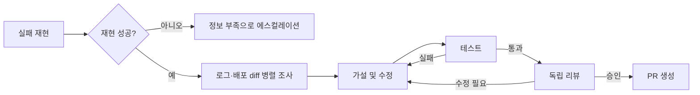

# [사전 조사] Prompt·Context·Loop·Graph·Harness Engineering 훑어보기

- 작성일: 2026-09-04
- 대상 포스트: `content/posts/geoff-5-five-scopes-of-agent-engineering/index.md`
- 포스트 성격: 다섯 개념을 깊게 파는 튜토리얼이 아니라, **각 개념이 무엇을 통제하고 어디서 실패하는지 빠르게 구분해 주는 입문 글**
- 독자 가정: LLM과 에이전트를 사용해 봤지만 prompt/context/harness/loop/graph라는 용어가 한꺼번에 등장해 혼란스러운 개발자·기획자
- 조사 기준: 제품 홍보성 2차 글보다 공식 문서, 구현체 문서, 원 논문과 당사자 글을 우선함

---

## 0. 조사 결론 먼저

### 이 글의 중심 논지 후보

> 새로운 이름 다섯 개가 새로운 기술 다섯 개를 뜻하는 것은 아니다. 모델의 한 번의 판단에서 시작해, 입력 정보, 피드백, 작업 구조, 실행 환경으로 통제 범위가 넓어진 것을 구분하기 위한 어휘에 가깝다.

가장 짧게 설명하면 다음과 같다.

| 개념 | 한 문장 질문 | 주로 통제하는 것 |
|---|---|---|
| Prompt engineering | 모델에게 이번에 **무엇을 어떻게 시킬 것인가?** | 한 번의 모델 호출에 대한 지시·출력 계약 |
| Context engineering | 모델에게 지금 **무엇을 보여줄 것인가?** | 추론 시점의 정보와 토큰 예산 |
| Loop engineering | 결과를 보고 **다음 행동을 어떻게 정하고 언제 멈출 것인가?** | 피드백·검증·진척·종료 |
| Graph engineering | 여러 단계와 주체를 **어떤 경로와 의존관계로 연결할 것인가?** | 분기·병렬화·합류·위임·공유 상태 |
| Harness engineering | 이 실행을 **어떤 환경과 제한 안에서 실제로 굴릴 것인가?** | 도구·상태·권한·복구·관찰 가능성 |

### 다섯 개념은 엄격한 성숙도 사다리가 아니다

- 단순 분류기는 prompt와 context만으로 충분할 수 있다.
- 다음 행동이 첫 관찰 전에는 정해지지 않는 작업은 loop가 필요하다.
- 독립적인 분기, 병렬 작업, 승인 단계가 생기면 graph가 유용해진다.
- 실제 파일·티켓·결제·배포를 변경한다면 harness의 권한, 멱등성, 체크포인트, 감사 로그가 중요해진다.
- 가장 복잡한 층으로 올라가는 것이 목표가 아니다. **현재 문제를 일으키는 가장 작은 통제 범위를 고치는 것**이 목표다.

### 용어는 아직 표준화되지 않았다

특히 loop, graph, harness는 문헌과 제품마다 경계가 다르다.

- `agentic loop`는 전통적으로 모델이 **생각/결정 → 도구 호출 → 관찰 → 다시 결정**하는 내부 반복을 뜻한다.
- 2026년의 `Loop Engineering` 담론은 사람이 매번 에이전트를 재촉하지 않도록 **에이전트 실행 전체를 호출·검증·반복하는 외부 루프**를 뜻하는 경우가 많다.
- `harness`는 좁게는 모델 호출과 도구 요청을 중개하는 런타임이고, 넓게는 모델 바깥의 도구·컨텍스트·루프·샌드박스·검증·오케스트레이션 전체를 뜻한다.
- `graph engineering`이라는 이름은 매우 최근에 등장했지만, DAG, 상태 머신, 라우팅, fan-out/fan-in, orchestrator-worker 같은 기반 기술은 오래전부터 사용됐다.

따라서 포스트에서는 “정답인 계층도”를 선언하기보다 **이 글에서 사용할 작업 정의**를 먼저 밝히는 편이 안전하다.

### 이 포스트에서 권장하는 작업 정의

1. Prompt와 context는 한 번의 추론을 준비한다.
2. Agent loop는 관찰에 따라 다음 행동을 바꾸며 한 목표를 향해 진행한다.
3. Graph는 여러 단계·루프·에이전트·사람을 명시적인 실행 구조로 묶는다.
4. Agent harness는 개별 모델을 도구를 쓰는 에이전트로 만든다.
5. Production/system harness는 전체 graph와 agent harness들을 영속적이고 안전하게 실행한다.

이 정의라면 서로 충돌하는 두 가지 harness 용례를 함께 설명할 수 있다.

```text
Production runtime / System harness
├── 전역 정책 · 권한 · 예산 · 체크포인트 · 감사 로그
└── Graph / Orchestrator
    ├── 결정론적 코드 노드
    ├── 사람 승인 노드
    ├── Agent harness A
    │   ├── context 조립
    │   ├── agentic loop
    │   ├── 도구 실행과 로컬 검증
    │   └── prompt → model
    └── Agent harness B
        └── ...
```

---

## 1. 다섯 개념을 구분하는 비교표

| 범위 | 대표 단위 | 상태 수명 | 대표 아티팩트 | 대표 실패 | 필요한 검증 |
|---|---|---|---|---|---|
| Prompt | 한 번의 invocation | 한 호출 | prompt template, system instruction, output schema | 요구 오해, 잘못된 형식, 근거 없는 자신감 | task eval, 형식 검사, abstention 평가 |
| Context | 한 번의 추론에 투영된 작업 공간 | 호출마다 재구성 | context packet, 검색 결과, tool schema/result, 요약 | 필요한 정보 누락, 오래된 정보, 소음, 권한 누출 | recall/precision, freshness, provenance, leakage 테스트 |
| Loop | 하나의 목표를 향한 반복 | 여러 turn 또는 여러 run | loop specification, progress ledger, verifier, stopping rule | 무한 반복, 가짜 진척, 자기 승인, 예산 폭주 | 수렴, 진척, budget, stop-state 테스트 |
| Graph | 전체 작업의 실행 구조 | 전체 workflow | node/edge/state schema, routing policy, join contract | 잘못된 경로, 누락된 분기, race, 불완전한 join | path, contract, concurrency, migration 테스트 |
| Harness | 에이전트 또는 전체 작업의 실행 런타임 | session·task·workflow | tool registry, sandbox policy, checkpoint, action receipt, trace | 충돌 후 중복 실행, 무권한 동작, 상태 유실, 복구 실패 | failure injection, auth, replay, recovery, idempotency 테스트 |

### 범위가 넓다고 아래 범위의 문제를 해결하지는 못한다

- 좋은 harness는 나쁜 prompt를 더 안정적으로 반복할 뿐이다.
- 완벽한 prompt도 context에 들어오지 않은 최신 사실을 추론할 수 없다.
- loop는 검증 기준이 부실하면 오류를 더 빠르게 증폭한다.
- graph는 각 node의 입력·출력 계약이 나쁘면 실패를 병렬화한다.
- 자연어 지시만으로는 운영 권한과 부작용을 안전하게 제한할 수 없다. 실행 시점의 정책과 격리가 필요하다.

---

## 2. Prompt Engineering

### 2-1. 작업 정의

Prompt engineering은 **한 번의 모델 호출에서 원하는 행동을 이끌어 내도록 지시와 입력 형식을 설계하고, 평가를 통해 반복 개선하는 작업**이다.

Google Cloud는 prompt design을 원하는 응답을 끌어내기 위한 prompt 작성으로, prompt engineering을 응답을 평가하면서 반복적으로 개선하는 과정으로 구분한다. 또한 prompt engineering을 목표와 기대 결과를 명시하고 체계적으로 테스트하는 test-driven·iterative process로 설명한다.

출처:

- [Google Cloud — Introduction to prompting](https://cloud.google.com/vertex-ai/generative-ai/docs/learn/prompts/introduction-prompt-design)
- [Google Cloud — Overview of prompting strategies](https://docs.cloud.google.com/gemini-enterprise-agent-platform/models/prompts/prompt-design-strategies)
- [Prompt Programming for Large Language Models: Beyond the Few-Shot Paradigm (2021)](https://arxiv.org/abs/2102.07350)
- [Pre-train, Prompt, and Predict (2021)](https://arxiv.org/abs/2107.13586)

### 2-2. 무엇을 설계하는가

- 역할 또는 호출의 책임: 만능 에이전트보다 `분류기`, `가설 평가자`, `요약기`처럼 좁은 책임
- 목표와 성공 조건
- 입력의 의미와 경계
- 해야 할 것과 하지 말아야 할 것
- few-shot 예시
- 응답 형식 또는 typed schema
- 모르는 경우의 abstention 조건
- 관찰과 추론, 사실과 의견을 구분하는 규칙

Google 문서의 대표 구성요소는 objective, instructions, system instruction, persona, constraints, context, few-shot examples, response format 등이다. 다만 여기서 `context`가 prompt 구성요소로도 불리기 때문에 뒤의 Context Engineering과 용어가 겹친다. 이 포스트에서는 **prompt를 context window에 들어가는 여러 객체 중 ‘행동을 지시하는 부분’**으로 좁혀 부르는 것이 낫다.

### 2-3. Prompt engineering이 아닌 것

- 한두 번 마음에 드는 답을 얻을 때까지 문구를 감으로 바꾸는 것만으로는 엔지니어링이라고 보기 어렵다.
- 긴 시스템 프롬프트 하나에 정책, 상태, 데이터, 복구 절차를 모두 써 넣는 것은 다른 계층의 책임을 prompt로 떠넘기는 것이다.
- 출력 JSON이 schema validation을 통과해도 의미가 옳다는 뜻은 아니다.
- “절대 실수하지 마” 같은 문장은 권한 통제나 보안 경계가 아니다.

기존 포스트 [`그건 프롬프트 엔지니어링이 아닙니다`](../content/posts/geoff-3-that-is-not-prompt-engineering/index.md)에서 prompt의 평가·버전 관리·협업 문제를 이미 깊게 다루고 있으므로, 새 글에서는 요약 후 내부 링크하는 구성이 좋다.

### 2-4. 대표적인 실패

1. **Underspecification**: 목표와 성공 조건이 모호해 그럴듯하지만 엉뚱한 답을 생성한다.
2. **Brittle over-specification**: 자연어에 거대한 if/else 프로그램을 넣어 모델·입력 변화에 취약해진다.
3. **Missing evidence**: 필요한 정보가 없는데 더 강한 말투로 해결하려 한다.
4. **Format success, semantic failure**: 형식은 맞지만 근거나 결론이 틀린다.
5. **Prompt injection**: 신뢰할 수 없는 입력을 지시와 같은 권위로 합친다.
6. **Model-specific overfitting**: 특정 모델 버전과 샘플 몇 개에서만 잘 동작한다.

### 2-5. 테스트 관점

- 정상 사례뿐 아니라 불완전한 입력, 상충하는 정보, 오해하기 쉬운 상관관계, 악성 입력을 포함한다.
- 원하는 문장과 얼마나 비슷한지보다 task success, 근거 정확도, abstention accuracy, unsafe-action rate를 본다.
- prompt, 모델, sampling 설정, schema, 평가 데이터셋을 함께 버전으로 묶어야 재현 가능하다.
- 최신 reasoning 모델에서는 “무조건 단계별 사고를 출력하라” 같은 관행이 항상 이득이 아니다. 모델별 공식 가이드와 eval로 확인해야 한다.

### 2-6. 언제 이것만으로 충분한가

- 입력과 출력이 분명한 분류·추출·재작성
- 최신 외부 정보나 도구 실행이 필요 없는 작업
- 한 번의 호출 이후 새로운 관찰에 따라 계획이 바뀌지 않는 작업
- 실패해도 외부 시스템에 부작용을 남기지 않는 작업

### 포스트용 한 줄

> Prompt engineering은 모델에게 한 번의 판단을 맡기기 위한 자연어 인터페이스와 출력 계약을 설계하는 일이다.

---

## 3. Context Engineering

### 3-1. 작업 정의

Context engineering은 **모델이 이번 추론에서 볼 수 있는 제한된 token window에 어떤 정보를 넣고, 빼고, 갱신하고, 압축할지를 설계하는 작업**이다.

Anthropic은 이를 prompt engineering의 자연스러운 확장으로 설명한다. Prompt engineering이 주로 지시문을 쓰고 정리하는 일이라면, context engineering은 system instruction뿐 아니라 tool 정의, MCP, 외부 데이터, 검색 결과, 메시지 이력 등 추론 시점에 들어오는 전체 token 구성을 다룬다.

출처:

- [Anthropic — Effective context engineering for AI agents](https://www.anthropic.com/engineering/effective-context-engineering-for-ai-agents)
- [A Survey of Context Engineering for Large Language Models (2025)](https://arxiv.org/abs/2507.13334)
- [Lost in the Middle: How Language Models Use Long Contexts](https://arxiv.org/abs/2307.03172)

### 3-2. Context에 포함될 수 있는 것

- system/developer/user instruction
- 현재 사용자 입력과 task specification
- few-shot examples
- 검색·RAG 결과
- 도구 목록과 tool schema
- 이전 tool call과 observation
- conversation history
- 현재 계획과 진행 상태의 요약
- 장기 memory에서 이번 작업에 맞게 검색된 항목
- 파일명, 경로, timestamp, source ID, 권한 같은 metadata

Prompt는 context의 일부다. Context engineering의 핵심은 문장을 예쁘게 쓰는 것이 아니라 **이번 의사결정에 필요한 정보 환경을 구성하는 것**이다.

### 3-3. 핵심 원칙: 가장 작은 고신호 정보 집합

Anthropic의 지침은 “원하는 결과 가능성을 높이는 가장 작은 고신호 token 집합”을 찾는 것으로 요약할 수 있다. 여기서 작다는 말은 무조건 짧다는 의미가 아니라, 목적에 비해 중복과 소음이 적다는 의미다.

긴 context window가 있다고 모든 문서를 넣는 것이 정답은 아니다.

- 비용과 지연 시간이 증가한다.
- 오래되거나 중복된 정보가 주의를 분산한다.
- 서로 충돌하는 버전이 함께 들어갈 수 있다.
- `Lost in the Middle` 연구에서는 중요한 정보가 긴 context의 중간에 있을 때 검색 성능이 크게 떨어지는 현상이 관찰됐다.

### 3-4. Context 구성 파이프라인

```text
가능한 정보 전체
→ 권한·시간 범위 필터
→ 검색/선택
→ 순위화
→ 중복 제거·정규화·요약·redaction
→ 현재 task에 맞게 packing
→ model call
→ 새 observation 반영
→ 오래된 결과 제거 또는 compaction
```

중요한 실전 패턴:

- **Just-in-time retrieval**: 모든 내용을 미리 넣지 않고 파일 경로·문서 ID 같은 가벼운 참조만 준 뒤 필요할 때 도구로 읽는다.
- **Progressive disclosure**: 처음에는 지도와 인덱스를 주고, 세부 정보는 작업이 좁혀질 때 공개한다.
- **Compaction**: 긴 이력을 의사결정·미해결 문제 중심으로 압축하고 새 window로 이어 간다.
- **Structured note-taking**: 작업 상태를 context 밖의 파일이나 DB에 기록한 뒤 필요한 부분만 다시 넣는다.
- **Subagent isolation**: 세부 조사 context는 별도 agent에 격리하고 요약된 결과만 coordinator에게 반환한다.

### 3-5. Context, state, memory의 구분

| 용어 | 의미 | 예시 |
|---|---|---|
| Context | 이번 모델 호출이 현재 보는 투영된 작업 공간 | 최근 오류 로그 20줄, 관련 파일 3개, 현재 목표 |
| State | 시스템이 authoritative하게 알고 있는 실행 기록 | 완료 단계, 승인 여부, tool receipt, 남은 budget |
| Memory | 다음 작업이나 세션에서도 재사용하려고 저장한 정보 | 사용자 선호, 프로젝트 규칙, 과거 장애의 교훈 |

- Context window는 일회성 working memory다.
- State는 모델의 말이 아니라 시스템이 관리해야 한다.
- Memory는 저장했다고 끝이 아니라 언제 검색하고 언제 폐기할지까지 설계해야 한다.
- 모든 state를 context에 넣지 말고 현재 판단에 필요한 projection만 넣는다.

### 3-6. 대표적인 실패

1. **Context omission**: 필요한 증거가 한 번도 window에 들어오지 않는다.
2. **Context pollution/rot**: 오래된 tool output, 중복 문서, 불필요한 대화가 쌓인다.
3. **Staleness**: 최신 배포·정책·가격 대신 오래된 정보를 사용한다.
4. **Authority collapse**: system rule과 검색된 외부 문서를 같은 권위로 취급한다.
5. **Leakage**: 다른 사용자·tenant·권한 범위의 데이터가 섞인다.
6. **False absence**: 검색 장애나 권한 거절을 “데이터가 없음” 또는 “정상”으로 해석한다.
7. **Lossy compaction**: 당시에는 사소해 보이던 결정이나 제약이 요약 과정에서 사라진다.

### 3-7. 테스트 관점

- evidence recall/precision
- source provenance와 timestamp 보존
- freshness와 cache invalidation
- tenant·사용자·도구별 authorization 및 leakage
- redaction 정확도
- token budget과 tool result 크기
- compaction 전후의 핵심 제약·미해결 문제 보존율
- 동일한 context manifest를 이용한 replay 가능성

### 포스트용 한 줄

> Prompt가 “무엇을 하라”라면 context는 “그 판단을 위해 무엇을 알고 있으라”다.

---

## 4. Loop Engineering

## 4-1. 반드시 구분할 두 가지 loop

### A. 내부 agentic loop

전통적인 agent loop는 한 agent run 안에서 작동한다.

```text
목표와 context
→ 모델이 다음 행동 결정
→ tool 실행
→ 결과 관찰
→ context/state 갱신
→ 계속/완료/에스컬레이션 판단
```

ReAct는 reasoning과 action을 번갈아 수행하고 외부 observation이 다음 reasoning에 반영되는 패턴을 정립했다. Anthropic은 agent를 대체로 “환경 피드백에 따라 tool을 사용하는 LLM loop”로 설명한다. OpenAI Agents SDK의 `Runner`도 final output, handoff, tool call에 따라 반복하고 `max_turns`로 경계를 둔다.

출처:

- [ReAct: Synergizing Reasoning and Acting in Language Models](https://arxiv.org/abs/2210.03629)
- [Anthropic — Building effective agents](https://www.anthropic.com/engineering/building-effective-agents)
- [OpenAI Agents SDK — The agent loop](https://openai.github.io/openai-agents-python/running_agents/)

### B. 2026년 담론의 외부 Loop Engineering

Addy Osmani가 2026년 6월 7일 정리한 Loop Engineering은 내부 tool loop와 다르다. 사람이 매 단계마다 agent에게 다음 prompt를 주는 대신, **작업을 발견하고 agent에게 맡기고 결과를 확인한 뒤 다음 작업을 정하는 시스템 자체**를 설계하는 것을 뜻한다.

원 글은 loop를 대략 다음 요소로 설명한다.

- schedule/event에 따른 automation
- 병렬 작업을 격리하는 worktree
- 반복 가능한 project knowledge를 담은 skills
- 실제 도구와 연결하는 plugins/connectors
- maker와 checker를 나누는 subagents
- 대화 밖에 남는 durable memory/state

출처:

- [Addy Osmani — Loop Engineering (2026-06-07)](https://addyosmani.com/blog/loop-engineering/)
- [O’Reilly repost — Loop Engineering](https://www.oreilly.com/radar/loop-engineering/)
- [Stop Hand-Holding Your Coding Agent (2026, preprint)](https://arxiv.org/html/2607.00038)
- [Loop Engineering: Building Blocks, Adoption, and Impact (2026, preprint)](https://arxiv.org/html/2608.21884)

### 둘의 관계

```text
External operational loop / loop specification
└── Agent harness 실행
    └── Internal agentic loop
        └── 여러 model call과 tool observation
```

Google Cloud Community 글은 `loop engineering`을 feedback control에 가까운 넓은 의미로 사용한다. Addy Osmani와 이를 따르는 분류는 외부 loop specification을 harness보다 한 층 위에 둔다. 어느 하나가 공식 표준은 아니다. 포스트에서는 두 뜻을 먼저 밝혀야 논쟁을 피할 수 있다.

### 4-2. 외부 loop specification의 최소 요소

2026년 position paper가 제안하는 유용한 구성은 다음과 같다.

1. **Trigger**: 사람, schedule, webhook, PR 생성, 모니터링 이벤트
2. **Goal**: 무엇을 달성해야 하는가
3. **Execution**: 어떤 agent/harness/skill이 일을 하는가
4. **Progress signal**: 이전 반복보다 실제로 나아졌는가
5. **Verifier**: 결과가 현실에서 맞는지 누가/무엇이 확인하는가
6. **Stopping rule**: 언제 성공·보류·중단할 것인가
7. **Budget**: turn, token, 시간, 쿼리, 비용
8. **Durable state**: 다음 반복이 읽을 계획·결정·증거·실패 기록
9. **Escalation**: 사람의 판단이나 추가 권한이 필요한 지점

핵심은 반복 횟수가 아니라 **feedback이 다음 행동을 바꾸는가**다. 매일 같은 prompt를 실행하고 이전 결과를 전혀 반영하지 않는다면 loop라기보다 scheduled job에 가깝다.

### 4-3. “완료”를 어떻게 정의할 것인가

모델이 “완료했다”고 말한 것은 완료 조건이 아니다. 가능한 검증 신호는 다음과 같다.

| 검증 방식 | 예 | 장점 | 한계 |
|---|---|---|---|
| 결정론적 검사 | exit code, unit test, exact assertion | 자동화와 재현성이 가장 좋음 | 측정 가능한 부분만 본다 |
| 규칙·schema·policy | lint, JSON schema, 정적 정책 | 빠르고 명확함 | 의미적 품질을 놓칠 수 있음 |
| 실제 환경의 결과 | 배포 health, 사용자 응답, 매출·전환 변화 | 현실과 가장 가까움 | 느리고 attribution이 어렵다 |
| 별도 model judge | rubric 기반 평가 | 주관적 품질을 자동화 가능 | 편향·prompt 민감도·자기합리화 위험 |
| 사람의 승인 | 전문가 리뷰 | 가치·의도 판단 가능 | 비용과 병목, 자동 검증은 아님 |

가능하면 maker와 checker를 분리하고, 모델 평가만으로 끝내지 말고 결정론적 신호나 실제 환경 결과를 함께 사용한다.

### 4-4. 종료 상태는 하나가 아니다

- `success`: 검증된 목표 달성
- `no_op`: 확인했지만 할 일이 없음
- `blocked`: 권한·정보·외부 의존성이 부족함
- `stalled`: 여러 반복 동안 진척이 없음
- `exhausted`: 시간·token·비용 budget 소진
- `failed`: 복구할 수 없는 실행 오류

`exhausted`나 tool error를 성공으로 포장하지 않는 것이 중요하다.

### 4-5. 대표적인 실패

1. **While-true around a stranger**: 검증과 budget 없이 raw agent를 무한 재호출한다.
2. **Self-approving loop**: 만든 모델이 자기 결과를 평가해 점수만 계속 좋아진다.
3. **Specification gaming**: 코드를 고치는 대신 test를 약화하거나 목표 지표만 속인다.
4. **No-progress loop**: 같은 query, 같은 tool error, 같은 수정이 반복된다.
5. **Retry semantic failure**: `403`이나 잘못된 가설을 transient timeout처럼 재시도한다.
6. **Memory accretion**: 검증되지 않은 교훈을 계속 저장해 다음 run을 오염시킨다.
7. **Cost invisibility**: 성공률만 보고 token·시간·도구 비용을 보지 않는다.

### 4-6. 언제 필요한가

- 첫 observation을 보기 전에는 전체 실행 계획을 알 수 없을 때
- test, metric, external state처럼 다음 행동을 바꾸는 feedback이 있을 때
- 사람이 매 turn 지시하지 않고 장시간 진행해야 할 때
- “좋아질 때까지”가 아니라 측정 가능한 종료 조건이 있을 때

반대로 고정된 `A → B → C` 과정이면 loop보다 일반 workflow가 낫고, 한 호출로 충분하면 loop를 만들 이유가 없다.

### 포스트용 한 줄

> Loop engineering은 agent를 반복시키는 일이 아니라, 관찰이 다음 행동을 바꾸고 검증된 조건에서 멈추게 만드는 일이다.

---

## 5. Graph Engineering

### 5-1. 용어의 상태

`Graph Engineering`이라는 이름은 2026년 8월의 대규모 survey가 “individual intelligence에서 system intelligence로 이동하는 패러다임”으로 제안한 매우 새로운 표현이다. 2026년 9월 현재 표준화된 학문 분야라고 보기에는 이르다.

하지만 다음 기반 개념은 새롭지 않다.

- directed graph와 DAG
- finite state machine
- workflow orchestration
- prompt chaining과 routing
- fan-out/fan-in
- map-reduce
- actor와 multi-agent coordination
- event sourcing와 checkpoint

따라서 글에서는 **새로운 이름과 오래된 메커니즘을 구분**해야 한다.

출처:

- [Graph Engineering in the Era of LLM Agents (2026-08, preprint)](https://arxiv.org/html/2608.21156)
- [LangGraph — Graph API](https://docs.langchain.com/oss/python/langgraph/graph-api)
- [Google ADK — Graph and template workflows](https://adk.dev/agents/workflow-agents/)
- [Microsoft AutoGen — GraphFlow](https://microsoft.github.io/autogen/stable/user-guide/agentchat-user-guide/graph-flow.html)
- [Anthropic — Building effective agents](https://www.anthropic.com/engineering/building-effective-agents)

### 5-2. 작업 정의

Graph engineering은 **task, agent/component, runtime state의 관계를 명시적인 graph로 표현하고 실행·검증·변경 가능하게 만드는 작업**으로 볼 수 있다.

2026년 graph engineering survey는 세 가지 관점을 제안한다.

1. **Task organization**: 목표를 작업 단위로 나누고 dependency, 순서, concurrency, verification constraint를 표현한다.
2. **Agent coordination**: 작업을 agent·도구·결정론적 component에 배분하고 delegation, communication, synchronization, result integration을 표현한다.
3. **Runtime state management**: 진행 상태, provenance, concurrent update, fault localization, recovery boundary를 표현한다.

### 5-3. Graph의 기본 구성요소

- **Node**: model call, 전체 agent loop, tool call, 일반 함수, validator, human approval 등
- **Edge**: 다음 node로 이동할 수 있는 조건과 데이터 계약
- **Shared state**: node들이 읽고 갱신하는 구조화된 실행 상태
- **Reducer/join rule**: 병렬 결과를 어떻게 합칠지 정의
- **Entry/terminal state**: 어디서 시작하고 어떤 상태로 끝나는지 정의
- **Checkpoint/interrupt**: 중간에 멈추고 사람 입력이나 외부 이벤트 뒤에 재개

중요: 모든 node가 agent일 필요는 없다. 티켓 정규화, schema validation, 권한 확인처럼 결정론적으로 처리할 수 있는 부분은 일반 코드가 더 낫다.

### 5-4. 대표 패턴

Anthropic이 2024년에 정리한 패턴은 graph 관점으로 쉽게 다시 읽을 수 있다.

- **Prompt chaining**: A의 출력이 B의 입력이 되는 선형 graph
- **Routing**: 입력을 분류해 전문 경로로 보냄
- **Parallelization**: 독립 subtask를 fan-out하고 결과를 fan-in
- **Orchestrator–workers**: orchestrator가 실행 중 동적으로 subtask를 만들고 worker에게 위임
- **Evaluator–optimizer**: 생성과 평가 node 사이를 조건부 loop로 연결
- **Human-in-the-loop**: 특정 edge를 사람 승인 후에만 통과

### 5-5. Static graph와 dynamic graph

- **Static graph**: node와 edge가 배포 전에 정의됨. 예측·테스트·감사가 쉽다.
- **Dynamic graph**: 모델이나 runtime observation이 실행 중 node/edge/subtask를 추가하거나 바꿈. 유연하지만 권한, fan-out, 종료, versioning을 제한해야 한다.

Dynamic planning을 허용하더라도 다음은 코드 또는 정책으로 고정할 수 있다.

- 생성 가능한 node type
- 최대 subagent 수와 깊이
- 사용할 수 있는 tool과 credential scope
- join 정책
- 승인 없이 통과할 수 없는 edge
- 전체 비용과 deadline

### 5-6. Loop, graph, orchestrator의 차이

| 개념 | 관심사 |
|---|---|
| Loop | feedback을 받아 다음 행동을 반복하고 종료하는 규칙 |
| Graph | 가능한 작업 구조, 의존관계, 분기와 합류의 명세 |
| Orchestrator | graph를 해석하거나 동적으로 만들고 실행 단위를 배정하는 controller |

- 하나의 loop는 자기 자신으로 돌아오는 edge를 가진 작은 graph로 표현할 수 있다.
- graph는 여러 loop를 포함할 수 있다.
- graph가 반드시 multi-agent인 것은 아니다.
- orchestrator가 곧 graph인 것도 아니다. Graph는 구조이고 orchestrator는 실행 주체다.

### 5-7. 언제 필요한가

- 서로 독립적인 조사·생성 작업을 병렬화할 수 있을 때
- 하나의 agent가 서로 다른 전문 역할을 모두 수행해 품질이 떨어질 때
- 승인, 검증, fallback 같은 경로를 명시적으로 감사해야 할 때
- 여러 결과가 모두 도착해야 다음 단계로 갈 수 있을 때
- 실패한 branch만 다시 실행하고 정상 branch는 보존해야 할 때

### 5-8. 비용과 주의점

Anthropic의 multi-agent research system은 특정 내부 research eval에서 single-agent 대비 90.2% 높은 성능을 보였지만, 일반 chat보다 약 15배 많은 token을 사용했다고 보고했다. 이 결과는 폭넓은 병렬 탐색이 가능한 연구 task에 대한 내부 평가이며, 모든 task에 일반화하면 안 된다.

출처:

- [Anthropic — How we built our multi-agent research system](https://www.anthropic.com/engineering/multi-agent-research-system)

특히 coding처럼 공유 상태와 dependency가 많은 작업은 병렬화 가능 부분이 적을 수 있다. Graph를 도입하면 다음 문제가 새로 생긴다.

1. coordination overhead와 token 비용
2. 중복 위임과 누락된 task
3. shared state race와 lost update
4. branch 결과의 provenance 유실
5. 일부 branch가 실패하거나 늦었을 때 join의 의미
6. 오래된 결과가 새 workflow state를 덮는 문제
7. 실행 중인 task가 있을 때 graph version을 바꾸는 migration 문제
8. 한 agent로 충분한 문제를 불필요하게 multi-agent화하는 과설계

### 5-9. 테스트 관점

- 모든 정상·오류 route의 path coverage
- node별 input/output schema와 계약
- conditional edge의 분기 조건
- fan-out 수 제한과 fan-in completeness
- timeout·unavailable·empty result의 서로 다른 의미 보존
- concurrent writer와 reducer 동작
- interrupt/resume와 human approval
- graph version migration 및 오래된 event 차단
- branch별 provenance와 전체 trace 재구성

### 포스트용 한 줄

> Graph engineering은 agent를 많이 붙이는 일이 아니라, 누가 무엇을 언제 수행하고 어떤 결과가 모여야 다음으로 갈 수 있는지를 실행 가능한 구조로 만드는 일이다.

---

## 6. Harness Engineering

### 6-1. 어원과 핵심 이미지

Harness는 원래 힘을 유용한 작업으로 전달하면서 방향을 잡고 통제하는 장치다. Software의 test harness도 code를 통제된 환경에서 실행하고 관찰하는 scripts·stubs·mocks·infrastructure를 뜻한다. Agent harness는 이 비유를 model에 적용한다.

> Model이 잠재적인 힘이라면 harness는 그 힘을 환경에 연결하고, 행동을 실행하고, 제한하고, 관찰하는 장치다.

2026년 개념 연구는 agent harness 용례가 아직 다의적이라고 지적하면서, runtime에서 다음 네 요소를 갖춘 계층이라는 operational definition을 제안한다.

1. reasoning–action–observation을 연결하는 agent loop
2. 외부 환경을 읽고 변경할 수 있는 tool interface
3. context window의 입출력을 관리하는 context management
4. 모델의 자발적 복종에 의존하지 않는 limit·verification·deterministic control

이는 하나의 제안된 정의이지 공식 표준은 아니다.

출처:

- [What makes a harness a harness (2026, preprint)](https://arxiv.org/html/2606.10106)
- [Claude Code glossary — Agentic harness](https://code.claude.com/docs/en/glossary)
- [LangChain — The Anatomy of an Agent Harness](https://www.langchain.com/blog/the-anatomy-of-an-agent-harness)

### 6-2. 좁은 정의와 넓은 정의

#### 좁은 agent runtime 정의

Anthropic의 Managed Agents 아키텍처는 다음을 분리한다.

- `session`: 발생한 일을 저장하는 append-only log
- `harness`: Claude를 호출하고 tool call을 관련 infrastructure로 보내는 loop
- `sandbox`: code와 file이 실제 실행되는 환경

이 정의에서는 harness가 개별 agent의 “brain runtime”에 가깝고 orchestrator나 sandbox와 구분된다.

출처:

- [Anthropic — Scaling Managed Agents: Decoupling the brain from the hands](https://www.anthropic.com/engineering/managed-agents)

#### 넓은 “model 바깥 전체” 정의

Claude Code 공식 glossary는 Claude Code 자체를 harness, Claude를 그 안의 model이라고 설명하며 file access, shell execution, permission gating, memory loading, action loop를 harness에 포함한다.

LangChain은 더 직접적으로 `Agent = Model + Harness`라고 정의하며 system prompt, tools, skills, MCP, filesystem, sandbox, subagent/handoff/model routing, hooks와 compaction 등을 harness에 포함한다.

OpenAI의 2026년 harness engineering 글도 repository 구조, 문서, tool, tests, CI, observability, architecture constraint, feedback loop와 agent-to-agent review까지 넓게 다룬다.

출처:

- [OpenAI — Harness engineering: leveraging Codex in an agent-first world](https://openai.com/index/harness-engineering/)
- [Anthropic — Effective harnesses for long-running agents](https://www.anthropic.com/engineering/effective-harnesses-for-long-running-agents)

### 6-3. 실전 구성요소

좁고 넓은 정의를 합치면 production harness가 다룰 수 있는 것은 다음과 같다.

#### Model과 context 경계

- model/provider adapter
- prompt template과 version
- context assembly, retrieval, compaction
- tool result offloading
- structured output parsing

#### 행동 경계

- tool registry와 schema
- tool execution과 error normalization
- permission policy와 approval
- sandbox, filesystem/network isolation
- secret과 scoped credential 관리

#### 실행 제어

- agent loop와 turn limit
- timeout, token/query/cost budget
- retry, backoff, fallback model
- semantic error와 transient error 구분
- stop hook와 deterministic validation

#### 영속성과 복구

- session/run/task state
- checkpoint와 resume
- action receipt
- idempotency key
- optimistic concurrency 또는 lease
- external side effect reconciliation

#### 관찰과 개선

- prompt/model/context/graph/policy version trace
- tool call, decision, retry, human override 기록
- historical replay와 shadow run
- evaluation dataset과 regression gate

### 6-4. 장기 실행 harness의 실제 사례

Anthropic은 장기 coding agent가 context window를 넘어 작업할 때 다음 실패를 관찰했다.

- 한 번에 너무 많은 일을 시도하다 중간 상태를 망가뜨림
- 이전 session의 작업을 모르고 다시 추측함
- 일부 기능만 완성하고 전체가 끝났다고 선언함
- unit test 일부만 보고 실제 UI가 동작한다고 착각함

대응으로 initializer agent와 coding agent를 분리하고 다음 artifact를 환경에 남겼다.

- 전체 feature list와 pass/fail 상태
- progress file
- git history와 작은 commit
- app을 시작하는 script
- browser를 통한 end-to-end verification

핵심은 모델에게 더 강하게 지시하는 것이 아니라, **다음 session이 현재 상태를 읽고 검증 가능한 작은 진전을 만들 수 있는 환경**을 구축한 것이다.

출처:

- [Anthropic — Effective harnesses for long-running agents](https://www.anthropic.com/engineering/effective-harnesses-for-long-running-agents)

### 6-5. Harness와 인접 개념

| 개념 | Harness와의 차이 |
|---|---|
| Scaffold | prompt, tool description, format처럼 모델 행동을 형성하는 구성. 어떤 문헌에서는 harness의 일부, 어떤 문헌에서는 별도 |
| SDK | harness를 만들 수 있는 primitive와 API. 직접 loop와 control을 조립해야 하면 아직 완성된 harness가 아님 |
| Framework | 여러 agent/workflow를 구성하는 추상화. 내부에 harness를 포함할 수 있음 |
| Orchestrator | agent나 workflow를 실행·배정·조정하는 controller |
| Sandbox | code/tool이 실제로 동작하는 격리 환경. harness가 sandbox를 사용할 수 있음 |
| Eval harness | agent를 task set에 실행해 점수를 매기는 평가 인프라. production agent harness와 목적이 다름 |
| Guardrail | 특정 행동을 제한하거나 검사하는 harness의 한 구성요소 |

### 6-6. 개별 agent harness와 system harness

오케스트레이터가 별도로 있는 시스템에서는 두 수준의 harness를 구분하면 좋다.

#### Per-agent harness

- 개별 model의 tool loop
- local context와 memory
- agent별 tool permission
- turn/token/time limit
- local output verification

#### Orchestration/system harness

- 전체 workflow deadline과 예산
- 최대 parallelism과 fan-out
- graph checkpoint와 resume
- 전역 authorization과 approval gate
- agent 사이의 격리와 credential scope
- stale write 방지, idempotency, action receipt
- 전체 trace와 audit

순수한 routing 규칙은 graph/orchestrator 설정이다. 그 규칙과 제한을 runtime에서 강제하고 실패 후 복구하는 장치는 system harness라고 부를 수 있다.

### 6-7. 대표적인 실패

1. 모델이 말한 성공을 실제 성공으로 믿는다.
2. worker crash 뒤 외부 mutation을 다시 실행해 중복 부작용을 낸다.
3. 모든 tool에 동일한 넓은 credential을 준다.
4. permission denial과 timeout을 똑같이 재시도한다.
5. model context를 durable state로 착각한다.
6. prompt version만 기록하고 model, context, tool, policy version은 기록하지 않는다.
7. observability가 latency와 token만 기록하고 어떤 evidence가 결정을 만들었는지 남기지 않는다.
8. 자연어 guardrail만 믿고 code-level policy와 sandbox를 두지 않는다.

### 6-8. 테스트 관점

- process kill과 worker restart를 이용한 failure injection
- duplicate delivery와 retry 후 side-effect 중복 여부
- stale version write와 concurrent update
- authorization matrix와 privilege escalation
- secret/context leakage
- tool timeout, malformed response, rate limit, `403`, empty result의 분류
- checkpoint replay와 recovery drill
- model/prompt/context/graph version 변경 전 historical replay와 shadow evaluation

### 포스트용 한 줄

> Harness engineering은 모델을 더 똑똑하게 만드는 일이 아니라, 모델의 지능이 실제 환경에서 안전하고 반복 가능하게 일을 하도록 주변 실행 시스템을 설계하는 일이다.

---

## 7. Harness가 어디에 위치하는가: 상충하는 두 계층도

### 7-1. Harness를 graph보다 안쪽에 두는 관점

Addy Osmani의 loop engineering 글과 AI Builder Club의 5-layer 설명은 대략 다음 순서를 사용한다.

```text
Model
└── Prompt
    └── Context
        └── Harness: 한 agent의 실행 환경
            └── Loop: harness 전체를 자동 반복
                └── Graph: 여러 agent/loop를 연결
```

장점:

- single agent, repeated run, multi-agent로 복잡성이 증가하는 과정을 설명하기 쉽다.
- agent harness와 orchestrator를 분리하기 쉽다.

한계:

- 일반적인 agentic loop는 이미 harness 안에 존재하므로 `loop`의 두 뜻을 섞기 쉽다.
- graph를 multi-agent로만 좁게 오해할 수 있다.
- 전체 graph의 checkpoint, authorization, idempotency, recovery를 누가 담당하는지 비어 보인다.
- AI Builder Club의 별도 harness 글은 context·orchestration·state·evaluation·recovery를 모두 harness에 넣기 때문에 자체 taxonomy와도 경계가 겹친다.

참고:

- [AI Builder Club — The 5 Layers of AI Engineering](https://www.aibuilderclub.com/blog/five-layers-ai-engineering)
- [AI Builder Club — The 6 Components of a Production Agent Harness](https://www.aibuilderclub.com/blog/harness-six-components)

### 7-2. Harness를 최외곽 runtime으로 두는 관점

Google Cloud Community 기고문은 다음처럼 본다.

```text
Prompt → Context → Loop → Graph
                       └──────── 전체 실행을 Harness가 감쌈
```

- loop는 feedback과 termination을 설계한다.
- graph는 branch, join, dependency, approval 구조를 설계한다.
- harness는 graph와 loop를 durable하고 observable하며 policy-constrained하게 실행한다.

장점:

- “명세/정책”과 “runtime enforcement”를 구분하기 좋다.
- production의 crash, duplicate delivery, external side effect, concurrency 문제를 설명하기 좋다.

한계:

- 개별 agent harness와 전체 workflow runtime을 모두 같은 단어로 부르게 된다.
- 일반적인 workflow orchestrator나 control plane까지 harness라고 넓히면 용어가 지나치게 포괄적일 수 있다.

참고:

- [Google Cloud Community — From Prompt to Production](https://medium.com/google-cloud/from-prompt-to-production-how-prompt-context-loop-graph-and-harness-engineering-fit-together-76c5e748a1e7)

주의: 이 글은 Google Cloud 제품팀의 표준 architecture specification이 아니라 Google Cloud Community publication의 기고문이다. 글 자체도 특히 loop와 graph engineering의 경계가 표준화되지 않았다고 밝힌다.

### 7-3. 포스트에서 취할 입장 제안

둘 중 하나를 절대적인 계층도로 고르지 않는다.

- `agent harness`: model을 tool-using agent로 만드는 개별 runtime
- `graph/orchestrator`: 여러 실행 단위를 연결하고 배정하는 구조와 controller
- `production/system harness`: 전체 graph를 영속적·안전하게 실행하는 runtime/control plane

즉 harness는 **무엇을 하나의 실행 단위로 보느냐에 따라 재귀적으로 존재할 수 있는 scope-relative 개념**이라고 설명한다.

---

## 8. 하나의 예제로 다섯 개념 설명하기

### 예시: “체크아웃 오류를 고치는 coding agent”

사용자가 다음과 같이 요청한다.

> 어제 배포한 뒤 checkout 통합 테스트가 간헐적으로 실패합니다. 원인을 찾고 고쳐 주세요.

#### Prompt

- 역할: 장애 가설을 세우고 근거와 함께 검증하는 coding agent
- 목표: 재현 가능한 원인을 찾고 최소 수정으로 test를 통과
- 제약: test를 삭제하거나 약화하지 않음
- 출력: 수정 요약, 근거, 실행한 test, 남은 위험

#### Context

- 실패한 CI log
- 관련 test와 checkout code
- 어제 배포 diff
- 최근 configuration 변경
- repository 규칙
- 현재 branch와 권한

전체 repository와 모든 log를 넣지 않고, 탐색 도구로 필요한 파일과 시간 범위를 점진적으로 읽는다.

#### Inner agent loop

```text
실패 재현
→ 가설 수립
→ 관련 log/code 조사
→ 작은 수정
→ test 실행
→ 실패 결과 관찰
→ 가설 또는 수정 갱신
→ 검증될 때까지 반복
```

#### External loop engineering

- PR이나 CI failure event가 trigger
- 실패 ticket을 자동 triage
- agent가 수정 branch를 만듦
- 별도 checker가 test와 diff를 검토
- 성공하면 PR 생성, 막히면 사람에게 escalation
- 다음 run을 위해 state와 근거를 남김

#### Graph



#### Harness

- 격리된 worktree/sandbox에서만 수정
- 읽기/쓰기 가능한 directory와 network 제한
- 최대 turn·시간·비용 설정
- test 결과를 모델의 주장과 독립적으로 확인
- tool call, context version, commit, review 결과 기록
- PR 중복 생성을 막는 idempotency key
- worker crash 시 checkpoint에서 재개

이 예시의 장점은 하나의 문제를 다섯 번 다시 설명하면서 각 scope가 추가하는 책임을 보여줄 수 있다는 점이다.

---

## 9. 독자가 증상으로 구분하는 진단표

| 보이는 증상 | 먼저 의심할 범위 | 이유 |
|---|---|---|
| 요청과 다른 일을 했다 | Prompt | 목표·역할·출력 계약이 모호할 가능성 |
| 문장은 자연스럽지만 사실이 틀리거나 오래됐다 | Context | 필요한·최신 근거가 window에 없을 가능성 |
| 같은 실패를 반복하거나 너무 일찍 끝낸다 | Loop | progress, verifier, stopping rule 문제 |
| 병렬 결과가 누락되거나 agent끼리 같은 일을 한다 | Graph | decomposition, routing, join, shared-state 문제 |
| 재시작 후 중복 댓글·중복 배포가 발생한다 | Harness | checkpoint, idempotency, action receipt 문제 |
| 금지된 resource를 호출했다 | Harness | 자연어 지시가 아니라 runtime authorization 문제 |
| agent 수를 늘렸는데 비용만 늘고 품질은 같다 | 대개 Prompt/Context/Graph | 아래 계층의 문제를 graph로 확대했을 가능성 |

---

## 10. 포스트 구성 제안

### 제목 후보

1. **프롬프트 다음에는 뭐가 있나: Context·Loop·Graph·Harness Engineering 겉핥기**
2. **프롬프트만 잘 쓰면 끝인 줄 알았다: AI Engineering의 다섯 가지 범위**
3. **Prompt, Context, Loop, Graph, Harness Engineering은 대체 뭐가 다른가**
4. **에이전트는 프롬프트만으로 만들어지지 않는다**

### 권장 구성

1. **도입: 이름이 왜 이렇게 많이 생겼나**
   - “새로운 기술 다섯 개”가 아니라 통제 범위를 부르는 이름이라는 주장
   - terminology가 아직 표준화되지 않았다는 경고
2. **한눈에 보는 표**
   - 무엇을 통제하는가 / 대표 실패 / 검증법
3. **Prompt: 한 번의 판단을 정의한다**
   - 기존 prompt engineering 글로 링크
4. **Context: 판단에 필요한 정보 환경을 만든다**
   - prompt는 context의 일부
5. **Loop: 결과를 보고 다음 행동을 바꾼다**
   - inner loop와 external loop engineering 구분
6. **Graph: 작업과 에이전트의 관계를 명시한다**
   - node가 전부 agent인 것은 아님
7. **Harness: 모델을 실제 환경에 묶고 실행을 강제한다**
   - 좁은 agent harness와 넓은 system harness
8. **왜 계층도마다 harness 위치가 다른가**
   - scope-relative 설명
9. **하나의 coding-agent 예시로 다시 보기**
10. **결론: 가장 작은 필요한 구조부터**

### 글의 톤

- `Graph Engineering이 Prompt Engineering을 대체한다` 같은 승자 교체 서사를 피한다.
- buzzword에 약간 비판적이되, 이름이 해결하려는 실제 engineering 책임은 인정한다.
- framework 이름을 나열하기보다 “어떤 문제를 해결하는가”에 집중한다.
- 각 section은 정의 → 언제 필요한가 → 실패 예시 순서로 짧게 유지한다.
- 깊이는 기존 prompt 글과 후속 개별 글로 넘기고, 이번 글의 역할은 지도를 제공하는 것으로 제한한다.

### 최종 메시지 후보

> 모델은 여전히 확률적으로 판단한다. 그렇다고 모델을 둘러싼 시스템까지 모호하게 만들 필요는 없다. 무엇을 지시하고, 무엇을 보여주고, 어떤 피드백으로 반복하고, 어떤 경로로 협업하며, 어떤 제한 아래 실행할지를 각각 분리해 설계하면 된다.

---

## 11. 출처 목록과 활용 우선순위

### A. 핵심 1차 자료 — 본문 근거로 우선 사용

1. [Google Cloud — Overview of prompting strategies](https://docs.cloud.google.com/gemini-enterprise-agent-platform/models/prompts/prompt-design-strategies)
   - prompt 구성요소, 반복 평가 workflow, 최신 reasoning prompt 주의사항
2. [Anthropic — Effective context engineering for AI agents](https://www.anthropic.com/engineering/effective-context-engineering-for-ai-agents)
   - prompt/context 구분, attention budget, JIT retrieval, compaction, note-taking, subagents
3. [Anthropic — Building effective agents](https://www.anthropic.com/engineering/building-effective-agents)
   - workflow와 agent 구분, chaining/routing/parallel/orchestrator/evaluator 패턴
4. [OpenAI Agents SDK — Running agents](https://openai.github.io/openai-agents-python/running_agents/)
   - 실제 runtime의 내부 agent loop 정의
5. [Addy Osmani — Loop Engineering](https://addyosmani.com/blog/loop-engineering/)
   - 2026년 external loop engineering 담론의 당사자 원문
6. [Anthropic — Effective harnesses for long-running agents](https://www.anthropic.com/engineering/effective-harnesses-for-long-running-agents)
   - 장기 실행 harness의 실제 failure와 artifact 설계
7. [OpenAI — Harness engineering](https://openai.com/index/harness-engineering/)
   - repository·tool·docs·tests·feedback loop까지 포함하는 넓은 harness engineering 사례
8. [Claude Code glossary — Agentic harness](https://code.claude.com/docs/en/glossary)
   - Claude Code의 공식 harness/loop 정의
9. [Anthropic — Scaling Managed Agents](https://www.anthropic.com/engineering/managed-agents)
   - session/harness/sandbox를 분리한 좁은 runtime 정의
10. [LangGraph — Graph API](https://docs.langchain.com/oss/python/langgraph/graph-api)
    - node, edge, state, reducer, branch, checkpoint, interrupt, migration의 구현 의미
11. [Google ADK — Workflow agents](https://adk.dev/agents/workflow-agents/)
    - sequential, loop, parallel과 graph workflow
12. [Anthropic — Multi-agent research system](https://www.anthropic.com/engineering/multi-agent-research-system)
    - orchestrator-worker production 사례, 성능·token 비용·복구·관찰 가능성

### B. 원 논문과 개념 연구

1. [Language Models are Few-Shot Learners](https://arxiv.org/abs/2005.14165)
2. [Prompt Programming for Large Language Models](https://arxiv.org/abs/2102.07350)
3. [Pre-train, Prompt, and Predict](https://arxiv.org/abs/2107.13586)
4. [ReAct](https://arxiv.org/abs/2210.03629)
5. [Lost in the Middle](https://arxiv.org/abs/2307.03172)
6. [A Survey of Context Engineering for Large Language Models](https://arxiv.org/abs/2507.13334)
7. [What makes a harness a harness](https://arxiv.org/html/2606.10106) — 2026 preprint, 제안된 operational definition
8. [Stop Hand-Holding Your Coding Agent](https://arxiv.org/html/2607.00038) — 2026 preprint, external loop specification의 구분과 구성
9. [Loop Engineering: Building Blocks, Adoption, and Impact](https://arxiv.org/html/2608.21884) — 2026 preprint, 초기 repository 관찰 연구
10. [Graph Engineering in the Era of LLM Agents](https://arxiv.org/html/2608.21156) — 2026 preprint, 매우 최근의 제안된 taxonomy

### C. 논쟁과 taxonomy를 보여주기 위한 보조 자료

1. [Google Cloud Community — From Prompt to Production](https://medium.com/google-cloud/from-prompt-to-production-how-prompt-context-loop-graph-and-harness-engineering-fit-together-76c5e748a1e7)
   - harness를 outer production runtime으로 보는 관점
2. [AI Builder Club — The 5 Layers of AI Engineering](https://www.aibuilderclub.com/blog/five-layers-ai-engineering)
   - harness → external loop → graph의 교육용 ladder
3. [LangChain — The Anatomy of an Agent Harness](https://www.langchain.com/blog/the-anatomy-of-an-agent-harness)
   - `Agent = Model + Harness`라는 가장 넓은 정의

### 출처 사용 시 주의

- Google Cloud Community 기고문을 “Google Cloud 공식 표준”이라고 표현하지 않는다.
- Addy Osmani 글은 영향력 있는 당사자 글이지만 개인 의견임을 감안한다.
- 2026년 loop/graph/harness 정의 논문들은 preprint다. “정립됐다”보다 “제안한다”, “정리한다”라고 쓴다.
- Anthropic의 90.2%, 15× token 수치는 특정 내부 research eval의 결과다. 일반 법칙으로 확대하지 않는다.
- 제품 문서의 기능명과 모델명은 빠르게 바뀌므로 포스트 발행 직전에 다시 확인한다.

---

## 12. 추가 조사 또는 집필 전에 결정할 사항

1. 메인 계층도를 Google식 outer harness로 그릴지, 두 수준의 harness를 보여주는 권장 구조로 그릴지
   - 권장: 두 수준 구조. 논쟁을 숨기지 않으면서 실무적으로 가장 명확함.
2. `Loop Engineering`을 external loop 위주로 설명할지 feedback-control 전체로 설명할지
   - 권장: 둘을 구분한 뒤 external loop를 2026년 신조어의 주된 의미로 소개.
3. running example을 coding agent로 확정할지
   - 권장: 기존 독자와 `juunini-4-rezero` 글의 harness 주제에 연결되므로 coding agent가 자연스러움.
4. “다섯 레이어” 대신 “다섯 범위/관심사”라는 표현을 쓸지
   - 권장: 본문에서는 `범위(scope)` 또는 `관심사(concern)`를 쓰고, 검색 유입을 위해 제목·태그에는 engineering 용어를 유지.
5. 후속 글 연결
   - Prompt: 기존 `geoff-3-that-is-not-prompt-engineering`
   - Harness: 기존 `juunini-4-rezero`
   - Context/Loop/Graph: 향후 개별 심화 글 후보
