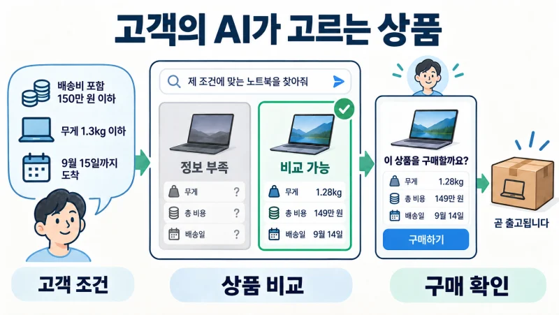
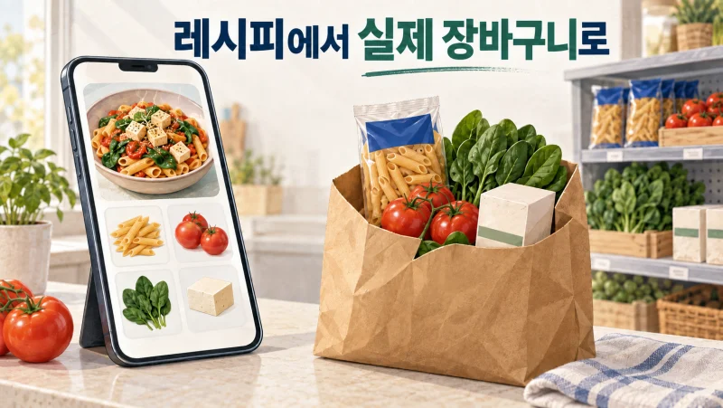
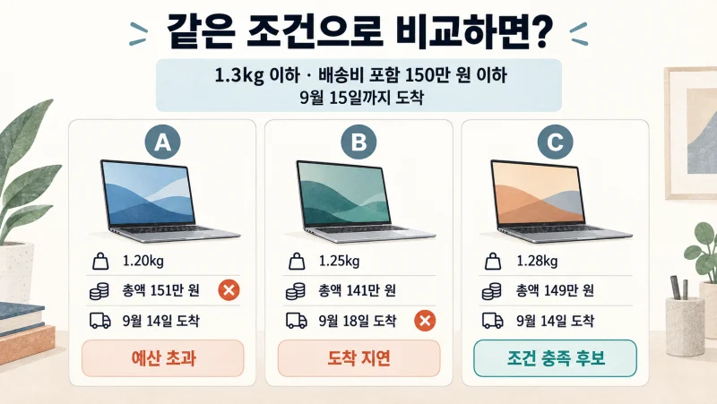
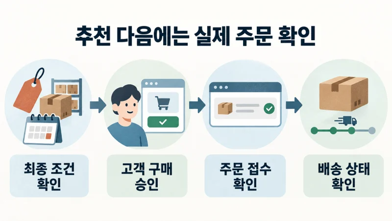
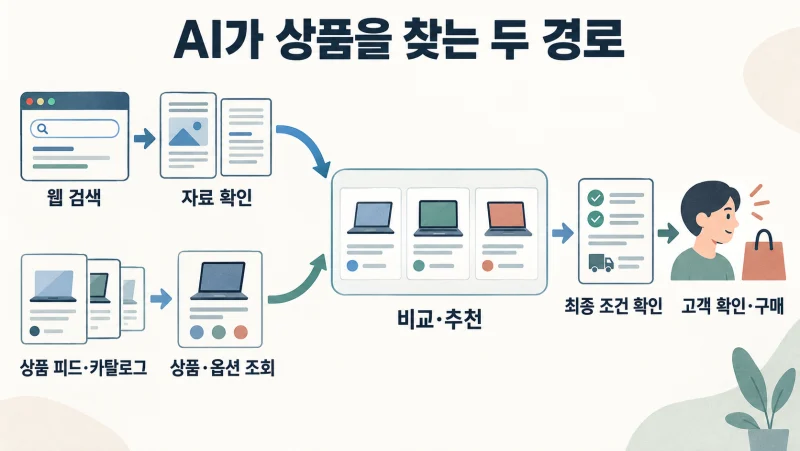
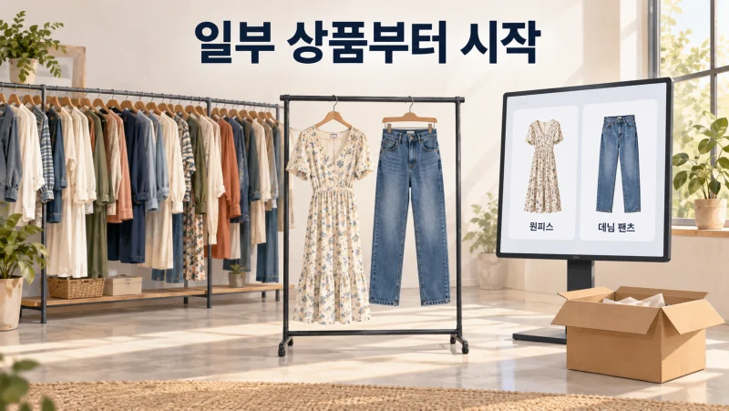
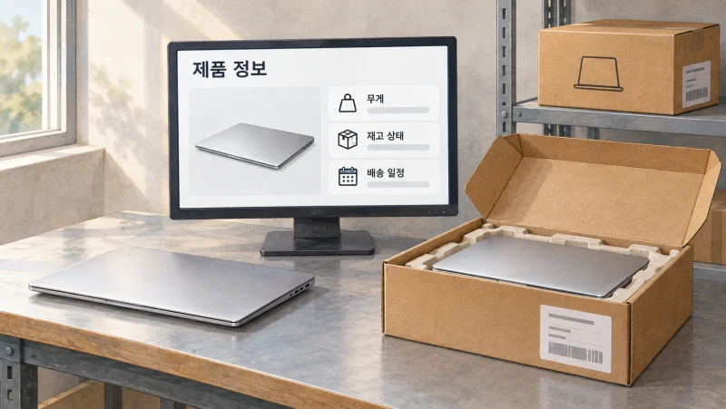

+++
date = '2026-09-11T00:00:00+09:00'
draft = false
title = '에이전트가 쇼핑하는 시대, 준비된 브랜드가 살아남습니다'
description = '고객의 AI가 구매 후보를 추릴 때 우리 상품도 들어갈까요? Agentic Commerce의 실제 사례로 살펴보는 상품 정보, 주문 연결, 브랜드의 준비 과제.'
tags = ['ax', 'ai', 'agent', 'agentic-commerce', 'ecommerce']
authors = ['geoff']
featured_image = 'thumbnail.webp'
images = ['thumbnail.webp']
slug = 'what-is-agentic-commerce'
audio = []
vedios = []
series = []
toc = true
+++

## 들어가며

출장을 앞둔 고객이 노트북을 산다고 해보겠습니다. 쇼핑몰을 하나씩 둘러보는 대신 평소 쓰던 AI에게 이렇게 부탁합니다.

> 무게는 1.3kg 이하, 배송비까지 150만 원 안쪽으로 찾아줘. 9월 15일까지 받아야 해. 결제하기 전에는 나한테 확인받고.

AI가 추린 후보 몇 개를 살펴본 고객은 그중 하나를 골라 주문합니다. 그런데 우리 회사도 조건에 맞는 노트북을 팔고 있었다면 어떨까요? 상세 페이지에는 가볍다는 설명만 있고 정확한 무게는 제품 안내서에, 배송 조건은 별도 공지에 흩어져 있습니다. AI가 필요한 정보를 찾지 못하면 우리 상품은 비교 후보에서 빠질 수 있습니다.

그렇게 우리 상품이 후보에서 빠졌다고 해봅시다. 고객은 우리 쇼핑몰에 와보지도 않은 채 다른 상품을 골랐습니다. 마케팅팀이 준비한 할인 행사와 상세 페이지를 볼 기회조차 없었던 겁니다.

이런 구매 방식을 Agentic Commerce라고 부릅니다. 고객의 요청을 받은 AI 에이전트가 상품을 찾고 비교하며 장바구니와 구매 절차까지 돕습니다. Instacart와 Target 같은 기업은 이미 고객이 쓰는 AI를 실제 쇼핑 서비스에 연결했습니다.

**브랜드는 우리 상품을 AI가 정확히 비교하도록 정보를 정리하고 고객이 선택한 상품을 실제로 주문하고 받을 수 있는 체계도 함께 준비해야 합니다.** 이번 글에서는 기업들이 어디까지 연결했는지 살펴보고 우리 회사는 어떤 상품과 판매 채널부터 준비하면 좋을지 이야기해보겠습니다. 고객이 AI에게 쇼핑을 맡길 때 우리 상품은 왜 후보에 들거나 빠지는지, 판매자는 무엇을 손봐야 하는지 판단할 수 있을 겁니다.

## 고객이 쓰는 AI가 새로운 구매 창구가 됩니다

지금까지 기업에서 AI를 쓴다고 하면 상품 설명이나 광고 문구를 빨리 만들고 고객 문의에 답하는 일을 먼저 떠올렸습니다. Agentic Commerce에서는 고객 쪽에도 에이전트가 있습니다. 고객이 용도와 예산을 말하면 에이전트가 조건에 맞는 상품을 찾고 다음 구매 절차를 진행합니다.

고객 대신 장을 보는 도우미를 생각하면 쉽습니다. 두부가 필요하다는 말을 듣고 두부의 종류를 설명하는 데서 끝나지 않습니다. 이용할 매장에서 살 수 있는 상품을 찾고 수량을 확인해 장바구니에 담습니다. 판매자 쪽에서도 이 도우미가 상품을 조회하고 주문할 방법을 마련해야 하겠죠.

AI에게 어디까지 맡기는지는 서비스마다 다릅니다. 후보를 비교한 뒤 판매자 사이트로 이동해 구매할 수도 있고 AI 안에서 상품을 고르고 구매를 확인할 수도 있습니다. 고객이 최종 결제를 직접 확인하는 방식도 포함합니다. 이어서 볼 사례에서 실제 구매 경로를 확인할 수 있습니다.

브랜드 입장에서는 고객을 만나는 순서가 달라집니다. 고객이 우리 사이트에 들어오기 전에 다른 상품과 비교를 마칠 수도 있습니다. 사이트에 도착한 사람의 구매 전환율뿐 아니라 AI가 고객의 조건에 맞춰 후보를 고를 때 우리 상품을 찾을 수 있는지도 살펴야 합니다.

## 이미 식단을 짜고 장바구니를 채웁니다

### Instacart에서는 레시피가 실제 장바구니가 됩니다

미국의 식료품 주문·배송 플랫폼 Instacart는 2026년 5월 Gemini 연동을 발표했습니다. 고객이 계정을 연결하고 이용할 매장을 고르면 식단이나 레시피를 이야기하면서 실제 상품으로 장바구니를 구성할 수 있습니다. Instacart는 고객이 대화로 바꾼 재료와 수량을 계정의 장바구니에도 반영합니다. 마지막에는 Instacart로 이동해 주문을 확정합니다. [Instacart의 서비스 설명](https://company.instacart.com/updates/instacart-brings-agentic-grocery-shopping-to-gemini)

오늘 저녁에 먹을 요리를 추천받는 일과 그 요리에 필요한 재료를 주문하는 일 사이에는 여러 단계가 있습니다. 판매 중인 제품을 찾아야 하고 필요한 수량과 재고를 확인해야 합니다. Instacart는 지역 매장의 상품과 재고, 고객의 구매 이력과 식이 선호 등을 연결해 이 과정을 돕습니다.

식품 브랜드라면 상품명만 등록해 두는 것으로 충분할지 생각해볼 만합니다. 고객이 브랜드 이름 대신 특정 식단이나 재료 조건으로 요청할 때도 우리 상품을 찾을 수 있어야 하니까요.

### Target은 결제와 수령 방법까지 연결했습니다

Target은 2026년 6월 공식 안내에서 Google과 ChatGPT 등의 쇼핑 경험을 설명했습니다. Google에서는 상품을 고른 뒤 Target 계정으로 로그인하고 구매를 확인해 Google Pay로 결제할 수 있습니다. 이 경로는 미국 배송을 대상으로 합니다.

ChatGPT의 Target 앱에서는 여러 상품과 신선식품을 함께 담고 배송이나 매장 픽업 등을 선택할 수 있습니다. 집에서 받을지, 매장에 들러 가져갈지도 구매 과정에서 다루는 겁니다. [Target의 채널별 쇼핑 안내](https://corporate.target.com/press/fact-sheet/2026/06/conversational-ai)

브랜드가 AI에 상품 목록을 전달하는 일만으로 여기까지 할 수는 없습니다. 선택한 옵션의 재고를 조회하고 고객의 수령 방법에 맞춰 주문을 처리할 수 있도록 판매 시스템을 연결해야 합니다. 같은 상품이라도 배송받으려는 고객과 오늘 매장에서 가져가려는 고객에게 필요한 정보가 다릅니다.

### SAZO는 해외 직구의 번거로운 절차를 맡습니다

국내 사례도 있습니다. NAVER D2SF가 2026년 6월 소개한 SAZO는 고객이 해외 상품의 URL을 넣으면 번역, 관세·배송비 예측, 구매대행 등을 처리합니다. 한·일 양방향 구매 서비스에 미국 서비스도 더했습니다. [NAVER D2SF의 SAZO 소개](https://d2startup.com/ko/story/73)

고객이 이미 사고 싶은 상품을 찾았어도 해외 사이트의 설명을 읽고 최종 비용을 계산하고 주문하는 일은 남아 있습니다. SAZO는 이 과정을 연결합니다. 앞의 Instacart가 식단 요청에서 실제 상품을 찾는 데 도움을 준다면 SAZO는 고객이 고른 상품을 구매하는 절차를 돕습니다.

우리 상품을 찾은 해외 고객이 언어나 결제·배송 절차 때문에 구매를 포기하고 있다면, 고객이 어디에서 막히는지부터 살펴볼 수 있겠죠. 에이전트를 활용할 지점은 상품 추천에만 있지 않습니다.

## AI는 우리 상품이 고객 조건에 맞는지 알 수 있을까?

처음의 노트북 구매로 돌아가 보겠습니다. 아래는 비교를 위한 가상의 상품 정보입니다. 가격은 세금을 포함하며 모두 같은 배송지로 받는다고 가정하겠습니다.

| 상품 | 무게 | 상품 가격 | 배송비 | 총액 | 판매자가 안내한 도착일 |
|---|---:|---:|---:|---:|---|
| A | 1.20kg | 145만 원 | 6만 원 | 151만 원 | 9월 14일 |
| B | 1.25kg | 140만 원 | 1만 원 | 141만 원 | 9월 18일 |
| C | 1.28kg | 147만 원 | 2만 원 | 149만 원 | 9월 14일 |

A는 상품 가격만 보면 예산 안에 들지만 배송비를 더하면 초과합니다. B는 저렴해도 고객이 원하는 날짜보다 늦게 도착합니다. 지금 제공한 정보로는 C가 조건에 맞는 후보입니다.

만약 C의 판매자가 무게와 배송 조건을 제공하지 않았다면 어떨까요? 가볍고 배송이 빠르다는 문구만으로는 1.3kg 이하인지, 9월 15일까지 받을 수 있는지 확인하기 어렵습니다. 값이 비싸서 탈락하는 것과 조건을 확인할 수 없어 추천하기 어려운 것은 판매자가 고쳐야 할 부분부터 다릅니다.

그래서 상품 정보를 AI가 항목별로 읽고 비교할 수 있게 정리하는 작업이 필요합니다. 상품명과 설명 외에 옵션, 가격, 재고, 배송 조건을 구분해 제공하는 겁니다. 판매자는 이런 정보를 일정한 형식으로 모아 공급합니다. 이 자료를 상품 피드라고 부릅니다. Shopify도 상품명·설명·옵션·이미지·가격·판매 가능 여부 등을 AI가 읽을 수 있는 구조로 제공합니다. [Shopify의 상품 데이터 안내](https://help.shopify.com/en/manual/online-sales-channels/agentic-storefronts/products)

마케팅팀과 상품 담당자가 함께 할 일입니다. 마케팅팀은 상품 설명을 잘 쓰고 상품 담당자는 사양을 정확히 관리하는 겁니다. 같은 제품도 색상이나 크기, 구성품에 따라 가격과 재고가 다를 수 있습니다. 모델 이름만 같다고 서로 다른 옵션을 섞어 비교하면 잘못된 추천이 나옵니다.

숙련된 판매 직원은 고객이 말하지 않은 조건도 묻습니다. 노트북을 자주 들고 다닌다고 하면 본체뿐 아니라 충전기까지 챙길 때의 무게도 살펴보겠죠. 이런 상담 기준을 상품 설명과 비교 항목에 담을 수 있습니다. 앞선 [암묵지 자산화 글](https://tech.epsilondelta.ai/posts/ax-tacit-knowledge-assetization/)에서 다룬 현업의 노하우를 고객의 상품 선택에 활용하는 방법입니다.

## 추천은 받았는데 주문할 수 없다면

상품 정보는 구매하는 순간에도 맞아야 합니다. 오전에 제공한 상품 목록에는 재고가 있었지만 오후에는 품절됐을 수 있습니다. 고객이 고른 색상만 없거나 배송지를 입력한 뒤 추가 배송비가 붙을 수도 있습니다.

판매자는 주문을 진행할 때 해당 옵션의 재고와 최종 금액, 배송 조건을 다시 확인해야 합니다. 노트북 C를 추천받았더라도 이 과정을 거쳐야 고객에게 실제로 얼마를 내고 언제 받을지 안내할 수 있습니다. [Shopify의 장바구니·결제 문서](https://shopify.dev/docs/agents/carts-and-checkout)도 탐색 중인 장바구니와 구매 조건을 확정하는 체크아웃을 구분합니다.

여기서 시스템 연결이 필요합니다. 가격과 재고를 실제로 관리하는 시스템에서 값을 가져오고 고객이 확인한 상품·수량·금액으로 주문을 넣어야 합니다. AI가 대화창에서 주문을 마쳤다고 답하는 것과 판매자의 주문 시스템에 정상 접수된 것은 따로 확인할 일입니다.

예를 들어 주문 요청을 보낸 직후 통신이 끊겼다고 해봅시다. 응답을 받지 못했으니 다시 주문하면 될까요? 판매자는 첫 요청을 이미 접수했을 수 있습니다. 에이전트는 첫 주문의 접수 여부를 확인해야 합니다. 판매자 시스템은 같은 요청을 다시 받아도 중복 주문을 만들지 않도록 처리해야 합니다. [UCP의 체크아웃 명세](https://ucp.dev/specification/shopping/checkout/)에도 이런 재시도 절차가 있습니다.

주문 이후에는 배송 상태와 취소·환불까지 고객이 확인할 방법이 있어야 합니다. 상품 담당자와 개발팀이 연동을 마쳤어도 물류팀과 고객지원팀이 새 판매 경로의 주문을 처리하지 못하면 고객은 불편을 겪습니다. 저는 Agentic Commerce를 검토할 때 상품을 얼마나 잘 추천하는지와 함께 주문 이후 누가 어떤 일을 맡을지도 정하는 편이 좋다고 생각합니다.

## GEO와 쇼핑 프로토콜은 어떻게 맞물릴까?

GEO는 Generative Engine Optimization을 줄인 말입니다. 생성형 AI의 답변에서 우리 브랜드와 상품이 잘 드러나도록 콘텐츠를 정비하는 작업입니다. 검색 결과에 페이지가 나오는지와 함께 AI가 답변을 만들 때 그 내용을 실제로 활용하는지도 봅니다. [GEO의 개념](https://arxiv.org/abs/2311.09735)

쇼핑에서는 AI가 어떤 자료를 얻어 추천하는지부터 나눠보면 이해하기 쉽습니다. 웹에서 문서를 검색해 답변을 만드는 경우와 상품 피드·카탈로그, 쇼핑 프로토콜로 상품과 거래 정보를 주고받는 경우입니다.

### 챗봇이 검색한 자료로 답변을 만드는 경우

검색 기능을 쓰는 챗봇은 고객의 질문을 받고 관련 자료를 찾은 뒤 필요한 내용을 골라 비교·추천 답변을 만듭니다. Google은 AI 검색에서 여러 관련 검색을 실행하고 찾은 페이지의 정보를 활용해 답변을 만드는 방식을 설명합니다. [Google의 AI 검색 설명](https://developers.google.com/search/docs/fundamentals/ai-optimization-guide)

브랜드는 우선 검색 시스템이 상품 페이지와 구매 가이드를 찾아 읽을 수 있도록 관리해야 합니다. 중요한 사양과 구매 조건은 이미지에만 넣지 말고 텍스트로도 제공하는 편이 좋습니다. Google도 AI 검색에 기존 SEO 원칙을 적용하면서 페이지 수집과 검색 등록, 텍스트로 읽을 수 있는 주요 정보를 강조합니다. [Google의 사이트 준비 지침](https://developers.google.com/search/docs/appearance/ai-features)

그다음에는 AI가 읽은 자료로 고객의 질문에 답할 수 있는지 봐야 합니다. 앞의 노트북이라면 가볍다는 광고 문구만 반복하기보다 본체와 충전기의 무게, 옵션별 차이, 배송 조건을 구체적으로 설명하는 겁니다. 고객이 출장용으로 쓸 만한지 물었을 때 어떤 조건에 맞고 무엇을 더 확인해야 하는지 판단할 자료가 필요하니까요. 상품 담당자가 실제로 받는 질문을 구매 가이드에 정리하면 이런 설명을 보충할 수 있습니다.

점검할 때도 검색과 답변을 나눠봅니다. 상품 페이지를 검색하고 읽을 수 있는지 먼저 시험한 뒤 챗봇 답변의 출처 링크와 상품 설명을 살펴봅니다. 모델명과 사양을 정확히 썼는지, 고객의 조건에 맞는 후보로 다뤘는지 보는 겁니다. 답변에서 서로 다른 옵션을 섞어 설명했다면 원래 상품 정보와 대조해 원인을 찾습니다.

### 상품 피드와 쇼핑 프로토콜로 정보를 주고받는 경우

쇼핑 에이전트는 판매자가 제공한 상품 피드나 카탈로그에서도 후보를 찾을 수 있습니다. 이때는 문서에서 설명을 추리는 것과 함께 상품·옵션별로 정리한 정보를 활용합니다. Shopify도 AI 채널의 상품 발견 경로로 웹 검색과 Shopify Catalog 등을 함께 안내합니다. [Shopify의 상품 발견 경로](https://help.shopify.com/en/manual/online-sales-channels/agentic-storefronts/products)

[UCP](https://ucp.dev/specification/overview/)와 [ACP](https://www.agenticcommerce.dev/)는 이런 상품 정보와 장바구니·체크아웃·주문 등을 주고받기 위한 공통 규약입니다. 거래처마다 주문서 양식과 처리 방법이 제각각이면 일을 맞추기 어렵겠죠. 에이전트와 판매자가 서로 이해할 형식으로 요청하고 응답하도록 정하는 겁니다. 두 규약은 다루는 범위가 겹치며 연결할 채널이 어떤 규약과 기능을 지원하는지 확인해야 합니다.

예를 들어 [UCP의 카탈로그 기능](https://ucp.dev/specification/shopping/catalog/)으로는 검색어와 조건에 맞는 상품을 찾고 상품·옵션 식별자로 가격과 구매 가능 여부를 조회할 수 있습니다. 앞의 노트북 C를 찾았다면 어떤 옵션을 추천했는지 식별한 뒤 그 옵션으로 구매 절차를 진행하는 식입니다. 최종 금액과 주문 가능 여부는 체크아웃에서 다시 확인합니다.

GEO 관점에서는 AI가 고객의 조건과 대조할 상품 정보를 충실하게 제공하는 일이 중요합니다. 쇼핑 프로토콜은 그 정보를 주고받고 실제 거래를 처리하는 데 사용합니다. 그래서 프로토콜을 연결하는 작업과 AI의 추천에 쓸 정보를 준비하는 작업을 함께 해야 합니다. 연결할 수 있는 상품 중 무엇을 고객에게 추천할지는 각 AI 서비스가 판단합니다.

웹 검색과 카탈로그 조회를 한 번의 쇼핑에 함께 쓸 수도 있습니다. 예를 들어 AI가 검색으로 노트북의 사용 후기와 비교 자료를 살펴본 뒤 카탈로그에서 정확한 옵션을 찾고 구매 단계에서 재고와 배송 조건을 확인하는 겁니다. 브랜드는 상세 페이지·구매 가이드에 적은 내용과 피드·거래 시스템에서 제공하는 정보를 맞춰야 합니다. 한쪽에서는 배송 가능하다고 설명하고 다른 쪽에서는 해당 지역의 주문을 받지 않는다면 고객을 혼란스럽게 할 수 있습니다.

[AP2](https://ap2-protocol.org/ap2/specification/)는 고객이 어떤 구매와 결제를 허용했는지 확인하는 문제를 다룹니다. 앞의 노트북 고객은 결제 전에 확인받으라고 했습니다. AI가 조건에 맞는 상품을 찾았다는 이유로 바로 결제하면 안 됩니다. AP2에서는 고객이 허용한 구매·결제 조건을 서명된 기록으로 남겨 거래 과정에서 확인하도록 합니다.

### 우리 회사가 판매할 채널부터 정합니다

판매하려는 국가와 고객도 먼저 정해봅시다. 2026년 9월 확인한 [Shopify의 ChatGPT 판매 조건](https://help.shopify.com/en/manual/online-sales-channels/agentic-storefronts/chatgpt)은 미국 고객에게 판매하는 적격 상점을 대상으로 하며 상점은 미국 밖에 있어도 가능합니다. 해당 경로에서는 고객이 상품을 발견한 뒤 판매자 상점의 결제 화면에서 구매합니다. 한국 브랜드가 미국 고객에게 판매하는 경우라면 검토할 수 있는 경로입니다.

국내 고객을 상대한다면 그 고객이 이용하는 서비스의 상품 연동과 구매 기능부터 확인해야 합니다. 같은 기술을 지원하는지와 우리 회사가 해당 채널에서 판매할 수 있는지는 각각 확인할 항목입니다.

## 전 상품을 한꺼번에 연결할 필요는 없습니다

Anthropologie·Free People·Urban Outfitters의 모회사 URBN은 Agentic Commerce를 시작하면서 인기 드레스와 데님 일부부터 판매 대상으로 삼았습니다. 식물과 맞춤 가구까지 취급하지만 처음부터 전체 상품군을 연결하지 않았습니다. [Stripe의 구축 회고](https://stripe.com/blog/10-lessons)

우리 회사도 고객의 질문이 반복되고 가격·옵션·배송 조건이 분명한 상품부터 골라볼 수 있습니다. 자주 들어오는 구매 문의를 AI에 넣어 고객의 조건에 맞는 상품을 찾는지 확인하고 장바구니와 주문까지 진행해보는 겁니다. 특별 주문이나 복잡한 설치 상담이 필요한 상품은 어떤 단계에서 담당자에게 넘길지도 정합니다.

이 과정에는 마케팅팀만 참여해서는 부족합니다. 상품 담당자는 사양과 옵션을, 개발팀은 데이터와 주문 연결을 맡습니다. 물류·고객지원 담당자는 배송 약속과 취소·반품 처리를 확인합니다. 현업 담당자가 어떤 조건을 반복해서 설명하거나 바로잡는지 남겨야 다음 주문에서도 같은 실수를 줄일 수 있습니다.

성과도 실제 판매 과정에 맞춰 봐야 합니다. GEO에서는 고객의 질문에 우리 상품이 정확하게 언급·추천되는지 살펴봅니다. 쇼핑 연동에서는 상품·옵션 조회와 장바구니 구성이 제대로 되는지 확인합니다. 이어서 AI를 거쳐 방문한 고객이 늘었는지, 구매를 끝냈는지 봅니다. 주문은 늘었는데 품절 취소나 반품이 함께 늘지는 않았는지도 확인합니다. 매출에서 환불·상품 원가·결제 수수료·물류·지원 비용을 빼고 구축·운영 비용까지 감당할 수 있는지 따져봐야 합니다.

몇 번 AI에 질문해서 우리 브랜드 이름이 나왔다는 보고만으로는 판매 효과를 알기 어렵습니다. 판매자가 확인할 수 있는 유입·주문 자료와 실제 고객 문의를 함께 살펴봐야 합니다. 고객이 어떤 조건으로 상품을 찾는지, 구매 중 어디에서 어려움을 겪는지 파악하면서 상품 정보와 구매 절차를 고쳐가는 겁니다.

먼저 시작한 회사는 그 과정에서 고객의 질문과 주문 실패를 하나씩 확인할 수 있습니다. 준비를 미루다 보면 당장의 주문과 함께 이런 운영 경험도 놓칠 수 있습니다.

## 나가며

처음의 고객은 가벼운 노트북을 정해진 예산과 날짜에 맞춰 사고 싶었습니다. 판매자가 조건에 맞는 상품을 가지고 있어도 AI가 그 조건을 확인하지 못하면 추천 후보에서 빠질 수 있습니다. 추천을 받았더라도 주문과 배송이 막히면 고객은 다른 상품을 찾을 겁니다.

준비된 브랜드는 상품의 장점을 설명하는 데서 멈추지 않습니다. 고객의 조건과 대조할 정보를 제공하고 선택한 상품을 실제로 주문하고 받을 수 있도록 연결합니다. 그 일을 먼저 해보는 브랜드가 고객이 AI로 쇼핑하는 과정도 먼저 배울 수 있습니다.

막상 우리 회사에 적용하려면 상품 정보를 정리하는 일부터 쉽지 않습니다. 쇼핑몰의 설명과 재고 시스템의 옵션 이름이 다를 수 있고 배송이나 교환의 예외 조건을 베테랑 직원만 알고 있을 수도 있습니다. 현업의 판단 기준을 정리하면서 기존 시스템과 AI 채널을 연결하고 실제 주문으로 검증하는 경험이 함께 필요합니다.

우리 엡실론델타는 이 과정을 함께 도와드리겠습니다. 상품·판매 담당자의 노하우를 AI가 활용할 정보로 정리하고 판매 채널을 함께 선정하겠습니다. 검색과 답변 생성에 필요한 콘텐츠, 상품 피드와 쇼핑 프로토콜 연동을 함께 살펴보겠습니다. 상품·재고·주문 시스템을 연결해 검증하고 운영하는 일까지 함께하겠습니다.

고객의 AI가 우리 상품을 제대로 찾고 구매할 수 있는 구조를 구성하는데 도움이 필요하시다면 [contact@epsilondelta.ai](mailto:contact@epsilondelta.ai)로 연락 주세요. 대표 상품 몇 개와 평소 자주 받는 구매 문의부터 가져오셔도 좋습니다. 우리 상품을 비교하는 데 빠진 정보는 무엇인지, 구매는 어디에서 막히는지 함께 살펴보고 실제로 판매할 수 있는 범위부터 만들어보겠습니다.
