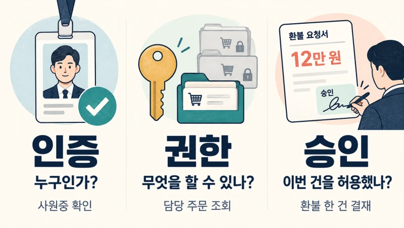
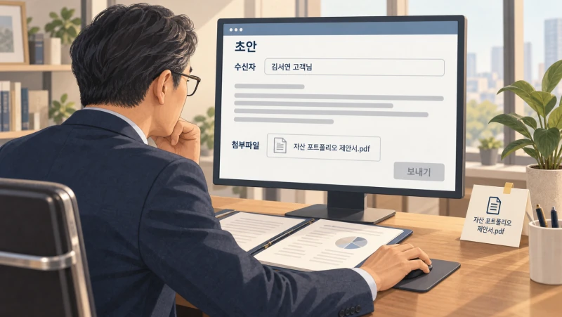
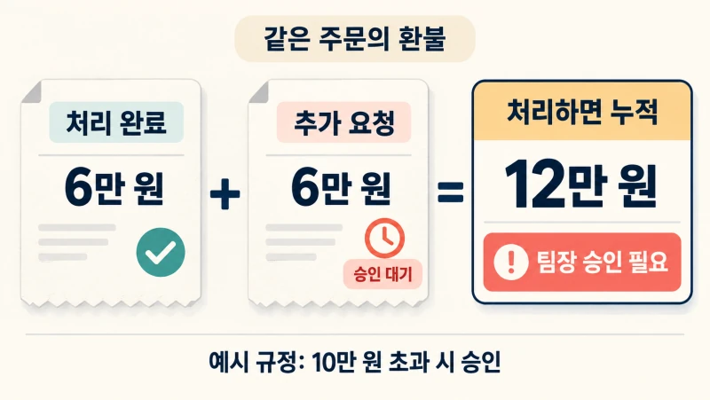
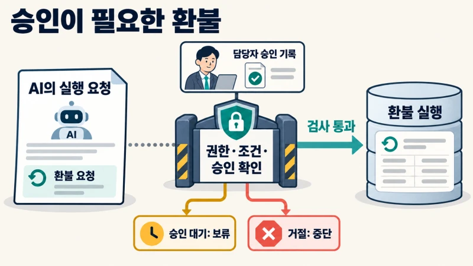
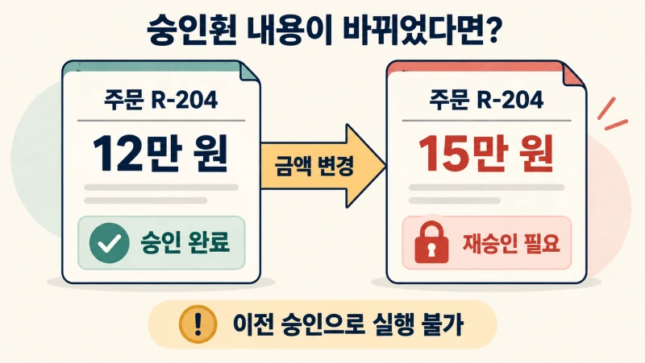
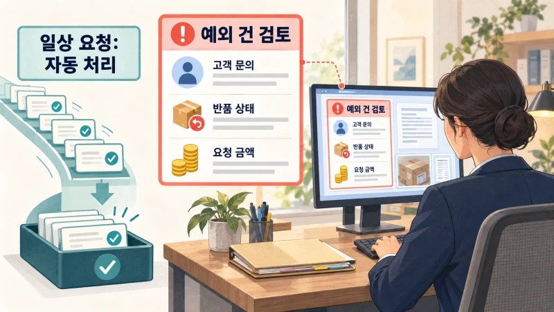
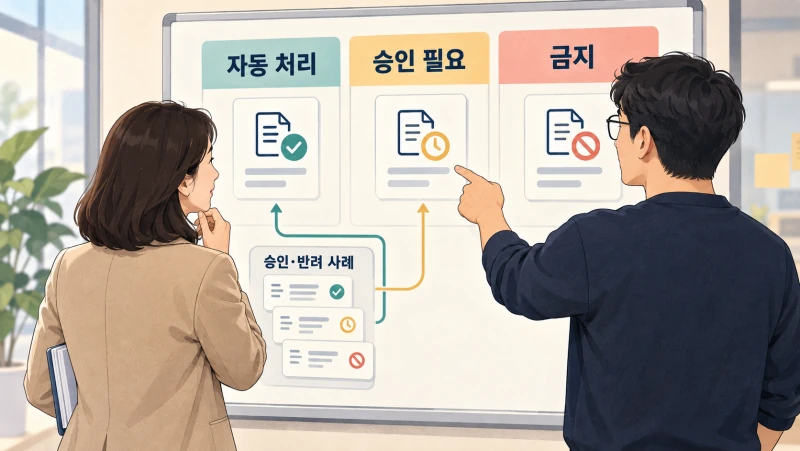

+++
date = '2026-09-12T00:00:00+09:00'
draft = false
title = 'AI는 이미 처리했다는데, 팀장은 승인한 적이 없습니다'
description = '규정을 알려줬는데 AI가 승인 없이 환불했다면? 실제 기업 사례와 환불 업무로 살펴보는 AI의 자동 처리 범위, 실행 권한, 사람의 결재선.'
tags = ['ax', 'ai', 'agent', 'governance', 'human-in-the-loop']
authors = ['geoff']
featured_image = 'thumbnail.webp'
images = ['thumbnail.webp']
slug = 'ai-agent-approval-workflows'
audio = []
vedios = []
series = []
toc = true
+++

## 들어가며

가상의 쇼핑몰 고객지원팀을 생각해보겠습니다. 이 회사는 10만 원을 넘는 환불에는 팀장 승인이 필요합니다. AI 에이전트를 도입하면서 담당자는 이 규정을 업무 지침에 넣었습니다. 주문을 조회하고 반품 상태를 확인하는 도구에 환불 기능도 연결했습니다.

어느 날 담당자가 주문번호를 넣고 환불 처리를 요청합니다. 잠시 뒤 AI가 답합니다.

> 12만 원 환불을 완료했습니다.

처리 내역을 보던 팀장은 당황합니다. 자신은 이 건을 승인한 적이 없습니다. 담당자는 AI에게 분명히 규정을 알려줬다고 합니다. 어디서 잘못된 걸까요?

AI에 연결한 계정에는 환불할 권한이 있었지만 환불 기능에는 팀장 승인을 검사하는 절차가 없었습니다. AI가 지침을 놓치고 실행을 요청해도 시스템은 그대로 처리할 수 있었던 겁니다. 직원이라면 결재 문서를 올려야 할 일을 AI는 바로 끝냈습니다.

**AI에게 일을 맡길 때는 자동으로 처리할 범위와 사람의 승인이 필요한 조건을 정하고 실제 실행 단계에서 그 조건을 검사해야 합니다.** 그래야 현업도 어디까지 맡겨도 되는지 알고 사용할 수 있습니다.

앞선 [AI Evals 글](https://tech.epsilondelta.ai/posts/what-are-ai-evals/)에서는 우리 업무를 잘하는지 시험하는 방법을 다뤘습니다. 이번에는 운영 중인 AI에게 결재선을 만드는 방법을 살펴보겠습니다. 실제 기업들은 무엇을 자동으로 처리하고 어디서 사람을 부르는지, 한 건의 환불을 승인한 뒤에도 어떤 확인이 필요한지 따라가 봅시다. 다 읽고 나면 우리 업무에서 자동으로 진행할 단계와 사람의 결정을 기다릴 단계를 나누고 개발팀에 무엇을 확인할지 정하는 데 도움이 될 겁니다.

## 일을 잘한다고 전결권까지 주지는 않습니다

일을 잘하는 직원에게도 담당 업무와 전결 한도가 있습니다. 견적서를 만드는 일은 맡겨도 큰 폭의 할인을 약속하려면 부서장에게 확인받도록 합니다. AI가 계산을 잘하고 규정을 정확하게 설명하더라도 회사 돈을 쓰거나 고객에게 약속할 권한은 따로 정해야 합니다.

여기서 인증과 권한, 승인을 구분해볼 필요가 있습니다. 사원증으로 본인임을 확인하는 것이 인증입니다. 담당 고객의 주문을 조회할 수 있게 하는 것은 권한 설정입니다. 그 고객에게 12만 원을 환불해도 좋다고 팀장이 결정하는 것은 이번 거래의 승인입니다.

직원 계정으로 로그인했다고 그 직원이 회사의 모든 거래를 승인할 수 있는 것은 아니죠. 직원의 계정으로 움직이는 AI도 마찬가지입니다. 개발팀은 누가 AI에게 요청했는지와 함께 실제 주문 시스템에는 어떤 계정으로 접속하는지 확인해야 합니다. 제한된 고객만 맡는 AI가 전사 관리자 계정으로 연결돼 있다면 잘못된 동작 한 번으로 다른 고객의 주문까지 바꿀 수 있습니다. [OWASP의 에이전트 권한 지침](https://genai.owasp.org/llmrisk/llm062025-excessive-agency/)도 도구의 기능과 접속 권한을 필요한 범위로 제한하도록 권고합니다.

사람이 AI의 처리 과정에 참여하는 방식을 Human-in-the-loop, 줄여서 HITL이라고 부릅니다. 이 글에서 살펴볼 것은 그중 실행 전에 사람이 검토하고 승인하는 방식입니다. 때로는 정해진 범위 안에서 AI가 처리하고 예외가 생겼을 때 사람이 업무를 넘겨받기도 합니다.

이런 결재선을 정하려면 업무를 행동별로 나눠봐야 합니다. 고객 상담을 맡긴다는 말에는 주문 조회, 답변 작성, 연락처 변경, 환불 등 서로 다른 행동이 들어 있습니다. 각각 어떤 권한으로 실행하고 어느 조건에서 멈출지 정하는 겁니다.

## 실제 회사들은 어디서 사람을 부를까?

### Ramp는 애매한 경비를 기존 검토 절차로 돌려보냅니다

기업의 지출 관리를 돕는 Ramp는 경비 규정을 읽고 지출을 검토하는 Policy Agent를 운영합니다. [2025년 7월 엔지니어링 글](https://builders.ramp.com/post/how-to-build-agents-users-can-trust)에 따르면 AI는 판단의 근거가 된 규정 조항을 함께 보여줍니다. 판단하기 어려우면 불확실한 이유를 설명하고 기존에 쓰던 사람 검토 절차로 넘깁니다. Ramp는 내부 적용 후 승인의 65% 이상을 에이전트가 완전히 처리했다고 밝혔습니다.

현재 [제품의 승인 설정](https://support.ramp.com/use-policy-agent-for-approvals/)에서는 금액이나 부서, 법인 등에 따라 자동 승인 범위를 정할 수 있습니다. AI의 추천을 참고만 할지 실제 승인으로 처리할지도 업무 흐름에서 설정합니다.

경비 담당자가 모든 영수증을 다시 읽는 대신 예외에 집중할 수 있는 구성입니다. 사람에게 넘어온 건에 어떤 자료가 부족하고 어떤 규정이 애매한지 표시해주면 담당자는 그 부분부터 살펴볼 수 있습니다. 자동 처리할 조건과 사람에게 물어볼 조건을 함께 정하는 셈입니다.

### Morgan Stanley에서는 담당자가 메일을 편집하고 보냅니다

금융회사 Morgan Stanley의 Debrief는 고객 동의를 받아 상담 미팅을 기록하고 요약과 후속 메일 초안을 만듭니다. 메일은 담당 자산관리사가 자신의 판단으로 편집하고 발송합니다. [Morgan Stanley의 서비스 발표](https://www.morganstanley.com/press-releases/ai-at-morgan-stanley-debrief-launch)에 이 역할이 명시돼 있습니다.

여기서는 고객에게 내용이 전달되기 전에 담당자가 확인합니다. 상담 내용을 정리하는 일은 AI에게 맡기고 실제로 고객에게 보낼 내용은 그 상담을 맡은 사람이 결정하는 겁니다.

우리 회사의 영업 메일도 비슷하게 생각해볼 수 있습니다. 제품 설명을 정리하는 동안에는 자동으로 진행해도 납기나 할인 조건을 약속하는 메일은 담당자가 확인하도록 구성할 수 있습니다. 이때 메일 본문뿐 아니라 수신자와 첨부파일도 함께 보여줘야 합니다. 문장은 맞게 썼어도 다른 고객의 견적서를 붙였다면 그대로 보내서는 안 되겠죠.

### Lemonade는 권한 밖의 청구를 맡을 전문가까지 정합니다

보험사 Lemonade의 AI Jim은 보험금 청구를 접수하고 분류합니다. 회사의 [2025년 사업보고서](https://www.sec.gov/Archives/edgar/data/1691421/000169142126000016/lmnd-20251231.htm)에 따르면 처리 권한이 없거나 우려가 있는 청구는 사람 전문가에게 배정합니다. 전문가의 분야와 자격, 업무량과 일정도 고려합니다.

AI가 사람을 호출하는 것으로 끝나는 게 아닙니다. 그 일을 판단할 수 있고 실제로 처리할 여유가 있는 사람에게 맡깁니다. 회사가 2025년 말 기준으로 공개한 전체 청구 자동 처리 비율은 약 55%였습니다.

회사마다 모든 건에 같은 결재선을 적용할 필요는 없습니다. Ramp처럼 조건에 맞는 건을 자동으로 처리할 수도 있고 Morgan Stanley처럼 외부 발송을 담당자에게 남길 수도 있습니다. Lemonade에서는 권한 밖의 건을 전문가에게 넘깁니다. 우리도 업무의 영향과 판단에 필요한 전문성을 보고 사람의 역할을 정하면 됩니다.

## 금액만으로 승인 대상을 정하면 빠지는 일이 있습니다

처음 쇼핑몰의 10만 원 기준으로 돌아가 보겠습니다. 금액이 작으면 모두 자동으로 처리해도 될까요? 같은 주문에 6만 원씩 두 번 환불하면 합계는 12만 원입니다. 건별 금액만 확인하는 시스템이라면 한도를 넘긴 사실을 놓칠 수 있습니다.

환불받을 계좌가 갑자기 바뀌었거나 같은 고객이 반복해서 요청했다면 금액 외의 조건도 봐야 합니다. 회사가 정한 반품 요건을 충족했는지, 이미 환불한 금액은 얼마인지 함께 확인하는 겁니다. 다음 표는 이런 조건을 정할 때 쓸 수 있는 구성 예시입니다.

| 행동 | 자동으로 맡길 범위의 예 | 사람에게 확인할 조건의 예 |
|---|---|---|
| 주문 조회 | 담당 고객의 주문·배송 상태 조회 | 접근 권한 밖의 고객 정보 요청 |
| 환불 | 회사가 정한 금액·반품·횟수 조건을 모두 충족한 건 | 누적 한도 초과, 지급 수단 변경, 분쟁 |
| 구매·발주 | 승인된 거래처·품목·예산 안의 정형 발주 | 신규 거래처, 예산 초과, 계약 조건 변경 |
| 고객 메일 | 초안 작성과 내부 저장 | 외부 발송, 새로운 할인·납기 약속 |
| IT 운영 | 허용한 테스트 환경에서 점검 | 운영 데이터 변경, 대량 삭제, 배포 |

이 표의 조건은 회사가 자기 업무에 맞춰 정할 예시입니다. 이미 직원에게 적용하던 전결 규정과 예외 처리 사례부터 펼쳐보면 좋습니다. 어떤 건은 현업 담당자에게 맡겨도 되고 어떤 건은 재무나 보안 담당자의 확인이 필요한지 이야기할 수 있습니다.

승인을 요청한다고 해서 금지된 행동을 모두 허용할 수 있는 것도 아닙니다. 해당 요청을 승인할 권한이 없는 사람이 버튼을 눌렀을 때는 실행되지 않아야 합니다. 요청자가 볼 수 없는 고객 정보라면 적절한 권한을 확인하는 절차부터 필요합니다.

## 승인 버튼 뒤에는 실행을 막는 코드가 있어야 합니다

개발팀이 환불 기능을 연결한다고 해보겠습니다. API는 프로그램끼리 주문 조회나 환불 같은 기능을 요청하는 접점입니다. AI는 도구를 통해 이 API를 호출합니다. 이때 환불 API를 실행하는 쪽에서 요청자의 권한과 환불 조건, 필요한 승인 여부를 검사해야 합니다.

AI에게는 주문 정보를 읽고 환불안을 만드는 도구를 줍니다. 실제 환불 도구에는 회사 규정에 맞는 요청만 통과하도록 검사를 붙입니다. 승인 전에는 보류 상태를 반환하고 고객에게는 아직 처리 중이라고 안내합니다. AI가 지침을 잘못 이해해 환불 도구를 호출하더라도 이 검사에서 멈추도록 만드는 겁니다.

[OWASP의 거래 승인 지침](https://cheatsheetseries.owasp.org/cheatsheets/Transaction_Authorization_Cheat_Sheet.html)도 승인을 서버에서 검사하고 실제 거래를 실행하기 직전에 확인하도록 설명합니다. 화면에 승인 버튼이 있는지에 더해 그 버튼을 누르지 않고도 다른 경로로 실행할 수 있는지 살펴야 합니다. 승인 절차를 거치지 않고 다른 경로로 환불을 실행하거나 주문 데이터를 직접 수정할 수 있다면 우회할 길이 남아 있는 셈입니다.

이런 구성을 도와주는 기능도 있습니다. Amazon Bedrock Agents의 [Return control](https://docs.aws.amazon.com/bedrock/latest/userguide/agents-returncontrol.html)을 쓰면 에이전트가 실행하려는 함수와 입력값을 호출한 애플리케이션으로 돌려받을 수 있습니다. 개발팀은 이 정보를 회사의 결재 시스템에 보내고 승인·검사를 마친 뒤 실제로 실행하도록 연결할 수 있습니다.

정책 엔진을 이용하는 방법도 있습니다. 정해둔 규칙에 따라 요청을 허용하거나 막는 프로그램입니다. [Amazon Bedrock AgentCore의 temporal policies](https://docs.aws.amazon.com/bedrock-agentcore/latest/devguide/policy-temporal.html)는 Gateway라는 중간 접점을 거치는 관련 호출의 이력을 보고 앞서 승인받은 대상과 지금 실행할 대상이 같은지 검사하는 조건을 지원합니다.

어느 기능을 선택하더라도 회사가 결정할 조건은 남습니다. 누가 승인할 수 있는지, 어떤 대상과 금액을 허용할지, 승인하지 않은 요청을 어디에서 막을지 개발팀과 현업이 함께 정해야 합니다. 도입 제안서에 승인 기능을 지원한다고 적혀 있다면 **우리 시스템의 어느 동작을 실제로 막는지 시연해 달라고 요청해볼 만합니다.**

## 12만 원을 승인했는데 15만 원이 나가면 안 되겠죠

이제 처음의 쇼핑몰에 승인 절차를 붙였다고 해봅시다. AI가 주문 R-204에 대해 12만 원 환불을 제안합니다. 고객지원 팀장은 반품이 완료됐는지, 이미 돌려준 금액은 없는지 확인하고 12만 원 환불을 승인합니다.

그런데 실행 전에 고객이 배송비도 포함해 달라고 요청합니다. AI가 금액을 15만 원으로 고쳤습니다. 앞에서 팀장 승인을 받았으니 그대로 처리해도 될까요?

팀장이 승인한 것은 R-204 주문에 대한 12만 원 환불입니다. 금액을 바꾸면 다시 검토받아야 합니다. 고객 메일이라면 수신자나 본문, 첨부물을 바꿨을 때 같은 문제가 생깁니다. 승인은 막연히 이 고객을 잘 처리하라는 동의가 아니라 검토한 실행 내용에 대한 동의입니다.

개발팀은 승인 화면과 실행 프로그램이 같은 거래 정보를 읽도록 만들어야 합니다. 주문번호와 고객, 금액, 지급 수단을 한 건으로 묶어 저장하고 누가 언제 그 내용을 승인했는지 연결하는 겁니다. 실행 프로그램은 현재 요청이 승인한 내용과 일치하는지 확인합니다. 다르면 이전 승인으로 처리하지 않습니다.

승인 후 시간이 지나 업무 상태가 바뀔 수도 있습니다. 다른 담당자가 그사이 같은 주문을 환불했다면 처음 제안한 금액이 그대로여도 다시 실행해서는 안 됩니다. 실제 실행 직전에 주문 상태와 남은 환불 가능 금액도 확인해야 합니다. [OWASP의 고영향 행동 통제](https://cheatsheetseries.owasp.org/cheatsheets/AI_Agent_Security_Cheat_Sheet.html#high-impact-action-integrity-controls)에서도 승인을 구체적인 행동에 연결하고 실행 전에 별도로 검증하도록 권고합니다.

### 팀장이 자리를 비웠다면

사람의 결재는 AI의 응답처럼 바로 오지 않을 수 있습니다. 승인 대기 상태를 데이터베이스에 남겨두고 팀장이 응답하면 이어서 처리해야 합니다. 대기 중 서버가 재시작돼도 어떤 건을 기다리고 있었는지 찾아갈 수 있어야겠죠.

에이전트의 작업 흐름을 구성하는 LangGraph에는 이런 중단과 재개를 위한 기능이 있습니다. 다만 재개할 때 중단했던 작업 단위의 처음부터 코드를 다시 실행합니다. 개발자는 실제 변경 작업을 승인 뒤로 분리하고 다시 실행돼도 중복 처리하지 않도록 구성해야 합니다. [공식 문서](https://docs.langchain.com/oss/python/langgraph/interrupts)도 중단 전에 실행한 코드가 반복될 수 있음을 설명합니다.

누가 대신 결재할지와 얼마 동안 기다릴지도 정합니다. 응답이 없으면 대체 담당자에게 넘기거나 작업을 보류합니다. 승인 유효기간이 지났을 때도 다시 확인받도록 해야 합니다. 오래 기다렸다는 이유로 승인된 것으로 간주하면 사람이 확인할 기회를 없애는 셈이니까요.

### 실행했는데 응답이 오지 않았다면

팀장이 승인한 환불 요청을 보낸 직후 통신이 끊겼다고 해봅시다. 우리 화면에는 실패로 보이지만 결제 시스템은 이미 접수했을 수 있습니다. 이때 새 환불을 요청하면 같은 돈을 두 번 돌려줄 위험이 있습니다.

같은 업무에 식별자를 붙이고 재시도할 때도 유지하는 방법을 쓸 수 있습니다. 외부 시스템이 멱등 키를 지원한다면 같은 키로 들어온 요청을 중복 처리하지 않도록 연결합니다. 멱등성은 같은 요청을 반복해도 결과가 중복해서 생기지 않게 하는 성질입니다. [Stripe의 API](https://docs.stripe.com/api/idempotent_requests)도 이런 키를 사용해 재시도하는 기능을 제공합니다.

응답을 못 받았을 때는 기존 요청의 처리 결과부터 조회합니다. 결제 시스템이 접수만 한 상태인지 지급까지 끝냈는지에 맞춰 고객에게 안내합니다. 승인 기록뿐 아니라 실제 접수 결과도 함께 남겨야 담당자가 무슨 일이 일어났는지 확인할 수 있습니다.

승인 대기 중인 환불과 거절한 환불, 접수했지만 결과를 확인 중인 환불을 구분해 두면 담당자도 어디서 이어받아야 할지 알 수 있습니다.

## 결재선이 생겼는데 팀장은 더 바빠졌습니다

승인 기능을 만들고 나면 모든 요청을 팀장에게 보내고 싶어질 수 있습니다. 그런데 주문을 조회할 때도, 고객에게 답변 초안을 쓸 때도 매번 승인 알림이 온다면 어떨까요? 팀장은 AI를 도입하기 전보다 더 많은 화면을 열어봐야 합니다.

사람에게 보낼 건을 고르고 실제로 판단할 자료를 함께 줘야 합니다. [AWS의 사람 승인 설계 가이드](https://docs.aws.amazon.com/wellarchitected/latest/agentic-ai-lens/agentsec04-bp02.html)도 모든 행동을 검토하게 하면 승인 피로와 형식적인 확인이 생길 수 있다고 지적합니다.

앞의 환불 건이라면 팀장에게 고객 문의 원문과 반품 상태, 요청 금액, 적용 규정을 함께 보여줍니다. 무엇이 자동 처리 조건을 벗어났는지, 담당자가 아직 확인하지 못한 것이 무엇인지도 표시합니다. AI가 길게 설명한 문장만 보내놓고 나머지는 알아서 찾으라고 하면 검토자가 조사부터 다시 해야 합니다. 앞선 [Workslop 글](https://tech.epsilondelta.ai/posts/what-is-workslop/)에서 살펴본 재작업이 승인 업무에서도 생길 수 있습니다.

처음에는 최근에 잘 처리한 건과 반려한 건을 모아 승인 흐름에 넣어보면 좋습니다. 실제 지급이나 발송은 막아둔 시험 환경에서 자동 처리할 건을 제대로 구분하는지, 승인 없는 실행은 막는지 확인합니다. 승인 뒤 금액을 바꾸거나 승인자의 권한을 회수했을 때도 시험합니다. 서버를 재시작하거나 같은 요청을 두 번 보내는 상황도 포함할 수 있습니다.

운영을 시작한 뒤에는 자동 처리율과 함께 잘못 처리해 되돌린 건, 승인 대기시간, 검토자가 쓴 시간을 봅니다. 어느 팀장에게 예외가 몰리는지, 어떤 규정 때문에 보완 요청을 반복하는지 살펴보면 다음에 고칠 부분을 찾을 수 있습니다.

저희는 처음부터 모든 업무의 결재선을 한꺼번에 만들기보다 환불이나 고객 메일처럼 한 업무를 골라 끝까지 연결해보는 편이 좋다고 생각합니다. 현업 담당자가 자동 처리할 조건을 정하고 개발팀이 실행을 통제한 뒤 실제 예외로 시험하는 겁니다. 그 결과를 보고 맡길 범위를 넓혀갈 수 있습니다.

## 나가며

처음의 쇼핑몰에는 환불 규정이 있었고 AI에게도 알려줬습니다. 그런데 실행하는 시스템에서 승인을 확인하지 않아 팀장이 모르는 환불을 처리할 수 있었습니다. AI를 도입할 때는 업무 지침과 실행 권한, 사람의 결재를 함께 구성해야 합니다. 그래야 맡겨도 되는 일은 계속 진행하고 중요한 결정에서는 멈출 수 있습니다.

현업과 이 조건을 정하다 보면 문서에 없던 판단도 나옵니다. 같은 금액이어도 이 고객은 왜 한 번 더 확인하는지, 이 거래처와는 어떤 조건을 먼저 협의해야 하는지 설명하게 됩니다. 그 이유를 검토 자료와 승인·반려 사례에 남기고 업무 지침과 검사 규칙에 반영하면 다음 담당자와 에이전트도 참고할 수 있습니다. 앞선 [암묵지 자산화](https://tech.epsilondelta.ai/posts/ax-tacit-knowledge-assetization/)를 실제 처리 기준으로 구체화하는 작업입니다.

막상 우리 회사에 적용하려면 전결 규정을 정리하는 데서 끝나지 않습니다. 사내 주문·재무·고객관리 시스템의 권한을 확인하고 승인 화면과 실제 실행을 연결해야 합니다. 기다렸다 재개하는 절차와 중복 처리 방지를 구현하고 현업의 예외 판단을 시험 사례로 만들어야 합니다. 업무를 잘 아는 사람과 에이전트를 설계·운영할 기술적인 노하우가 함께 필요합니다.

우리 엡실론델타는 현업 담당자와 자동 처리·승인·금지 조건을 정하는 일부터 기존 시스템 연동, 실행 통제, 검증과 운영까지 함께 도와드리겠습니다.

AI에게 더 많은 일을 맡기고 싶은데 어디까지 허용해야 할지 고민이거나 모든 결과를 사람이 다시 확인하느라 도입 효과를 느끼지 못한다면 [contact@epsilondelta.ai](mailto:contact@epsilondelta.ai)로 연락 주세요. 맡기고 싶은 업무 하나와 최근 승인·반려 사례 몇 건부터 가져오셔도 좋습니다. 우리 회사의 결재선을 AI의 실제 행동에 연결하는 방법을 함께 찾아보겠습니다.
