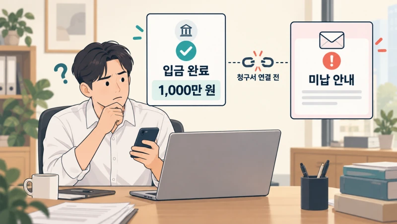
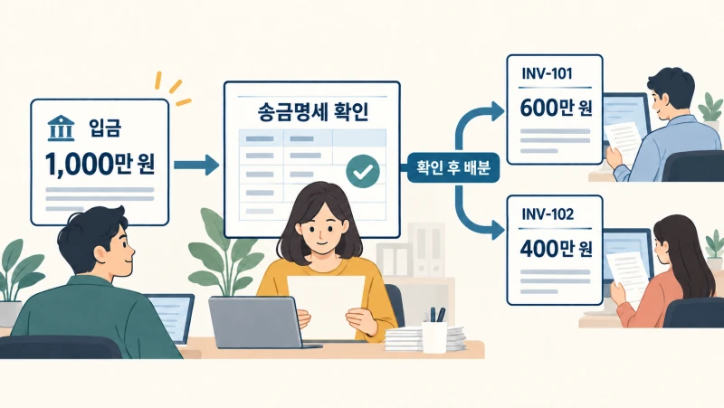
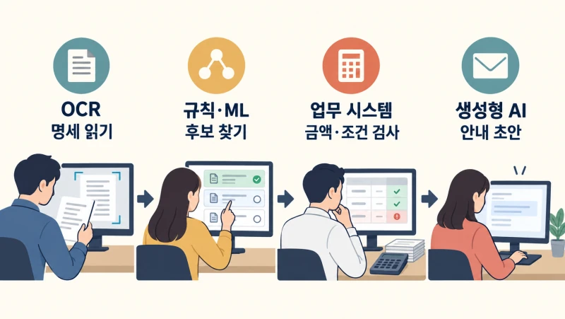
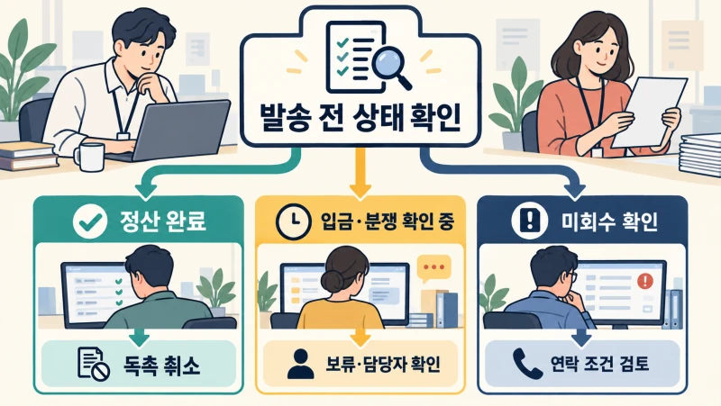
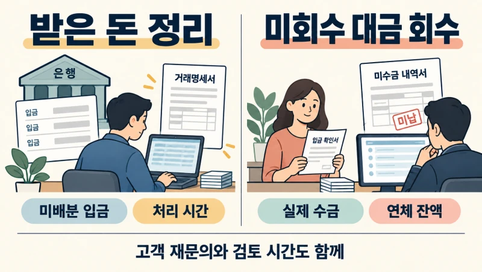
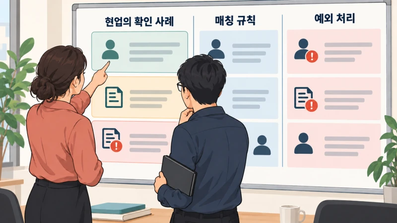

+++
date = '2026-09-13T00:00:00+09:00'
draft = false
title = '고객은 입금했다는데, 우리 회사 AI는 왜 독촉하고 있을까?'
description = '입금한 고객에게 독촉 메일이 나갔다면? 실제 기업 사례로 살펴보는 입금 매칭, 고객 약속, 회수 업무를 연결하는 AX와 우리 회사의 시작점.'
tags = ['ax', 'ai', 'accounts-receivable', 'finance', 'agent']
authors = ['geoff']
featured_image = 'thumbnail.webp'
images = ['thumbnail.webp']
slug = 'accounts-receivable-ax'
audio = []
vedios = []
series = []
toc = true
+++

## 들어가며

가상의 자재 유통회사를 생각해보겠습니다. 재무팀은 미수 대금 안내를 AI로 자동화했습니다. 지급기일을 넘긴 청구서를 찾아 고객별로 정중한 메일을 쓰고 발송합니다. 담당자가 엑셀을 정리하고 메일을 보내던 시간을 줄일 수 있겠죠.

그런데 영업팀에 고객의 전화가 옵니다.

> 어제 입금하고 내역도 보내드렸는데, 왜 또 돈을 내라고 하시죠?

영업 담당자가 재무팀에 확인합니다. 은행에는 실제로 돈이 들어와 있습니다. 고객은 청구서 두 건의 대금을 한 번에 보냈고 어느 청구서에 얼마를 지급했는지는 별도 이메일에 적어뒀습니다. 재무팀이 그 입금을 청구서에 연결하기 전에 AI가 미결 목록을 읽고 독촉 메일을 보낸 겁니다.

고객은 송금 내역을 다시 보내야 했고 영업 담당자는 사과해야 했습니다. 재무팀은 입금과 청구서를 맞추는 일에 고객 응대까지 더해졌습니다. 메일은 빨라졌는데 업무는 늘었습니다.

이 상황에서 AI에게 더 공손하게 쓰라고 하면 해결될까요?

**미수 대금 회수에 AI를 쓰려면 청구서와 입금 내역, 고객과 주고받은 약속을 함께 확인하고 그 결과에 맞춰 다음 업무를 진행하도록 연결해야 합니다.** 이미 지급한 고객에게는 확인 안내가 필요하고 실제로 연체한 고객에게는 회수 담당자의 대응이 필요하니까요.

이번 글에서는 돈을 받는 일과 받은 돈을 청구서에 반영하는 일이 왜 어긋나는지 살펴보겠습니다. 실제 기업의 개선 사례와 AI의 역할을 따라가 보면 우리 회사에서 어떤 정보를 연결해야 하는지, 무엇부터 자동화하고 어떤 성과를 확인해야 할지 정하는 데 도움이 될 겁니다.

## 돈은 받았는데 청구서는 아직 미결입니다

우리 회사가 거래처에 물건을 팔고 아직 받지 못한 대금을 매출채권이라고 합니다. 이 대금을 관리하는 담당자는 지급기일만 보는 것이 아닙니다. 어느 고객이 무엇을 지급했고 얼마가 남았는지 확인하며 청구 내용에 이견이 있으면 영업이나 고객지원팀과 함께 해결합니다.

고객은 청구서마다 정확한 금액을 따로 송금해주지 않을 수 있습니다. 여러 건을 합쳐 보내기도 하고 일부만 지급하기도 합니다. 입금자명이 거래처 상호와 다르거나 본사가 지사의 대금을 대신 지급하는 경우도 있습니다. 은행에 돈이 들어왔다는 사실만으로 어느 청구서를 정산할지는 바로 알기 어렵습니다.

받은 돈을 고객과 청구서에 연결하는 일을 Cash Application이라고 부릅니다. 여기서는 입금 배분 또는 입금 매칭이라고 하겠습니다. 고객이 어떤 청구서에 얼마를 지급했는지 알려주는 문서가 송금명세입니다. 돈은 은행으로 오고 명세는 이메일이나 고객 포털로 따로 올 수 있습니다.

처음 사례를 숫자로 보겠습니다. 가온상사가 우리 회사에 지급할 청구서는 두 건입니다. 같은 통화이며 수수료나 공제는 없다고 가정합니다.

| 자료 | 확인할 내용 |
|---|---|
| 청구서 INV-101 | 600만 원 |
| 청구서 INV-102 | 400만 원 |
| 은행 입금 | 가온상사 본사 명의 1,000만 원 |
| 고객의 송금명세 | INV-101에 600만 원, INV-102에 400만 원 지급 |

담당자는 송금자와 고객의 관계를 확인하고 명세에 적힌 두 청구서를 찾습니다. 합계가 입금액과 맞는지, 이미 다른 입금으로 처리한 청구서는 아닌지도 봅니다. 확인을 마친 뒤 두 청구서에 각각 금액을 반영하면 해당 대금을 더 받을 필요가 없다고 판단할 수 있습니다.

이 연결이 끝나지 않았다면 은행에는 1,000만 원이 있어도 청구서별 잔액에는 그대로 남아 있을 수 있습니다. AI에게 그 잔액 목록만 보여주면 이미 들어온 입금을 확인할 기회가 없는 겁니다.

이름을 모르는 송금자를 찾는 일, 고객은 알지만 청구서를 못 찾은 입금을 처리하는 일, 실제로 안 낸 고객에게 연락하는 일은 각각 다릅니다. 그런데 모두 미결이라는 이유로 같은 독촉 대상에 넣으면 첫 장면 같은 문제가 생길 수 있습니다.

## 현장에서는 이 일을 어떻게 바꿨을까?

### WESCO는 돈과 따로 오는 지급명세를 연결했습니다

전기·통신 자재를 유통하는 WESCO의 담당자도 비슷한 어려움을 설명했습니다. 전자이체로 돈은 더 빨리 들어왔지만 직원들은 이메일과 고객 포털에서 지급명세를 찾아야 했습니다. 입금이 빨라져도 어느 청구서를 지급했는지 반영하는 일은 늦었던 겁니다.

[HighRadius가 공개한 현업 책임자의 발표](https://radiance.highradius.com/houston/wesco-case-study/)에 따르면 WESCO는 지급명세 수집과 문자 인식, 청구서 연결을 자동화했습니다. 회수 담당자도 지급 상태와 고객이 어떤 청구서를 납부했다고 적었는지 확인할 수 있게 했습니다. 은행 자료를 찾아달라고 입금 처리 담당자에게 다시 요청하던 수고를 줄인 겁니다.

여러 ERP를 사용하는 상황에서 그 위에 정보를 연결하는 도구를 둔 점도 참고할 만합니다. ERP는 청구와 회계 등 회사의 업무를 관리하는 시스템입니다. 인수합병으로 회사가 커지면 서로 다른 ERP를 함께 쓰는 경우가 생기는데, WESCO는 이런 상황에서 입금 처리와 정보 공유를 개선했습니다.

우리 회사도 ERP를 전부 교체해야만 시작할 수 있는지부터 고민하기보다 현재 시스템 사이에서 어떤 정보를 주고받아야 하는지 살펴볼 수 있겠죠.

### Microsoft는 고객에게 연락하기 전의 준비부터 바꿨습니다

Microsoft의 글로벌 회수 담당자들은 고객에게 연락하기 전에 여러 시스템을 오가야 했습니다. 청구 내역을 찾고 다른 팀이 고객과 무슨 이야기를 했는지 확인하며 예외 건을 맡을 담당자를 찾았습니다.

회사는 고객·청구·입금 정보를 SAP와 Dynamics 365 환경에 통합했습니다. 이어 AI로 입금 매칭을 돕고 고객 문의를 요약하고 담당자에게 배정했습니다. 매일 어떤 고객을 우선 확인할지 정하는 일과 답변 초안 작성도 담당자의 업무 안에 넣었습니다. [2026년 6월 Microsoft의 운영 회고](https://www.microsoft.com/insidetrack/blog/streamlining-finance-cash-collection-at-microsoft-with-ai/)에서는 통화 준비 시간이 40% 줄었다고 설명합니다.

그동안의 고객 대화와 청구 내역을 준비해주면 회수 담당자는 전화를 걸기 전 조사부터 반복하지 않아도 됩니다. 분쟁이 생긴 고객인지, 어느 팀이 이미 대응 중인지 알고 이야기할 수 있습니다. 담당자가 연락해야 할 고객을 골라주는 것과 그 고객에게 연락할 준비까지 해주는 것을 함께 구성한 셈입니다.

### Laminex의 담당자는 입력 대신 검토에 시간을 썼습니다

호주의 건축 마감재 제조사 Laminex는 2021년 입금 배분 자동화를 시작했습니다. [Esker가 공개한 고객 사례](https://www.esker.com/company/customer-success-stories/laminex-customer-story/)에 따르면 직원들은 AI가 처리한 지급명세와 배분 제안을 확인하는 방식으로 일했습니다. 도입 6개월 뒤 자동 배분율은 52%였고 월말에 청구서 등에 배분하지 못한 현금은 95% 줄었다고 합니다.

입금을 어디에 반영할지 몰라 남겨두는 경우가 줄면 고객에게 보내는 잔액 명세도 더 정확하게 정리할 수 있습니다. 고객은 납부했는데 명세에는 계속 미납으로 나오는 상황을 줄이는 데 필요한 작업입니다.

세 회사에서 담당자가 하던 일을 살펴보면 메일 작성보다 앞선 일이 많습니다. 우리 조직의 회수 업무를 자동화할 때도 이 준비 과정을 함께 살펴야 합니다. 입금을 찾고 지급명세를 읽고 고객과 청구서를 맞춥니다. 다른 부서가 처리 중인 예외도 확인합니다.

## AI에게는 읽고 찾게 하고, 금액은 시스템에서 계산합니다

입금 매칭을 한다고 하면 언어모델에 청구서와 거래 내역을 전부 넣으면 될 것처럼 보일 수 있습니다. 하지만 필요한 작업을 나누면 서로 다른 기술을 쓸 곳이 보입니다.

송금명세가 PDF나 이미지라면 먼저 청구번호와 금액을 읽어야 합니다. 이때 쓰는 OCR은 이미지 속 문자를 인식하는 기술입니다. 숫자를 읽은 뒤에도 어느 행의 청구번호에 붙은 금액인지 확인해야 합니다. 합계는 맞아도 600만 원과 400만 원을 반대로 연결하면 두 청구서의 잔액을 잘못 처리하게 됩니다.

정확한 고객번호와 청구번호가 있는 건은 정해진 규칙으로 맞출 수 있습니다. 약칭이나 누락된 번호 때문에 애매한 경우에는 머신러닝 모델로 후보를 찾을 수 있습니다. 이 모델은 과거에 담당자가 확정한 내역을 학습합니다. [SAP Cash Application](https://www.sap.com/use-cases/reduce-accounts-receivable-matching-effort)도 과거 정산 내역을 활용해 고객 계정과 미결 항목의 매칭을 제안합니다.

같은 금액이라는 이유만으로 연결해서는 안 됩니다. 거래처와 법인, 통화가 맞는지 확인하고 두 후보를 구분할 근거가 부족하면 담당자에게 넘겨야 합니다. 이때 후보 청구서와 원문 명세를 같이 보여주면 담당자가 처음부터 다시 찾는 일을 줄일 수 있습니다.

고객의 이메일을 읽고 요약하거나 답변을 쓰는 데에는 생성형 AI를 활용할 수 있습니다. 다만 계산한 잔액은 회계 시스템에서 가져오도록 구성하는 편이 좋습니다. [Dynamics 365의 회수 업무 요약 기능](https://learn.microsoft.com/en-us/dynamics365/finance/accounts-receivable/collections-coordinator-summary-faq)도 금액 계산은 Finance에서 수행하고 언어모델은 그 자료로 요약과 메일 초안을 만듭니다.

가온상사 예시라면 프로그램이 청구액과 배분액을 대조해 잔액을 계산합니다. 생성형 AI는 확인한 상태에 맞춰 입금 안내나 추가 확인 요청을 작성합니다. 돈을 맞추는 규칙과 고객에게 설명하는 문장을 나누는 겁니다.

## 영업팀이 아는 약속을 재무팀의 AI도 알아야 합니다

입금 내역을 연결해도 남는 문제가 있습니다. 고객이 제품 일부의 하자를 이유로 대금 지급을 보류했고 영업팀이 이를 협의 중이라면 어떨까요? 재무팀의 AI가 지급기일과 잔액만 읽으면 일반 연체 고객과 똑같이 연락할 수 있습니다.

고객이 보낸 메일에서 어떤 청구서를 두고 다투는지, 누구와 무엇을 협의했는지 추려 회수 업무에 연결할 필요가 있습니다. 영업 담당자 개인의 메일함에만 남기지 않고 해당 고객·청구서·담당자와 함께 조회할 수 있도록 하는 겁니다.

여기서 고객의 요청과 회사가 수락한 약속은 구분해야 합니다. 고객이 다음 달에 내겠다고 썼다고 회사가 지급기일을 바꾸기로 한 것은 아니죠. AI는 메일에서 요청 내용을 찾아줄 수 있지만 공식 지급 조건은 정해진 승인 절차를 거쳐 반영해야 합니다.

숙련된 담당자는 이런 차이를 금방 알아봅니다. 이 거래처는 본사에서 일괄 지급한다는 점, 특정 차액은 반품 확인이 끝나야 처리할 수 있다는 점도 알고 있습니다. 이런 기준이 개인의 기억에만 있으면 새 직원이나 AI는 같은 고객을 맡을 때마다 다시 물어봐야 합니다.

앞선 [암묵지 자산화 글](https://tech.epsilondelta.ai/posts/ax-tacit-knowledge-assetization/)에서 다룬 노하우를 여기서는 고객 식별 기준, 매칭 규칙, 예외 처리 조건으로 정리할 수 있습니다. 담당자가 어떤 근거로 연결하거나 보류했는지 남기고 확인한 내용을 다음 업무에 활용하는 방식입니다.

## 독촉하기 전에 보류할 이유부터 확인합니다

처음의 가온상사 거래에 AI를 다시 적용해보겠습니다. 이번에는 은행 입금과 지급명세를 조회할 수 있고 미결 목록을 읽은 뒤 바로 메일을 보내지 않도록 구성합니다.

AI가 입금과 명세에서 두 청구서의 연결 후보를 찾으면 프로그램이 고객·금액·통화를 검사합니다. 회사가 정한 자동 반영 조건을 충족하면 청구서에 배분하고, 판단이 애매한 경우에는 담당자가 확인합니다. 그동안 해당 청구서는 입금 확인 중으로 두고 독촉을 보류할 수 있습니다.

배분을 마치면 ERP의 실제 반영 결과를 확인합니다. 그 결과에 맞춰 회수 목록을 갱신하고 예약된 독촉도 취소합니다. AI가 답변에서 처리했다고 말하는 것뿐 아니라 업무 시스템의 상태까지 확인하는 겁니다.

| 지금 확인한 상태 | 이어서 할 일 |
|---|---|
| 입금과 청구서 연결 완료 | 잔액과 회수 목록 갱신, 불필요한 독촉 취소 |
| 입금은 있지만 어느 청구서인지 확인 중 | 해당 건 보류, 담당자에게 매칭 자료 전달 |
| 고객은 송금했다고 하지만 은행 입금 미확인 | 증빙과 수집 상태 확인, 재확인 시점 지정 |
| 청구 내용에 분쟁이 있음 | 분쟁 범위와 담당자 확인 |
| 회사가 승인한 지급 약속이 있음 | 약속한 기일과 금액에 맞춰 추적 |

위 표는 우리 회사에 적용할 흐름을 생각해보기 위한 예시입니다. 보류한 건에는 담당자와 다시 확인할 시간을 붙입니다. 확인 중이라는 표시만 남겨놓으면 실제로 늦게 낸 대금까지 계속 기다릴 수 있으니까요.

메일을 보내는 순간에도 상태를 확인해야 합니다. 아침에 만든 독촉 메일이 대기하는 동안 입금 배분을 마칠 수 있습니다. 보내기 직전에 잔액과 보류 여부를 다시 조회하고 같은 건으로 다른 부서가 이미 연락했는지도 봅니다. [Dynamics 365의 회수 자동화](https://learn.microsoft.com/en-us/dynamics365/finance/accounts-receivable/collections-process-automate)에는 고객군별 연락 단계와 연락 간격을 정하는 기능이 있습니다. 이런 기능을 사용할 때도 회사의 실제 처리 상태와 연락 규칙이 맞는지 확인할 일입니다.

은행 연동에 문제가 생겨 새 거래를 가져오지 못했다면 입금이 없는 것으로 단정해서는 안 됩니다. 마지막으로 받은 자료가 언제 것인지 표시하고 필요한 건은 담당자에게 확인을 요청하도록 구성합니다. 데이터가 늦게 도착해 이미 잘못 안내한 경우에는 후속 연락으로 정정하는 절차도 준비합니다.

차액을 없애거나 고객에게 대금을 돌려주는 일은 또 다른 권한이 필요합니다. 앞선 [AI 결재선 글](https://tech.epsilondelta.ai/posts/ai-agent-approval-workflows/)처럼 조회·추천·장부 반영·외부 발송의 조건을 나눠야 합니다. 입금 후보를 잘 찾는다는 이유로 AI에게 채권 감면이나 환불까지 맡기지는 않습니다.

## 진짜 회수할 대금에 시간을 쓰고 있는가?

이미 입금한 고객을 연락 대상에서 빼고 나면 회수 담당자는 실제 미회수 대금을 살펴볼 수 있습니다. 청구서 사본이 필요해 지급이 늦어진 고객과 납품 문제를 해결해야 하는 고객에게는 서로 다른 대응이 필요하겠죠.

어느 건부터 확인할지 정할 때는 예측 모델도 활용할 수 있습니다. [Dynamics 365의 고객 지급 예측](https://learn.microsoft.com/en-us/dynamics365/finance/finance-insights/payment-insights-overview)은 과거 청구·지급·고객 자료를 보고 정시 지급과 지연 가능성을 제시합니다. 담당자는 이런 예측과 금액, 현재 분쟁 상태를 함께 보며 우선순위를 정할 수 있습니다. 연체 가능성이 높게 나왔더라도 이미 지급한 내역은 먼저 반영해야 합니다.

경영진이 볼 성과도 이 업무에 맞춰 정해봅시다. 가온상사의 1,000만 원을 두 청구서에 연결했다면 이미 받은 돈을 정리한 성과입니다. 고객이 추가로 돈을 보낸 것은 아닙니다. 이 성과는 미배분 입금이 얼마나 줄었는지, 처리 시간이 얼마나 짧아졌는지로 확인할 수 있습니다.

회수 활동의 효과는 실제 수금과 기한을 넘긴 잔액, 분쟁 해결 시간으로 살펴봅니다. 여기에 이미 납부한 고객에게 보낸 안내, 중복 연락, 담당자의 검토 시간도 같이 기록하면 자동화를 늘리면서 어떤 부담이 생겼는지 알 수 있습니다.

연락 건수가 늘었는데 고객의 이의 제기와 재무팀의 정정 업무도 늘었다면 다음에 늘릴 것은 발송량이 아닐 겁니다. 어떤 상태를 잘못 읽었고 어느 자료가 늦게 들어왔는지부터 확인해야 합니다.

저희는 한 법인이나 고객군을 골라 최근 입금과 청구서, 담당자가 바로잡은 내역부터 비교해보는 편이 좋다고 생각합니다. 실제 장부 변경과 발송을 막아둔 상태에서 후보를 추천하게 하고 담당자의 판단과 맞는지 살펴봅니다. 과거의 예외를 [평가 사례](https://tech.epsilondelta.ai/posts/what-are-ai-evals/)로 남긴 뒤 정확히 처리하는 유형부터 자동화 범위를 넓혀가는 겁니다.

## 나가며

고객은 돈을 보냈고 은행에도 입금됐습니다. 그런데 우리 회사는 그 돈이 어떤 청구서의 대금인지 연결하지 못해 독촉했습니다. 입금과 청구서를 맞추고 고객과의 약속을 확인한 뒤 연락할 대상과 다음 행동을 정해야 합니다. 이 상황에서 고칠 부분은 메일의 말투보다 앞에 있습니다.

미수금 회수의 AX에는 현업의 판단과 여러 기술이 함께 필요합니다. 지급명세를 읽는 기술, 과거 처리 내역으로 후보를 찾는 모델, 잔액을 계산하는 시스템, 고객 대화를 정리하는 생성형 AI를 업무에 맞게 연결합니다. 베테랑이 매번 바로잡던 고객명과 예외 조건도 검증해 공통 기준으로 남겨야 다음 담당자와 에이전트가 다시 사용할 수 있습니다.

실제로 구성하려면 은행·ERP·고객관리 시스템의 데이터가 언제 갱신되는지부터 확인해야 합니다. 고객과 청구서의 식별자를 맞추고 매칭을 확정할 조건, 사람이 검토할 예외, 장부 반영과 발송 권한을 정해야 합니다. 기존 업무를 이해하면서 연동과 모델을 만들고 운영할 노하우가 필요한 일입니다.

우리 엡실론델타는 현업 담당자의 입금 매칭·예외 처리 기준을 정리하는 일부터 데이터 연결, AI 구성, 검증과 운영까지 함께 도와드리겠습니다.

입금 확인과 고객 응대를 반복하느라 재무팀이 바쁘거나, 회수 업무에 AI를 어디부터 적용할지 고민이라면 [contact@epsilondelta.ai](mailto:contact@epsilondelta.ai)로 연락 주세요. 고객명과 계좌정보를 가린 입금·청구서 예시, 최근 담당자가 다시 확인해야 했던 사례 몇 건부터 살펴볼 수 있습니다. 우리 회사에서 돈과 정보가 어디서 따로 움직이는지 확인하고 현업이 실제로 쓸 수 있는 업무 흐름을 함께 만들겠습니다.
