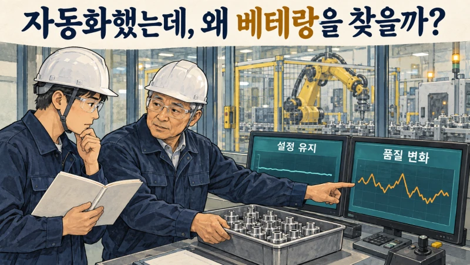
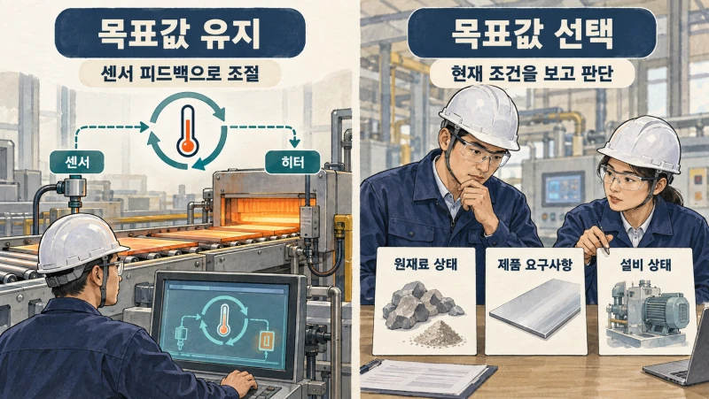
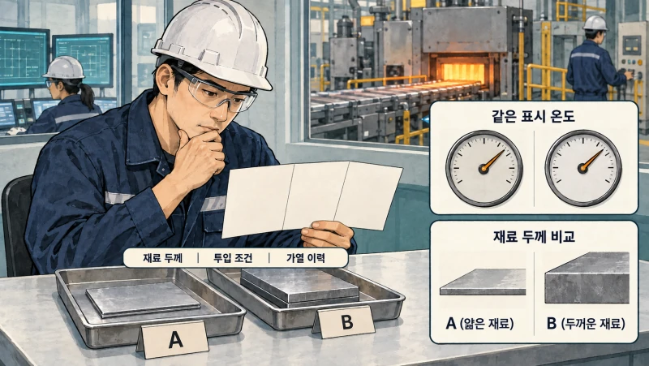
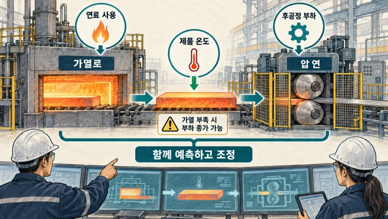
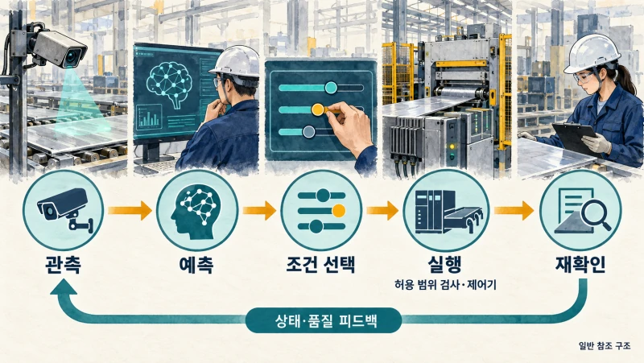
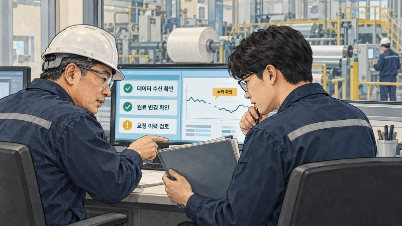
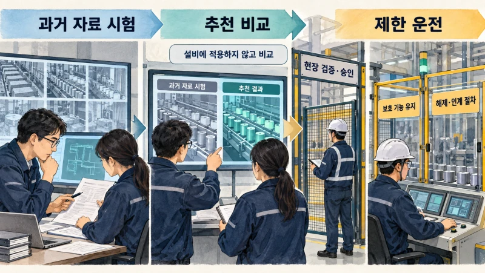
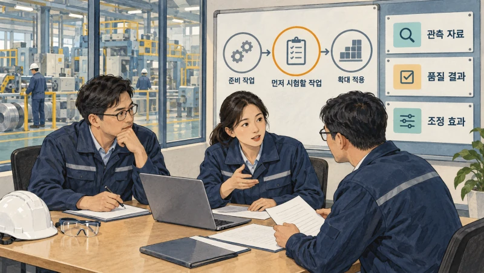
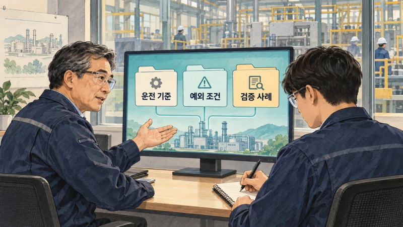

+++
date = '2026-09-15T00:00:00+09:00'
draft = false
title = '공장은 이미 자동화했는데, 왜 아직도 베테랑을 찾을까?'
description = '설비도 작업표준서도 있는데 왜 숙련자의 조정이 필요할까요? 국내외 제조 사례로 살펴보는 공정 판단의 데이터화, AI 자율조업과 현장 검증의 조건.'
tags = ['ax', 'ai', 'manufacturing', 'autonomous-operations', 'tacit-knowledge']
authors = ['geoff']
featured_image = 'thumbnail.webp'
images = ['thumbnail.webp']
slug = 'manufacturing-autonomous-operations'
audio = []
vedios = []
series = []
toc = true
+++

## 들어가며

자동화 설비를 갖춘 부품 공장을 생각해보겠습니다. 기계가 재료를 옮기고 정해진 순서대로 가공합니다. 작업표준서도 있고 온도와 압력도 화면에서 확인할 수 있습니다.

그런데 품질이 흔들리면 현장에서는 여전히 같은 사람을 찾습니다.

> 반장님, 설정은 그대로인데 오늘은 왜 이럴까요?

반장은 원료가 바뀐 시점과 설비 상태를 살펴보고 운전 조건을 조정합니다. 생산이 안정되자 관리자는 묻습니다.

> 이렇게 하면 되는 거면, 이 조건을 표준서에 넣으면 되지 않나요?

반장은 답합니다.

> 오늘은 이 조건이 맞는 거고요. 다음 원료가 들어오면 다시 봐야 합니다.

가상의 장면이지만 제조 현장에서 AI를 어디에 쓸지 생각해보기 좋은 문제입니다. 기계가 움직이는 순서는 자동화했어도, 달라진 상태를 보고 무엇을 바꿀지 정하는 일은 경험자에게 남아 있을 수 있습니다. 표준서에 설정값 하나를 추가한다고 해결될 일도 아니죠.

제조 AX와 자율조업에서는 이런 판단을 다룹니다. **어떤 상태에서 무엇을 조정했고 결과가 어땠는지 연결한 뒤, 검증한 범위에서 AI와 제어 시스템이 그 일을 맡도록 구성하는 겁니다.** 숙련자의 판단 기준을 다른 직원과 시스템도 활용할 수 있게 남기는 일이기도 합니다.

이번 글에서는 국내외 제조 사례를 따라 관측·예측·제어가 어떻게 연결되는지 살펴보겠습니다. 읽고 나면 우리 공장의 어느 판단부터 AI로 도울지, 어떤 자료를 모으고 무엇을 검증해야 할지 정하는 데 도움이 될 겁니다.

## 자동화한 뒤에도 판단할 일은 남습니다

자동제어는 이미 공장에서 쓰고 있습니다. 온도가 목표보다 낮으면 가열을 늘리고 높으면 줄이는 식으로 센서 값을 보며 조절합니다. 그런데 그 목표 온도를 지금도 유지할지, 원료가 달라졌으니 다른 조건으로 운전할지는 별도의 판단입니다.

자동차의 정속 주행을 떠올려보면 쉽습니다. 설정한 속도를 유지하는 기능이 있어도 안개가 짙어졌을 때 얼마로 달릴지는 운전자가 정합니다. 공장에서도 정해진 값을 잘 유지하는 일과 그 상황에 맞는 값을 고르는 일이 함께 필요합니다.

자율조업은 공정의 상태를 인식하고 결과를 예측해 조업 조건이나 동작을 선택·조정하는 범위를 넓히는 방식으로 이해하면 좋겠습니다. 실제로 무엇을 맡기는지는 공정마다 다릅니다. 어떤 곳에서는 AI가 조건을 추천하고 담당자가 적용합니다. 다른 곳에서는 승인한 범위 안에서 시스템이 조건을 바꾸고 결과를 다시 확인합니다.

따라서 첫 논의는 우리 공장을 얼마나 자율화할 것인가보다 구체적이어야 합니다. 작업자가 어느 순간 화면을 더 들여다보는지, 언제 설정을 바꾸는지부터 살펴봅시다. 그 판단에 어떤 자료를 쓰고 잘못 판단하면 무엇이 생기는지 알아야 맡길 범위도 정할 수 있습니다.

## 같은 숫자를 봐도 판단이 달라지는 이유

재료를 가열하는 공정이라면 온도 하나만으로 상태를 충분히 설명하기 어려울 수 있습니다. 재료의 두께와 투입 온도, 가열한 시간에 따라 같은 화면 숫자라도 제품 내부의 상태는 다를 수 있기 때문입니다. 숙련자는 지금 보이는 값과 그전의 운전 과정을 함께 봅니다.

눈으로 확인하는 작업도 있습니다. 포스코는 포항 3제강공장의 KR 공정에 영상 인식과 딥러닝을 적용했다고 [2025년 6월 발표](https://www.posco.com/homepage/docs/kor7/jsp/prcenter/press/s91c600310v.jsp?idx=2302&onPage=1)했습니다. KR은 쇳물의 유황 성분을 제거하고 표면의 슬래그를 걷어내는 예비처리 공정입니다. 슬래그는 여기서 쇳물과 구분해 제거해야 하는 물질로 이해하면 됩니다.

이 사례에서는 영상으로 쇳물 상태와 슬래그의 양·위치를 파악하고 목표량에 맞춰 제거 경로를 정했습니다. 포스코는 20여 년간 쌓은 조업 노하우를 접목했으며 해당 공정의 조업시간이 3% 줄었다고 설명합니다.

이처럼 작업을 자동으로 수행하려면 기계에 동작 순서를 알려주는 것 외에 그 순간의 대상을 구분하는 기술이 필요합니다. 같은 위치를 같은 횟수로 움직이게 할지, 현재 상태에 맞춰 경로를 달리할지는 다른 설계 문제입니다.

우리 공장에서도 담당자가 보는 것을 먼저 확인해볼 수 있습니다. 제품 표면인지, 센서의 순간값인지, 여러 시간대의 변화인지에 따라 필요한 자료가 달라집니다. 카메라를 설치할지부터 정하기보다 사람이 무엇을 보고 판단하는지부터 알아야겠죠.

## 앞 공정의 절약이 뒤 공정의 부담이 되지 않으려면

가열로에서 연료를 덜 쓰면 비용을 줄일 수 있습니다. 하지만 재료를 충분히 가열하지 못하면 뒤에서 눌러 펴는 압연 공정에 부담이 갈 수 있습니다. 가열로 담당자에게 연료 사용량만 줄이라고 할 때 놓치기 쉬운 부분입니다.

동국제강과 엠아이큐브솔루션 연구진이 참여한 [2024년 가열로 연구](https://www.dbpia.co.kr/journal/articleDetail?nodeId=NODE11804541)도 이 문제에서 출발합니다. 공개 초록에서는 가열로의 데이터로 제품 최종 온도와 후공정 부하를 예측하는 모델을 개발하고 이를 공정 운영에 활용하는 구성을 설명합니다.

이어 [2025년 연구](https://www.dbpia.co.kr/journal/articleDetail?nodeId=NODE12293870)에서는 온도와 조압연 부하 예측 모델을 강화학습에 통합해 가열로 온도를 제어하는 시스템을 다뤘습니다. 실제 현장에 적용해 활용 가능성을 확인하는 연구입니다.

강화학습은 행동의 결과를 평가하며 어떤 행동을 선택할지 학습하는 방법입니다. 가열로라면 온도를 어떻게 조정했을 때 원하는 제품 상태를 얻고 연료도 덜 쓰는지 함께 고려하는 구성을 생각할 수 있습니다. 무엇을 좋은 결과로 평가할지 정하는 과정에 현업의 기준이 들어갑니다.

경영진이 정할 목표도 여기서 달라집니다. 앞 공정의 비용을 줄였는데 뒤에서 재작업과 설비 부담이 늘었다면 전체 생산에는 도움이 되지 않을 수 있습니다. AI에 맡길 과제도 공정 사이의 영향을 포함해 정해야 합니다. 현업이 경험으로 알고 있던 다음 공정의 제약을 개발팀과 공유할 필요가 있습니다.

## 센서와 AI, 제어기는 각자 다른 일을 합니다

공정에 AI를 적용한다고 하면 모델이 모든 센서를 읽고 설비를 직접 움직이는 모습을 떠올릴 수 있습니다. 실제 구성을 검토할 때는 역할을 나눠보는 편이 이해하기 쉽습니다.

센서와 카메라는 상태를 측정합니다. 모델은 그 자료로 보이지 않는 상태나 앞으로의 품질을 추정합니다. 조건을 선택하는 프로그램은 예측 결과와 생산 목표를 함께 고려합니다. 실제 동작은 설비의 제어 계층을 거쳐 수행하고 그 뒤에는 상태와 품질을 다시 확인합니다.

| 역할 | 가열 공정에서 생각해볼 작업 | 현업과 확인할 것 |
|---|---|---|
| 관측 | 온도·투입 조건·운전 이력 수집 | 어느 재료의 어느 시점 자료인가 |
| 예측 | 가열 후 제품 상태와 후공정 부하 추정 | 처음 보는 원료·제품에도 적용 가능한가 |
| 조건 선택 | 목표 품질과 에너지 사용을 고려해 조정안 결정 | 함께 지켜야 할 생산·품질 조건은 무엇인가 |
| 실행 | 허용 범위 검사 후 제어기에 전달 | 어느 범위에서 누가 실행을 허용하는가 |
| 재확인 | 실제 품질과 조작 결과 기록 | 예상과 다르면 누가 어떻게 대응하는가 |

이 표는 설계를 논의하기 위한 일반적인 예시입니다. PLC는 기계의 동작과 논리를 실행하는 산업용 제어기이고 DCS는 공정 제어를 분산해 수행하는 시스템입니다. 기존 제어 설비를 활용하면서 상위의 예측·최적화 기능을 연결하는 구성을 검토할 수 있습니다.

여기서 데이터의 시각과 대상이 맞아야 합니다. 나중에 나온 품질 검사 결과를 다른 생산 묶음의 설정값과 연결하면 잘못된 관계를 학습할 수 있습니다. 원료가 바뀌었는지, 센서를 교정했는지 같은 기록도 필요합니다. 모델에 넣을 데이터 양을 늘리기 전에 서로 같은 작업을 가리키는지 확인할 일입니다.

앞서 다룬 [MCP](https://tech.epsilondelta.ai/posts/mcp-enterprise-integration/)로 업무 도구를 연결하는 것처럼 제조 AX에도 시스템 연동이 필요합니다. 다만 공정 제어에서는 정해진 시간 안에 반응하고 통신 장애 때도 필수 기능을 유지하는 조건까지 따져야 합니다. 어떤 분석 결과를 어떤 제어 경로로 전달할지는 현장 설비와 위험도에 맞춰 정합니다.

## 모델을 만든 다음 날에도 할 일이 있습니다

원료와 제품 구성이 바뀌고 설비를 정비하면 모델이 처음 배운 조건도 달라질 수 있습니다. 센서 값이 이상해졌을 때 공정에 문제가 생긴 것인지 측정에 문제가 생긴 것인지 확인하는 일도 남습니다.

LG화학의 [2023년 DX분석팀 인터뷰](https://blog.lgchem.com/2023/09/26_dx/)에서는 Plant AI라는 실시간 공정 모니터링·제어 플랫폼을 소개합니다. 담당자는 운전 조건 최적화와 설비 수명 예측 모델을 개발했다고 설명합니다. 하루 업무를 시작할 때 밤사이 플랫폼에 문제가 없었는지 확인하는 과정도 나옵니다. 공정 데이터 송수신 문제나 급격한 이상값 때문에 품질 예측·레시피 최적화 결과에 오류가 날 수 있어 예외를 점검한다고 합니다.

AI를 도입하면 현업이 하던 일 중에는 줄어드는 일이 있고 새롭게 관리할 일도 생깁니다. 값을 일일이 옮기거나 반복 조정하던 시간을 줄이는 대신, 모델이 판단할 조건과 데이터 상태를 관리할 담당자가 필요해지는 겁니다.

이때 베테랑이 결과를 바로잡은 이유를 남기면 다음 운영에도 쓸 수 있습니다. 특정 원료에서는 추천을 적용하지 말아야 하는 이유, 설비 정비 직후에는 별도 확인이 필요한 조건 같은 내용입니다. 과거의 조작을 모두 정답으로 삼기보다 당시 품질 결과와 적용 조건을 함께 검토합니다.

앞선 [암묵지 자산화 글](https://tech.epsilondelta.ai/posts/ax-tacit-knowledge-assetization/)의 문제를 제조 현장에 적용하면 이런 모습입니다. 사람 안에 있던 판단을 운전 기준과 예외 조건, 검증 사례로 정리합니다. 운영하면서 교정을 받으면 내용을 확인하고 그 자료에 반영합니다.

## 실제로 움직이기 전에는 무엇을 검증할까?

예측값이 맞았다는 것과 그 값으로 설비를 운전해도 된다는 것은 따로 확인해야 합니다. 한 번의 추천이 맞아도 연속으로 조정했을 때 어떻게 반응할지는 다시 볼 일입니다.

해외에서는 Yokogawa와 JSR이 화학 공장의 증류 공정을 AI로 제어하는 현장 시험을 진행했습니다. 증류는 성분의 끓는점 차이 등을 이용해 혼합물을 분리하는 과정입니다. 숙련자가 밸브를 조정하던 작업에 강화학습 기반 제어를 적용했고 2022년에는 35일 연속 시험을 발표했습니다.

[2023년 후속 발표](https://www.yokogawa.com/news/press-releases/2023/2023-03-30/)에서는 해당 사업을 이은 ENEOS Materials가 이 기술의 정식 채택에 합의했다고 설명합니다. 초기 시험 뒤 정기 보수 정지를 거쳐 시험을 재개했으며 거의 1년간의 현장 운전을 다뤘습니다. 한 번의 시연 이후에도 실제 조건에서 확인하는 과정이 이어진 사례입니다.

우리 공장에 적용할 때도 과거 데이터로 시험하고 가능한 경우 시뮬레이션을 활용한 뒤 기존 운전과 AI의 추천을 비교하는 식으로 범위를 정할 수 있습니다. 현장 적용 전에는 센서 단절이나 영상 가림, 새로운 원료처럼 정상 상황과 다른 조건도 시험해야 합니다. 좋은 자료에서만 모델이 잘 맞는다면 실제 운영 중에는 담당자가 자주 개입해야 할 수 있습니다.

자동으로 움직이게 할 범위와 해제 조건도 함께 정합니다. 안전 인터록은 위험 조건에서 특정 동작을 막는 장치나 논리를 말합니다. 모델이 제안한 조정을 어디에서 검사하고 기존 보호 기능을 어떻게 유지할지 현장 제어·안전 담당자가 검증해야 합니다. 이상이 생기면 무조건 전원을 끄는 것이 맞는지조차 공정에 따라 다를 수 있습니다. 안전하게 유지할 상태와 인계 절차를 정하는 이유입니다.

[NIST의 OT 보안 지침](https://csrc.nist.gov/pubs/sp/800/82/r3/final)도 산업 운영 기술을 보호할 때 성능·신뢰성·안전 요구를 함께 고려합니다. 외부 분석 시스템을 연결한다면 접근 권한과 원격 유지보수 경로, 변경 이력을 관리해야 합니다. 누가 모델을 바꿀 수 있고 누가 운전 적용을 승인하는지 정해두면 문제 발생 시 조치도 명확해집니다.

## 우리 공장에서 첫 과제를 고르는 법

처음부터 공장 전체를 자율화하는 계획을 세우기보다 담당자가 반복해서 조정하는 작업을 하나 골라보면 좋겠습니다. 그중 관측 자료와 품질 결과를 연결할 수 있고 조정의 효과를 확인할 수 있는 범위를 찾습니다.

가령 특정 제품군에서 작업자가 설정을 자주 바꾼다면 어떤 조건에서 바꾸는지 기록합니다. 설비를 움직이지 않은 상태에서 AI의 추천을 받아 담당자의 판단과 비교해볼 수 있습니다. 잘 맞지 않는 경우를 따로 모으면 자료가 부족한지, 목표를 잘못 정했는지, 예외 조건을 빠뜨렸는지 살펴볼 수 있습니다.

성과도 공정에 맞춰 봐야 합니다. 품질은 평균값뿐 아니라 규격을 벗어난 빈도와 편차를 확인합니다. 연료는 사용 총량과 함께 유효한 생산량 대비 사용량을 봅니다. 자동 운전 시간이 늘었더라도 작업자가 오류를 바로잡느라 더 바빠졌다면 개입의 원인과 복구 시간까지 기록합니다.

다른 생산라인으로 옮길 때는 다시 검증합니다. 같은 종류의 설비여도 센서 위치와 원료, 정비 상태가 다를 수 있기 때문입니다. 첫 현장의 성공을 그대로 복사할 수 있다고 가정하기보다 어떤 조건까지 재사용할 수 있는지 확인하는 편이 좋습니다.

경영진에게는 모델 이름보다 이런 질문이 도움이 될 겁니다. 어떤 판단을 맡겼고 품질과 원가가 어떻게 바뀌었는가? 담당자의 부담은 줄었는가? 예외가 생기면 누가 이어받는가? 답할 수 있는 범위부터 넓혀가는 것이 현실적인 제조 AX의 시작이라고 생각합니다.

## 나가며

공장을 자동화한 뒤에도 베테랑을 찾는 데에는 이유가 있습니다. 설비가 정해진 순서대로 움직이는 동안에도 누군가는 달라진 원료와 공정 상태를 보고 조건을 고르고 있습니다. 제조 AX에서는 이 판단을 관측 자료와 결과에 연결하고 검증한 범위에서 시스템이 수행하도록 만듭니다.

국내외 사례에서 참고할 것은 우리 공장에 그대로 가져올 설정값보다 판단과 실행을 연결한 방법입니다. 상태를 알아보는 기술, 다음 공정의 영향을 예측하는 모델, 설비를 제어하는 프로그램과 운영 담당자의 점검이 함께 필요합니다.

이 과정에서 숙련자의 노하우를 재사용할 자산으로 남길 수 있습니다. 어떤 조건에서 추천을 받아들이고 언제 사람에게 넘길지, 무엇을 확인해야 정상으로 볼지 정리하면 다음 직원과 시스템도 같은 기준을 활용할 수 있습니다.

막상 구성하려면 현업의 작업을 이해하면서 데이터의 시각과 대상을 맞추고 모델과 기존 시스템을 연결해야 합니다. 시험할 예외를 고르고 운영 중의 교정을 반영하는 데에도 경험이 필요합니다. 생산·품질·설비 담당자와 AI 엔지니어가 함께 풀어야 할 일입니다.

우리 엡실론델타는 현업의 판단 기준을 정리하고 적용할 과제를 찾는 일부터 데이터 연결, AI 모델과 업무 시스템 구성, 검증과 운영까지 함께 도와드리겠습니다.

자동화 설비는 갖췄는데 특정 담당자의 경험에 계속 의존하고 있거나, 공정 데이터를 모으고도 어디에 쓸지 고민이라면 [contact@epsilondelta.ai](mailto:contact@epsilondelta.ai)로 연락 주세요. 영업비밀을 가린 공정 설명과 반복해서 조정하는 작업, 현재 모으는 데이터부터 함께 살펴보겠습니다. 우리 현장에서 어떤 판단을 남기고 무엇부터 시험할지 구체적으로 정하는 데 도움을 드리겠습니다.
