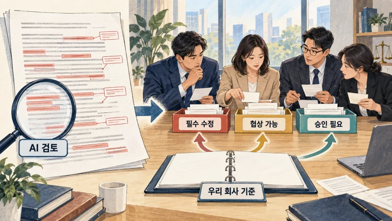
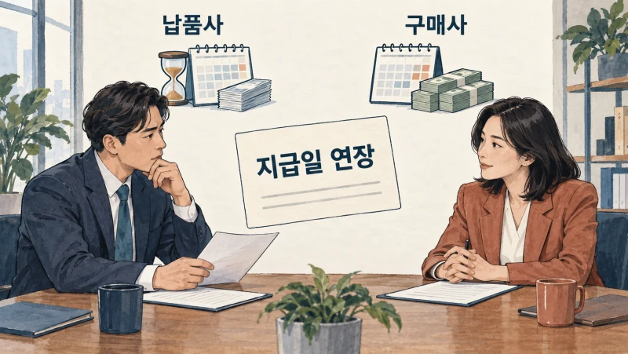
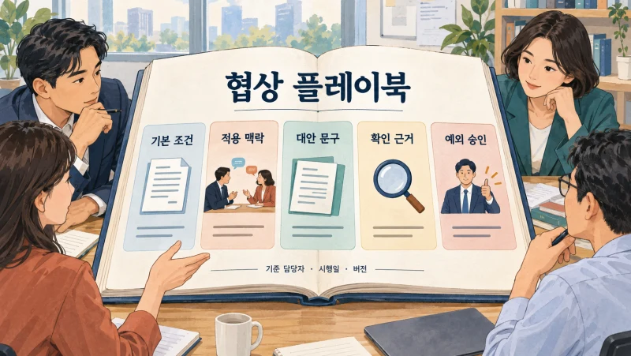
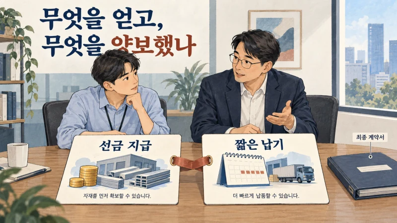
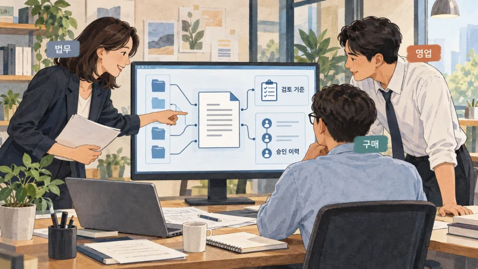
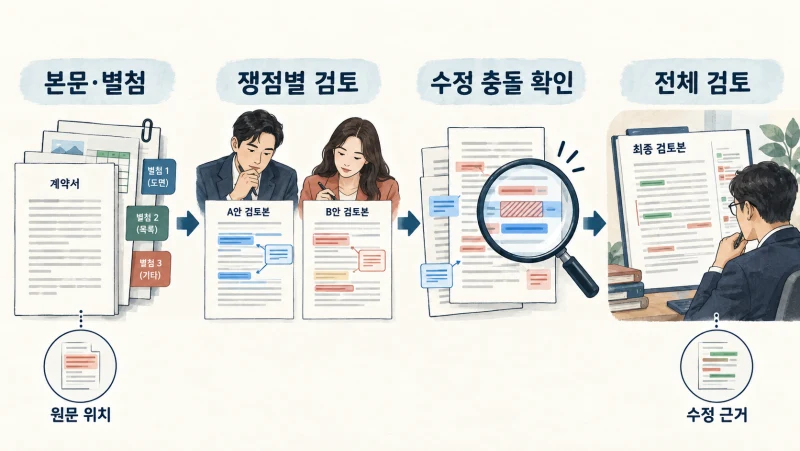
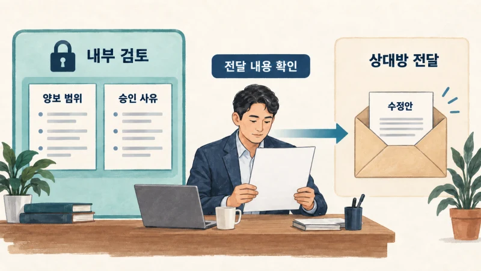
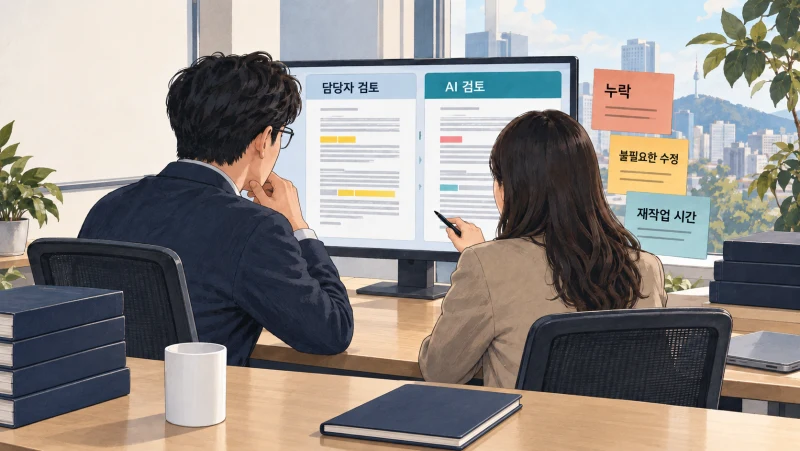

+++
date = '2026-09-16T00:00:00+09:00'
draft = false
title = '계약서는 AI가 읽었는데, 왜 협상은 다시 해야 할까?'
description = 'AI가 찾아낸 수정 의견만으로 협상을 진행할 수 있을까요? 실제 기업 사례와 함께 우리 회사의 양보 기준을 플레이북으로 정리하고, 계약 검토·수정·승인에 연결하는 방법을 살펴봅니다.'
tags = ['ax', 'ai', 'contract-review', 'playbook', 'tacit-knowledge']
authors = ['geoff']
featured_image = 'thumbnail.webp'
images = ['thumbnail.webp']
slug = 'contract-review-ai'
audio = []
vedios = []
series = []
toc = true
+++

## 들어가며

이런 상황을 생각해보겠습니다. 영업 담당자가 고객사에서 받은 계약서를 AI로 먼저 검토합니다. 불리한 조항과 수정 의견을 정리해달라고 했더니 꽤 상세한 보고서가 나왔습니다. 담당자는 보고서를 법무팀에 보내며 말합니다.

> AI로 먼저 확인했습니다. 표시한 부분만 봐주시면 될 것 같습니다.

법무 담당자가 보고서를 읽고 되묻습니다.

> 이 중에서 꼭 고쳐야 하는 건 뭔가요? 고객이 거절하면 어디까지 받아줄 수 있죠?

영업 담당자는 다시 AI에게 물어봅니다. 그런데 이번에는 답변에 필요한 자료를 달라고 합니다. 회사의 협상 지침, 이번 거래의 조건, 예외를 승인할 사람까지요. 계약서는 넣었는데 정작 우리 회사가 어떤 조건으로 거래하려는지는 알려주지 않았던 겁니다.

가상의 장면이지만 계약 검토 AI를 도입할 때 생각해볼 문제입니다. 수정 의견이 많다고 협상을 바로 진행할 수 있는 것은 아닙니다. 고쳐야 할 조건과 양보할 조건을 구분하지 못하면 담당자는 목록을 처음부터 다시 살펴봐야 합니다. 불필요한 수정까지 상대방에게 보내면 협상만 길어질 수도 있고요.

**계약 검토 AI에 우리 회사 일을 맡기려면, 무엇을 문제로 볼지와 어떤 조건에서 받아들일지를 함께 알려줘야 합니다.** 경험 많은 담당자가 하던 판단을 회사의 기준으로 정리하고 문서 검토와 승인 절차에 연결하는 일입니다.

이번 글에서는 이 기준을 담는 협상 플레이북이 무엇인지, 실제 기업들은 어떻게 활용하는지 살펴보겠습니다. 우리 회사에서는 어떤 계약부터 시작하고 어떤 자료와 기술을 준비해야 할지까지 함께 짚어보려 합니다.

## AI는 지금 누구 편에서 계약서를 읽고 있을까?

대금 지급일을 늦추자는 조항을 생각해보겠습니다. 물건을 사는 회사라면 현금 지출을 늦출 수 있지만 납품하는 회사라면 돈을 더 기다려야 합니다. 같은 문장이라도 우리 회사가 어느 쪽인지에 따라 검토 의견이 달라져야겠죠.

거래 사정도 중요합니다. 납품 전에 재료비를 많이 써야 하는 거래와 별도 비용 없이 기존 서비스를 제공하는 거래를 똑같이 볼 수는 없습니다. 상대가 대금을 늦게 주는 대신 선금을 주기로 했는지, 장기 구매를 약속했는지도 함께 봐야 합니다.

계약서를 요약할 때는 지급일이 언제인지 찾으면 됩니다. 협상을 준비할 때는 그 조건을 받아들일지, 바꾼다면 무엇을 제안할지 정해야 합니다. 이때 필요한 내용 중에는 계약서 밖에 있는 것도 많습니다. 영업팀이 고객과 나눈 대화, 재무팀의 자금 계획, 운영팀이 실제로 지킬 수 있는 납기 같은 것들입니다.

그래서 AI에게 계약서를 건네기 전에 우리 회사의 역할과 거래 목적을 확인해야 합니다. 예전 납품 계약을 참고자료로 넣어놓고 이번 구매 계약도 같은 기준으로 검토하게 하면 곤란합니다. 내용을 정확히 읽었더라도 상대방에게 유리한 방향으로 고칠 수 있으니까요.

## 표준 계약서 옆에 협상 플레이북이 필요한 이유

표준 계약서에는 우리가 우선 제안하고 싶은 조건을 담습니다. 하지만 상대방이 그대로 받아주는 경우만 있는 것은 아닙니다. 지급기일을 바꾸고 싶다거나 특정 의무를 빼달라고 할 때 담당자는 다음 제안을 준비해야 합니다.

이런 대응 기준을 내부 지침으로 정리한 것이 **협상 플레이북(Playbook)**입니다. 처음 제안할 조건, 대안으로 검토할 조건, 받아들이기 어려운 조건과 예외 승인 경로를 담습니다. 신입에게 표준 계약서만 주는 대신, 상대가 수정을 요청했을 때 어떻게 대응할지까지 알려주는 셈입니다.

가령 우리 회사가 납품사이고 고객이 지급 조건을 바꾸자고 했다고 해보겠습니다. 아래는 플레이북에 어떤 내용을 담을지 설명하기 위한 예시입니다.

| 정리할 항목 | 담당자와 확인할 내용 |
|---|---|
| 기본 조건 | 우리 회사가 우선 제안하는 지급 조건은 무엇인가? |
| 적용 맥락 | 선금이 있는가? 납품 전에 큰 비용이 드는가? |
| 대안 | 고객이 기본 조건을 거절하면 무엇을 제안할 수 있는가? |
| 확인할 근거 | 지급일을 계산하는 시작 시점이 본문과 검수 조건에서 일치하는가? |
| 예외 승인 | 기준을 벗어나면 재무·사업 담당자 중 누가 무엇을 확인하는가? |

여기에 승인된 문구를 붙이면 AI가 수정안을 작성할 때 참고할 수 있습니다. 기준의 담당자와 시행일도 남겨야 합니다. 작년에는 허용했지만 올해는 바꾼 조건이 있을 수 있기 때문입니다.

실제 제품에서도 이런 방식을 사용합니다. [Ironclad의 AI 플레이북](https://support.ironcladapp.com/hc/en-us/articles/12275685560215-Ironclad-AI-Playbooks-Overview)은 선호 문구와 대안 문구를 제시하고 비표준 조건을 관련 부서의 승인으로 연결합니다. 지급 조건의 예외라면 재무팀이 확인하도록 구성하는 식입니다.

여기까지 들으면 회사 문서가 많아야 시작할 수 있겠다고 생각할 수도 있습니다. 저는 오히려 최근에 협상이 길어졌던 계약 하나를 펴놓고 담당자에게 물어보는 편이 좋다고 생각합니다. 어느 문구를 두고 의견이 갈렸는지, 마지막에는 왜 받아들였는지 설명을 듣다 보면 표준서에 없는 기준을 찾을 수 있습니다.

## 최종 계약서에는 양보한 이유가 빠져 있습니다

과거 계약서를 전부 모아 AI에게 참고하라고 하면 어떨까요? 비슷한 문구를 찾는 데에는 도움이 되겠지만 최종 체결본만으로 당시 판단을 모두 알기는 어렵습니다.

예를 들어 이전 거래에서는 납기를 짧게 잡는 대신 고객이 선금을 주기로 했다고 해보겠습니다. 담당자는 그 돈으로 재료를 미리 확보할 수 있어서 납기에 동의했습니다. 그런데 다음 거래에서 AI가 짧은 납기만 가져와 제안한다면 어떨까요? 선금 없이 같은 약속을 지켜야 할 수도 있습니다.

이런 차이를 알려면 최초 제안과 상대방 수정본, 최종 합의, 승인 사유를 함께 살펴봐야 합니다. 여러 거래에서 반복해 적용한 기준인지 특정 고객에게만 허용한 예외인지도 구분해야 합니다. 담당자가 그때 받아들였다는 사실만으로 다음 계약에도 허용할 수 있다고 판단해서는 안 됩니다.

앞선 [암묵지 자산화 글](https://tech.epsilondelta.ai/posts/ax-tacit-knowledge-assetization/)에서 다룬 문제가 계약 업무에서는 이렇게 나타납니다. 경험 많은 담당자는 어느 조건을 함께 봐야 하는지 알고 있지만 체결본에는 합의한 문장만 남아 있습니다. 왜 그렇게 합의했는지 설명을 붙여야 다음 직원과 AI도 참고할 수 있습니다.

기준을 정리할 때 AI의 도움을 받을 수도 있습니다. [Harvey가 소개한 Playbook Builder](https://www.harvey.ai/blog/playbook-builder-in-harvey)는 기존 지침과 계약을 읽고 확인 질문을 하며 규칙 초안을 만듭니다. 과거 문서에서 다른 조건을 찾아 담당자에게 확인하는 방식입니다. 사람이 백지에서 모든 규칙을 쓰는 부담을 줄이되, 회사 기준으로 확정할 내용은 담당자가 검토하는 겁니다.

이렇게 정리한 자료를 AI가 검토할 때 찾아 읽도록 연결할 수 있습니다. 반드시 모델을 새로 학습시켜야 시작할 수 있는 일은 아닙니다. 먼저 최신 지침과 적용할 선례를 구분하고 거래에 맞는 자료를 제공하는 구성을 검토하면 됩니다.

## 실제 기업은 계약 검토를 어떻게 바꿨을까?

### Carvana는 템플릿을 검토 기준으로 바꿨습니다

미국 온라인 중고차 판매 기업 Carvana는 사업이 커지면서 법무 업무도 늘었습니다. 문서가 흩어져 있고 수작업 검토와 외부 법률 지원에 의존하면서 처리 속도와 일관성을 고민했다고 합니다.

[Harvey가 공개한 고객 사례](https://www.harvey.ai/customers/carvana)에 따르면 Carvana는 19명이 참여한 파일럿을 시작으로 법무와 관련 부서의 70명 이상에게 활용 범위를 넓혔습니다. 26개 템플릿을 검토 논리를 담은 플레이북으로 바꿨고 변호사들은 Word 안에서 작성·비교·수정 작업을 수행합니다.

우리 회사도 템플릿을 플레이북으로 바꾼 과정을 참고해볼 만합니다. 표준 문구를 보관하는 데서 그치지 않고 어떤 기준으로 검토할지를 붙였습니다. 우리도 자주 쓰는 계약서 옆에 담당자가 매번 설명하던 수정 이유와 대안을 정리하는 것부터 시작할 수 있습니다.

### Benjamin Moore의 구매·판매 계약과 승인 절차

페인트·코팅 기업 Benjamin Moore는 부서마다 계약을 관리하는 방식이 달라 만료일이나 자동 갱신 여부, 승인 과정을 파악하기 어려웠습니다. 작은 소프트웨어 구매와 규모가 큰 계약에 같은 검토 절차를 적용하기도 어려웠고요.

[Ironclad의 고객 사례](https://ironcladapp.com/resources/customer-stories/benjamin-moore)에서는 비밀유지계약부터 시작해 간접구매 계약과 판매 계약으로 적용 범위를 넓힌 과정을 설명합니다. 계약 규모에 따라 승인 흐름을 다르게 구성하고 누가 어떤 위험을 검토해 승인했는지도 한곳에서 확인하도록 했습니다. AI 플레이북과 조항 라이브러리, AI 보조 도구도 활용합니다.

계약 검토를 법무팀의 문서 작업으로만 보면 이런 부분을 놓치기 쉽습니다. AI가 수정 의견을 내놓은 뒤에도 재무팀이 지급 조건을 확인하고 사업 담당자가 이행 가능성을 판단해야 합니다. 이 단계까지 연결해야 담당자가 검토 결과를 들고 부서마다 다시 설명하는 일을 줄일 수 있습니다.

## AI가 읽고 고치는 과정에도 설계가 필요합니다

플레이북을 만들었다고 계약서를 넣는 즉시 업무가 완성되는 것은 아닙니다. 계약서에는 본문 밖의 별첨을 참조하는 문장이 있고 앞에서 정의한 단어를 뒤에서 다시 사용하기도 합니다. 수정안을 만들 때는 이런 관계를 유지해야 합니다.

### 별첨을 찾고, 근거가 있는 위치로 돌아갈 수 있어야 합니다

본문에는 검수 완료 후 대금을 지급한다고 쓰여 있는데 별첨에는 검수 절차가 정해져 있을 수 있습니다. 지급 조항만 떼어 읽으면 검수를 언제 끝내는지 알 수 없습니다. 별첨이 빠져 있다면 추가 자료를 요청해야 하고 문서 안에 있다면 그 부분까지 찾아 읽어야 합니다.

그래서 문서를 처리할 때 조항 번호와 표, 정의, 참조 위치를 함께 보존하는 구성이 필요합니다. AI가 문제를 지적하면 담당자가 원문의 어느 부분인지 바로 확인할 수 있어야 합니다. 승인된 사내 기준도 같은 화면에서 비교할 수 있으면 좋겠죠.

검색할 때는 자료의 적용 대상도 확인합니다. 문장이 비슷하다는 이유로 다른 사업부의 폐기된 지침을 가져오면 안 됩니다. 현재 유효한 기준 중 이번 계약과 우리 측 역할에 맞는 자료를 찾도록 해야 합니다.

### 여러 AI가 고친 문장을 합칠 때도 검토해야 합니다

계약 검토를 여러 에이전트에 나눠 맡길 수도 있습니다. 하나는 대금 조건을 보고 다른 하나는 해지 조건을 살피는 식입니다. 그런데 두 에이전트가 같은 문장을 서로 다르게 고치면 어떻게 합쳐야 할까요?

Harvey는 [2026년 9월 기술 글](https://www.harvey.ai/blog/rebuilding-playbook-review-as-a-multi-agent-system)에서 플레이북 규칙별로 에이전트를 나눠 검토하는 구조를 공개했습니다. 각 에이전트는 필요하면 별첨까지 읽고 문서 요소의 식별자로 근거와 수정 위치를 지정합니다. 각자 별도 문서 사본에서 수정안을 만든 뒤 총괄 에이전트가 결과를 모아 충돌을 조정합니다.

같은 글에서 Harvey는 이전 방식에서 과도한 수정, 누락, 잘못된 수정 위치와 규칙별 수정안 충돌을 겪었다고 설명합니다. 계약 검토 AI를 구성하려면 문장을 생성하는 기능에 더해 수정 위치를 관리하고 변경 사항을 합치는 기술도 필요합니다.

우리 회사에서는 처음부터 복잡하게 구성하기보다 한 계약 유형을 순서대로 검토하는 방식부터 시험해볼 수 있습니다. 시간이 오래 걸리는 부분을 나눠 처리하더라도 수정안을 합친 뒤에는 문서 전체를 다시 확인해야 합니다. 담당자가 받는 결과는 하나의 계약서니까요.

## 협상 기준을 알려줬다면, 밖으로 나가지 않게 해야 합니다

AI가 우리 회사의 양보 범위를 알아야 좋은 대안을 낼 수 있습니다. 그렇다고 그 범위를 상대방에게 그대로 설명하면 안 되겠죠. 내부 검토용으로는 어디까지 양보할 수 있는지 기록하더라도 상대방에게 보내는 수정 의견에는 전달할 내용만 담아야 합니다.

문서의 댓글과 변경 이력도 확인할 대상입니다. AI가 수정 이유를 잘 정리했더라도 내부 승인 사유나 협상 전략을 외부용 파일에 넣었다면 담당자가 다시 걷어내야 합니다. 처음부터 내부 판단 기록과 상대방 전달 문안을 분리해 만드는 편이 좋습니다.

접근 권한도 함께 정합니다. 특정 계약을 검토한다고 해서 회사의 모든 고객 계약과 협상 기록을 읽게 할 필요는 없습니다. 상대가 보낸 문서에 AI를 조종하는 지시가 섞일 수도 있습니다. 이런 프롬프트 인젝션도 고려해야 합니다. [OWASP의 예방 지침](https://cheatsheetseries.owasp.org/cheatsheets/LLM_Prompt_Injection_Prevention_Cheat_Sheet.html)을 참고해 외부 문서를 검토 자료로 다루고, 문서 속 지시가 다른 자료의 조회나 발송 권한을 바꾸지 못하도록 구성해야 합니다.

수정안 작성과 외부 발송, 서명은 권한을 나눕니다. 담당자가 승인한 뒤 상대가 새 버전을 보내왔다면 어느 부분이 달라졌는지 다시 확인해야 합니다. 승인 기록을 계약 이름에만 붙이지 말고 실제 검토한 문서 버전에 연결하는 이유입니다.

## 우리 회사에서는 어떤 계약부터 맡겨볼까?

반복해서 검토하는 계약 유형 하나를 고르고 법무와 현업 담당자가 함께 최근 처리 사례를 살펴보면 좋겠습니다. 검토 기준을 설명할 수 있고 결과를 대조할 자료가 있는 업무가 시작하기 좋습니다.

자료를 고를 때는 순조롭게 체결한 계약뿐 아니라 의견이 엇갈렸던 계약도 넣어봅시다. 필수 조항이 빠진 경우, 별첨을 읽어야 판단할 수 있었던 경우, 예외 승인을 받은 거래처럼 담당자가 시간을 썼던 사례가 특히 도움이 됩니다. AI가 만든 검토 의견을 보고 담당자가 왜 동의하거나 반대하는지 기록합니다.

평가할 때도 수정 의견 개수만 세지 않습니다. 꼭 고쳐야 할 내용을 놓치지 않았는지, 수용 가능한 조건에 불필요한 수정을 요구하지 않았는지 확인합니다. 원문 근거가 맞는지와 수정한 뒤 다른 조항에 모순이 생기지 않았는지도 봅니다. [AI Evals 글](https://tech.epsilondelta.ai/posts/what-are-ai-evals/)에서 다룬 업무별 시험문제를 계약 검토에 맞춰 만드는 겁니다.

AI가 답을 내는 시간과 담당자가 그 답을 고치는 시간을 따로 재보면 좋겠습니다. 검토 보고서는 빨리 나왔는데 법무팀의 재작업이 늘었다면 기준이 모호한지, 자료를 잘못 찾았는지부터 살펴봐야 합니다. 반대로 검토 자체는 빨라졌지만 재무 승인 대기가 길다면 승인 절차를 손볼 일입니다.

운영 중 담당자가 수정한 내용도 바로 회사 규칙으로 바꾸지는 않습니다. 오답을 바로잡은 것인지, 이번 거래에서만 양보한 것인지 확인한 뒤 기준 담당자가 반영 여부를 정합니다. 이렇게 설명을 남겨 지침과 평가 사례에 보태면 같은 실수를 다시 시험하고 줄여갈 수 있습니다.

## 나가며

처음의 영업 담당자는 수정 의견 스무 개와 함께 쓸 협상 기준이 필요했습니다. 꼭 바꿔야 할 조건과 대안으로 제안할 내용, 사내 승인을 받을 부분을 알아야 고객과 다음 대화를 할 수 있으니까요.

계약 검토 AI를 준비하다 보면 회사 안에서도 합의하지 않은 기준을 만나게 됩니다. 담당자마다 양보 범위가 다르거나 과거에 허용한 이유를 아무도 설명하지 못할 수도 있습니다. 이런 차이를 확인하고 적용할 조건을 정리하는 과정에서 숙련자의 노하우를 조직에 남길 수 있습니다. 앞서 이야기한 암묵지 자산화를 계약 업무에서 실천하는 방법입니다.

실제로 구성하려면 할 일이 많습니다. 법무·영업·구매가 쓰는 기준을 맞추고 계약서와 별첨을 정확히 읽도록 처리해야 합니다. 수정안과 승인 절차를 연결하고 민감한 협상 정보가 새지 않도록 권한을 정해야 합니다. 운영 중 바뀐 기준을 반영하고 기존 계약 사례로 다시 시험하는 데에도 현업 경험과 기술적인 노하우가 함께 필요합니다.

우리 엡실론델타는 법무·현업 담당자와 함께 협상 기준을 정리하는 일부터 AI 검토 절차와 사내 시스템 연결, 평가와 운영까지 도와드리겠습니다. 이미 쓰는 계약관리 솔루션에 기능을 더할지, 범용 에이전트로 반복 업무부터 구성할지도 업무에 맞춰 함께 검토할 수 있습니다.

AI로 계약서를 검토해도 담당자가 매번 처음부터 다시 확인하고 있다면 [contact@epsilondelta.ai](mailto:contact@epsilondelta.ai)로 연락 주세요. 어떤 계약을 얼마나 자주 검토하고 어느 단계에서 시간이 오래 걸리는지부터 말씀해주시면 됩니다. 민감한 계약 원문을 바로 보내실 필요는 없습니다. 우리 회사에서 어떤 판단을 정리하고 무엇부터 맡길지 함께 찾아보겠습니다.
