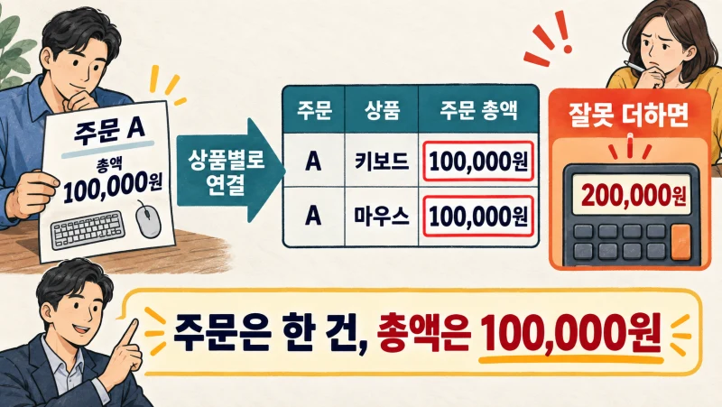
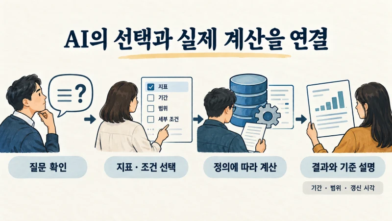

+++
date = '2026-09-17T00:00:00+09:00'
draft = false
title = '"이번 달 매출 얼마야?" AI에게 물었더니 부서마다 답이 다릅니다'
description = '같은 매출을 물었는데 왜 숫자가 다를까요? 시맨틱 레이어의 원리와 기업 사례를 통해 지표의 정의·계산·권한을 AI 분석에 연결하는 방법을 살펴봅니다.'
tags = ['ax', 'ai', 'semantic-layer', 'data', 'tacit-knowledge']
authors = ['geoff']
featured_image = 'thumbnail.webp'
images = ['thumbnail.webp']
slug = 'semantic-layer'
audio = []
vedios = []
series = []
toc = true
+++

## 들어가며

월간 실적 회의를 하는 회사를 생각해보겠습니다. 대표가 매출을 묻자 영업팀장은 이번 달에 확정한 계약 금액을 보고합니다. 그런데 재무팀장이 준비한 실적표에는 다른 금액이 적혀 있습니다.

> 잠깐만요. 왜 매출이 서로 다르죠?

확인해보니 영업팀장은 수주액을 말했고 재무팀장은 회계상 매출을 말했습니다. 이 회사에서는 평소 두 숫자를 모두 매출이라고 부르고 있었던 겁니다. 회의는 실적을 논의하기 전에 숫자의 뜻부터 맞추는 시간이 됩니다.

이제 이 회사가 사내 AI를 도입했다고 해봅시다. 대표는 회의 전에 AI에게 이번 달 매출을 묻습니다. AI가 영업팀 자료에서 찾은 숫자를 답하면 재무팀 보고서와 다르고, 재무팀 자료를 골랐다면 대표가 궁금했던 신규 계약 실적과 다를 수 있습니다. 자료를 더 빨리 찾게 됐지만 어떤 숫자를 봐야 하는지는 여전히 정하지 않았습니다.

AI에게 회계와 영업을 더 공부시키면 해결될까요? 그 전에 우리 회사에서 매출이라는 말을 어떤 뜻으로 쓰는지부터 알려줘야 합니다.

이때 살펴볼 기술이 **시맨틱 레이어(Semantic Layer)**입니다. 지표의 뜻과 계산 방법을 정리하고 AI와 분석 도구가 그 기준으로 데이터를 조회하도록 연결하는 계층입니다. 현업 담당자만 알고 있던 집계 기준을 프로그램에서도 사용할 수 있게 만드는 일이죠.

이번 글에서는 같은 질문에 다른 숫자가 나오는 이유와 시맨틱 레이어의 작동 방식을 실제 기업 사례와 함께 살펴보겠습니다. 읽고 나면 우리 회사의 어떤 지표부터 정리하고 AI를 어디에 연결해야 할지 판단하는 데 도움이 될 겁니다.

## 매출이라는 이름부터 나눠야 할 수도 있습니다

앞의 가상 회의에서 두 팀이 낸 숫자는 각각 필요한 숫자입니다. 새 계약을 얼마나 따냈는지와 이번 달 손익에 반영할 매출이 얼마인지는 서로 다른 질문이니까요. 돈이 실제로 얼마나 들어왔는지 보려면 입금액도 따로 확인해야 합니다.

| 알고 싶은 것 | 확인할 지표의 예 | 함께 정할 기준 |
|---|---|---|
| 이번 달 새 계약을 얼마나 따냈나? | 신규 수주액 | 계약 확정일, 취소·변경 반영 |
| 이번 달 실적에 반영할 매출은? | 회계 매출 | 회사의 회계 정책과 마감 기준 |
| 이번 달 현금은 얼마나 들어왔나? | 입금액 | 입금일, 선금과 미확인 입금의 구분 |

세 숫자를 하나로 맞추려고 하면 오히려 필요한 정보를 잃습니다. 용도가 다른 지표는 이름을 나누고 어떤 상황에서 쓰는지 정리하는 편이 좋습니다. AI도 사용자가 자금 상황을 보려는지 영업 실적을 보려는지 확인한 뒤 알맞은 지표를 조회하도록 구성할 수 있습니다.

반대로 같은 지표를 보는데 숫자가 다르다면 계산 조건을 살펴봐야 합니다. 한 보고서는 취소 주문을 빼고 다른 보고서는 포함했을 수도 있습니다. 한쪽은 어젯밤에 갱신했고 다른 쪽은 방금 들어온 주문까지 반영했을 수도 있고요.

이 두 상황을 구분하면 해결 방법도 구체적입니다. 지표의 뜻이 다르면 정의와 이름을 정리합니다. 뜻은 같은데 결과가 다르면 계산식, 조회 범위와 데이터 갱신 시점을 확인합니다. 그 과정을 생략한 채 AI에게 어느 보고서가 맞는지 고르라고 하면 AI가 근거 없이 한쪽을 선택할 수도 있습니다.

## 용어집을 만드는 데서 한 걸음 더

시맨틱 레이어를 회사 숫자의 사전이라고 설명할 수 있습니다. 다만 매출이라는 단어 옆에 설명을 붙이는 것에서 끝나지는 않습니다. 실제로 어느 데이터에서 어떤 조건으로 계산할지까지 연결합니다.

예를 들어 온라인 판매 담당자가 완료 주문 금액을 보고 싶다고 해보겠습니다. 주문이 완료된 날짜를 기준으로 볼지, 결제한 날짜를 기준으로 볼지 정해야 합니다. 취소한 주문과 환불은 어떻게 반영할지도 필요합니다. 이 기준을 문서에만 적어두면 대시보드 개발자와 AI 개발자가 각자 읽고 별도로 계산식을 만들게 됩니다.

시맨틱 레이어에서는 이런 정의를 프로그램이 사용할 수 있는 모델로 관리합니다. 지표를 조회할 때 같은 계산식을 재사용하고 지역이나 채널처럼 나눠 볼 항목도 함께 정의하는 겁니다.

음식점의 조리법을 떠올리면 이해하기 쉽습니다. 같은 메뉴를 주문했는데 주방마다 재료와 분량을 달리 쓰면 다른 음식이 나오겠죠. 메뉴 이름에 더해 무엇을 얼마나 넣을지 정하듯, 지표에도 계산할 대상과 방법을 붙입니다.

구현할 때는 지표를 뜻하는 Metric, 지역·채널처럼 데이터를 나누는 기준인 Dimension, 고객·주문을 식별하는 키와 테이블 사이의 관계 등을 정의합니다. [Looker의 LookML](https://docs.cloud.google.com/looker/docs/lookml-terms-and-concepts)이나 [dbt Semantic Layer](https://docs.getdbt.com/docs/use-dbt-semantic-layer/dbt-sl)에서도 이런 모델을 사용해 질의를 구성합니다. 기존 BI에서 쓰던 모델링을 AI의 데이터 조회에도 활용할 수 있는 겁니다.

그래서 이미 회사에서 쓰는 대시보드에 잘 관리한 지표 정의가 있다면 그 내용을 먼저 살펴볼 만합니다. AI 도입을 이유로 같은 계산 기준을 처음부터 다시 만들 필요는 없겠죠.

## SQL이 잘 실행됐는데도 합계는 틀릴 수 있습니다

AI가 데이터베이스에 접근해 SQL을 작성할 수 있는데 시맨틱 레이어는 왜 필요할까요? SQL은 데이터베이스에서 자료를 조회하고 계산할 때 쓰는 언어입니다. 문법에 맞는 SQL을 만들었다고 업무상 올바른 계산까지 했다고 볼 수는 없습니다.

간단한 예를 들어보겠습니다. 주문 A의 총액은 10만 원이고 그 안에 상품 두 개가 들어 있습니다. 주문 정보와 상품 정보를 연결하면 다음과 같은 표가 나올 수 있습니다.

| 주문 번호 | 상품 | 주문 총액 |
|---|---|---:|
| A | 키보드 | 100,000원 |
| A | 마우스 | 100,000원 |

여기서 주문 총액 열을 더하면 20만 원입니다. 고객이 주문을 한 번 더 한 적은 없는데 집계 금액이 두 배가 됐습니다. 주문 한 건의 금액을 상품 행마다 반복해서 붙인 뒤 합산했기 때문입니다.

이런 오류를 피하려면 한 행이 주문 한 건인지 상품 한 개에 해당하는지 알아야 합니다. 테이블을 연결하는 조인(Join) 관계도 함께 정해야 하고요. [dbt의 MetricFlow](https://docs.getdbt.com/docs/build/join-logic)는 모델에 정의한 식별자와 관계를 이용해 조인을 구성하고 중복 집계를 유발할 수 있는 조인을 제한한다고 설명합니다.

비율도 조심해야 합니다. 방문자 10명 중 5명이 구매한 날의 전환율은 50%이고, 100명 중 10명이 구매한 날은 10%입니다. 두 날의 전환율을 단순 평균하면 30%지만 전체 방문자 110명 중 구매자 15명으로 계산하면 약 13.6%입니다. 기간 전체의 전환율을 알고 싶은데 일별 비율을 평균했다면 다른 숫자를 보고 있는 겁니다.

이처럼 현업에서 당연하게 쓰던 계산 기준을 구체적으로 정리해야 합니다. AI가 표 이름을 잘 찾는지와 별개로, 어떤 단위에서 어떤 식으로 집계할지 알려줄 필요가 있습니다.

## AI는 지표를 고르고, 계산은 정해진 경로로

우리 회사에서 지난달 채널별 완료 주문 금액을 묻는 상황을 예로 들어보겠습니다. 다음은 이런 질문을 처리하기 위한 구성 예시입니다.

AI는 먼저 사용 가능한 지표에서 완료 주문 금액을 찾습니다. 질문에 맞춰 채널별로 나누고 지난달이라는 기간을 적용합니다. 조회 도구는 해당 지표에 연결한 계산식과 데이터 관계를 사용해 질의를 만들고 데이터 엔진에서 실행합니다. AI는 그 결과를 받아 사용자에게 설명합니다.

이렇게 역할을 나누면 AI가 원천 테이블에서 계산식을 새로 추측하는 일을 줄일 수 있습니다. 사용자가 문장을 조금 다르게 입력할 때도 마찬가지입니다. 지표를 고르는 과정이 모호하면 숫자를 내놓기 전에 확인 질문을 하도록 구성합니다.

예를 들어 우리 회사에서 매출이라는 말로 두 지표를 쓰고 있다면 AI가 이렇게 되물을 수 있겠죠.

> 신규 수주액을 보시겠어요, 회계 매출을 보시겠어요?

조회 결과에도 금액만 적기보다 선택한 지표, 기간, 대상 범위와 데이터 갱신 시각을 같이 표시하면 좋습니다. 담당자가 숫자를 다시 확인할 때 어디부터 봐야 할지 알 수 있으니까요.

기술을 선택할 때는 한 가지를 더 확인해야 합니다. 모델에게 계산 기준을 읽혀준 것인지, 실제 조회도 그 기준을 사용하도록 연결한 것인지입니다. 지침은 잘 읽었는데 실행할 때 원천 테이블을 임의로 합산한다면 앞의 중복 집계 문제가 다시 생길 수 있습니다. 개발팀에는 어떤 지표를 선택했고 어떤 계산 경로로 결과를 얻었는지 확인할 수 있게 해달라고 요청해야 합니다.

앞서 다룬 [MCP](https://tech.epsilondelta.ai/posts/mcp-enterprise-integration/)는 이런 조회 도구를 AI에 연결할 때 활용할 수 있습니다. MCP로 연결한 뒤에는 그 도구가 어떤 지표와 계산 기준을 제공하는지 정해야 합니다. 연결과 정의를 함께 준비하는 셈입니다.

## 실제 기업은 숫자를 맞추는 일을 어떻게 줄였을까?

### Sweetgreen의 매출 분석과 작은 파일럿

외식 체인 Sweetgreen도 숫자를 맞추는 데 시간을 쓰고 있었습니다. [dbt Labs가 공개한 사례](https://www.getdbt.com/blog/sweetgreen-conversational-analytics-dbt-ai)에서 담당자는 같은 대시보드 안에서도 매출이 다르게 나오고 새로운 질문마다 별도의 데이터 처리 과정을 만들었다고 설명합니다.

Sweetgreen은 주문·상품·고객 등 실제 사업 활동에 맞춰 데이터 구조를 정리했습니다. 그 위에 지표 정의와 품질 검사를 붙이고 Claude와 MCP, dbt Semantic Layer를 연결했습니다. 현업이 자연어로 질문하더라도 대시보드와 같은 지표 정의를 활용하도록 한 겁니다.

담당자는 데이터팀의 작업 여력을 기다리느라 2주가 걸리던 요청을 현업이 직접 분석하면서 30분에 처리하게 됐다고 설명합니다. 공개 글에서 소개하는 대화형 기능의 범위는 약 15~20명 사용자와 3~5개 시맨틱 모델로 시작한 파일럿입니다.

우리 회사에서도 참고할 만한 순서입니다. 자주 묻는 업무 영역의 데이터를 정리하고 지표를 만든 뒤, 제한된 사용자가 AI로 조회하며 결과를 확인합니다. 처음부터 회사의 모든 질문에 답하는 챗봇을 목표로 잡지 않아도 됩니다.

### Drata에서는 고객 보고서 작성에 활용했습니다

보안·컴플라이언스 관리 플랫폼 Drata의 고객 담당자는 분기 보고서를 만들 때 여러 대시보드에서 숫자를 가져왔습니다. 비교 기준을 계산하고 설명을 붙여야 했으며 자료마다 지표가 달라지는 문제도 있었다고 합니다.

[Cube의 고객 사례](https://cube.dev/case-studies/drata-scaling-data-driven-decision-making-with-cubes-semantic-layer-and-ai)에 따르면 기존에는 보고서 한 건에 2~3시간을 썼습니다. Drata는 공통 시맨틱 레이어를 구성해 고객용 대시보드와 AI 기반 보고서에서 같은 지표를 활용하도록 했습니다. 알아보기 쉬운 지표 이름과 설명, 데이터 관계를 정리하고 고객군별 비교 지표도 준비했습니다.

담당자가 숫자를 모으고 맞춘 다음 설명까지 쓰던 작업을 생각해보면 왜 이런 준비가 필요한지 알 수 있습니다. AI에게 보고서 문장만 쓰게 해서는 자료 사이의 계산 기준 차이가 해결되지 않습니다. 어떤 고객 지표를 어떤 비교 대상과 나란히 놓을지부터 정해야 합니다.

두 사례를 우리 업무에 적용한다면 판매 분석이나 고객 보고처럼 반복해서 같은 숫자를 쓰는 작업을 찾아볼 수 있습니다. 회의 자료, 대시보드, AI 보고서가 각자 계산하지 않고 함께 쓸 지표를 고르는 겁니다.

## 같은 숫자를 쓴다고 모두에게 보여줘도 될까요?

지표를 공통으로 관리하더라도 모든 직원에게 같은 자료를 보여줄 수는 없습니다. 지점장은 자기 지점의 실적을 보고 본사 담당자는 전사 실적을 볼 수 있겠죠. 같은 계산식이라도 열람 범위가 다르면 합계는 달라집니다.

AI에 연결한 계정이 회사 전체 자료를 읽을 수 있다면 문제가 생길 수 있습니다. 사용자에게 권한이 있는 범위만 조회하도록 실제 데이터 접근 단계에서 제한해야 합니다. 프롬프트에 다른 지점 자료는 보여주지 말라고 적는 것으로 끝내서는 안 됩니다. [Cube의 접근 제어 문서](https://docs.cube.dev/docs/data-modeling/access-control)도 사용자가 누구인지 확인하는 인증과 어떤 데이터에 접근할 수 있는지 결정하는 인가를 구분합니다.

최신성도 따로 관리합니다. 자주 묻는 결과를 미리 계산하거나 저장해두면 빠르게 답할 수 있습니다. 그런데 어제 저장한 결과를 오늘 실적처럼 보여주면 계산식이 같아도 잘못 판단할 수 있습니다. 결과의 기준 시각과 갱신 주기를 정하고 사용자에게 표시할 필요가 있습니다.

지표를 변경했을 때도 확인할 곳이 있습니다. 취소 주문 처리 기준을 바꿨다면 대시보드와 AI 조회에 언제부터 적용할지 정해야 합니다. 지난달 보고서까지 새 기준으로 다시 계산할지도 결정해야 하고요. 정의의 담당자와 변경 이력이 없으면 다음 회의에서 또 숫자의 차이를 추적하게 됩니다.

## 우리 회사에서 첫 지표를 고르는 법

저는 전사 데이터 용어집을 만드는 계획부터 세우기보다, 회의 때마다 숫자를 다시 확인하는 보고서 하나를 골라보면 좋겠다고 생각합니다. 어느 질문에서 의견이 갈리는지 들어봅니다. 담당자들이 추가로 설명하는 조건도 확인합니다.

그다음 지표 이름과 목적을 적고 계산에 쓸 데이터, 기간, 제외 조건을 정합니다. 현재의 기준 보고서와 직접 대조해보고 차이가 나면 원천 데이터가 다른지 계산 방식이 다른지 확인합니다. 기존 BI에 잘 정리한 모델이 있다면 그 모델을 AI에서도 활용하는 경로를 검토할 수 있습니다.

실증에서는 정상 질문 외에 헷갈리기 쉬운 질문도 넣어야 합니다. 기간을 말하지 않은 질문, 취소와 환불이 섞인 자료, 같은 고객이 여러 채널에서 구매한 경우를 시험해봅니다. 데이터가 없다는 답과 실적이 0이라는 답을 구분하는지도 봅니다. 권한이 없는 자료는 실제로 조회하지 못해야 합니다.

[Snowflake의 Cortex Analyst 평가 기능](https://docs.snowflake.com/en/user-guide/snowflake-cortex/cortex-analyst-evaluations)은 검증한 질문과 SQL을 기준으로 생성한 SQL의 실행 결과를 비교하고 정확도와 회귀 오류, 지연을 기록합니다. 우리 회사에서도 자주 쓰는 질문과 확인된 결과를 평가 사례로 남겨둘 수 있습니다. 지표나 모델을 바꾼 뒤에도 이전에 맞혔던 질문에 제대로 답하는지 다시 확인하는 겁니다.

숫자가 맞아도 설명을 확인해야 합니다. 매출이 줄었다는 결과만 조회했는데 AI가 특정 캠페인 때문이라고 원인을 단정하면 추가 근거가 필요합니다. 계산 결과와 해석을 나눠 검토하고 담당자가 고쳐준 이유를 기록하면 다음 시험에도 쓸 수 있습니다.

도입 성과는 답변 속도와 함께 담당자의 확인 시간을 봐야 합니다. 숫자를 얻는 시간이 줄고 같은 기준으로 바로 비교할 수 있어야 현업에서도 쓸 이유가 생깁니다.

## 나가며

처음의 회의로 돌아가 보겠습니다. 영업팀장과 재무팀장은 각자 다른 실적을 설명하고 있었습니다. AI를 도입하기 전에 수주액과 회계 매출의 뜻을 구분하고 사용 목적에 맞춰 조회하도록 정리했다면 숫자를 놓고 불필요하게 다투는 일을 줄일 수 있었겠죠.

시맨틱 레이어를 구성하는 과정에서는 현업 담당자의 설명이 중요합니다. 어떤 거래를 제외하는지, 어느 날짜로 집계하는지, 두 자료를 언제 연결하면 안 되는지처럼 평소 말로만 전달하던 기준이 필요합니다. 이 기준을 계산식과 관계, 검증 사례로 남기면 다음 직원과 AI도 활용할 수 있습니다. 앞선 [암묵지 자산화 글](https://tech.epsilondelta.ai/posts/ax-tacit-knowledge-assetization/)에서 이야기한 일을 경영 데이터에 적용하는 방법입니다.

막상 우리 조직에 구성하려면 고려할 것이 많습니다. 부서마다 다르게 쓰는 말을 확인하고 기존 보고서의 계산을 원천 데이터까지 따라가야 합니다. 지표 모델과 AI 조회를 연결하면서 권한과 갱신 주기를 맞추고 변경 후의 결과도 검증해야 합니다. 현업의 업무를 이해하는 경험과 데이터·AI 시스템을 구현하는 기술이 함께 필요한 일입니다.

우리 엡실론델타는 이런 지표 차이를 진단하고 현업의 기준을 정리하는 일부터 데이터 모델과 AI 조회 도구 연결, 평가와 운영까지 함께 도와드리겠습니다.

AI에 사내 데이터를 연결했는데도 숫자를 믿기 어려워 담당자가 매번 다시 확인하고 있다면 [contact@epsilondelta.ai](mailto:contact@epsilondelta.ai)로 연락 주세요. 회의에서 반복해 묻는 질문과 숫자가 달라지는 보고서가 무엇인지부터 함께 살펴보겠습니다. 우리 회사에서 어떤 기준을 정리하고 어느 조회부터 AI에 맡길지 구체적으로 정하는 데 도움을 드리겠습니다.
