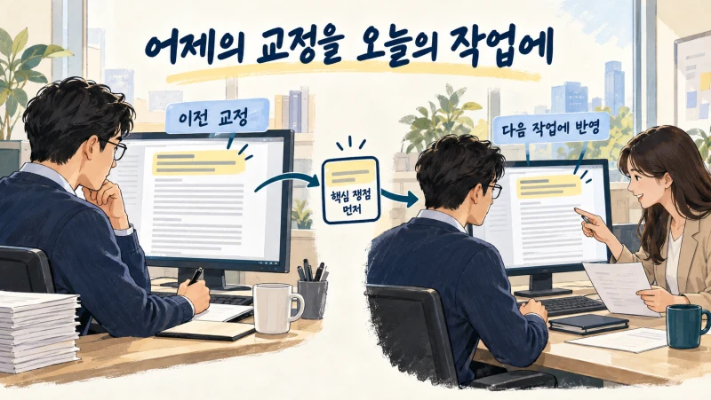
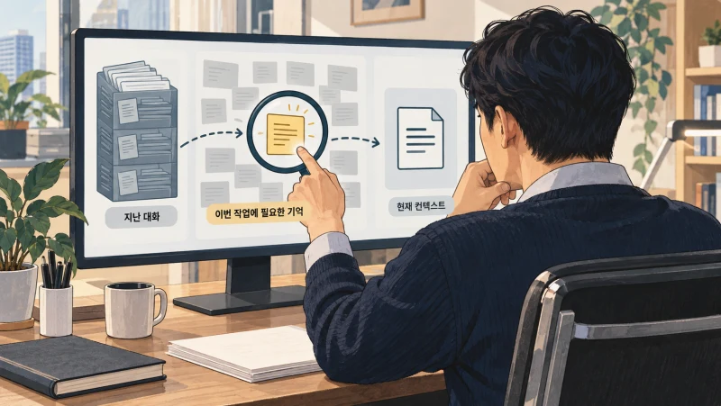

+++
date = '2026-09-18T00:00:00+09:00'
draft = false
title = '어제 가르쳐준 일을 오늘 또 설명하고 있다면'
description = 'AI에게 같은 설명을 반복하고 있나요? 에이전트 메모리의 원리와 실제 활용 사례, PE사 프로젝트의 범위별 메모리 기반 개선을 통해 우리 회사에 필요한 기억을 설계하는 방법을 살펴봅니다.'
tags = ['ax', 'ai', 'agent', 'memory', 'reflexion', 'tacit-knowledge']
authors = ['geoff']
featured_image = 'thumbnail.webp'
images = ['thumbnail.webp']
slug = 'agent-memory'
audio = []
vedios = []
series = []
toc = true
+++

## 들어가며

AI에게 고객 보고서를 맡기는 상황을 생각해보겠습니다. 초안을 받아보니 내용은 괜찮은데 순서가 마음에 들지 않습니다. 담당자는 세부 분석보다 핵심 쟁점을 먼저 보여달라고 요청합니다. AI가 고친 결과는 쓸 만합니다.

다음 주, 새 대화를 열고 다음 보고서를 부탁합니다. 그런데 이번에도 세부 분석부터 길게 나옵니다.

> 지난번에도 핵심부터 보여달라고 했잖아.

담당자는 같은 설명을 다시 입력합니다. 이번 보고서도 고쳤지만 다음번에는 또 어떨지 모르겠습니다. AI가 일을 빨리해주는 건 맞는데 매번 처음 같이 일하는 사람에게 설명하는 기분입니다.

반대 상황도 생각해볼 수 있습니다. 지난 보고서에서만 특정 항목을 따로 표시해달라고 했는데 AI가 그 요청을 계속 적용합니다. 이번에는 기억하지 말아야 할 예외를 너무 잘 기억한 겁니다.

에이전트 메모리는 이 두 문제를 함께 다룹니다. **이전 작업에서 얻은 정보를 남기고, 필요한 순간에 적절한 범위로 다시 활용하도록 구성하는 기술**입니다. 무엇을 기억할지에 더해 언제 적용하고 언제 고칠지도 정해야 합니다.

이번 글에서는 대화 기록과 업무 기억의 차이, 실제 기업의 활용 사례, 메모리로 작업을 개선하는 방법을 살펴보겠습니다. 우리 조직에서 반복하는 설명 중 무엇부터 남기고 어떻게 운영해야 할지 판단하는 데 도움이 될 겁니다.

## 대화가 저장돼 있는데 왜 다시 설명해야 할까?

메신저에 지난 대화가 남아 있다고 새 담당자가 그 내용을 모두 알고 있는 것은 아닙니다. 필요한 기록을 찾아 읽어야 하죠. AI도 비슷합니다. 대화 기록을 저장하고 그중 필요한 내용을 다음 작업에 제공하도록 함께 준비해야 합니다.

모델이 지금 답변할 때 참고하는 입력을 컨텍스트라고 합니다. 현재 질문과 지시, 검색한 자료 등을 여기에 넣습니다. 과거 대화가 저장소에 있더라도 이번 입력에 포함하지 않았거나 조회 도구로 찾아보지 않았다면 그 내용을 활용하기 어렵습니다.

그렇다면 모든 대화를 매번 넣으면 될까요? 기록이 길어질수록 처리할 양이 늘고 필요 없는 내용도 섞입니다. 이미 끝난 작업, 폐기한 가정, 잠깐 논의한 아이디어가 현재 지시와 함께 들어갈 수 있습니다. 비용을 들여 더 많이 읽혔는데도 정작 중요한 조건을 놓칠 수 있는 겁니다.

그래서 기록에서 재사용할 내용을 골라 남기고 작업에 맞춰 불러오는 구성을 검토합니다. [Anthropic의 컨텍스트 엔지니어링 글](https://www.anthropic.com/engineering/effective-context-engineering-for-ai-agents)에서도 긴 작업을 이어가기 위한 요약과 외부 노트 활용을 설명합니다. 현재 대화를 줄여 이어가는 일과 다음 작업에서도 쓸 정보를 정리하는 일을 나눠볼 수 있습니다.

보고서 순서를 고쳐달라는 요청을 예로 들면, 수정 전후의 대화는 이력으로 남깁니다. 그중 해당 사용자는 핵심 쟁점을 먼저 보고 싶어 한다는 내용을 별도로 정리하고 다음 보고서를 만들 때 참고하도록 연결하는 식입니다.

## 일을 이어가는 기억과 다음 일에 쓸 기억

에이전트 메모리를 설명할 때 단기 기억과 장기 기억이라는 말을 많이 씁니다. 업무로 풀어보면 현재 일을 이어가기 위한 기억과 다른 대화나 작업에서도 다시 쓸 기억입니다.

가령 계약서 검토 중 어느 조항까지 확인했고 무엇을 더 물어봐야 하는지는 현재 작업의 상태입니다. 작업을 잠시 멈췄다가 재개하려면 이 상태가 필요합니다. 이런 중간 상태를 저장한 것을 체크포인트라고 부릅니다. 고객이 선호하는 보고 방식처럼 다음 업무에서도 참고할 정보는 장기 메모리로 관리할 수 있습니다.

[LangChain의 메모리 문서](https://docs.langchain.com/oss/python/concepts/memory)도 현재 대화 범위의 상태와 여러 대화에서 활용할 기억을 구분합니다. 단기라는 이름이 붙어도 DB에 저장해 작업을 재개할 수 있습니다.

기억의 내용도 나눠보면 설계가 쉬워집니다.

| 남길 내용 | 업무에서 생각해볼 예 | 함께 확인할 것 |
|---|---|---|
| 사실·선호 | 특정 사용자는 핵심 쟁점을 먼저 읽고 싶어 함 | 누구의 선호인가 |
| 사건·경험 | 어떤 조건에서 예외를 승인했고 결과가 어땠는가 | 당시 조건과 근거는 무엇인가 |
| 절차 | 보고서 작성 전에 집계 기간과 지표를 확인함 | 어떤 업무에 적용하는가 |

누구에게 어떤 일이 있었는지와 앞으로 어떻게 일해야 하는지는 연결될 수 있습니다. 다만 한 번 있었던 일을 곧바로 모든 업무의 규칙으로 바꾸지는 않아야겠죠. 특별한 사정으로 허용한 예외를 기본 절차처럼 기억하면 다음 작업에서 문제가 생깁니다.

## 실제 서비스에서는 메모리를 어디에 쓰고 있을까?

### S&P Global은 여러 에이전트의 작업 상태를 관리했습니다

S&P Global Market Intelligence는 내부 에이전트 업무 플랫폼 Astra를 만들면서 여러 전문 에이전트의 상태와 문맥을 관리하는 문제를 겪었습니다. 담당자는 [Amazon이 공개한 소개 글](https://www.aboutamazon.com/news/aws/aws-amazon-bedrock-agent-core-ai-agents?mod=article_inline)에서 AgentCore Memory를 이용해 여러 에이전트의 체크포인트를 중앙에서 관리했다고 설명합니다.

업무를 나눠 맡기는 에이전트가 늘어나면 무엇을 확인했고 어디까지 진행했는지 이어받는 일이 중요해집니다. 예를 들어 자료 수집을 맡은 에이전트와 분석을 맡은 에이전트가 협업한다면 수집한 자료뿐 아니라 아직 확인하지 못한 항목도 전달할 필요가 있습니다. 이런 작업을 설계할 때 상태를 저장하고 다시 읽는 기능을 검토할 수 있습니다.

### OpenNote는 학습자가 돌아왔을 때의 대화를 바꿨습니다

학습 서비스 OpenNote에서는 사용자가 이전에 무엇을 물었고 어느 내용을 공부했는지 다음 대화에서 활용할 필요가 있었습니다. 전체 이력을 매번 입력하면 처리할 양도 늘었습니다.

[Mem0의 고객 사례](https://mem0.ai/blog/how-opennote-scaled-personalized-visual-learning-with-mem0-while-reducing-token-costs-by-40)는 OpenNote가 학습자 정보를 이어서 관리하고 관련 요약을 입력에 제공하는 방식으로 메모리를 활용했다고 설명합니다. 결과 표에는 프롬프트당 토큰 사용량이 40% 줄었다고 나옵니다.

사용자가 며칠 뒤 돌아왔을 때 처음부터 다시 설명하게 할지, 이전에 어려워했던 내용부터 이어갈지의 차이입니다. 기업의 고객 대응에서도 비슷한 질문을 해볼 수 있습니다. 고객이 이미 시도한 조치를 다음 상담에서 참고하게 하려면 무엇을 남기고 어떻게 찾아야 할까요?

두 사례에서 메모리가 맡은 일은 다릅니다. 하나는 여러 에이전트가 작업을 이어가는 데 필요한 상태이고 다른 하나는 사용자의 이전 경험을 다음 대화에 반영하는 정보입니다. 우리 조직에서도 먼저 줄이고 싶은 반복이 무엇인지 정하면 필요한 기억이 구체적으로 보입니다.

## 메모리는 쓰는 과정과 읽는 과정이 함께 필요합니다

메모리 시스템을 만든다고 하면 대화를 넣어둘 데이터베이스부터 떠올리기 쉽습니다. 실제 업무에 연결하려면 저장 전후의 처리도 정해야 합니다.

대화에서 기억할 내용을 추출할 때는 적용 대상을 함께 남깁니다. 어느 사용자의 선호인지, 어느 고객과 프로젝트에 관한 내용인지, 이번 작업에만 해당하는지 확인합니다. 원문이나 확인한 자료의 위치도 연결해둡니다. 나중에 잘못된 기억을 고칠 때 근거를 다시 볼 수 있어야 하니까요.

같은 내용이 이미 있다면 중복으로 쌓을지 기존 내용을 고칠지 판단합니다. 고객 담당자가 바뀌었다면 예전 담당자와 새 담당자를 같은 현재 정보로 남겨서는 안 됩니다. 과거 이력은 보존하더라도 지금 적용할 정보는 구분해야 합니다.

읽을 때도 비슷한 문장을 찾는 것만으로는 부족할 수 있습니다. 지난주에 끝내지 못한 고객 건을 물었는데 이미 완료한 건을 가져오면 쓸 수 없겠죠. 고객 식별자와 기간, 완료 상태 같은 조건으로 범위를 좁힌 뒤 관련 내용을 찾는 편이 좋습니다.

개인 AI 서비스 Dot을 만든 New Computer도 이 검색 문제를 다뤘습니다. [LangChain의 사례 글](https://blog.langchain.dev/customers-new-computer/)에서는 기억에 상태와 날짜를 붙이고 의미 검색, 키워드 검색과 필터를 비교한 과정을 설명합니다. 어떤 기억을 정답으로 봐야 하는지 표시한 평가 자료로 검색 방식을 시험했습니다.

저장 방식은 업무에 맞춰 고르면 됩니다. 짧은 개인 지침은 파일로 관리할 수 있고 고객별 속성과 작업 상태는 구조화된 DB가 편할 수 있습니다. 표현이 달라도 관련 경험을 찾아야 한다면 의미 검색을, 사건 사이의 관계와 변화를 따라가야 한다면 그래프 구성을 검토할 수 있습니다. 어느 방식을 택하든 저장한 정보가 실제 작업에서 필요한 시점에 조회되는지 확인해야 합니다.

## 기억을 다음 작업의 개선으로 연결하는 Reflexion

일을 끝낸 뒤 잘못한 부분을 돌아보고 다음에는 어떻게 할지 적어두는 방식도 있습니다. 사람이 업무 회고를 남기는 것처럼 에이전트도 수행 결과와 피드백을 정리해 다음 시도에 활용하도록 구성할 수 있습니다.

[Reflexion 연구](https://arxiv.org/abs/2303.11366)는 이런 접근을 다룹니다. 에이전트가 작업을 수행하면 결과를 평가하고, 바꿀 점을 언어로 정리해 경험 메모리에 저장합니다. 다음 시도에서는 그 내용을 입력으로 받아 행동을 조정합니다. 모델 가중치를 바꾸는 훈련 대신 기억과 컨텍스트를 활용하는 방식입니다.

여기서 남길 내용은 막연한 반성보다 다음 행동에 도움이 되는 설명이어야 합니다. 가령 보고서에서 기간을 잘못 맞췄다면 정확하게 분석하겠다는 문장만 남겨서는 다음에 무엇을 바꿀지 모릅니다. 비교할 자료의 집계 기간을 먼저 확인하고 다르면 사용자에게 물어보도록 정리하는 편이 구체적입니다. 이는 원리를 설명하기 위한 업무 예시입니다.

평가에는 프로그램의 실행 결과나 규칙 검사, 사람의 교정 등을 활용할 수 있습니다. AI가 실패 원인을 잘못 짚었다면 그 회고도 고쳐야 합니다. 따라서 실행 기록과 교훈을 구분하고 교훈이 맞는지 다음 작업에서 확인하는 과정이 필요합니다.

저는 이런 점에서 메모리가 개선의 엔진 역할을 할 수 있다고 생각합니다. 사람이 고쳐준 내용을 지금 답변에만 반영하면 다음 작업에서는 다시 설명할 수 있습니다. 적용할 조건과 함께 남겨 다시 읽게 하면 이전의 교정을 다음 작업에도 활용할 수 있습니다.

## PE사 프로젝트에서는 기억의 범위를 나눴습니다

우리 엡실론델타가 PE사 에이전트를 구축할 때도 비슷한 요구가 있었습니다. 고객사의 부사장님은 에이전트가 점차 자신의 스타일과 업무 방식을 이해하고 개선하기를 원하셨습니다. 이런 일하는 방식을 학습시킬 수 있는지 직접 물으셨고요.

현업에서는 이를 학습이라고 표현하셨지만 구현 과정에서 제가 사용한 표현은 메모리 기반 개선이었습니다. 사용 중에 모델을 다시 훈련하는 방식이 아니라, 업무에서 기억할 내용을 저장하고 이후 컨텍스트로 다시 읽어 작업에 반영하는 방식이었기 때문입니다.

이 프로젝트에서는 메모리를 다음 네 범위로 나눴습니다.

| 범위 | 저장하고 활용한 내용 |
|---|---|
| Organization level | 조직이 일하는 방식과 특성 |
| User level | 특정 사용자의 선호와 업무 스타일 |
| Thread level | 해당 대화에서 기억하고 이어갈 내용 |
| Workspace level | 이번 딜 프로젝트에서 기억하고 개선할 부분 |

조직 차원의 방식은 조직 메모리로, 개인의 스타일은 사용자 메모리로 남깁니다. 대화 중에 기억할 내용은 해당 thread에서 활용하고 특정 딜에 관한 내용은 그 workspace에서 활용합니다. 작업할 때는 해당 범위의 메모리를 다시 컨텍스트로 읽어 반영하도록 구성했습니다.

저는 이 방식을 **layered reflexion**이라고 부릅니다. 기억의 범위를 나누고 각 범위에서 얻은 내용을 작업 개선에 활용한다는 의미로 이름을 붙였습니다.

예를 들어 핵심 쟁점을 먼저 보고 싶다는 개인 선호와 이번 딜에서만 확인해야 할 조건은 적용 대상이 다릅니다. 이런 구분 없이 한곳에 저장하면 개인 취향을 조직 공통 기준으로 사용하거나 다른 딜의 조건을 가져올 수 있습니다. 이 예시는 범위를 나눈 이유를 설명하기 위한 것이고, 실제 구성에서는 조직·사용자·대화·딜별로 기억할 내용을 구분했습니다.

범위별 기억을 활용하면 사용자와 일하며 알게 된 내용도, 프로젝트를 진행하며 바로잡은 내용도 각각 필요한 곳에서 참고할 수 있습니다. 부사장님이 원하신 점차 내 일하는 방식을 이해하는 에이전트를 구현하려면 이런 구분이 필요하다고 보았습니다.

## 오래된 기억과 잘못된 기억도 관리해야 합니다

잘 기억하는 것만큼 잘 고치는 것도 중요합니다. 고객이 입금했다고 말했다는 기록과 실제 거래 내역에서 입금을 확인했다는 기록을 생각해보겠습니다. 대화를 요약하면서 둘을 모두 입금 완료로 남기면 다음 작업에서 확인을 생략할 수 있습니다.

정보의 출처와 확인 상태를 함께 남겨야 합니다. 특히 입금 상태나 재고처럼 계속 바뀌는 값은 실행 전에 원천 시스템을 다시 확인할 필요가 있습니다. 과거 기억은 무엇을 확인할지 알려줄 수 있지만 현재 상태까지 보장하지는 않습니다.

조직의 필수 기준과 개인의 선호가 충돌할 때 적용할 규칙도 정해야 합니다. 사용자가 보고서를 짧게 쓰고 싶어 한다고 필수 검토 항목까지 빼면 곤란하겠죠. 조직 공통 절차를 바꾸는 일과 개인 출력 형식을 조정하는 일에 같은 수정 권한을 주지 않는 편이 좋습니다.

외부 자료도 주의할 대상입니다. Microsoft는 웹사이트의 AI 요약 링크에 특정 회사를 기억하고 우선 추천하도록 유도하는 지시를 넣은 시도를 [공개했습니다](https://www.microsoft.com/en-us/security/blog/2026/02/10/ai-recommendation-poisoning/). 외부 자료에서 읽은 문장을 검증 없이 장기 기억으로 옮기면 이후 다른 업무에도 영향을 줄 수 있습니다. 기억을 읽는 권한과 쓰는 권한을 나눠 관리할 이유입니다.

삭제할 때는 원문만 지우고 끝내지 않습니다. 그 원문에서 만든 요약이나 검색용 색인, 임시 저장 결과에도 같은 내용이 남아 있는지 확인합니다. 잘못된 기억을 고쳤는데 다음 대화에서 같은 내용이 다시 나온다면 재사용 경로 어딘가에 이전 내용이 남아 있을 수 있습니다.

## 우리 조직에서 무엇부터 시험할까?

반복해서 설명하거나 수정하는 업무 하나를 골라보면 좋겠습니다. 특정 보고서의 형식인지, 프로젝트에서 이미 확인한 내용인지, 고객 응대에서 반복하는 질문인지부터 구분합니다. 그다음 담당자와 기억할 대상과 범위, 고칠 사람을 정합니다.

시험할 때는 새 대화를 열어 이전 교정이 반영되는지 확인합니다. 같은 사용자라도 프로젝트가 바뀌었을 때 적용하면 안 되는 조건은 빠지는지 봅니다. 다른 사용자의 기억이 나오지 않는지, 담당자 변경을 반영했는지, 삭제한 내용이 다시 나타나지 않는지도 함께 시험해야 합니다.

[LongMemEval 연구](https://arxiv.org/abs/2410.10813)에서도 사실을 기억하는 능력 외에 여러 대화의 정보 종합, 시간에 따른 변화, 지식 갱신과 답변 유보를 평가합니다. 우리 회사의 시험문제도 예전 말을 그대로 되풀이하는지에 머무르지 않아야 합니다. 지난달의 조건과 이번 달의 조건을 구분하고 지금 모르는 것은 확인할 수 있어야 합니다.

오류를 살펴볼 때는 저장과 검색, 적용을 나눠보면 원인을 찾기 쉽습니다. 처음부터 잘못 저장했는지, 올바른 기억을 찾지 못했는지, 찾고도 다른 상황에 적용했는지는 각각 고칠 부분이 다릅니다.

성과도 담당자가 같은 설명을 반복한 횟수와 수정에 쓴 시간을 함께 봅니다. 기억을 많이 쌓았다는 보고보다 이전에 고쳐준 부분을 다음 작업에서 제대로 처리했는지가 현업에는 더 중요할 겁니다.

## 나가며

AI와 일할 때마다 처음부터 설명해야 한다면 담당자의 경험은 매번 그 대화 안에서만 쓰이고 사라질 수 있습니다. 반대로 모든 말을 영구적인 규칙처럼 기억하게 하면 일회성 예외가 다음 업무를 방해할 수 있습니다.

에이전트 메모리를 구성할 때는 무엇을 남길지, 누구와 어떤 작업에 적용할지, 언제 고치고 지울지를 함께 정합니다. 실행 결과와 현업의 교정을 살펴보고 다음 작업에서 다시 활용하도록 연결하면 기억을 업무 개선에 쓸 수 있습니다.

앞선 [암묵지 자산화 글](https://tech.epsilondelta.ai/posts/ax-tacit-knowledge-assetization/)에서 이야기한 것도 이런 방향입니다. 숙련자가 결과를 보며 고쳐준 이유를 적용 조건과 함께 남깁니다. 그 설명을 다음 직원과 에이전트도 활용할 수 있게 만들면 개인 안에 있던 노하우를 조직의 자산으로 쌓아갈 수 있습니다.

실제로 구현하려면 현업의 일을 이해해야 합니다. 이를 바탕으로 메모리의 범위와 접근 권한을 정하고 저장·검색·갱신 경로를 연결해야 합니다. 교정을 어떤 기준으로 반영할지, 잘못된 기억을 어떻게 바로잡을지 결정하고 운영 중에도 결과를 확인해야 합니다. 업무 경험과 에이전트 엔지니어링 노하우가 함께 필요한 일입니다.

우리 엡실론델타는 현업에서 반복하는 설명과 판단 기준을 정리하는 일부터 메모리 구조와 업무 도구 연결, 평가와 운영까지 함께 도와드리겠습니다.

AI를 도입했는데 같은 지시와 수정을 계속 반복하고 있다면 [contact@epsilondelta.ai](mailto:contact@epsilondelta.ai)로 연락 주세요. 어떤 업무에서 같은 설명을 되풀이하는지부터 함께 살펴보겠습니다. 우리 조직에서 무엇을 기억하게 하고 그 기억을 어떻게 다음 작업의 개선에 활용할지 구체적으로 구성하는 데 도움을 드리겠습니다.
