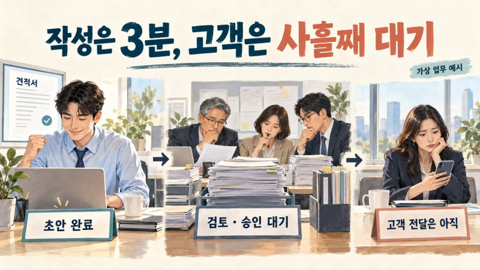
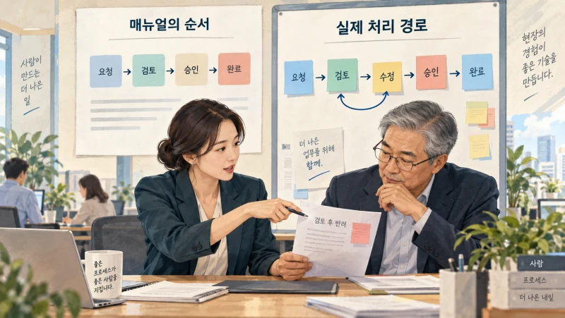
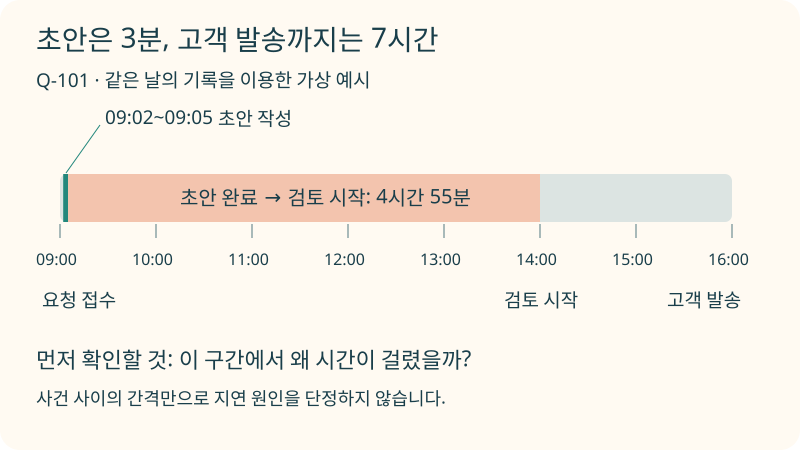
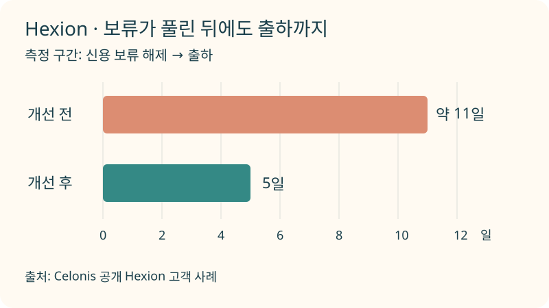
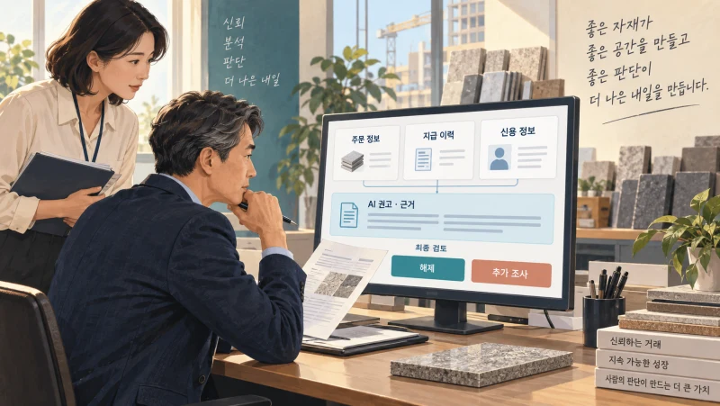
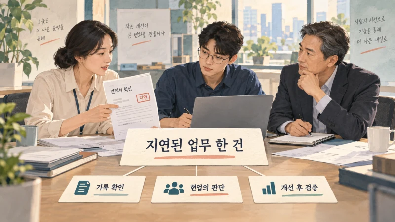

+++
date = '2026-09-20T00:00:00+09:00'
draft = false
title = '견적서는 3분 만에 썼는데, 고객은 왜 사흘째 기다릴까?'
description = 'AI로 개별 작업을 빠르게 해도 고객의 대기는 줄지 않을 수 있습니다. 프로세스 마이닝의 원리와 실제 기업 사례를 통해 업무 병목을 찾고, AI를 적용할 지점과 성과를 판단하는 방법을 살펴봅니다.'
tags = ['ax', 'ai', 'process-mining', 'process-intelligence', 'automation']
authors = ['geoff']
featured_image = 'thumbnail.webp'
images = ['thumbnail.webp']
slug = 'process-mining'
audio = []
vedios = []
series = []
toc = true
+++

## 들어가며

어떤 회사가 견적 작성에 AI를 도입했다고 생각해보겠습니다. 예전에는 담당자가 자료를 찾아 초안을 만드는 데 30분이 걸렸는데 이제는 3분이면 됩니다. 영업팀의 AX 성과 보고서에도 작성 시간이 크게 줄었다고 적었습니다.

그런데 고객에게는 여전히 이런 전화가 옵니다.

> 견적서 언제 받을 수 있나요? 요청한 지 사흘이나 됐는데요.

영업 담당자는 초안을 작성해서 넘겼습니다. 검토 담당자는 다른 건을 처리하느라 아직 보지 못했습니다. 뒤늦게 확인하니 납품 조건이 빠져서 다시 영업팀으로 돌려보냅니다. 수정 후 승인을 받아도 고객에게 보내는 일이 남아 있습니다.

이 가상의 상황에서 AI는 맡은 일을 빨리했습니다. 회사에서도 27분을 아꼈죠. 하지만 고객은 견적서 초안이 아니라 실제로 받은 견적서를 기준으로 기다린 시간을 세니, 달라진 게 없다고 느낄 만합니다.

**AX 과제를 고를 때는 개별 작업의 속도와 함께, 고객의 요청이 들어와 끝날 때까지의 흐름을 살펴야 합니다.** 어디서 멈췄고 왜 다시 돌아갔는지 알아야 시간을 줄일 곳도 고를 수 있겠죠.

이번 글에서는 그 흐름을 실제 기록으로 살펴보는 프로세스 마이닝을 알아보겠습니다. 기업들은 무엇을 찾아 바꿨는지, 우리 회사에서는 어떤 기록부터 연결하고 어디에 AI를 적용하면 좋을지 함께 살펴보겠습니다.

## 매뉴얼대로라면 벌써 끝났어야 하는데

담당자에게 견적 업무의 순서를 물으면 접수하고, 작성하고, 검토한 뒤 승인받아 발송한다고 설명할 겁니다. 매뉴얼에도 그렇게 적혀 있을 테고요.

실제로 처리한 기록을 보면 이야기가 달라질 수 있습니다. 어떤 견적은 검토를 한 번에 통과하지만 어떤 건은 조건을 확인하느라 두 번 돌아옵니다. 특정 상품만 다른 부서의 확인을 거칩니다. 승인까지 끝났는데 발송하지 않은 건도 있습니다. 같은 견적 업무라도 고객이 거친 순서는 제각각입니다.

프로세스 마이닝(Process Mining)은 시스템에 남은 사건 기록을 분석해서 이런 실제 업무 흐름을 찾아내는 기술입니다. 주문 접수, 담당자 배정, 검토 시작, 승인, 발송처럼 업무 중 발생한 사건을 시간 순서로 연결합니다. [IEEE 프로세스 마이닝 태스크포스](https://www.tf-pm.org/)도 실제 프로세스를 발견하고 점검하며 개선하는 접근으로 설명합니다.

택배 배송 조회를 떠올리면 이해하기 쉽습니다. 우리는 택배가 목적지까지 가는 일반적인 순서보다 내 물건이 어느 지점에 도착했고 얼마나 머물렀는지가 궁금합니다. 회사의 견적과 주문, 상담 건에도 비슷한 질문을 던지는 겁니다.

여러 건을 모아보면 반복하는 경로와 오래 걸리는 구간을 찾을 수 있습니다. 여기서 정해둔 절차와 실제 기록을 비교하는 일을 적합성 검사라고 부릅니다. 예를 들어 승인 후 발송해야 한다는 규칙을 정했다면, 발송부터 해버린 건을 찾아 확인할 수 있죠. 흐름을 발견하고 규칙과 비교한 뒤 개선에 활용하는 것이 프로세스 마이닝의 기본적인 쓰임입니다. [개념과 분류](https://www.tf-pm.org/resources/manifesto)

## 시스템에는 무엇이 남아 있어야 할까?

처음부터 거창한 구성을 생각할 필요는 없습니다. 견적 요청 한 건을 골라 어떤 기록이 남아 있는지 찾아보면 됩니다.

필요한 기본 정보는 업무 건을 구분하는 식별자, 무슨 일이 있었는지를 나타내는 활동명, 그 일이 일어난 시각입니다. Microsoft의 [프로세스 마이닝 데이터 문서](https://learn.microsoft.com/en-us/power-automate/process-mining-processes-and-data)에서도 이 항목들을 설명합니다. 활동의 시작과 종료를 각각 남기면 그 활동에 걸린 시간도 따로 볼 수 있습니다.

다음은 설명을 위해 만든 견적 요청 Q-101의 기록입니다. 모두 같은 날에 있었던 일로 가정했습니다.

| 시각 | 기록된 사건 | 담당 부서 |
|---|---|---|
| 09:00 | 견적 요청 접수 | 영업 |
| 09:02 | 초안 작성 시작 | 영업 |
| 09:05 | 초안 작성 완료 | 영업 |
| 14:00 | 검토 시작 | 영업관리 |
| 14:15 | 수정 요청 | 영업관리 |
| 14:25 | 수정 완료 | 영업 |
| 15:00 | 승인 완료 | 영업관리 |
| 16:00 | 고객 발송 | 영업 |

초안 작성에는 3분이 걸렸습니다. 요청을 접수해서 고객에게 보내기까지는 7시간이 걸렸고요. 이 기록에서는 초안 완료 후 검토 시작까지의 4시간 55분을 먼저 살펴볼 만합니다.

다만 그 시간을 곧바로 검토 담당자가 일을 하지 않은 시간으로 해석하면 곤란합니다. 앞선 업무가 밀려 있었는지, 필요한 자료를 기다렸는지, 검토 요청 알림이 제대로 갔는지를 확인해야 합니다. 프로세스 마이닝으로 오래 걸린 구간을 찾았다면 담당자와 해당 건의 사정을 확인하는 일이 뒤따릅니다.

데이터를 준비할 때도 확인할 게 있습니다. 화면에 현재 상태가 승인 완료라고 표시돼 있어도, 중간에 몇 번 반려됐는지는 알 수 없습니다. 상태가 바뀐 이력이 필요합니다. CRM의 견적 번호와 결재 시스템의 요청 번호가 다르다면 같은 업무 건으로 묶을 수 있도록 연결해야 합니다. 이 연결을 잘못하면 서로 다른 고객의 일을 하나의 흐름처럼 분석할 수도 있습니다.

분석할 때는 필요한 범위의 기록부터 가져오는 편이 좋습니다. 직원의 이름을 가져오기 전에 담당 부서나 역할만으로도 병목을 찾을 수 있는지 검토해보면 좋겠습니다.

## 기록을 모으면 어떻게 업무 흐름이 나올까?

견적 건마다 사건을 시간 순서로 정리하면 접수 다음에 작성이 있었는지, 검토 뒤에 승인이 있었는지 알 수 있습니다. 여러 건에서 같은 연결을 세어 그리면 자주 거치는 경로가 보입니다. 이런 연결을 표현하는 방법 중 하나가 Directly-Follows Graph, 줄여서 DFG입니다.

그림에서 검토와 수정 사이를 여러 번 오가는 선이 보인다면, 어떤 조건의 견적이 그 경로를 반복하는지 좁혀볼 수 있습니다. 신규 고객인지, 특정 상품인지, 할인 폭이 큰 건인지 비교하는 식입니다. 평균 시간이 긴 부서를 찾는 데서 그치지 않고 어떤 업무가 왜 오래 걸리는지 조사할 대상을 정할 수 있습니다.

Inductive Miner 같은 알고리즘은 기록에서 순서와 분기, 반복 등을 찾아 프로세스 모델을 만듭니다. 정해진 모델과 실제 실행 이력을 맞춰보는 기법도 있습니다. 개발팀이 직접 분석을 구성한다면 이런 기능을 제공하는 [PM4Py](https://github.com/process-intelligence-solutions/pm4py)를 검토할 수 있습니다.

실제 구축에서는 분석 도구를 고르는 것과 함께 사건의 의미를 맞추는 작업도 중요합니다. 한 시스템의 완료가 작성 완료를 뜻하고 다른 시스템에서는 고객 발송 완료를 뜻한다면, 두 값을 그대로 같은 단계로 묶을 수 없으니까요. 앞선 [시맨틱 레이어 글](https://tech.epsilondelta.ai/posts/semantic-layer/)에서 다룬 지표 정의 문제와도 닿아 있습니다.

주문 업무로 가면 관계가 더 복잡해집니다. 한 주문의 상품을 두 번에 나눠 배송하고, 여러 주문의 대금을 청구서 하나로 묶기도 합니다. 첫 배송이 끝났다고 주문 전체가 끝난 것은 아니겠죠. 주문 번호 하나만 따라가서는 어떤 품목이 아직 남았는지 놓칠 수 있습니다.

이런 관계를 함께 다루는 접근이 객체 중심 프로세스 마이닝입니다. 주문·배송·청구서를 각각 구분하고 서로 연결해 분석합니다. 관련 로그 형식인 [OCEL 2.0](https://www.ocel-standard.org/)에서는 사건과 객체의 관계뿐 아니라 객체 사이의 관계와 속성 변화도 표현합니다. 경영진 입장에서는 용어보다 이 질문이 실용적일 겁니다. 우리 회사가 완료했다고 집계한 주문은 고객이 받아야 할 물건까지 모두 도착한 주문일까요?

## Hexion은 출하까지 걸리는 시간을 줄였습니다

화학 제조기업 Hexion은 주문 변경이 자주 일어난다는 사실을 알고 있었습니다. 하지만 어느 고객의 주문이 주로 바뀌고, 그 변경이 생산 계획이나 구매에 얼마나 영향을 주는지 파악하기 어려웠습니다.

Celonis가 공개한 사례에 따르면 Hexion은 실제 업무 흐름을 분석하면서 잘못된 배송 경로 기준정보 때문에 경로 변경이 많이 발생한다는 사실을 확인했습니다. 기준정보를 수정한 뒤 경로 변경을 45% 줄였다고 합니다.

출하 지연 위험이 있는 주문의 보류 상태도 알림으로 확인하고 먼저 대응했습니다. 그 결과 신용 보류를 해제한 시점부터 출하까지 걸린 시간을 약 11일에서 5일로 줄였다고 설명합니다. [Hexion 도입 사례](https://www.celonis.com/solutions/stories/hexion-supply-chain-process-mining)

여기서 해볼 질문은 우리 회사에서도 같습니다. 담당자가 주문을 확인했다는 사실만으로 고객에게 물건이 빨리 갈까요? 주문 확인 후에도 경로를 고치고 보류 건을 찾아 처리해야 한다면 그 작업까지 살펴봐야 합니다. Hexion에서는 기준정보를 바로잡고 지연 위험을 미리 확인하는 데서 개선할 부분을 찾았습니다.

## Cosentino는 발견한 병목에 AI를 투입했습니다

건축용 표면재를 만드는 Cosentino에서는 신용 정책 때문에 보류된 주문을 처리하는 일이 문제였습니다. 담당자가 고객 관계와 지급 이력, 위험 등을 확인하고 재무팀과 협의해 보류를 풀어도 되는지 판단했습니다. 이 과정에서 주문이 최대 한 달까지 지연되기도 했다고 합니다. 건축 현장에서 쓸 자재라면 고객의 다음 공정도 영향을 받을 수 있겠죠.

Cosentino는 프로세스 분석에서 이 문제를 확인한 뒤 Celonis와 AI 에이전트를 구축했습니다. 여러 IT 시스템의 정보를 모으고 주문 금액과 고객 신용 정보, 보류 해제 관련 지표 등을 AI가 참고하도록 구성했습니다.

에이전트는 주문을 검토해 보류를 해제할지, 유지하고 더 조사할지 근거와 함께 권고합니다. 일부 주문은 자동으로 해제하고 다른 건은 담당자가 권고를 확인해 수락하거나 거절합니다. Celonis의 공개 사례에서는 하루 약 180건을 분석하며 담당자가 이전보다 최소 5배 많은 보류 주문을 처리할 수 있게 됐다고 설명합니다. [Cosentino 도입 사례](https://www.celonis.com/solutions/stories/cosentino-order-management)

저는 이 사례에서 AI를 넣기로 한 위치를 눈여겨보면 좋겠습니다. 주문이 오래 걸리는 구간을 찾고, 그 구간에서 담당자가 무슨 자료를 보고 판단하는지 확인했습니다. 그리고 필요한 정보를 연결해 검토와 해제를 돕도록 만들었습니다. 우리 조직에서도 이런 순서로 살펴보면 AI에게 맡길 일을 훨씬 구체적으로 정할 수 있습니다.

마케팅 업무에서도 비슷한 접근을 볼 수 있습니다. Microsoft MCAPS는 이벤트 로그를 정리하고 Copilot을 활용해 업무 흐름을 분석했습니다. 분석한 과정에서 20%의 건에 재작업이 있었고 검토 반복이 주요 병목이었다고 설명합니다. [Microsoft의 2024년 공개 사례](https://www.microsoft.com/en-us/power-platform/blog/power-automate/transforming-digital-processes-with-ai-a-power-automate-process-mining-case-study-at-microsoft-customer-and-partner-solutions-mcaps/)

콘텐츠를 빨리 만들어도 검토에서 계속 되돌아오면 전체 일정은 길어질 수 있습니다. 그래서 저는 AX 과제를 정할 때 작성 도구를 고르는 일과 함께 검토·반려 과정도 확인하는 편이 좋다고 생각합니다.

## 오래 걸리는 곳마다 AI를 넣어야 할까요?

처음의 견적 업무로 돌아가 보겠습니다. 검토가 늦어진 원인이 무엇인지에 따라 할 일이 달라집니다.

필수 납품 조건이 빠져서 계속 반려된다면 어떨까요? 요청을 받을 때 그 조건부터 입력하도록 바꿀 수 있습니다. 고객이 보낸 문서에서 조건을 찾아야 한다면 AI로 추출하고 누락을 확인하는 구성을 검토할 만합니다.

담당자가 여러 시스템을 열어 고객 이력과 거래 조건을 비교하느라 시간이 걸린다면, 조회 도구를 연결하고 AI가 근거를 정리하게 할 수 있겠죠. 이때는 [MCP 글](https://tech.epsilondelta.ai/posts/mcp-enterprise-integration/)에서 다룬 시스템 연결과 권한 설계가 필요합니다.

반면 낮은 위험의 견적까지 여러 사람의 승인을 기다린다면 승인 기준을 다시 살펴봐야 합니다. 승인 요청 메일을 빨리 쓰는 것만으로는 해결하기 어렵습니다. 누구에게 어떤 건을 맡기고 어느 조건에서 승인을 받을지 정하는 일입니다.

프로세스 마이닝으로 발견한 지연을 줄이려면 실제 업무 절차를 바꿀 사람이 함께 있어야 합니다. 분석 담당자가 그래프를 만들어 전달했는데 현업에서는 기존 방식대로 일한다면 고객의 대기도 계속될 겁니다.

## 정말 빨라졌는지는 어디에서 확인할까?

개선 후에는 처음 정한 시작과 끝을 같은 기준으로 재야 합니다. 견적 초안 완료까지 걸린 시간을 보다가 나중에는 승인 완료까지의 시간과 비교하면, 무엇이 얼마나 나아졌는지 판단하기 어렵습니다. 고객에게 견적서를 보내는 업무라면 요청 접수부터 발송까지를 보고 그 사이의 작성·검토·승인 구간도 나눠보면 좋겠습니다.

평균과 함께 유난히 오래 걸린 건도 확인합니다. 대부분은 빨리 처리했어도 일부 고객이 계속 기다리고 있을 수 있습니다. 아직 끝나지 않은 건을 집계에서 빼면 바로 그 고객들을 놓치게 됩니다.

처리량과 반려도 같이 봅니다. AI 덕분에 초안을 더 많이 만들었는데 검토할 사람과 기준은 그대로라면 검토함에 문서가 더 쌓일 수 있습니다. 앞선 [Workslop 글](https://tech.epsilondelta.ai/posts/what-is-workslop/)에서는 부실한 결과물을 받아 생기는 재작업을 다뤘습니다. 이번에는 결과물의 품질이 괜찮더라도 다음 단계에서 처리할 여력이 있는지까지 확인하는 겁니다.

실제 운영에서는 AI가 작업을 마쳤다는 응답과 업무 시스템에 남은 결과를 연결해두는 편이 좋습니다. 어떤 주문을 대상으로 실행했고 승인과 발송까지 끝났는지 확인할 수 있어야, 중간에 멈춘 건을 찾아 다시 처리할 수 있습니다. 성과 보고서에도 작성 시간뿐 아니라 고객에게 전달하기까지 걸린 시간과 재작업을 함께 담아야 합니다.

## 나가며

AI가 견적서를 3분 만에 써도 고객은 검토와 승인, 발송까지 기다립니다. 프로세스 마이닝을 활용하면 업무가 실제로 거친 경로를 따라가며 시간이 오래 걸린 구간과 반복 작업을 찾을 수 있습니다. 그 원인을 확인한 뒤 절차를 바꾸거나 필요한 곳에 AI를 적용하고 고객의 대기가 줄었는지 다시 살펴보는 겁니다.

이 과정에서는 기록과 현업의 경험이 함께 필요합니다. 왜 특정 조건의 주문만 보류하는지, 어떤 예외는 바로 처리해도 되는지, 담당자가 무엇을 확인한 뒤 넘기는지는 로그만 읽어서는 충분히 이해하기 어렵습니다. 앞선 [암묵지 자산화 글](https://tech.epsilondelta.ai/posts/ax-tacit-knowledge-assetization/)에서 이야기한 숙련자의 판단 기준을 실제 업무 건과 함께 정리할 기회이기도 합니다. 확인한 기준을 접수·검토·승인 절차와 에이전트에 반영하면 다음 업무에서도 활용할 수 있습니다.

막상 우리 회사에 적용하려면 여러 시스템의 업무 번호와 사건 정의부터 맞춰야 합니다. 현업과 지연 원인을 확인하고 바꿀 절차를 정하는 일, 필요한 데이터와 도구를 AI에 연결하는 일, 변경 후 결과를 검증하고 운영하는 일도 남아 있습니다. 회사의 업무를 이해하는 경험과 구현 노하우가 함께 필요한 작업입니다.

우리 엡실론델타는 실제 업무 흐름을 진단하고 AX 과제를 고르는 단계부터 현업의 판단 기준 정리, 시스템과 에이전트 연결, 평가와 운영까지 함께 도와드리겠습니다.

AI를 도입했는데 고객의 기다림은 줄지 않았다면 [contact@epsilondelta.ai](mailto:contact@epsilondelta.ai)로 연락 주세요. 최근 지연된 업무 한 건과 담당자들이 처리한 순서부터 함께 살펴보겠습니다. 어디서 시간이 걸렸고 무엇을 바꾸면 좋을지 확인해, 우리 조직에서 실제로 끝나는 일을 늘리는 방법을 찾아보겠습니다.
