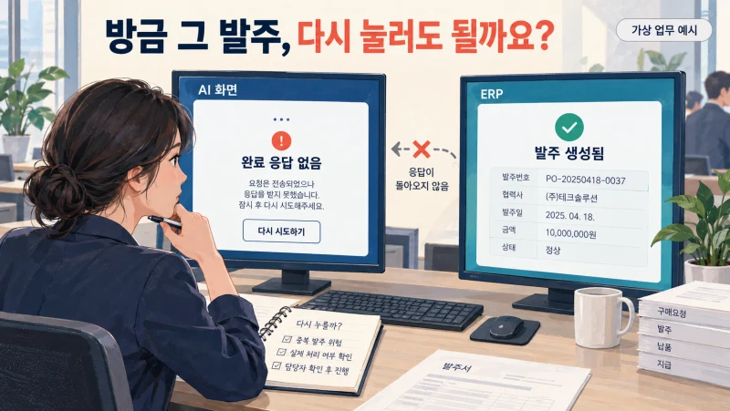
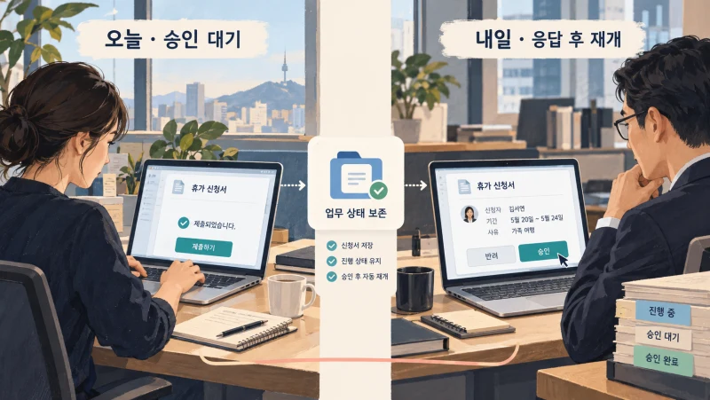
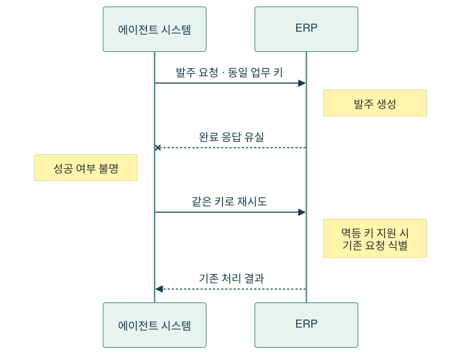
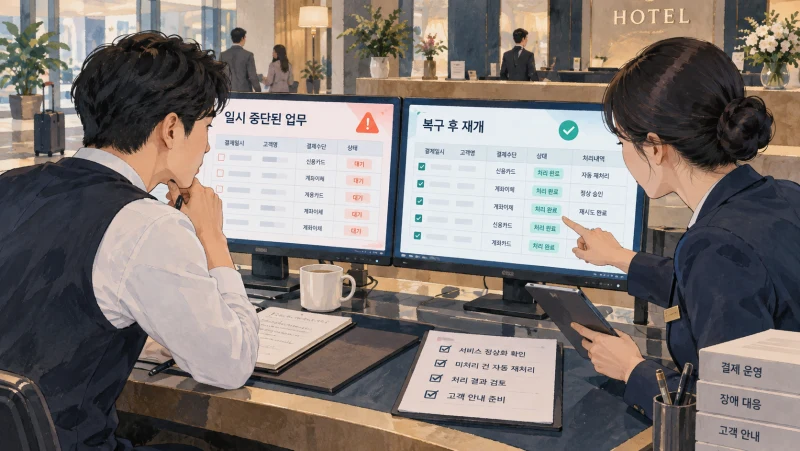
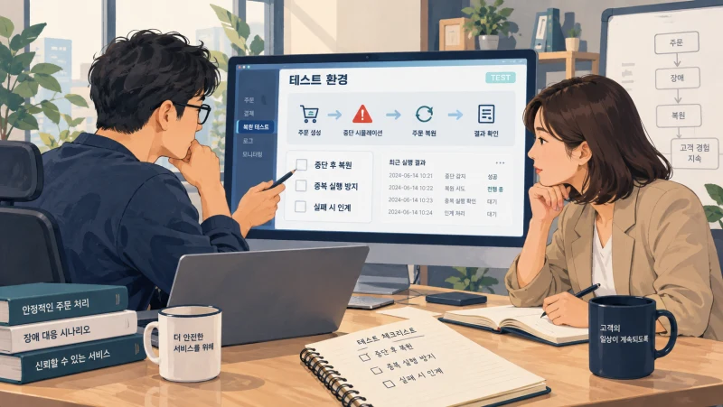
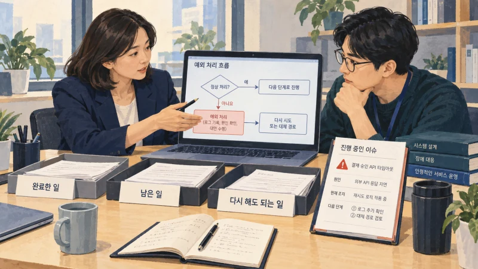

+++
date = '2026-09-21T00:00:00+09:00'
draft = false
title = 'AI가 멈췄습니다. 방금 그 발주, 다시 눌러도 될까요?'
description = '장애나 다음 날의 승인 이후에도 AI 업무를 안전하게 이어가려면 무엇이 필요할까요? Durable Execution의 복구 원리와 보험·결제 사례를 통해 상태 보존, 중복 실행 방지, 운영 기준을 살펴봅니다.'
tags = ['ax', 'ai', 'agent', 'durable-execution', 'workflow', 'reliability']
authors = ['geoff']
featured_image = 'thumbnail.webp'
images = ['thumbnail.webp']
slug = 'durable-execution'
audio = []
vedios = []
series = []
toc = true
+++

## 들어가며

구매팀이 AI 에이전트에게 발주 업무를 맡겼다고 생각해보겠습니다. 에이전트는 거래처를 확인하고 발주서를 작성했습니다. 팀장도 내용을 검토해 승인했습니다. 이제 사내 ERP에 발주를 넣으면 됩니다.

그런데 실행 직후 연결 오류가 뜹니다. 담당자가 묻습니다.

> 방금 발주가 들어간 건가요? 다시 실행해도 되나요?

에이전트 화면에는 완료 표시가 없습니다. ERP에는 이미 발주가 들어갔을 수도 있습니다. 그대로 두면 주문을 놓칠까 걱정되고 다시 실행하면 같은 물건을 두 번 주문할까 걱정됩니다. 결국 담당자가 ERP를 열고 거래 내역부터 찾습니다.

이 가상의 상황에서는 답변을 더 매끄럽게 해도 해결되지 않습니다. **어디까지 처리했는지 확인하고, 끝낸 일을 중복 실행하지 않으면서 남은 업무를 이어갈 수 있어야 합니다.**

이번 글에서 다룰 Durable Execution은 이런 업무를 구성하는 데 쓰는 실행 방식입니다. 진행 상태와 단계별 결과를 남겨 장애가 나거나 사람이 다음 날 응답해도 복구하고 재개하도록 합니다. 여기에 발주·결제 같은 외부 작업의 중복 방지까지 함께 설계하면 담당자가 처음부터 업무를 복원하는 부담을 줄일 수 있습니다.

보험 AI와 호텔 결제 시스템의 실제 사례를 살펴보면서 원리를 설명하겠습니다. 글을 읽고 나면 우리 회사 AI에 무엇을 기록하게 하고, 어떤 실패를 시험하고, 어디에서 사람에게 넘겨야 할지 판단하는 기준을 얻으실 수 있을 겁니다.

## AI는 답변을 끝냈지만 업무는 내일까지 이어집니다

채팅창에서 질문하고 답을 받는 일은 짧게 끝납니다. 현업의 업무는 그렇지 않을 때가 많습니다.

견적을 만들었지만 팀장이 내일 승인합니다. 고객에게 추가 서류를 요청했는데 며칠 뒤에야 답장이 옵니다. 환불을 접수했지만 결제사가 실제 처리를 끝냈다는 통지는 나중에 도착합니다. 그동안 서버를 재시작하거나 프로그램을 새 버전으로 바꿀 수도 있습니다.

이런 업무를 실행 중인 프로그램의 메모리에만 남겨두면 프로그램이 종료됐을 때 진행 상태를 잃을 수 있습니다. 담당자가 다시 실행하더라도 이전 작업의 결과와 남은 일을 알아야 어디서 이어갈지 정할 수 있겠죠.

Durable Execution에서는 실행을 이어가는 데 필요한 상태와 결과를 영속 저장소에 남깁니다. 프로그램이 다시 시작되면 그 기록을 사용해 업무를 복구합니다. 승인이나 외부 응답을 기다리는 상태도 관리 대상입니다. [Temporal의 실행 개념](https://docs.temporal.io/workflow-execution)과 [Azure의 Durable Orchestration 설명](https://learn.microsoft.com/en-us/azure/durable-task/common/durable-task-orchestrations?tabs=python)에서 이런 구성을 확인할 수 있습니다.

인수인계를 떠올려보면 이해하기 쉽습니다. 다음 담당자에게 발주를 부탁한다는 말만 남겨서는 부족합니다. 어떤 거래처를 확인했고 어느 발주서에 승인을 받았으며 실제 주문은 들어갔는지까지 알려줘야 합니다. 실행 중인 시스템을 교체할 때도 이어받을 기록이 필요합니다.

앞선 [에이전트 메모리 글](https://tech.epsilondelta.ai/posts/agent-memory/)에서는 이전 경험과 업무 방식을 다음 작업에 활용하는 방법을 다뤘습니다. 이번에는 지금 맡긴 업무를 중간에 잃어버리지 않고 끝내는 데 초점을 맞춥니다.

## 이미 끝낸 단계는 어떻게 건너뛸까?

Temporal을 예로 들어보겠습니다. 전체 업무의 순서와 대기, 분기는 Workflow로 구성합니다. 거래처 조회나 AI 호출, 발주 API처럼 실제 작업을 수행하는 단위는 Activity라고 부릅니다.

가령 거래처를 조회하고 AI가 발주 초안을 만든 뒤 팀장 승인을 기다리는 업무라면, 조회 결과와 초안 생성 결과를 실행 이력에 남깁니다. 승인 대기 중 프로그램이 종료돼도 이력을 읽어 진행 상태를 복원합니다.

복원할 때는 Workflow 코드를 처음부터 다시 따라갈 수 있습니다. 이 과정을 replay라고 부릅니다. 코드가 거래처 조회 단계에 도착했을 때 완료 결과가 이미 기록돼 있다면 저장한 결과를 사용합니다. 초안 생성도 마찬가지입니다. 기록된 결과를 따라 승인 대기 지점까지 복원하고 이후에 도착한 응답을 처리하는 식입니다. [Workflow의 결정성과 replay](https://docs.temporal.io/workflow-definition)

여기서 업무 순서를 관리하는 코드와 외부 작업을 나누는 이유가 드러납니다. 복원 중에 AI에게 발주서를 다시 쓰게 하면 이전과 다른 초안을 받을 수 있습니다. 이미 승인한 초안까지 달라지면 곤란하겠죠. AI 호출은 별도 작업으로 실행하고 기록한 결과를 복원에 사용하도록 구성합니다.

이처럼 다시 실행해도 같은 이력을 따라갈 수 있도록 작성하는 성질을 결정성이라고 합니다. 개발팀은 외부 호출이나 무작위 값 때문에 복원 경로가 달라지지 않게 해야 합니다. 현업에서 확인할 질문은 더 간단합니다. 장애 후에도 우리가 검토했던 그 초안과 진행 상태로 돌아오는가입니다.

## 발주는 성공했는데 성공 기록을 못 남겼다면?

처음의 발주 오류로 돌아가 보겠습니다. 실행 이력을 남기더라도 외부 시스템과 통신하는 순간에는 이런 일이 생길 수 있습니다.

| 순서 | ERP에서 일어난 일 | 에이전트 시스템이 아는 내용 |
|---|---|---|
| 발주 요청 전송 | 요청을 받음 | 발주 요청을 보냈음 |
| ERP 처리 | 발주를 생성함 | 아직 완료 응답을 받지 못함 |
| 연결 끊김 | 생성한 발주는 남아 있음 | 응답을 기다리다 타임아웃 발생 |
| 재시도 | 같은 발주 요청을 다시 받음 | 이전 요청과 같은 업무인지 식별해야 함 |

타임아웃은 정해진 시간 안에 응답을 받지 못했다는 뜻입니다. 외부 시스템에서 아무 일도 일어나지 않았다는 뜻은 아닙니다. 실패했다고 생각해서 새 발주를 보내면 중복 주문이 생길 수 있습니다.

이를 막는 방법 중 하나가 멱등성입니다. 같은 업무를 여러 번 요청해도 실제 효과는 한 번 처리한 것과 같도록 만드는 성질입니다. 업무 요청에 고유한 키를 붙이고 외부 시스템이 그 키로 중복을 식별하도록 구성할 수 있습니다. Temporal도 완료 보고 전에 실행 프로그램이 종료되면 Activity가 재시도될 수 있으므로 이런 설계가 필요하다고 설명합니다. [Activity와 멱등성](https://docs.temporal.io/activity-definition)

예를 들어 발주 요청 번호와 승인된 문서 버전을 기준으로 키를 만들었다고 해보겠습니다. 연결이 끊겨 같은 발주를 다시 보낼 때는 같은 키를 사용합니다. 외부 시스템이 이미 그 키로 발주를 만들었다면 기존 처리 결과를 돌려주도록 하는 겁니다. 매번 새로운 키를 만들면 외부 시스템도 새 요청으로 받아들일 수 있겠죠.

실제로 [Stripe의 멱등 요청 API](https://docs.stripe.com/api/idempotent_requests)는 같은 키에 대해 최초 요청의 결과를 재사용하는 방식을 제공합니다. 우리 회사의 ERP나 거래처 API를 연결할 때도 어떤 중복 방지 기능을 지원하는지 확인해야 합니다. 지원하지 않는 시스템이라면 거래 결과를 대조하거나 담당자 확인으로 넘길 절차를 별도로 구성합니다.

저는 발주나 환불을 맡기는 에이전트라면 이 상황을 꼭 시험해보는 편이 좋다고 생각합니다. 정상적으로 한 번 성공하는 장면보다, 외부 처리는 끝났는데 완료 응답을 놓친 순간의 처리가 더 까다롭기 때문입니다.

## 보험 AI는 며칠 뒤 온 서류를 어떻게 이어 처리할까?

보험 업무용 AI를 만드는 Strada의 사례를 보겠습니다. Temporal이 공개한 설명에는 고객이 이메일로 보험 청구를 접수하고 누락 서류를 요청받는 흐름이 나옵니다. 며칠 뒤 PDF가 도착하면 AI가 필요한 항목을 추출해 보험 시스템과 비교합니다. 차이가 있으면 사람에게 판단을 요청하고 그 응답을 받은 뒤 업무를 이어갑니다.

전화 한 통으로 끝나는 업무와 달리 이메일과 서류, 사람의 판단을 기다리며 며칠을 보내는 과정입니다. Strada는 업무 순서를 관리하는 Workflow와 문서 추출·API 호출·메일 발송을 수행하는 Activity를 나눴습니다. 첨부파일 처리도 별도 흐름으로 구성해 일부 추출에 문제가 생겨도 성공한 다른 결과를 잃지 않도록 했습니다.

고객이나 담당자의 답변을 기다리는 동안 새 코드를 배포하고 실행 프로그램을 재시작하더라도 이력을 사용해 업무를 재개한다고 설명합니다. 요청들이 같은 고객의 문맥을 공유하며 동시에 들어올 때는 추론을 순서대로 처리하도록 구성했습니다. [Strada 보험 AI 사례](https://temporal.io/resources/case-studies/strada)

우리 회사의 계약 검토나 고객 상담도 비슷합니다. 추가 자료를 요청한 뒤 답장이 늦게 왔다는 이유로 담당자가 처음부터 문서를 다시 모아야 한다면 자동화한 효과가 줄어듭니다. 어떤 자료를 받았고 무엇이 부족했으며 다음에 무엇을 확인할지까지 남겨야 실제 현업의 속도로 일을 이어갈 수 있습니다.

## 호텔 결제에서는 장애 뒤의 뒷정리가 달라졌습니다

숙박 플랫폼 Mews는 결제와 환불, 분쟁 처리처럼 여러 시스템에 걸친 장기 업무를 운영합니다. 자체 작업 처리 코드와 메시지 시스템 등을 조합해 사용했지만, 업무마다 재시도와 상태 복구를 구현하고 현재 상태를 확인하는 데 부담이 있었다고 합니다.

Mews는 결제 자동화 과정의 청구 마감부터 별도 Workflow로 옮겼습니다. Temporal의 공개 사례에서는 하루 약 6,000건의 청구 마감을 처리한다고 설명합니다. 특히 눈여겨볼 부분은 장애가 났을 때입니다. 메시지 시스템인 Kafka의 장애로 수천 개 Workflow가 멈췄는데 Kafka가 복구된 뒤 자동으로 재개돼 수동 정리가 필요하지 않았다고 합니다. [Mews 도입 사례](https://temporal.io/resources/case-studies/mews)

현업에서 장애가 끝났다는 말은 두 가지로 들릴 수 있습니다. 시스템에 다시 접속할 수 있다는 뜻일 수도 있고, 중간에 멈춘 업무까지 정상 처리했다는 뜻일 수도 있습니다. 복구 뒤 직원들이 누락된 건을 찾아 하나씩 다시 입력해야 한다면 아직 해야 할 일이 남아 있는 셈입니다.

AI가 수행하는 업무도 같은 기준으로 볼 수 있습니다. 모델에 다시 연결됐는지만 확인하면 문서 작성까지 끝낸 건, 승인 대기 중인 건, 외부 실행 결과를 확인하지 못한 건이 뒤섞인 채 남을 수 있습니다. 각각 어느 단계에서 재개할지 알 수 있어야 합니다.

## 어제 받은 승인으로 오늘 바뀐 발주를 보내도 될까?

오래 기다렸다가 재개하는 업무에서는 무엇을 승인받았는지도 보존해야 합니다. 팀장이 검토한 뒤 수량이나 금액이 바뀌었다면 이전 승인을 그대로 적용해서는 안 됩니다.

승인 대기 중인 업무에는 요청 번호뿐 아니라 승인 대상 문서의 버전, 승인자, 시각과 유효기간 등을 연결해두는 편이 좋습니다. 응답이 돌아오면 권한과 대상이 맞는지 확인하고 실행 전 변경 사항도 살펴봅니다. 승인 버튼을 두 번 누르거나 같은 응답이 중복 도착했을 때도 한 업무로 처리해야겠죠.

이런 대기는 실행 상태로 남길 수 있습니다. AI에게 계속 답변 여부를 물어보는 대신, 승인 응답이나 정해둔 기한에 맞춰 다음 처리를 진행하게 합니다. Temporal에서는 외부 입력을 Workflow에 전달하는 Signal과 Update 같은 기능을 제공합니다. [외부 입력과 Workflow](https://docs.temporal.io/develop/typescript/workflows/message-passing)

앞선 [AI 결재선 글](https://tech.epsilondelta.ai/posts/ai-agent-approval-workflows/)에서 어디까지 맡기고 언제 승인을 받을지 다뤘다면 여기서는 그 승인이 지연과 장애를 거친 뒤에도 올바른 실행에 사용되도록 만드는 겁니다.

업무를 기다리는 사이 코드가 바뀌는 경우도 생각해야 합니다. 개발팀이 새 버전을 배포했는데 이전 이력과 새 업무 순서가 맞지 않으면 복원에 문제가 생길 수 있습니다. [Worker Versioning](https://docs.temporal.io/production-deployment/worker-deployments/worker-versioning) 같은 기능을 검토하고 진행 중인 업무와 새로 시작하는 업무를 어떤 버전으로 처리할지 정할 필요가 있습니다.

## 다시 시도할 일과 멈춰야 할 일

모든 실패에 다시 시도하라는 규칙을 붙이면 끝날까요? 거래처 서버가 잠깐 응답하지 않은 상황과 팀장이 발주를 거절한 상황은 처리 방식이 달라야 합니다.

일시적인 통신 오류라면 간격을 두고 다시 시도할 수 있습니다. 입력한 거래처 코드가 틀렸다면 코드를 바로잡아야 합니다. 승인 거절은 거절 사유에 따라 수정하거나 종료할 일입니다. AI 호출이 계속 실패할 때는 총시간과 비용 한도를 넘기기 전에 멈추고 담당자에게 넘길 기준도 필요합니다.

이미 실행한 일의 정리도 남습니다. 재고를 예약했는데 뒤의 결제가 실패했다면 예약을 풀어줘야 할 수 있습니다. 결제까지 끝난 주문을 취소한다면 환불 절차를 진행해야겠죠. 보상 처리란 이런 후속 처리로 앞선 작업의 효과를 상쇄하는 방식입니다. [보상 트랜잭션 패턴](https://learn.microsoft.com/en-us/azure/architecture/patterns/compensating-transaction)

보상 처리도 기록하고 확인해야 합니다. 환불 요청을 보냈지만 결과를 받지 못했다면 환불 완료라고 끝내서는 안 됩니다. 담당자가 업무 화면에서 승인 대기인지, 외부 응답 대기인지, 실패 후 확인이 필요한지 구분할 수 있어야 대응할 수 있습니다.

## 우리 회사에서는 무엇부터 시험할까?

고객의 추가 서류나 사람의 승인을 기다리고 외부 시스템에 결과를 반영하는 업무 하나를 골라보면 좋겠습니다. 발주, 환불, 계약 검토처럼 시작과 완료를 정의할 수 있는 업무가 출발점이 될 수 있습니다.

구현 도구는 환경에 맞춰 검토하면 됩니다. Temporal이나 Azure Durable Functions처럼 장기 실행을 관리하는 기반을 사용할 수 있고, 에이전트 그래프에서는 LangGraph의 체크포인트와 중단·재개 기능을 활용할 수도 있습니다. 다만 LangGraph의 메모리 안에만 저장하는 체크포인터는 재시작하면 기록을 잃으므로 운영에서는 영속 저장 구성이 필요합니다. [LangGraph 저장과 복구](https://docs.langchain.com/oss/python/langgraph/persistence)

도구를 정했다면 중간에 일부러 멈춰보는 시험도 해야 합니다.

| 시험할 상황 | 확인할 결과 |
|---|---|
| 초안 생성 결과를 저장한 뒤 실행 프로그램 종료 | 같은 초안을 복원하고 남은 단계 진행 |
| ERP 발주 성공 직후 완료 응답을 받기 전에 연결 끊기 | 중복 발주 없이 기존 거래 결과 확인 |
| 승인 대기 중 프로그램 재배포 | 대기 상태와 승인 대상 유지 |
| 같은 승인 응답을 두 번 전달 | 실제 업무 효과가 중복되지 않음 |
| 일부 문서의 추출만 실패 | 성공한 결과 보존과 실패 구간 재처리 |
| 외부 서비스가 계속 실패 | 정한 한도에서 중단하고 담당자에게 인계 |

성과는 완료율과 중복 실행 건수에 더해 직원이 수동으로 복구한 시간도 보면 좋겠습니다. 정상적인 날에 몇 분을 아꼈는지와 문제가 생긴 날에 몇 건을 다시 처리했는지를 함께 보는 겁니다.

앞선 [프로세스 마이닝 글](https://tech.epsilondelta.ai/posts/process-mining/)에서 살펴본 실제 업무 기록도 활용할 수 있습니다. 장애 이후 어떤 건이 오래 남았고 어느 단계에서 사람의 재작업이 늘었는지 확인하면 다음에 고칠 부분이 구체적으로 보일 겁니다.

## 나가며

처음의 질문으로 돌아가 보겠습니다. 발주 직후 AI가 멈췄을 때 다시 눌러도 되는지는 화면의 오류 문구만으로 판단하기 어렵습니다. 어떤 단계의 결과를 저장했는지, 외부 시스템에서는 무엇을 처리했는지, 같은 요청을 다시 받아도 중복 실행하지 않는지까지 확인해야 합니다.

Durable Execution을 구성하면 중단된 업무를 복원하고 이어갈 기반을 마련할 수 있습니다. 여기에 현업의 승인·예외·취소 기준과 외부 시스템의 중복 방지 방식을 연결해야 맡긴 일을 안전하게 끝낼 수 있습니다.

이 기준 중에는 숙련자의 경험으로 처리해온 내용도 많습니다. 어떤 오류는 기다렸다 다시 시도하고 어떤 경우에는 거래처에 확인하는지, 이미 보낸 요청을 취소할 때 누구에게 연락하는지 같은 판단입니다. 앞선 [암묵지 자산화 글](https://tech.epsilondelta.ai/posts/ax-tacit-knowledge-assetization/)에서 이야기한 노하우를 복구와 예외 처리 절차에도 남겨야 합니다. 그러면 담당자가 바뀌거나 에이전트가 중단돼도 같은 기준으로 업무를 이어갈 수 있습니다.

실제로 적용하려면 업무를 나누는 단위부터 신중하게 정해야 합니다. 상태 저장, 승인 연결, 외부 실행 대조와 보상 처리, 코드 변경 후의 검증까지 함께 구성해야 하고 운영 중에 누가 확인할지도 정해야 합니다. 현업을 이해하는 경험과 에이전트·업무 시스템을 연결하는 엔지니어링 노하우가 함께 필요한 일입니다.

우리 엡실론델타는 이런 업무 흐름과 예외 기준을 정리하는 단계부터 에이전트 구현, 사내 시스템 연결, 복구·중복 방지 검증과 운영까지 함께 도와드리겠습니다.

AI가 멈춘 뒤 직원이 처음부터 업무를 다시 확인하고 있다면 [contact@epsilondelta.ai](mailto:contact@epsilondelta.ai)로 연락 주세요. 최근 중단된 업무 한 건부터 함께 살펴보겠습니다. 어디까지 처리했고 무엇을 다시 해도 되는지 확인할 수 있는 구조를 만들고, 우리 조직에서 AI에게 맡긴 일을 끝까지 이어가는 방법을 찾아보겠습니다.
