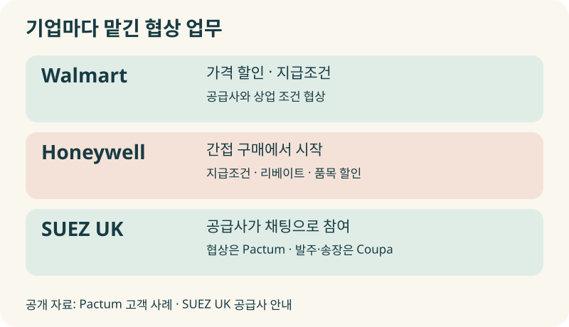
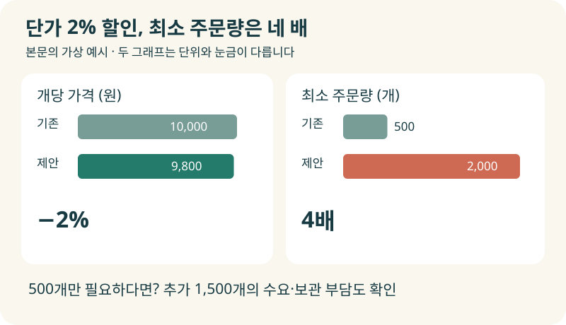
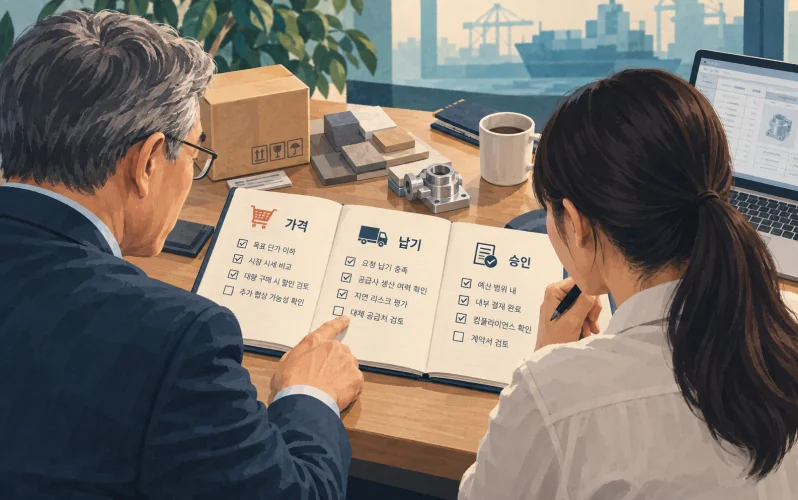
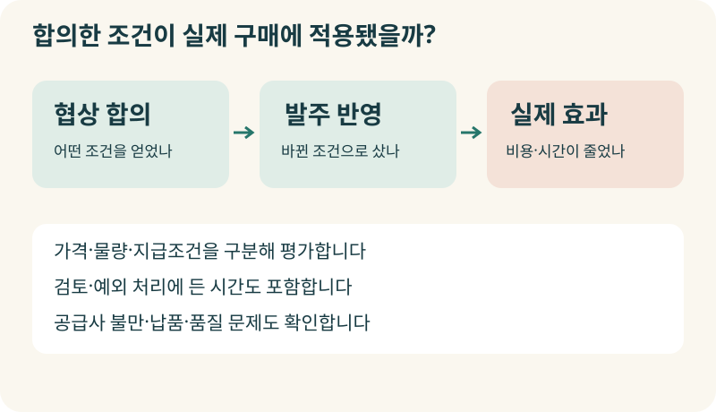

+++
date = '2026-09-22T00:00:00+09:00'
draft = false
title = '큰 계약만 챙기느라, 나머지는 부르는 값에 사고 있지 않나요?'
description = '구매팀이 일일이 협상하기 어려운 거래를 AI에게 맡길 수 있을까요? Walmart·Honeywell·SUEZ 사례와 함께 가격·물량·지급조건을 판단하는 기술, 협상 권한과 성과 기준을 살펴봅니다.'
tags = ['ax', 'ai', 'agent', 'procurement', 'negotiation']
authors = ['geoff']
featured_image = 'thumbnail.webp'
images = ['thumbnail.webp']
slug = 'procurement-negotiation-ai'
audio = []
vedios = []
series = []
toc = true
+++

## 들어가며

구매팀의 월말을 상상해보겠습니다. 큰 원자재 계약을 갱신하느라 팀 전체가 며칠째 매달리고 있습니다. 가격을 비교하고 생산팀에 필요 물량을 확인하고 공급사와 조건을 조율합니다. 그 사이 다른 부서에서 구매 요청이 계속 들어옵니다. 포장재도 사야 하고 사무실 소모품도 보충해야 합니다.

팀장이 담당자에게 묻습니다.

> 이 거래처는 계속 같은 가격으로 사고 있네요. 조건을 다시 이야기해본 적 있나요?

담당자도 가격을 비교해보고 싶었습니다. 다만 공급사에 연락하고 답변을 기다리고 수정 견적을 받는 데 시간이 듭니다. 이번에도 급한 주문부터 처리하다 보니 기존 조건으로 발주합니다.

이 가상의 장면에서 구매팀에 협상 교육을 더 한다고 해결될까요? 거래마다 협상에 쓸 시간이 부족하다면 담당자가 아무리 능숙해도 챙기지 못하는 계약은 남습니다.

이번에 다룰 구매 협상 AI는 이런 거래를 맡길 수 있는 방법입니다. 회사에서 허용한 조건 안에서 공급사와 제안을 주고받고, 범위를 벗어나면 담당자에게 판단을 요청하도록 구성합니다. **AI에게 협상을 맡기려면 우리 회사가 무엇을 얻고 어디까지 양보할 수 있는지부터 정해야 합니다.**

Walmart와 Honeywell은 이미 공급사 협상에 AI를 사용하고 있습니다. 이들이 어떤 업무를 맡겼는지 살펴보고, 우리 회사에서는 어떤 거래부터 시작할 수 있을지 알아보겠습니다. 단가를 낮췄는데 오히려 손해가 나는 협상을 피하려면 무엇을 구현해야 하는지도 함께 다룹니다.

## 견적을 비교하는 AI가 공급사와 대화하기 시작하면

견적서 여러 장을 AI에게 주고 비교표를 만드는 일은 익숙하실 겁니다. 구매 협상 AI에게는 상대방에게 조건을 제안하고 답변에 따라 다음 제안을 정하는 일까지 맡깁니다. 이를 자율 협상이라고 부릅니다.

예를 들어 공급사가 가격을 더 낮추기는 어렵지만 납품 일정을 조정하면 가능하다고 답했다고 해보겠습니다. AI는 그 일정을 회사가 받아들일 수 있는지 확인하고 허용 범위 안에서 다시 제안합니다. 가격·수량·납기·지급조건처럼 여러 항목을 다룰 수 있습니다. [자율 협상의 개념](https://pactum.com/blog/understanding-autonomous-negotiations)

물론 어디까지 실행하게 할지는 회사가 정합니다. AI가 제안 초안을 만들고 매번 사람이 승인하게 할 수도 있습니다. 검증을 마친 품목에서는 정해진 범위 안의 제안을 직접 보내게 하고, 예외만 구매 담당자에게 넘길 수도 있겠죠.

앞선 계약 검토 AI 글에서는 계약서를 우리 회사 기준에 맞춰 읽는 방법을 다뤘습니다. 이번에는 그 기준으로 상대와 조건을 조율합니다. 그래서 내부 검토용 답변보다 외부에 보내는 문장에 더 주의해야 합니다. 공급사 입장에서는 우리 회사가 제시한 거래 조건이니까요.

## 기업들은 어떤 협상을 맡겼을까?

### Walmart는 가격과 지급조건을 함께 다룹니다

구매 협상 솔루션 회사 Pactum은 Walmart가 공급사와 가격 할인과 지급조건을 논의하는 데 자사 시스템을 사용한다고 설명합니다. 공개한 사례에 따르면 플랫폼에 참여한 공급사의 68%가 합의했고 평균 지급기간은 35일 늘어났습니다. [Walmart 도입 사례](https://pactum.com/clients)

구매 담당자는 단가 외에도 돈을 언제 지급할지 협상합니다. 우리 회사에 유리한 지급조건이 무엇인지 정하고, 공급사가 다른 조건을 요구하면 함께 비교해야 합니다. 가격표만 읽어서는 끝나지 않는 업무입니다.

### Honeywell은 간접 구매에서 시작했습니다

Honeywell은 일일이 협상하기에 시간이 많이 드는 다수 공급사 계약을 대상으로 간접 구매 파일럿을 시작했습니다. Pactum의 설명에 따르면 이후 지급조건 표준화와 구매액에 따른 환급 조건, 개별 품목 할인 등으로 범위를 넓혔고 2,500건 이상의 자율 협상을 마쳤습니다. [Honeywell 도입 사례](https://pactum.com/testimonial/honeywell)

우리 회사에 적용할 때도 처음부터 모든 구매 업무를 맡길 필요는 없습니다. 반복해서 사는 품목 가운데 조건을 명확히 정할 수 있는 범위를 고르고, 실제로 협상과 후속 처리가 잘 끝나는지 확인하면서 넓혀갈 수 있습니다.

### SUEZ의 공급사는 채팅으로 협상합니다

SUEZ UK는 공급사 안내 페이지에서 자사와 주문을 주고받기 시작하면 Pactum AI 협상에 초대될 수 있다고 안내합니다. 공급사는 디지털 채팅으로 가격이나 지급조건을 논의합니다. 발주와 송장 처리는 별도의 구매·지급 시스템인 Coupa에서 진행합니다. [SUEZ의 공급사 안내](https://www.suez.co.uk/en-gb/our-offering/success-stories/our-references/sustainable-procurement/coupa)

공급사가 AI와 이야기하는 접점, 구매팀이 합의 내용을 확인하는 절차, 실제 발주에 조건을 적용하는 시스템을 함께 생각해야 합니다. 채팅에서 좋은 조건을 얻어도 다음 발주를 예전 가격으로 넣으면 협상한 보람이 없겠죠.

## 가격을 2% 깎았는데 주문량이 네 배라면?

기술적으로는 어떻게 협상을 구성할까요? 가상의 포장재 구매를 예로 들어보겠습니다. 품질과 규격은 그대로인데 공급사가 할인 조건으로 최소 주문량을 늘려달라고 제안했습니다.

| 조건 | 기존 구매 | 공급사 제안 |
|---|---|---|
| 개당 가격 | 10,000원 | 9,800원 |
| 최소 주문량 | 500개 | 2,000개 |
| 지급기한 | 30일 | 30일 |

가격은 2% 낮아졌습니다. 하지만 500개만 필요했던 회사라면 나머지 1,500개를 보관해야 합니다. 계속 사용할 물건인지, 창고가 있는지, 중간에 포장 규격이 바뀔 가능성은 없는지도 봐야 합니다. 할인율만 평가하면 재고 부담을 늘리는 제안을 좋은 협상으로 받아들일 수 있습니다.

이런 조건을 비교할 때 효용 함수라는 방식을 쓸 수 있습니다. 우리 회사에 여러 조건이 얼마나 유리한지를 점수로 표현하는 방법입니다. 단가와 납기에 어느 정도 비중을 둘지 정해 제안들을 비교합니다. 협상 시뮬레이션 라이브러리인 [NegMAS](https://github.com/yasserfarouk/negmas)에서도 협상 항목과 선호를 정의하고 에이전트가 제안을 주고받도록 실험할 수 있습니다.

다만 모든 조건을 점수로 바꾸어 더해서는 곤란합니다. 품질 기준을 충족하지 못한 물건을 가격이 싸다는 이유로 구매하면 안 되겠죠. 반드시 지켜야 할 조건은 먼저 검사하고, 통과한 제안들 사이에서 유리한 조합을 비교하도록 구성해야 합니다.

합의에 실패했을 때의 대안도 필요합니다. 다른 승인 공급사에서 살 수 있는지, 기존 계약을 유지할 수 있는지에 따라 받아들일 조건이 달라집니다. 협상에서는 이런 대안을 BATNA라고 부릅니다. [협상 대안과 수용 한계](https://www.pon.harvard.edu/daily/batna/for-sellers-staying-mum-on-price-can-offer-hidden-advantages-nb/)

무조건 합의하도록 시키면 AI가 불리한 조건까지 받아들이도록 만들 수 있습니다. 더 양보하기 어려울 때는 협상을 끝내거나 담당자에게 넘기는 것도 업무에 포함해야 합니다.

## 말하는 AI와 조건을 검사하는 코드를 나눕니다

Pactum은 협상을 시작하기 전에 구매팀이 가격 한계와 조건 범위, 구매 정책을 정하고 AI가 그 안에서 협상한다고 설명합니다. [협상 권한과 운영 범위](https://pactum.com/blog/can-ai-negotiate)

우리 회사에 이런 시스템을 만든다면 대화와 조건 검증을 나누어 구성하는 편이 좋습니다. 다음은 포장재 예시에 적용할 수 있는 설계입니다.

공급사가 “2,000개씩 주문하면 9,800원으로 맞춰드리겠습니다”라고 답합니다. 언어 모델은 이 문장에서 단가와 최소 주문량을 추출합니다. 시스템은 품목 코드와 단위가 맞는지 확인하고 구매 기준과 대조합니다. 최소 주문량이 허용 범위를 넘는다면 바로 수락하지 않고 가능한 다른 조건을 제안하거나 담당자에게 승인을 요청합니다.

이때 프롬프트에 ‘주문량 한도를 지켜라’라고 적는 데서 끝내서는 안 됩니다. **외부로 제안을 보내기 전에 금액·수량·기한을 별도 코드로 검사해야 합니다.** 상대방이 보낸 문장 때문에 회사의 승인 규칙이 바뀌지 않도록 권한도 분리합니다.

검사를 통과한 조건과 최종 발송 문장이 일치하는지도 확인해야 합니다. 데이터에는 주문량을 확약하지 않는다고 적어놓고 AI가 메일에 연간 물량을 보장한다는 표현을 넣으면 곤란합니다. 외부에 약속하는 부분은 정해진 문장에 승인된 조건만 넣도록 제한하는 방법도 있습니다.

공급사의 말만으로 내부 승인을 대신해서도 안 됩니다. 상대방이 임원과 이미 합의한 내용이라고 설명하면 내부 승인 기록을 확인하거나 담당자에게 넘겨야 합니다. 협상 상대의 답변은 검토할 자료이고, AI에게 권한을 주는 주체는 우리 회사입니다.

## 구매팀의 노하우를 협상 기준으로 옮기는 일

시스템을 구성하다 보면 현업 담당자에게 이런 말을 들을 겁니다. “이 품목은 가격보다 납기를 봐야 해요.” “이 공급사는 물량을 늘리기 전에 생산팀에 확인해야 합니다.”

구매 담당자는 이유를 알고 있지만 계약서만 읽은 AI는 모를 수 있습니다. 정기 납품일을 하루 늦추어도 되는 품목과, 하루만 늦어도 생산에 차질이 생기는 품목을 구분하는 경험 말입니다. 앞선 [암묵지 자산화 글](https://tech.epsilondelta.ai/posts/ax-tacit-knowledge-assetization/)에서 다룬 노하우를 협상에도 적용해야 합니다.

이런 기준을 정리한 협상 플레이북을 만들면 좋습니다. 가격표와 함께 어떤 조건을 바꿀 수 있는지, 예외를 누가 승인할지까지 담습니다. 예를 들어 다음처럼 시작할 수 있습니다.

| 현업의 판단 | 시스템에 남길 기준 |
|---|---|
| 이 포장재는 물량부터 확인해야 합니다 | 최소 주문량을 늘리는 제안은 수요 계획과 대조하고 정한 한도를 넘으면 승인 요청 |
| 이 부품은 납기를 늦출 수 없습니다 | 납기 연장을 할인과 교환할 수 없는 필수 조건으로 설정 |
| 가격 이야기를 하다가 계약 조항까지 바뀌면 곤란합니다 | 책임·보증 등 협상 권한 밖의 조항 변경은 담당자에게 인계 |
| 공급사가 직접 이야기하고 싶어 합니다 | 자율 협상을 멈추고 대화 이력과 제안을 구매 담당자에게 전달 |

모든 예외를 처음부터 알 수는 없을 겁니다. 담당자가 AI의 제안을 검토하면서 빠진 기준을 찾으면, 적용할 품목과 상황을 확인해 보완하면 됩니다. 한 번 허용한 예외를 모든 공급사에 적용하는 일반 규칙으로 저장하지 않도록 주의해야겠죠.

협상 이력도 필요합니다. 공급사가 며칠 뒤에 동의했을 때 어떤 버전의 제안을 받아들였는지 알아야 합니다. 그 사이 가격이나 물량을 바꿨다면 이전 답변으로 새 조건을 확정해서는 안 됩니다. 앞선 [Durable Execution 글](https://tech.epsilondelta.ai/posts/durable-execution/)에서 다룬 상태 보존과 중복 실행 방지는 협상 이후의 계약·발주 반영에도 활용할 수 있습니다.

## 얼마를 깎았는지, 실제로 얼마나 남았는지

AI가 많은 공급사와 합의했다는 보고를 받으면 성과가 난 것처럼 느낄 수 있습니다. 그런데 어떤 조건으로 합의했고 실제 거래에 얼마나 적용했는지까지 확인해야 합니다.

처음 제시한 가격 대비 할인율만 보면 비교 기준부터 잘못 잡을 수 있습니다. 작년 계약 가격이나 실제 구매 가격과 비교하면 결과가 다를 수 있으니까요. 물량과 규격이 달라졌다면 같은 조건으로 맞춰 평가할 필요도 있습니다.

지급기한 연장도 단가 인하와 나누어 봐야 합니다. 대금을 늦게 지급하는 효과를 구매 가격이 내려간 것처럼 계산하면 성과를 잘못 해석할 수 있습니다. 재무팀과 평가 기준을 정하고 공급사가 다른 조건을 바꾸었는지도 함께 살펴봅니다.

담당자의 시간은 얼마나 줄었을까요? AI가 협상한 건수는 늘었는데 조건을 바로잡고 공급사의 불만을 처리하는 일이 더 많아졌다면 운영 방식을 고쳐야 합니다. 협상 준비부터 검토, 예외 처리, 실제 발주 반영까지 포함해 보아야 합니다.

저는 첫 도입에서는 반복 구매하는 품목군 하나를 골라보는 편이 좋다고 생각합니다. 담당자가 AI의 외부 제안을 승인하면서 조건 추출과 판단이 맞는지 확인하고, 검증을 마친 범위부터 직접 협상하게 하는 겁니다. 적은 금액의 거래라도 공급이 끊겼을 때 영향이 크다면 사람의 판단을 남겨두어야 합니다.

## 나가며

처음의 구매팀으로 돌아가 보겠습니다. 담당자는 협상을 못해서 같은 가격으로 발주한 게 아닙니다. 급한 계약을 처리하는 동안 다른 거래처와 조건을 조율할 시간이 없었습니다. 구매 협상 AI를 잘 구성하면 이런 거래에도 회사의 구매 기준을 적용하고 제안을 주고받을 수 있습니다.

그러려면 현업이 알고 있는 양보 기준을 구체적으로 정리해야 합니다. 가격이 조금 낮아져도 받아들일 수 없는 조건은 무엇일까요? 공급사에게 확인할 내용과 사람이 직접 맡아야 할 예외도 있습니다. 이런 기준을 AI가 참고하고 시스템이 검사할 수 있도록 만들어야 합니다.

실제로는 구매 데이터의 단위와 품목을 맞추는 일부터 만만치 않습니다. 협상 기준을 코드와 도구로 구현하고 승인 절차를 연결해야 합니다. 합의한 조건을 계약·발주에 반영한 뒤 실제 효과를 확인하는 과정도 필요합니다. 구매 현업을 이해하는 경험과 에이전트를 구축하고 운영하는 기술적인 노하우가 함께 필요한 일입니다.

우리 엡실론델타는 자동화할 구매 업무를 찾고 현업의 협상 기준을 정리하는 단계부터 에이전트 구현, 사내 시스템 연결, 검증과 운영까지 함께 도와드리겠습니다.

매번 같은 조건으로 갱신하지만 구매팀이 다시 살펴볼 여유가 없는 거래가 있다면 [contact@epsilondelta.ai](mailto:contact@epsilondelta.ai)로 연락 주세요. 반복 구매하는 품목 한 종류와 최근 견적서부터 함께 살펴보겠습니다. 어떤 조건을 AI에게 맡기고 어디에서 담당자가 판단해야 할지, 우리 조직에 맞는 협상 방식을 정리해보겠습니다.
