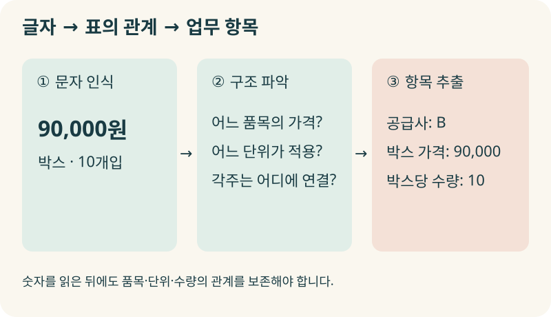
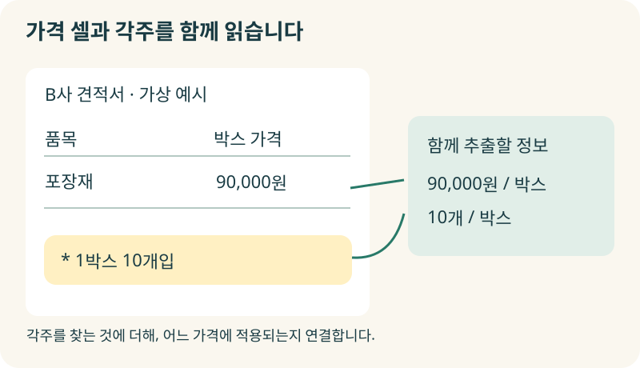
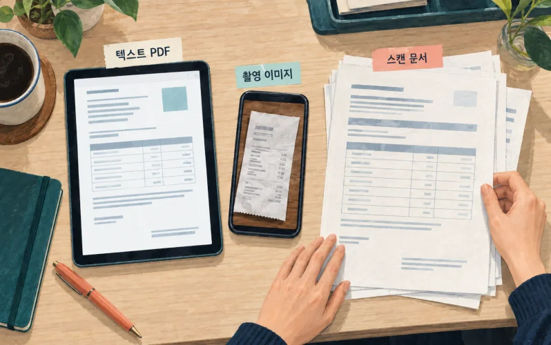
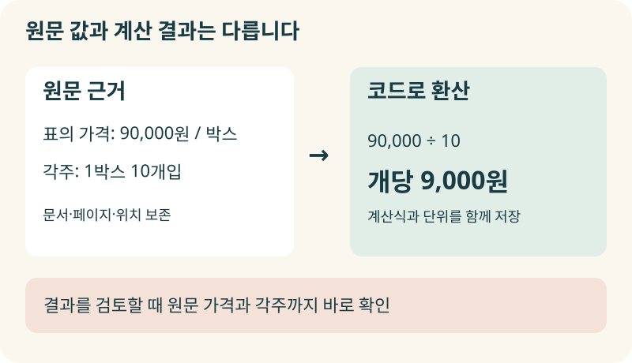
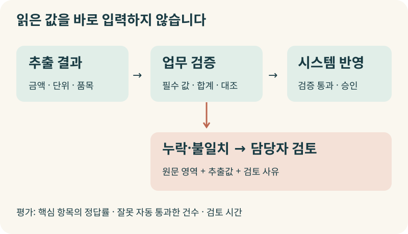

+++
date = '2026-09-23T00:00:00+09:00'
draft = false
title = '견적서는 제대로 줬는데, AI는 왜 비싼 곳을 추천할까?'
description = 'AI가 숫자를 정확히 읽고도 견적을 잘못 비교하는 이유는 무엇일까요? 문서 이해 AI의 원리와 송장·보험 업무 사례를 통해 표와 단위, 원문 근거를 실제 업무 데이터로 연결하는 방법을 살펴봅니다.'
tags = ['ax', 'ai', 'document-ai', 'ocr', 'document-processing']
authors = ['geoff']
featured_image = 'thumbnail.webp'
images = ['thumbnail.webp']
slug = 'document-ai'
audio = []
vedios = []
series = []
toc = true
+++

## 들어가며

구매 담당자가 두 공급사의 견적서를 AI에게 주었다고 생각해보겠습니다. 같은 규격의 포장재이고 운송비와 세금 등 다른 조건도 같습니다. 어느 곳이 저렴한지 비교해달라고 했더니 AI는 A사를 추천합니다.

> A사는 9,800원이고 B사는 90,000원이므로 A사가 저렴합니다.

그런데 담당자가 견적서를 다시 보니 B사의 가격은 10개가 들어 있는 한 박스 기준입니다.

| 공급사 | 견적서에 적힌 가격 | 가격 기준 | 개당 가격 |
|---|---:|---|---:|
| A | 9,800원 | 1개 | 9,800원 |
| B | 90,000원 | 1박스, 10개입 | 9,000원 |

개당 가격은 B사가 낮습니다. 이 가상의 상황에서 AI는 숫자를 틀리게 읽지도 않았습니다. 가격과 단위를 함께 해석하지 못한 겁니다. 담당자는 이미 정확한 견적서를 주었는데도 AI가 만든 비교표를 고치려고 원문을 다시 읽어야 합니다.

앞선 [구매 협상 AI 글](https://tech.epsilondelta.ai/posts/procurement-negotiation-ai/)에서는 회사의 기준 안에서 공급사와 조건을 조율하는 방법을 다뤘습니다. 이번에는 그보다 앞선 단계입니다. 협상을 맡기려면 우선 견적서에 무슨 조건이 적혀 있는지 정확히 알아야겠죠.

문서 이해 AI(Document AI)는 문서의 글자와 구조를 파악하고 업무에 필요한 정보를 추출하는 기술입니다. **실무에 쓰려면 숫자 옆의 단위와 조건까지 연결하고, 원문과 대조할 수 있도록 구성해야 합니다.** 송장과 보험 서류의 실제 도입 사례를 살펴보면서 우리 회사가 어디까지 자동 처리하고 어떤 문서를 사람이 확인해야 할지 알아보겠습니다.

## 글자를 읽었는데 문서는 잘못 이해할 수 있습니다

사진으로 찍은 영수증에서 글자를 읽어내는 OCR을 떠올리시면 이해하기 쉽습니다. OCR은 이미지 속 문자를 텍스트로 바꾸는 기술입니다. 90,000원을 정확히 인식했다면 그 단계의 일은 잘한 셈입니다.

견적서에서는 글자의 배치도 읽어야 합니다. 표의 맨 위에는 단가와 수량이라는 머리글이 있고 각 행에는 서로 다른 품목이 있습니다. 한 번만 적힌 단위가 표 전체에 적용되기도 합니다. 사람은 위치와 선, 묶음을 보면서 어느 숫자가 무엇을 뜻하는지 판단합니다.

문서 이해 AI에서도 이런 관계를 파악합니다. 문서의 제목·본문·표가 어디에 있는지 찾는 일을 레이아웃 분석이라고 합니다. 표에서는 행과 열, 여러 칸을 합친 병합 셀, 머리글의 적용 범위를 복원합니다. 그다음 공급사명·품목·단가·수량처럼 필요한 항목을 뽑습니다. Azure의 문서 분석 기능에서도 텍스트와 함께 표·선택 표시·문서 구조를 추출합니다. [Azure 문서 구조 분석](https://learn.microsoft.com/en-us/azure/ai-services/document-intelligence/prebuilt/layout?view=doc-intel-4.0.0)

처음의 견적서를 처리한다면 90,000이라는 숫자만 저장해서는 부족합니다. B사의 어느 품목인지, 박스 가격인지, 한 박스에 몇 개가 들어가는지까지 묶어야 개당 가격을 계산할 수 있습니다.

이 과정은 엑셀에서 머리글을 지우고 숫자만 복사해온 상황과 비슷합니다. 숫자가 모두 맞아도 어느 열이 수량이고 어느 열이 단가인지 모르면 계산할 수 없겠죠. AI에게 자료를 넘길 때도 문서의 구조를 잃지 않도록 해야 합니다.

## 표 밖의 작은 글씨가 금액을 바꿉니다

B사의 견적서를 조금 다르게 생각해보겠습니다. 표 안에는 품목과 90,000원만 있고 아래쪽에 ‘1박스 10개입’이라고 적혀 있습니다. 가격 셀만 추출하면 개당 환산에 필요한 수량을 놓칩니다.

‘운송비 별도’나 ‘특정 수량 이상 주문 시 적용’ 같은 각주도 마찬가지입니다. 문서 어딘가에서 이 문구를 찾아내는 것만으로는 충분하지 않습니다. 어느 품목과 가격에 적용하는 조건인지 연결해야 합니다.

표가 다음 페이지로 이어질 때도 문제가 생길 수 있습니다. 첫 페이지의 머리글과 단위를 떼어놓고 다음 페이지의 숫자만 읽으면 해석이 달라집니다. 상세 금액 아래에 소계가 있다면 둘을 모두 더하는 실수도 생각해볼 수 있겠죠.

그래서 문서를 검색용으로 잘게 나눌 때도 표의 머리글과 단위, 관련 각주를 함께 남기는 편이 좋습니다. 저장 단계에서 이 정보를 빠뜨렸다면 나중에 관련 문서를 잘 찾아와도 정확한 비교를 하기 어렵습니다.

원문에도 포장 수량이 없다면 어떻게 해야 할까요? AI가 보통 한 박스에 몇 개쯤 들어갈 것이라고 추정하게 두어서는 안 됩니다. **자료에 없는 값은 확인이 필요한 항목으로 남겨야 합니다.** 비어 있는 칸을 0이나 그럴듯한 숫자로 채우면 담당자는 어떤 정보가 누락됐는지부터 다시 찾아내야 합니다.

## 현장에서는 문서를 읽은 다음 일을 연결했습니다

### FibroGen은 송장 추출을 SAP 입력까지 연결했습니다

바이오 기업 FibroGen의 매입채무 담당자는 두 명이었습니다. Google Cloud와 FibroGen 담당자가 함께 작성한 2024년 사례에 따르면 월 약 1,000건의 송장을 받았고 한 건을 처리하는 데 평균 5분이 걸렸습니다. 이메일로 받은 PDF를 내려받아 SAP에 직접 입력하는 업무였습니다.

FibroGen은 Google Document AI의 Invoice Parser로 송장 정보를 추출하고 SAP Cloud Integration에서 업무 규칙을 적용해 SAP로 보내도록 구성했습니다. 정해둔 기준에 미달하는 송장은 담당자가 검토하도록 했습니다. 설계부터 운영 배포까지는 3개월 미만이 걸렸다고 설명합니다. [FibroGen 송장 처리 사례](https://cloud.google.com/blog/products/ai-machine-learning/reducing-invoice-processing-with-document-ai)

이 사례를 우리 회사에 대입해보면 구현할 일이 구체적입니다. AI가 읽은 값을 어느 시스템의 어떤 항목에 넣을지 정하고, 입력 전에 확인할 규칙과 사람에게 돌려보낼 기준을 만들어야 합니다. 추출 결과를 별도 화면에 띄워놓기만 하면 담당자가 SAP에 옮겨 적는 일은 그대로 남습니다.

### 보험 청구에서도 서류를 다시 입력하는 부담을 줄였습니다

AWS가 공개한 Anthem 사례에서는 청구 한 건에서 정보를 수작업으로 추출하는 데 평균 20분이 걸렸다고 합니다. 의료기관이 포털에 서류를 제출하면 저장소로 보내고 Amazon Textract를 활용한 처리 과정에서 정보를 추출·분류해 담당자가 사용할 수 있도록 했습니다. [Anthem의 보험 청구 서류 처리](https://aws.amazon.com/solutions/case-studies/anthem/)

보험 업무를 지원하는 Symbeo의 담당자는 AWS 고객 페이지에서 문서 처리 시간이 3분에서 1분 미만으로 줄었다고 설명합니다. 청구 처리에 필요한 데이터를 수집하는 업무를 자동화한 사례입니다. [Symbeo의 문서 처리 사례](https://aws.amazon.com/textract/customers/)

구매팀의 견적서든 보험사의 청구 서류든 사람이 문서를 받아 업무 시스템에 쓸 값으로 옮기는 과정이 있습니다. 그 과정에서 어떤 항목을 추출하고 무엇을 확인한 뒤 다음 담당자에게 넘기는지 살펴보면 문서 이해 AI를 적용할 업무를 찾기 쉽습니다.

## PDF를 통째로 AI에게 보여주면 안 될까요?

이미지를 볼 수 있는 AI에게 페이지를 보여주고 필요한 정보를 뽑게 하는 방법도 있습니다. 글자와 시각 정보를 함께 다루는 멀티모달 모델을 활용하는 방식입니다. 문서의 배치를 보면서 내용을 해석하게 할 수 있어 복잡한 문서를 다룰 때 검토할 만합니다.

개발팀은 업무에 맞춰 처리 방식을 선택합니다. OCR과 표 분석을 거쳐 항목을 추출할 수도 있고 시각·언어 모델이 페이지를 보고 정보를 추출하게 할 수도 있습니다. 정형 문서는 기존 파서로 처리하고 까다로운 구간만 다른 모델에 넘기는 구성도 가능합니다. 오픈소스 도구인 [Docling](https://github.com/docling-project/docling)에서도 OCR·표·읽기 순서 등을 다루는 문서 변환과 시각·언어 모델 기반 처리를 지원합니다.

어느 방식이든 실제로 받는 문서로 시험해봐야 합니다. 내용이 선명한 견적서 한 장과 표가 여러 페이지에 걸친 스캔 문서는 조건이 다릅니다. 같은 PDF 파일이라도 일부 페이지는 텍스트이고 나머지는 스캔 이미지일 수 있습니다.

저는 처음부터 모든 문서를 같은 방식으로 처리하기보다 입력 자료의 상태를 나누어 보는 편이 좋다고 생각합니다. 원본 스프레드시트를 받을 수 있다면 셀과 시트 구조를 활용하고, 흐릿한 사진이라면 원본을 다시 요청할 기준도 두는 겁니다. 모델을 바꾸는 것보다 입력 경로를 바꾸는 편이 간단한 경우도 있을 테니까요.

경영진이라면 우리 문서에서 필요한 항목을 얼마나 정확히 추출하는지 물어보면 좋겠습니다. 틀리거나 빠진 부분은 어떻게 찾아낼까요? 모델의 이름만으로는 이 질문에 답하기 어렵습니다.

## 9,000원이 어디에서 나온 값인지 남겨야 합니다

처음의 B사 견적서를 다시 보겠습니다. 개당 가격 9,000원은 문서에 직접 적힌 값이 아니라 90,000원을 10개로 나눈 결과입니다. 이 계산값만 남기면 나중에 검토하는 사람이 원문에서 9,000원을 찾다가 시간을 쓸 수 있습니다.

다음처럼 원문과 계산 결과를 구분해 저장하면 좋습니다. 아래는 앞의 가상 견적서에 적용한 예입니다.

| 구분 | 남길 내용 |
|---|---|
| 원문 가격 | 90,000원/박스 |
| 원문 수량 | 1박스 10개입 |
| 정리한 데이터 | 통화: 원, 박스 가격: 90,000, 박스당 수량: 10 |
| 계산 결과 | 개당 9,000원, 계산식: 90,000 ÷ 10 |
| 근거 위치 | 가격이 적힌 표의 셀과 포장 수량이 적힌 각주 위치 |

서로 다른 표기를 일정한 형식으로 맞추는 과정을 정규화라고 합니다. 원문을 지워버리고 정리한 값만 보관하기보다 둘을 연결해두어야 수정과 검토가 쉽습니다. Google Document AI도 지원하는 항목에 대해 원문에서 추출한 값과 정규화한 값을 구분해 제공합니다. [추출값의 정규화](https://docs.cloud.google.com/document-ai/docs/enrichment)

추출한 단가와 수량을 검증한 뒤에는 코드로 계산하도록 구성할 수 있습니다. 여러 견적서의 금액을 비교할 때마다 AI에게 암산을 맡길 필요는 없습니다. 대신 계산에 사용한 단위와 조건이 맞는지 확인해야겠죠.

담당자가 결과를 눌렀을 때 해당 문서의 페이지와 표, 각주를 바로 볼 수 있으면 좋겠습니다. 문서 전체를 첨부하는 것만으로는 어느 부분을 보고 판단했는지 찾는 일이 남습니다. 합계가 맞지 않아 검토 요청을 보냈다면 어떤 행을 더했고 어디에서 차이가 났는지도 함께 보여주어야 합니다.

## 정확도 하나로 자동 처리 범위를 정할 수 있을까?

문서에서 회사명과 주소, 날짜를 잘 읽어도 금액 하나를 틀리면 업무 결과가 달라집니다. 여러 항목의 평균 점수만 보면 이런 차이를 놓칠 수 있습니다.

Google Document AI의 평가 기능은 정답과 추출 결과를 비교해 항목별 정밀도와 재현율 등을 확인하도록 합니다. 정밀도는 추출한 항목 중 맞는 비율이고 재현율은 찾아야 할 항목 중 실제로 찾아낸 비율입니다. [문서 추출 결과 평가](https://docs.cloud.google.com/document-ai/docs/evaluate)

우리 회사에서는 단가·통화·수량처럼 업무 결과에 직접 영향을 주는 항목을 따로 평가하는 편이 좋습니다. 그 항목들을 모두 제대로 읽었는지, 계산과 대조까지 통과했는지, 잘못된 결과를 사람이 확인하지 않은 채 넘긴 적은 없는지도 봅니다.

모델이 반환하는 신뢰도 점수도 활용할 수 있지만 우리 문서의 실제 정답과 비교해 검토 기준을 정해야 합니다. 점수가 높더라도 빠진 단위나 잘못 연결한 품목 때문에 최종 판단이 틀릴 수 있기 때문입니다. AWS도 신뢰도와 업무의 민감도를 함께 고려하도록 안내합니다. [문서 처리 검토 기준](https://docs.aws.amazon.com/textract/latest/dg/textract-best-practices.html)

실무에서는 필수 항목이 빠졌는지 먼저 확인하고, 할인과 세금 등을 반영한 합계가 맞는지 계산하고, 공급사·품목·발주 내역과 대조하는 검사를 조합할 수 있습니다. 추출이 잘됐어도 다른 공급사의 거래에 넣으면 곤란하겠죠. 같은 문서를 두 번 받았을 때 중복 입력하지 않도록 하는 확인도 필요합니다.

첫 시험에는 평소 받는 문서와 함께 담당자가 자주 고쳤던 문서를 넣어보면 좋겠습니다. 여러 페이지의 표, 손으로 수정한 금액, 처음 보는 공급사 양식처럼 실제로 시간을 쓰는 자료입니다. 앞선 [AI Evals 글](https://tech.epsilondelta.ai/posts/what-are-ai-evals/)에서 다룬 것처럼 우리 업무의 정답과 실패 사례로 시험해야 자동 처리할 범위를 정할 수 있습니다.

성과도 문서를 읽는 속도와 담당자의 검토 시간을 함께 보아야 합니다. 추출은 빨라졌는데 직원이 모든 값을 원문과 다시 대조하고 있다면 아직 줄이지 못한 일이 많습니다.

## 나가며

견적서를 제대로 주었는데 AI가 비싼 공급사를 추천했다면, 숫자 인식부터 의심하는 것만으로는 원인을 찾지 못할 수 있습니다. 개당 가격과 박스 가격을 구분했는지, 표 아래 각주를 함께 읽었는지, 같은 기준으로 환산했는지까지 확인해야 합니다.

문서 이해 AI를 현업에 적용하다 보면 숙련자가 평소 어떤 기준으로 확인했는지도 알게 됩니다. 이 거래처는 포장 수량을 각주에 적는다는 사실을 알고 이 문서의 합계에는 운송비가 빠져 있다고 판단하는 겁니다. 수정 견적이 오면 이전 문서부터 제외하는 습관도 있겠죠. 이런 노하우를 추출 규칙과 검증 절차에 남기면 다음 직원과 에이전트가 다시 활용할 수 있습니다. 앞선 [암묵지 자산화 글](https://tech.epsilondelta.ai/posts/ax-tacit-knowledge-assetization/)에서 이야기한 일이 문서 처리에서도 필요합니다.

막상 구성하려면 문서 유형과 데이터 구조부터 정해야 합니다. 원문 근거를 연결하고 오류를 검증할 방법, 담당자가 수정할 화면, 사내 시스템에 반영할 권한과 승인 절차도 필요합니다. 운영하면서 양식이 바뀌거나 새로운 예외가 생겼을 때 누가 기준을 보완할지도 정해야 합니다. 현업의 문서를 이해하는 경험과 AI·업무 시스템을 연결하는 기술적인 노하우가 함께 필요한 일입니다.

우리 엡실론델타는 반복되는 문서 업무를 살펴보고 현업의 해석 기준을 정리하는 단계부터 문서 추출·검증, 에이전트와 사내 시스템 연결, 운영 개선까지 함께 도와드리겠습니다.

AI에게 문서를 맡겼는데 직원이 원문을 다시 읽고 숫자를 고치느라 바쁘다면 [contact@epsilondelta.ai](mailto:contact@epsilondelta.ai)로 연락 주세요. 최근 처리한 견적서나 송장 한 종류와 실제로 수정했던 항목부터 함께 살펴보겠습니다. 무엇을 자동으로 처리하고 어디에서 확인을 요청해야 할지, 우리 조직에서 문서를 다시 읽는 일을 줄일 방법을 찾아보겠습니다.
