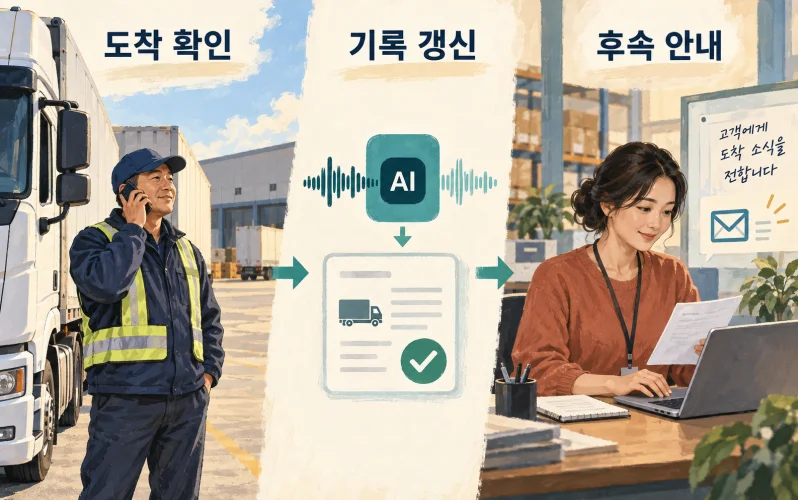
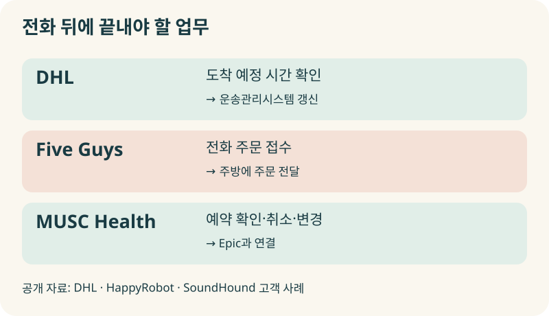
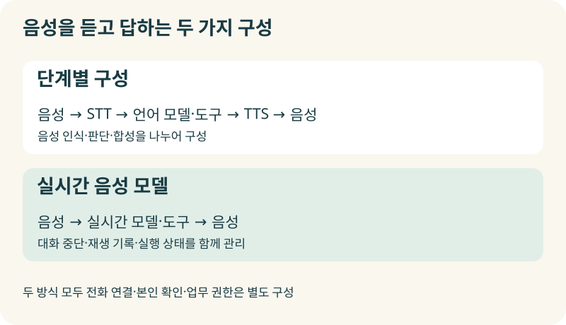
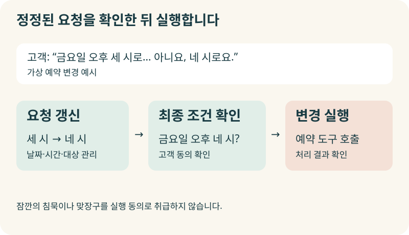
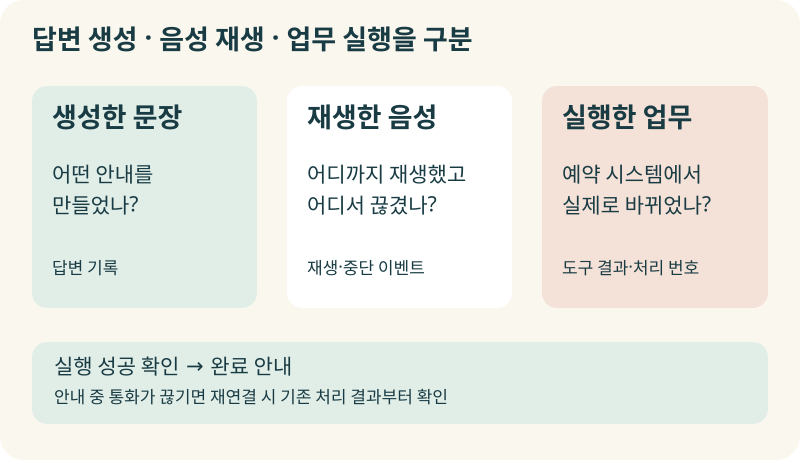
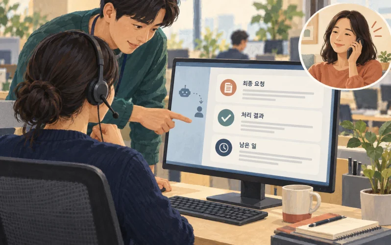
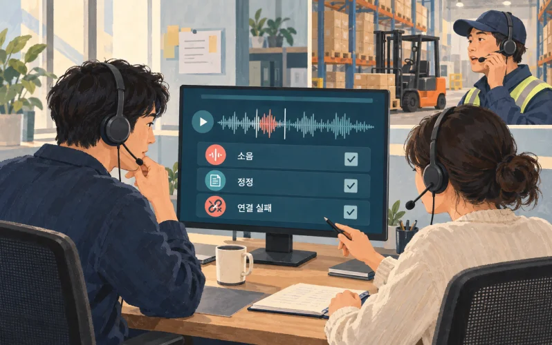
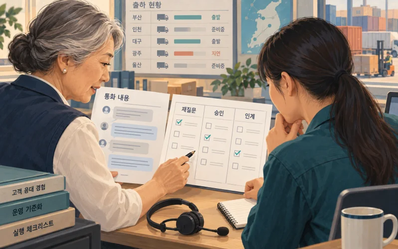

+++
date = '2026-09-24T00:00:00+09:00'
draft = false
title = '“확인하고 다시 전화드릴게요”를 하루 종일 반복하고 있다면'
description = '전화는 끝났는데 기록과 확인은 그대로 남아 있나요? DHL의 운송 확인, 음식점 전화 주문, 병원 예약 사례를 통해 음성 에이전트의 작동 원리와 실제 업무에 적용할 기준을 살펴봅니다.'
tags = ['ax', 'ai', 'agent', 'voice-agent', 'workflow']
authors = ['geoff']
featured_image = 'thumbnail.webp'
images = ['thumbnail.webp']
slug = 'voice-agent'
audio = []
vedios = []
series = []
toc = true
+++

## 들어가며

물류 운영팀의 오후를 상상해보겠습니다. 고객이 물건을 언제 받을 수 있는지 묻습니다. 담당자는 기사님에게 전화해 도착 예정 시간을 확인하고 창고에 연락해 그 시간에 하역이 가능한지 묻습니다. 확인한 내용을 시스템에 입력한 뒤 고객에게 다시 전화합니다.

> 확인했습니다. 말씀드린 시간에 도착할 예정입니다.

잠시 뒤 기사님에게 연락이 옵니다. 도로가 막혀 도착이 늦어질 것 같다고 합니다. 담당자는 창고에 다시 확인하고 기록을 고친 뒤 고객에게 변경 사항을 안내합니다. 그동안 다른 고객의 전화도 들어옵니다.

담당자는 누군가에게 묻고 다른 사람에게 확인하고 시스템에 적는 일을 계속합니다. 일을 못해서 바쁜 게 아닙니다. 통화 요약을 AI가 써주더라도 다음 확인 전화는 여전히 사람이 해야 합니다.

이번에 다룰 음성 에이전트(Voice Agent)는 이런 업무를 맡길 수 있는 방법입니다. 음성으로 요청을 주고받으며 필요한 정보를 조회하고, 허용된 작업을 실행하거나 담당자에게 넘기도록 구성합니다. **도입할 때는 말투가 얼마나 자연스러운지와 함께 통화 뒤의 일이 어디까지 끝나는지를 봐야 합니다.**

DHL의 운송 확인, 음식점의 전화 주문, 병원의 예약 지원 사례를 살펴보겠습니다. 사람의 말을 중간에 끊지 않으면서 정정된 요청을 반영하는 기술은 어떻게 구성하는지, 우리 회사에서는 무엇부터 맡길 수 있을지도 알아보겠습니다.

## 말을 잘하는 AI에게 일도 맡기려면

음성 에이전트라고 하면 기존 ARS를 떠올리실 수 있습니다. 번호를 누르는 메뉴 대신 자연스럽게 말하면 알아듣는 서비스 정도로 생각하기 쉽죠. 그런데 현업에서는 알아들은 뒤에 무엇을 하느냐가 중요합니다.

예약 시간을 바꾸려는 고객에게 운영시간을 안내하는 것과, 고객을 확인하고 빈 시간을 조회한 뒤 예약을 변경하는 것은 맡은 업무가 다릅니다. 후자를 하려면 예약 시스템에 연결하고 변경 권한과 확인 절차를 정해야 합니다. 기존 ARS에서도 조회나 처리를 지원할 수 있으므로 목소리의 차이만으로 구분하기보다 실행 범위를 살펴보는 편이 좋습니다.

음성 에이전트도 모든 요청을 직접 처리할 필요는 없습니다. 배송 상태는 조회해서 안내하고, 배송지 변경은 본인 확인을 거쳐 처리하고, 보상 요구는 담당자에게 넘기도록 나눌 수 있습니다. 회사가 정한 권한 안에서 대화와 실행을 연결하는 겁니다.

처음의 물류 업무라면 도착 예정 시간을 묻고 기록하는 일과 창고의 하역 일정을 바꾸는 일을 구분해야겠죠. 기사님이 늦는다고 말했다는 이유로 AI가 창고 일정을 마음대로 확정해서는 안 됩니다. 앞선 [AI 결재선 글](https://tech.epsilondelta.ai/posts/ai-agent-approval-workflows/)에서 다룬 실행 범위와 승인 기준이 전화 업무에도 필요합니다.

## 이미 현업에서는 어떤 전화를 맡기고 있을까?

### DHL은 확인 전화를 운영 기록에 연결했습니다

DHL은 2025년 공식 발표에서 HappyRobot의 AI 에이전트를 일정 예약, 운전자 후속 전화, 우선순위가 높은 창고 업무 조율에 활용한다고 밝혔습니다. 전화와 이메일을 처리하고 내부 시스템에 연결하는 구성입니다. [DHL의 도입 발표](https://group.dhl.com/en/media-relations/press-releases/2025/dhl-boosts-operational-efficiency-and-customer-communications-with-happyrobots-ai-agents.html)

HappyRobot의 상세 사례에는 운송사에 전화해 집하·배송 예상 도착 시간을 확인하고 운송관리시스템인 TMS를 갱신하는 흐름이 나옵니다. 사람이 통화한 뒤 내용을 옮겨 적던 업무를 함께 처리하는 방식입니다. [운송 확인과 TMS 갱신 사례](https://www.happyrobot.ai/customer-story/dhl)

우리 회사에서 전화가 자주 오가는 업무를 떠올려보면 비슷한 과정을 찾을 수 있습니다. 방문 시간을 확인하거나 자재 도착 여부를 묻는 통화입니다. 확인한 정보를 어디에 기록하고 누구에게 알려야 일이 끝나는지까지 정하면 자동화할 범위가 구체적으로 보입니다.

### 음식점에서는 놓치던 전화 주문을 받습니다

점심시간에 매장이 바쁘면 직원은 눈앞의 고객을 응대하면서 전화 주문까지 받아야 합니다. 전화를 받았어도 주문 내용을 잘못 전달하면 주방과 고객 모두 곤란해집니다.

SoundHound가 공개한 Five Guys 사례는 음성 AI가 전화 주문을 받고 주방에 전달하는 업무를 다룹니다. 공급사 발표에 따르면 첫해에 184,000건 이상의 전화 주문을 처리했고 2025년 AI가 접수한 전화 주문의 완료율은 92%였습니다. [Five Guys 전화 주문 사례](https://www.soundhound.com/resource/five-guys-ai-voice-assistant-processes-184-000-phone-orders-with-upsell)

음식점이 확인할 성과는 전화를 받은 건수에 그치지 않습니다. 메뉴와 옵션을 정확히 확인해 주방에 전달했는지, 직원이 다시 전화해서 주문을 고쳐야 했는지도 보아야 합니다. 전화 응답부터 실제 주문까지 한 업무로 연결할 때 효과를 평가할 수 있습니다.

### 병원 예약도 시스템의 상태가 바뀌어야 끝납니다

MUSC Health의 Emily는 Epic과 연결해 예약 확인·취소·일정 변경과 일반 문의 등을 지원합니다. SoundHound가 공개한 사례에 따르면 음성과 채팅을 합쳐 연간 220만 상호작용을 처리하는 규모로 운영합니다. [MUSC Health 예약 지원 사례](https://www.soundhound.com/resource/from-appointments-to-refills-musc-healths-expansion-of-ai-enabled-patient-access-capabilities-with-emily)

예약을 바꾸려는 사람은 자연스러운 안내도 중요하게 여기지만 원하는 시간으로 실제 예약이 바뀌었는지에 더 관심이 있습니다. 예약 시스템에서 처리 결과를 확인한 뒤 고객에게 정확히 안내하는 것까지 구성해야 합니다.

## 음성을 듣고 답하는 두 가지 구성

음성 에이전트는 어떻게 사람의 말을 처리할까요? 대표적인 구성은 음성을 텍스트로 바꾸는 STT, 요청을 해석하고 도구를 사용하는 언어 모델, 답변을 소리로 바꾸는 TTS를 연결하는 방식입니다. 음성 인식·판단·음성 합성을 나누어 구성합니다.

예를 들어 고객이 예약 변경을 요청하면 STT로 인식한 문장을 언어 모델에 전달합니다. 모델은 필요한 날짜와 시간을 확인하고 예약 조회 도구를 사용합니다. 조회 결과에 맞춰 만든 답변은 TTS로 읽어줍니다. 단계별로 어느 부분에서 문제가 생겼는지 살펴보고 구성 요소를 바꿀 수 있습니다.

음성을 직접 입력받고 음성으로 응답하는 실시간 모델을 쓰는 방법도 있습니다. LiveKit의 공식 문서에서는 이 방식과 STT–LLM–TTS 구성을 구분해서 설명합니다. [음성 모델 구성](https://docs.livekit.io/agents/models/)

| 구성 | 처리 방식 | 도입할 때 확인할 부분 |
|---|---|---|
| 단계별 구성 | 음성 인식 → 언어 모델·도구 → 음성 합성 | 인식 오류가 뒤의 판단에 미치는 영향과 단계 사이 지연 |
| 실시간 음성 모델 | 음성 입력 → 실시간 모델·도구 → 음성 출력 | 대화 중단, 실제 재생 내용, 도구 실행 상태의 일치 |

기술 선택은 실제 통화 환경에서 검증하면 됩니다. 어느 구성을 쓰든 회사의 전화 시스템과 연결하고 고객 확인·조회·수정 절차를 붙여야 합니다. 모델이 말을 잘 알아듣는다고 사내 시스템의 권한까지 알아서 정해주지는 않습니다.

## “세 시로… 아니요, 네 시로요”를 끝까지 들어야 합니다

음성 대화에서는 언제 답변을 시작할지도 문제입니다. 고객이 잠깐 숨을 고른 순간과 말을 끝낸 순간을 구분해야 하니까요.

고객이 이렇게 말했다고 생각해보겠습니다.

> 금요일 오후 세 시로… 아니요, 네 시로 바꿔주세요.

AI가 ‘세 시’까지만 듣고 바로 예약을 변경하면 뒤의 정정을 놓칩니다. 그렇다고 매번 오래 기다리면 고객은 전화가 끊겼다고 생각해 같은 말을 반복할 수 있습니다.

음성이 있는 구간을 탐지하는 기술을 VAD라고 합니다. 여기서 더 나아가 문맥 등을 활용해 상대의 발화가 끝났는지 판단하는 기능을 turn detection이라고 부릅니다. 상대가 AI의 말 도중 끼어들었을 때는 재생을 멈추고 새 말을 처리하는 기능도 필요합니다. LiveKit은 이런 발화 종료와 중단 처리 방법을 제공합니다. [대화 차례와 끼어들기 처리](https://docs.livekit.io/agents/logic/turns/)

예약 예시에서는 최종 날짜와 시간을 다시 확인하도록 구성하면 좋겠습니다. “이번 금요일 오후 네 시로 변경할까요?”라고 묻고 동의를 받은 뒤 실행하는 겁니다. 변경할 날짜·시간·예약 대상을 대화 기록과 별도로 관리하면 고객이 정정한 요청을 실행에 반영하기 쉽습니다.

맞장구도 구분해야 합니다. 설명을 듣다가 한 “네”를 예약 변경에 동의한 것으로 받아들이면 안 되겠죠. 회사가 정한 중요한 실행에는 구체적인 확인 질문과 그에 대한 응답을 연결해두어야 합니다.

응답 속도 역시 전체 과정을 봐야 합니다. AI가 곧바로 “잠시만요”라고 말했어도 예약 조회에 오래 걸린다면 고객은 여전히 기다립니다. 첫 음성이 나오기까지 걸린 시간과 요청한 일을 끝내기까지 걸린 시간을 나누어 측정하는 편이 좋습니다.

## AI가 말했다고 고객이 들은 것은 아닙니다

대화를 구현하다 보면 답변 생성과 실제 음성 재생 사이에도 차이가 생깁니다. AI가 긴 안내문을 만들었는데 고객이 중간에 말을 끊었다면 끝부분은 듣지 못했을 수 있습니다. 시스템이 생성한 문장 전체를 이미 전달한 것으로 기억하면 다음 대화부터 어긋나겠죠.

Twilio ConversationRelay는 고객이 끼어들었을 때 중단 시점까지의 발화와 시간을 이벤트로 전달합니다. 이런 정보를 사용해 재생을 어디까지 진행했는지 관리할 수 있습니다. [음성 재생 중단 이벤트](https://www.twilio.com/docs/voice/conversationrelay/websocket-messages)

실제 업무에서는 여기에 실행 상태를 함께 남기는 편이 좋습니다.

| 구분 | 예약 변경에서 확인할 내용 |
|---|---|
| 최종 요청 | 고객이 정정한 날짜·시간·대상 |
| 실행 동의 | 어떤 조건을 확인했고 고객이 어떻게 응답했는지 |
| 도구 결과 | 예약 시스템에서 변경을 완료했는지와 처리 번호 |
| 안내 상태 | 완료 안내를 재생했는지, 도중에 끊겼는지 |

예약 시스템이 실패를 반환했는데 AI가 “변경했습니다”라고 말해서는 안 됩니다. 결과를 확인하고 나서 완료를 안내하도록 순서를 정해야 합니다.

반대 상황도 있습니다. 예약은 바뀌었는데 완료 안내 중에 통화가 끊길 수 있습니다. 고객이 다시 전화했을 때 이전 처리 결과를 확인하지 않고 새 예약을 만들면 중복이 생깁니다. 앞선 [Durable Execution 글](https://tech.epsilondelta.ai/posts/durable-execution/)에서 다룬 상태 보존과 중복 실행 방지가 음성 에이전트에도 필요한 이유입니다.

## 상담원을 연결해도 고객이 처음부터 설명해야 한다면

자동 응대를 한참 거친 뒤 사람과 연결됐는데 다시 이름과 요청 내용을 설명해야 했던 경험이 있으실 겁니다. 음성 에이전트를 도입해도 인계할 내용을 정하지 않으면 같은 일이 반복될 수 있습니다.

사람에게 넘길 때는 고객의 최종 요청과 확인한 정보, 이미 처리한 일, 남은 문제를 함께 전달하면 좋겠습니다. 예약 변경을 시도하다 실패했다면 단순히 예약 문의라고 요약하지 말고 어느 예약을 언제로 바꾸려 했고 시스템에서 어떤 결과를 받았는지 알려줘야 합니다.

담당자에게 먼저 내용을 설명한 뒤 고객을 연결하는 방식을 warm transfer라고 합니다. LiveKit의 구현 문서에서는 고객을 대기시키고 담당자에게 맥락을 전달한 뒤 연결하는 절차를 설명합니다. 담당자가 응답하지 않으면 고객에게 돌아가 상황을 안내할 수도 있습니다. [맥락을 전달하는 통화 인계](https://docs.livekit.io/telephony/features/transfers/warm/)

담당자가 받지 않는 상황까지 정해두어야 합니다. 다른 담당자를 찾을까요, 콜백을 접수할까요? 언제까지 연락할 수 있는지도 운영 기준으로 정해두면 AI가 사실에 맞게 안내할 수 있습니다. 연결하겠다고 말한 뒤 고객을 대기 상태로 남겨두면 인계를 마친 것이 아닙니다.

## 우리 회사 전화로 시험해볼 것들

조용한 방에서 주고받는 데모 통화만으로 도입을 결정하기는 어렵습니다. 창고의 소음, 낯선 지점명, 천천히 말하는 고객, 중간에 요청을 바꾸는 상황을 실제 업무에 맞춰 시험해봐야 합니다.

처음의 도착 시간 확인이라면 기사님의 말을 정해진 시각으로 확인하는 과정부터 살펴보면 좋겠습니다. “삼십 분쯤 걸릴 것 같아요”라는 예상과 “오후 세 시 도착입니다”라는 말을 구분하고, 어느 날짜·어느 운송 건의 정보인지 연결하는 겁니다.

저는 첫 도입에서는 반복 확인 업무 하나를 좁게 고르는 편이 좋다고 생각합니다. 필요한 정보와 완료 조건을 정한 뒤 다음과 같은 상황을 시험할 수 있습니다.

| 시험 상황 | 확인할 처리 |
|---|---|
| 소음 때문에 시간이나 주소가 불명확함 | 추측해 저장하지 않고 되묻거나 다른 채널로 확인 |
| 고객이 말 도중 날짜를 정정함 | 마지막으로 확인한 날짜로 실행 |
| 조회·변경 시스템이 응답하지 않음 | 완료를 약속하지 않고 대기·실패·인계 절차 진행 |
| 작업 직후 통화가 끊김 | 다시 연결됐을 때 기존 결과 확인 |
| 사람이 필요하지만 담당자가 받지 않음 | 고객에게 상황 안내와 후속 연락 방법 제공 |

통화 시작 때는 AI의 역할과 목적을 알리고 사람이 필요할 때 도움받을 경로를 마련하는 편이 좋습니다. 개인정보를 조회하거나 변경하는 업무에는 별도 본인 확인과 권한 검사가 필요합니다. 녹음과 전사 기록을 어디에 얼마나 보관하고 누가 볼지도 정해야 합니다.

먼저 전화를 거는 업무라면 연락 대상과 목적, 재시도 횟수도 운영 기준에 넣습니다. 연결되지 않았다는 이유로 계속 전화하거나 수신을 원하지 않는 상대에게 반복 발신하지 않도록 해야겠죠.

성과는 통화 건수보다 실제 완료한 업무와 다시 처리한 일을 함께 보면 좋겠습니다. AI가 많은 전화를 받았어도 직원이 뒤에서 기록을 고치고 다시 연락해야 한다면 줄이지 못한 일이 남아 있습니다. 비용도 분당 음성 처리비에 더해 전화망·모델·시스템 연동·현업 검토까지 포함해 업무 한 건 기준으로 비교해야 합니다.

## 나가며

처음의 물류 담당자가 바빴던 이유는 통화 자체만이 아니었습니다. 도착 시간을 확인하고 창고와 조율한 뒤 시스템을 고치고 고객에게 안내해야 했습니다. 음성 에이전트에 맡길 업무도 이 흐름 안에서 찾아야 합니다.

현업 담당자는 상대의 말을 듣고 다시 물어봐야 할 때를 압니다. 일정 변경을 바로 기록해도 되는지, 다른 부서의 확인이 필요한지도 판단합니다. 이런 판단을 재질문·승인·인계 규칙으로 남기면 직원과 에이전트가 같은 기준으로 일할 수 있습니다. 앞선 [암묵지 자산화 글](https://tech.epsilondelta.ai/posts/ax-tacit-knowledge-assetization/)에서 다룬 노하우가 전화 업무에도 쌓여 있는 셈입니다.

실제로 구성하려면 음성 인식과 대화 모델만 연결해서는 부족합니다. 전화 시스템과 사내 도구를 잇고 정정된 요청을 반영해야 합니다. 실행 결과를 확인하고 사람이 이어받을 절차도 만들어야 합니다. 실제 통화에서 발견한 예외를 운영 중에 보완하는 일도 남습니다. 현업을 이해하는 경험과 실시간 음성·에이전트·업무 시스템을 다루는 기술적인 노하우가 함께 필요한 일입니다.

우리 엡실론델타는 반복 전화 업무를 살펴보고 현업의 판단 기준을 정리하는 단계부터 음성 에이전트 구현, 사내 시스템 연결, 검증과 운영까지 함께 도와드리겠습니다.

직원들이 하루 종일 “확인하고 다시 전화드릴게요”를 반복하고 있다면 [contact@epsilondelta.ai](mailto:contact@epsilondelta.ai)로 연락 주세요. 자주 하는 확인 전화 한 종류와 통화 뒤에 처리하는 일부터 함께 살펴보겠습니다. 어디까지 AI에게 맡기고 언제 사람이 이어받아야 할지, 우리 조직에 맞는 방법을 찾아보겠습니다.
