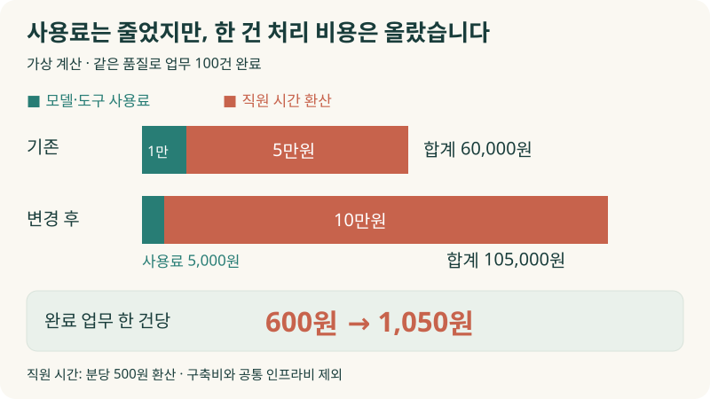
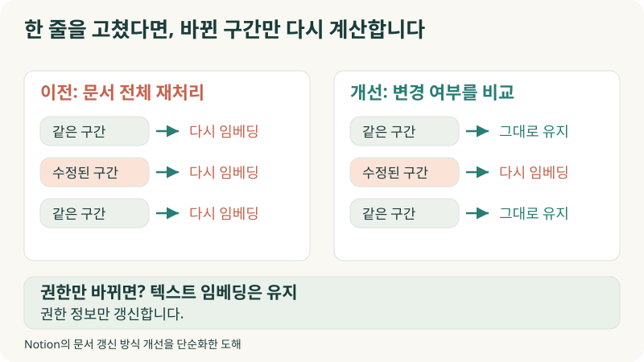
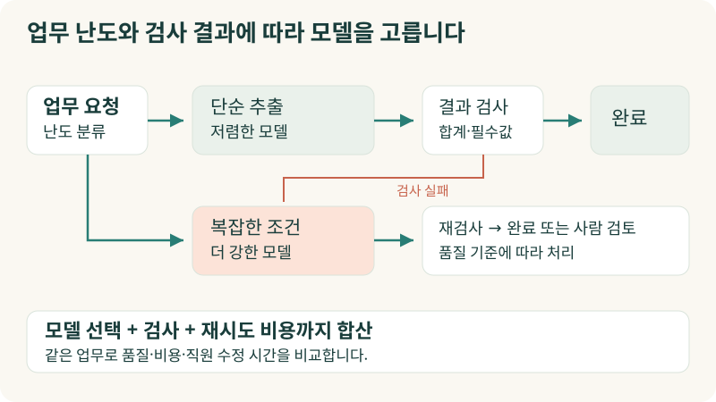
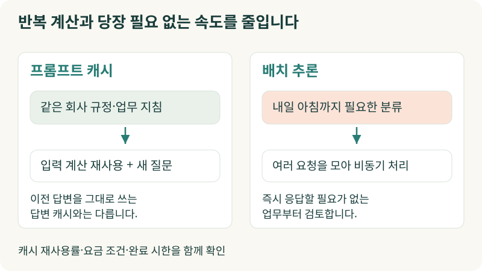
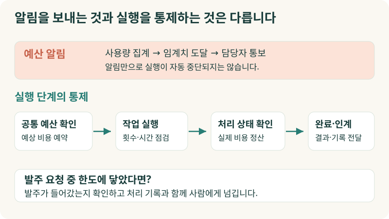
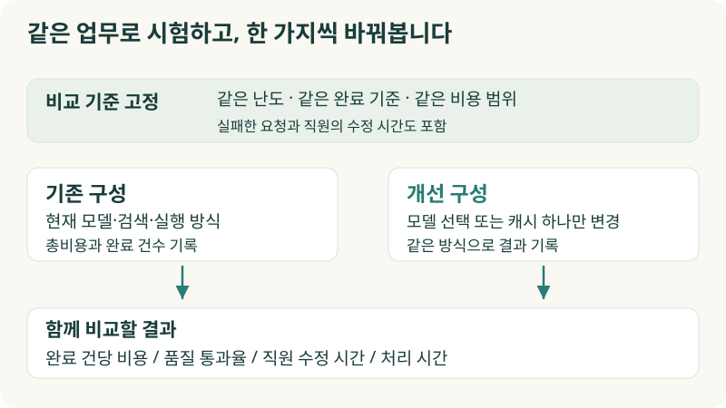

+++
date = '2026-09-28T00:00:00+09:00'
draft = false
title = '싼 AI로 바꿨는데, 왜 일하는 데 돈이 더 들까요?'
description = 'AI 사용료는 절반으로 줄었는데 직원의 수정 시간이 늘었다면 정말 절약한 걸까요? Notion의 비용 개선 사례와 모델 선택·캐시·예산 통제를 통해 AI FinOps를 우리 회사 업무에 적용하는 방법을 살펴봅니다.'
tags = ['ax', 'ai', 'finops', 'agent', 'cost-optimization']
authors = ['geoff']
featured_image = 'thumbnail.webp'
images = ['thumbnail.webp']
slug = 'ai-finops'
audio = []
vedios = []
series = []
toc = true
+++

## 들어가며

이런 상황을 상상해보겠습니다. 구매팀은 AI로 견적서를 읽고 거래처별 비교표를 만듭니다. 사용량과 요금이 함께 늘자 개발팀이 더 저렴한 모델로 바꿨습니다. 다음 달 AI 사용료는 절반으로 줄었습니다.

그런데 구매 담당자는 야근을 합니다. 할인 조건을 놓치거나 배송비를 다른 항목에 넣는 일이 잦아져 원본과 비교표를 다시 대조하고 있습니다.

> AI 비용을 줄였다고 들었는데, 저는 고칠 게 더 늘었어요.

개발팀은 사용료를 보고 절약했다고 말합니다. 구매팀은 수정 시간을 보고 일이 늘었다고 말합니다. 둘 다 자기 업무에서 벌어진 일을 정확하게 보고한 겁니다. 그렇다면 회사는 돈을 아낀 걸까요?

**AI FinOps는 AI에 쓴 돈을 업무 성과와 함께 관리하는 방법입니다.** 모델을 한 번 부르는 가격뿐 아니라, 쓸 수 있는 결과를 얻기까지 얼마가 들었는지 따집니다. 그래야 싼 모델로 바꿀 일과 더 좋은 모델에 돈을 쓸 일을 구분할 수 있습니다.

이번 글에서는 업무 한 건의 비용을 계산하는 방법부터 실제 기업의 비용 개선 사례, 모델 선택과 캐시, 예산 통제까지 살펴보겠습니다. AI 청구서를 받고 “왜 이렇게 많이 나왔지?”라고 묻기 전에 우리 회사에서 확인할 것들입니다.

## 사용료는 반값인데, 한 건 처리 비용은 올라갔습니다

FinOps Foundation은 기술·재무·현업이 함께 기술 지출과 사업 가치를 관리하는 운영 체계를 설명하며 AI도 별도 관리 대상으로 다룹니다. 외부 모델의 API 사용료부터 AI 서비스 구독료, 자체 운영 인프라까지 포함합니다. 여기서 다룰 AI FinOps는 AI를 써서 회계 업무를 자동화한다는 뜻이 아니라, AI에 쓰는 비용을 관리한다는 뜻입니다. [FinOps for AI](https://www.finops.org/framework/technology-categories/ai/)

앞의 견적서 업무를 숫자로 바꿔보겠습니다. 아래는 설명을 위한 가상 계산입니다. 같은 난도의 업무 100건을 처리하고 직원이 필요한 수정을 마쳐 모두 같은 품질 기준을 통과했다고 가정했습니다. 직원 시간은 분당 500원으로 환산했습니다.

| 비교 항목 | 기존 구성 | 저렴한 모델로 바꾼 구성 |
|---|---:|---:|
| 모델·도구 사용료, 재시도 포함 | 10,000원 | 5,000원 |
| 직원 검토·수정 시간 | 100분 | 200분 |
| 직원 시간을 비용으로 환산 | 50,000원 | 100,000원 |
| 위 비용의 합계 | 60,000원 | 105,000원 |
| 품질 기준을 통과한 업무 | 100건 | 100건 |
| 업무 한 건당 비용 | 600원 | 1,050원 |

사용료만 보면 절반으로 줄었습니다. 직원의 시간을 함께 계산하면 한 건에 600원이던 업무가 1,050원이 됐습니다. 비교를 단순하게 하려고 구축비와 공통 인프라비는 뺐습니다. 실제 도입을 판단할 때는 이 비용도 같은 범위로 포함해 봐야 합니다.

이때 “업무를 끝냈다”는 기준부터 정해야 합니다. 비교표 파일을 만들었으면 완료일까요? 아니면 구매 담당자가 금액과 조건을 확인하고 거래처를 고를 수 있어야 완료일까요? 전자를 기준으로 삼으면 AI가 틀린 표를 빨리 만들어도 생산성이 높아 보입니다.

실패한 시도에 쓴 돈도 비용에 넣습니다. 같은 견적서를 세 번 다시 읽었다고 업무 세 건을 처리한 것으로 세지는 않습니다. 사람이 고쳐서 끝낸 건을 완료 건수에 넣었다면 그 수정 시간도 계산합니다. 자동으로 끝난 건과 사람이 마무리한 건을 나눠 보면 비용이 변한 이유를 찾기 쉽습니다.

직원 시간을 줄이면 다른 일을 할 여유가 생깁니다. 이 여유와 실제 급여 지출이 줄어드는 것은 구분해서 판단하면 됩니다. 경영진은 청구서에 적힌 금액만으로는 판단하기 어렵습니다.

## Notion은 바뀌지 않은 문서를 다시 계산하고 있었습니다

사내 문서를 검색해 답하는 AI를 운영하면 답변을 생성할 때만 돈이 드는 게 아닙니다. 검색할 문서를 준비하고 갱신하는 데도 비용이 듭니다.

Notion은 문서를 여러 구간으로 나누고 각 구간을 의미 검색에 쓸 숫자 데이터로 변환합니다. 이를 임베딩이라고 합니다. 이전에는 문서의 한 글자만 바뀌어도 그 문서의 모든 구간을 다시 임베딩하고 검색 데이터베이스에 올렸습니다.

Notion은 텍스트와 부가 정보의 변경 여부를 따로 비교하도록 바꿨습니다. 텍스트가 바뀐 구간만 다시 계산하고, 접근 권한만 바뀌었다면 임베딩을 건너뛰고 권한 정보만 갱신했습니다. 이 변경으로 데이터 처리량을 70% 줄여 임베딩 API와 데이터베이스 쓰기 비용을 낮췄다고 설명합니다. [Notion의 기술 블로그](https://www.notion.com/blog/two-years-of-vector-search-at-notion)

Notion은 이런 개선과 인프라 변경을 거치며 2년 동안 벡터 검색 인프라를 10배 규모로 확장하면서 해당 인프라 비용을 90% 줄였다고 발표했습니다.

우리 회사에서도 살펴볼 만한 부분입니다. 상품 설명 한 줄을 고쳤는데 전체 상품을 다시 분석하고 있지는 않을까요? 계약서의 담당자 이름만 바뀌었는데 모든 조항을 처음부터 다시 검토하고 있지는 않을까요? 모델 가격표를 비교하기 전에, 같은 일을 불필요하게 반복하는 구간부터 찾아볼 수 있습니다.

## 모든 일을 가장 싼 모델에 맡기면 절약할 수 있을까요?

구매팀에서도 거래처 이름을 분류하는 일과 복잡한 할인 조건을 해석하는 일을 같은 난도로 보지는 않습니다. AI도 업무에 따라 모델을 나눠 쓸 수 있습니다.

견적서에서 거래처명과 발행일을 뽑는 일은 비교적 저렴한 모델에 맡기고, 여러 문서에 흩어진 조건을 비교하는 일은 더 강한 모델에 맡기는 식입니다. 요청의 성격을 보고 모델을 고르는 방식을 모델 라우팅이라고 부릅니다. Amazon Bedrock도 이런 기능을 제공하며 품질과 비용, 응답 시간을 함께 평가하도록 안내합니다. [모델 라우팅 설명](https://aws.amazon.com/blogs/machine-learning/use-amazon-bedrock-intelligent-prompt-routing-for-cost-and-latency-benefits/)

처음에는 저렴한 모델로 처리하되 검사를 통과하지 못한 요청만 더 강한 모델로 넘길 수도 있습니다. 예를 들어 견적서의 품목별 금액을 더한 값과 합계가 맞지 않으면 다시 확인하도록 만드는 겁니다. “제가 정확히 읽었습니다”라는 AI의 대답보다 실제 금액을 계산해보는 편이 확인에 도움이 됩니다.

다만 같은 요청을 저렴한 모델에 여러 번 보낸 뒤 결국 비싼 모델로 처리한다면 비용이 더 들 수 있습니다. 모델을 고르는 데 쓴 비용과 검사 비용도 더해 비교해야 합니다.

그래서 실제 업무 샘플로 시험하는 과정이 필요합니다. 평범한 견적서뿐 아니라 할인과 예외 조건이 많은 견적서도 넣고, 품질 기준을 통과한 비율과 직원의 수정 시간까지 확인합니다. 앞선 [AI Evals 글](https://tech.epsilondelta.ai/posts/what-are-ai-evals/)에서 다룬 평가가 모델 선택의 경제성 판단에도 쓰이는 셈입니다.

## 같은 내용을 매번 읽히고, 모든 답을 즉시 받고 있지는 않나요?

회사 규정이 길다고 가정해보겠습니다. AI에게 질문할 때마다 같은 규정과 업무 지침을 함께 전달합니다. 질문은 달라도 앞부분은 대부분 같습니다.

프롬프트 캐시를 쓰면 반복되는 입력을 처리할 때 이전 계산을 재사용할 수 있습니다. 변하지 않는 규정과 지침은 앞에 두고 이번 질문이나 문서처럼 매번 바뀌는 내용은 뒤에 두는 구성이 유리합니다. 실제 절약 폭은 캐시가 재사용된 비율, 저장·읽기 요금과 유지 시간에 따라 달라집니다. [Amazon Bedrock의 프롬프트 캐시 설명](https://docs.aws.amazon.com/bedrock/latest/userguide/prompt-caching.html)

여기서 재사용하는 것은 예전에 만든 답변이 아니라 입력을 처리한 계산입니다. 지난번 답변을 그대로 돌려주는 답변 캐시는 별도로 생각해야 합니다. “이 상품의 가격은 얼마인가요?”에 어제 가격을 답하거나 다른 직원의 권한으로 조회한 내용을 보여주면 안 되기 때문입니다. 답변을 저장해 재사용하려면 가격이나 규정이 바뀌었을 때 지우는 기준과 사용자 권한까지 살펴야 합니다.

응답을 언제 받아야 하는지도 비용과 관계가 있습니다. 고객과 통화하는 AI는 바로 답해야 하지만 다음 날 아침까지 필요한 문서 분류는 모아서 처리할 수 있습니다. 이런 작업에는 여러 요청을 비동기로 처리하는 배치 추론을 검토할 수 있습니다. 지원 모델과 요금 조건에 맞춰 실시간 처리와 비교하면 됩니다. [배치 추론 안내](https://docs.aws.amazon.com/bedrock/latest/userguide/batch-inference.html)

실무에서는 “얼마나 빨라야 하나요?”라는 질문을 빼먹기 쉽습니다. 당장 쓰지 않을 결과까지 전부 즉시 생성하고 있다면 그 속도에 얼마를 쓰는지 확인해볼 만합니다.

## 청구서는 한 장인데, 누가 무슨 일에 썼는지 모릅니다

여러 부서가 같은 AI 서비스를 쓰면 월말에 총액만 남기 쉽습니다. 견적서 비교가 늘어서 요금이 오른 것인지, 개발팀의 실험 때문인지, 특정 에이전트가 같은 검색을 반복했는지 구분하기 어렵습니다.

업무를 시작할 때 식별번호를 붙이고 그 번호에 모델 호출과 도구 사용 기록을 모으면 한 건의 처리 과정을 따라갈 수 있습니다. 견적서 한 건을 읽고, 계산기를 실행하고, 오류가 나서 다시 읽었다면 세 기록을 같은 업무에 묶는 겁니다. 여기에 부서와 업무 종류, 사용한 모델, 입력·출력 사용량, 처리 결과를 남깁니다. 직원이 검토한 시간도 해당 업무에 연결해 따로 집계할 수 있습니다.

공급사 청구액과 직원 시간을 환산한 비용은 구분해 보관하고 비교 목적에 맞게 합칩니다. 실제 지출과 내부 평가 금액을 처음부터 섞으면 재무팀이 청구서와 맞춰보기 어렵습니다. 공용 서버나 서비스 구독료도 사용량에 따라 나눌지, 공통비로 둘지 기준을 정해두면 됩니다.

이 일은 개발팀 혼자 정하기 어렵습니다. 개발팀은 사용량과 실행 과정을 알고, 현업은 결과를 실제로 쓸 수 있는지 판단하며, 재무팀은 비용 범위와 배분 기준을 정합니다. FinOps X 2026에서 SAP 담당자들이 공유한 내용도 글로벌 AI FinOps의 지표와 거버넌스, 운영 경험이었습니다. AI 지출을 조직 차원에서 관리하는 문제로 다룬 것입니다. [FinOps Foundation의 행사 요약](https://www.finops.org/insights/finops-x-2026-day-1-keynote/)

부서별 요금을 나눠 청구하는 데서 끝내지는 않았으면 합니다. 청구서를 받은 부서장이 사용량부터 줄이라고 하면 유용한 업무도 멈출 수 있습니다. 어떤 업무에 돈을 썼고 그만큼 어떤 결과를 얻었는지 함께 보여줘야 부서장도 다음 결정을 할 수 있습니다.

## “예산 초과 알림”만 켜두면 에이전트가 멈출까요?

밤새 에이전트가 검색과 재시도를 반복했다고 해보겠습니다. 아침에 예산 초과 메일을 확인했을 때는 이미 요금이 발생한 뒤입니다.

알림용 예산 설정은 지출을 자동으로 막는 장치와 다릅니다. Google Cloud도 알림용 예산을 설정하는 것만으로 사용이나 지출이 자동 제한되지는 않는다고 안내합니다. [예산 알림 안내](https://docs.cloud.google.com/billing/docs/how-to/budgets)

에이전트를 운영한다면 업무 한 건에서 허용할 모델 사용량, 도구 호출 횟수, 실행 시간 같은 한도를 따로 정할 수 있습니다. 한도에 가까워졌을 때 지금까지 확인한 내용을 저장하고 담당자에게 넘기거나 추가 실행 승인을 받도록 구성하는 겁니다.

여러 에이전트가 동시에 일할 때는 공통 예산도 함께 확인해야 합니다. 각자 “아직 예산이 남았다”고 판단한 뒤 동시에 호출하면 합계는 한도를 넘을 수 있습니다. 실행 전에 예상 사용분을 예약하고 작업이 끝난 뒤 실제 사용량으로 정산하는 방식을 고려할 수 있습니다.

멈추는 방법도 업무에 맞춰야 합니다. 발주 등록을 요청한 뒤 응답을 기다리는 중이라면 예산이 찼다고 무작정 종료할 수는 없습니다. 이미 발주가 들어갔는지 확인하고, 어디까지 처리했는지 남긴 뒤 사람에게 넘겨야 다음 담당자가 중복 발주를 피할 수 있습니다. 비용 한도를 정할 때 이런 후속 확인까지 고려해야 합니다.

## 우리 회사에서는 어떤 업무부터 계산해볼까요?

처음부터 전사 AI 지출을 완벽하게 나누려다 보면 기준만 정하다 시간이 다 갑니다. 반복량이 많고 완료 여부를 판단할 수 있는 업무 하나를 고르는 편이 시작하기 좋습니다. 견적서 비교, 고객 문의 처리, 사내 문서 검색처럼 현업이 결과를 확인할 수 있는 업무입니다.

먼저 지금 구성으로 같은 기간의 업무를 모읍니다. 총비용과 완료 건수, 직원이 고친 비율, 수정 시간, 처리 시간을 함께 봅니다. 실패한 요청도 포함합니다. 그다음 모델 선택이나 캐시처럼 바꿀 부분 하나를 정해 비교합니다. 여러 가지를 한꺼번에 바꾸면 무엇 때문에 좋아졌는지 알기 어렵습니다.

비교할 때는 품질 기준과 업무 난도를 맞춰야 합니다. 지난달에는 복잡한 견적서가 많았고 이번 달에는 단순한 견적서만 들어왔다면 단가가 내려갔다는 숫자만으로 모델 교체 효과를 판단하기 어렵습니다.

저는 “이번 달 AI 비용이 얼마나 줄었습니까?” 다음에 이 질문도 붙이면 좋겠습니다.

> 같은 품질로 업무 한 건을 끝내는 데 드는 비용과 시간은 어떻게 달라졌습니까?

사용자가 늘고 처리한 업무도 늘었다면 총지출이 올라갈 수 있습니다. 한 건을 처리하는 비용이 내려가고 현업이 쓸 만한 결과를 더 많이 얻었다면 사업 확대로 볼 여지가 있습니다. 반대로 총지출은 그대로인데 직원이 고치는 시간이 늘었다면 손볼 곳이 생긴 겁니다.

## 나가며

처음의 구매팀으로 돌아가 보겠습니다. 회사에 필요한 것은 저렴한 모델을 썼다는 보고보다 구매 담당자가 믿고 사용할 비교표입니다. 그 결과를 얻기 위해 모델에 얼마를 쓰고, 데이터를 얼마나 다시 처리하고, 직원이 얼마나 확인했는지를 알아야 비용을 줄일 방법도 찾을 수 있습니다.

AI FinOps를 하다 보면 현업의 판단 기준을 구체적으로 물어야 합니다. 어떤 견적서는 자동 처리해도 되는지, 어떤 할인 조건은 꼭 사람이 확인해야 하는지, 어느 정도 기다려도 되는지 같은 기준입니다. 숙련자가 경험으로 판단하던 내용을 정리해야 모델을 나눠 쓰고 검사와 승인 절차도 구현할 수 있습니다. 앞선 [암묵지 자산화 글](https://tech.epsilondelta.ai/posts/ax-tacit-knowledge-assetization/)에서 다룬 일이 여기서는 업무 품질과 비용을 관리하는 기준이 됩니다.

실제 구성에는 손이 많이 갑니다. 여러 서비스에 흩어진 사용량을 업무별로 묶고 품질 평가를 붙여야 합니다. 모델과 검색 구성을 바꿔 비교하고, 예산을 넘기기 전에 안전하게 멈추거나 사람에게 넘기는 절차도 만들어야 합니다. 현업의 업무를 이해하는 일과 에이전트를 구현하고 운영하는 기술이 함께 필요합니다.

우리 엡실론델타는 업무별 AI 비용을 진단하고 현업의 판단 기준을 평가·모델 선택·검토 절차에 반영하는 일부터 운영까지 함께 도와드릴 수 있습니다. AI 요금은 늘었는데 무엇이 좋아졌는지 설명하기 어렵거나, 비용을 줄인 뒤 직원의 수정 업무가 늘었다면 [contact@epsilondelta.ai](mailto:contact@epsilondelta.ai)로 연락 주세요. 반복해서 처리하는 업무 하나부터 함께 살펴보겠습니다. 어디에 돈과 시간이 들고 있는지 확인하고, 우리 회사에 맞는 품질과 비용의 기준을 찾아보겠습니다.
