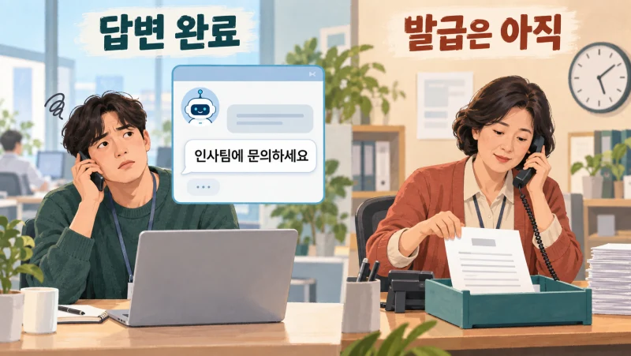
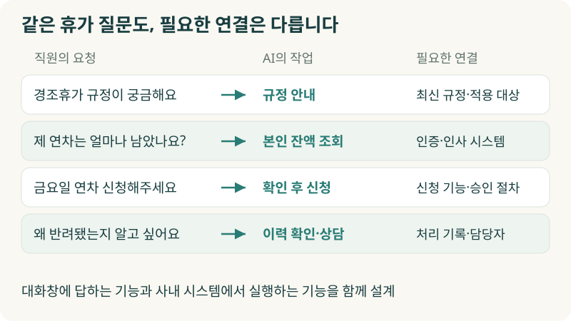
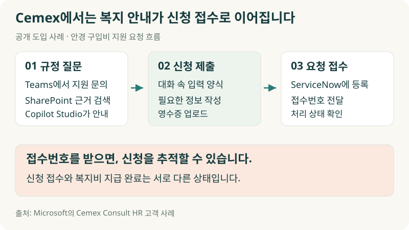
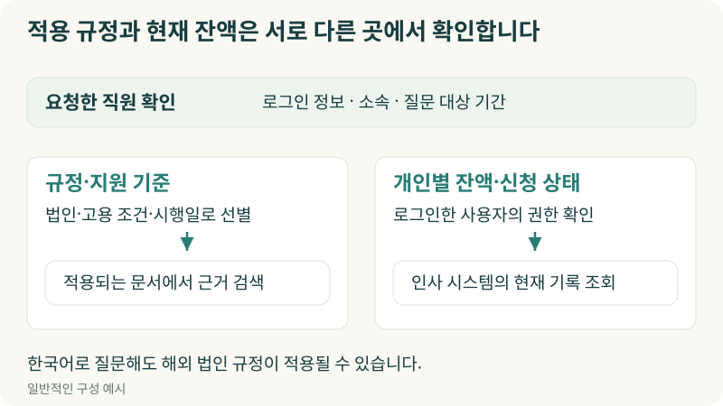
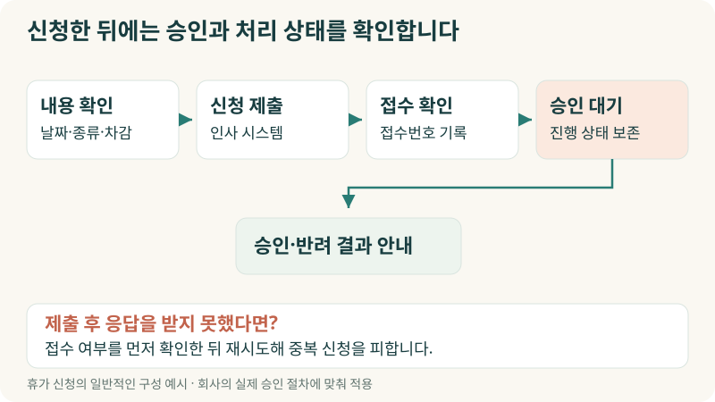
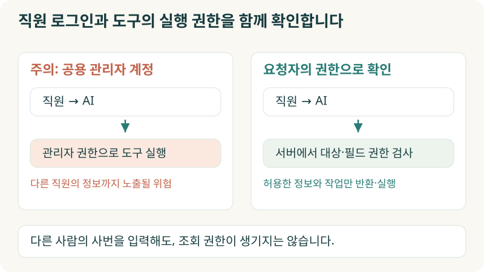
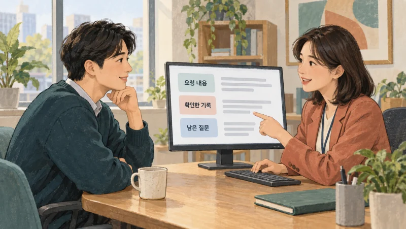
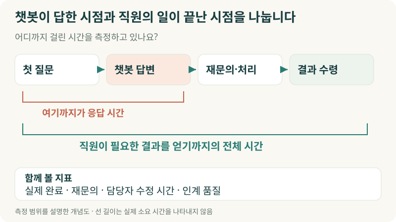

+++
date = '2026-09-29T00:00:00+09:00'
draft = false
title = '“인사팀에 문의하세요”로 끝나는 AI, 직원은 또 기다립니다'
description = 'HR 챗봇이 답했는데 직원은 왜 인사팀에 다시 전화할까요? Cemex·IBM·Microsoft 사례를 통해 규정 안내를 실제 신청·조회·상담으로 연결하는 HR AI의 기술과 도입 기준을 살펴봅니다.'
tags = ['ax', 'ai', 'hr', 'agent', 'workflow']
authors = ['geoff']
featured_image = 'thumbnail.webp'
images = ['thumbnail.webp']
slug = 'hr-ai'
audio = []
vedios = []
series = []
toc = true
+++

## 들어가며

이런 상황을 상상해보겠습니다. 회사가 인사팀의 반복 문의를 줄이려고 AI 챗봇을 도입했습니다. 취업규칙과 복지 안내서를 넣고 직원들에게 사용법도 알렸습니다.

직원이 챗봇에 묻습니다.

> 재직증명서를 영문으로 발급받고 싶어요.

챗봇은 발급 절차를 친절하게 설명합니다. 그런데 마지막 문장이 이렇습니다.

> 영문 증명서 발급은 인사팀에 문의해 주세요.

직원은 인사팀 담당자를 찾아 메신저를 보냅니다. 담당자는 용도와 필요한 정보를 다시 묻고 발급 시스템에 접속합니다. 챗봇과 대화는 했는데 실제 발급 업무는 이제 시작입니다.

이런 요청이 계속되면 직원은 처음부터 인사팀에 연락하는 편이 빠르다고 생각할 겁니다. 인사팀은 챗봇을 도입한 뒤에도 같은 문의를 받습니다. 답변은 빨라졌는데 왜 양쪽 모두 편해지지 않았을까요?

**직원이 원하는 결과를 얻으려면 AI의 답변 다음에 할 일까지 연결해야 합니다.** 본인 정보를 조회하고 신청을 접수하며 필요한 승인을 거쳐 결과를 알려주는 과정입니다. 사람이 판단해야 하는 요청은 담당자가 이어받을 수 있도록 넘겨야 하고요.

이번 글에서는 HR AI가 어디까지 도울 수 있는지 실제 기업 사례로 살펴보겠습니다. 우리 회사에 필요한 기능을 고르고, 어떤 정보와 시스템을 연결해야 직원의 수고가 줄어드는지 판단할 기준도 함께 정리해보겠습니다.

## HR AI에게 어떤 일을 맡길까요?

HR AI는 인사 업무에 AI를 활용하는 넓은 개념입니다. 채용이나 인사평가를 떠올릴 수도 있지만 이번에는 직원이 회사 생활을 하면서 요청하는 휴가·급여·증명서·복지 업무를 보겠습니다. 직원이 요청하면 인사팀이 처리해주는 업무들입니다.

같은 휴가 이야기라도 직원이 원하는 일은 다릅니다.

| 직원의 요청 | AI가 해야 할 일 | 필요한 연결 |
|---|---|---|
| 경조휴가 규정이 어떻게 되나요? | 적용되는 규정을 찾아 설명 | 최신 규정과 적용 대상 |
| 제 연차가 얼마나 남았나요? | 본인의 현재 잔액 조회 | 직원 인증과 인사 시스템 |
| 다음 주 금요일 연차 신청해주세요 | 날짜·차감 내용을 확인하고 신청 | 신청 기능과 승인 절차 |
| 지난번 신청이 왜 반려됐나요? | 처리 이력을 확인하고 필요하면 상담 연결 | 신청 기록과 담당자 |

규정 파일만 읽을 수 있는 AI는 개인별 잔액을 알 수 없습니다. 잔액을 조회할 수 있어도 신청 기능이 없으면 직원이 직접 신청 화면을 열어야 합니다. 사내 시스템과 연결하지 않은 채 대답만 더 친절하게 고쳐서는 해결하기 어려운 부분입니다.

IBM은 AskHR을 Workday·SAP·Concur 등과 연결해 휴가 신청과 재직 확인 서류 요청 같은 업무를 지원한다고 설명합니다. 직원의 요청을 인사 업무 영역별로 분류한 뒤 답변하거나 작업을 실행하는 방식입니다. 일상적인 문의는 AI가 맡고 복잡한 상담은 사람이 맡는 지원 체계도 함께 운영합니다. [IBM AskHR 사례](https://www.ibm.com/case-studies/ibm-askhr)

우리 회사에서도 어느 부서의 어떤 작업까지 AI에 맡길지부터 정하면 좋겠습니다. 안내만으로 충분한 질문도 있고, 조회나 신청까지 해야 직원이 다시 연락하지 않는 요청도 있습니다.

## 안경 지원비를 물었더니, 신청서까지 받았습니다

건자재 기업 Cemex는 직원과의 대화를 실제 업무에 연결했습니다. Cemex는 25명 규모의 시험 운영을 거쳐 2026년 1월 멕시코 중부 직원 약 800명을 대상으로 Consult HR을 운영하기 시작했습니다.

Microsoft가 공개한 사례에 따르면 직원이 Teams에서 안경 구입비 지원을 물으면 에이전트가 규정을 안내합니다. 직원이 신청을 원하면 대화 안에 입력 양식이 나타납니다. 필요한 정보를 적고 영수증을 올려 제출하면 ServiceNow에 요청이 등록되고 직원은 접수번호를 받습니다. 이후 처리 상태도 확인할 수 있습니다. [Cemex Consult HR 사례](https://www.microsoft.com/en/customers/story/26985-cemex-microsoft-copilot-studio)

이 과정에서 Copilot Studio 에이전트는 SharePoint의 인사 자료를 검색하고, Power Platform의 연결 기능과 업무 흐름을 이용해 요청을 접수합니다. 직원이 보는 화면은 대화창 하나지만 뒤에서는 규정을 찾는 시스템과 신청을 관리하는 시스템을 함께 사용합니다.

식당에서 메뉴 설명을 들은 뒤 주문까지 하는 것과 비슷합니다. 메뉴를 아무리 잘 설명해도 주문이 주방에 전달되지 않으면 식사는 나오지 않죠. 회사에서도 규정 안내를 받은 직원이 다시 신청 경로를 찾고 같은 내용을 입력해야 한다면 그만큼 수고가 남습니다.

Cemex의 사례에서 직원이 받는 것은 신청을 추적할 접수번호입니다. 복지비가 바로 지급됐다는 답변이 아닙니다. 우리 회사의 AI도 신청을 어디까지 처리했는지 정확하게 알려줘야 직원이 기다릴지, 서류를 보완할지 판단할 수 있습니다.

## 같은 질문에도 직원마다 답이 달라집니다

“병가는 며칠 쓸 수 있나요?”라는 질문에 모든 직원에게 같은 답을 해도 될까요?

해외 법인과 본사의 규정이 다를 수 있습니다. 고용 형태나 근무 조건에 따라 확인할 내용도 달라집니다. 한국어로 질문했다고 한국 본사 직원이라고 가정해서도 안 됩니다. 해외에서 일하는 직원도 한국어로 물을 수 있으니까요.

AI에게 회사 규정을 읽히는 것만으로는 부족합니다. 각 문서에 적용 법인과 대상, 시행일을 붙이고 현재 질문에 맞는 자료를 찾도록 구성해야 합니다. 예를 들어 다음 달부터 바뀌는 지원 한도를 이번 달 신청에 적용하면 문서의 숫자를 정확하게 읽고도 잘못 안내하게 됩니다.

이때 쓰는 기술이 RAG입니다. 질문에 필요한 근거를 검색해 AI가 그 자료를 보고 답하도록 하는 방식입니다. HR 업무에서는 비슷한 문장을 찾는 것만큼 누구에게 언제 적용되는 규정인지 좁혀 찾는 일이 중요합니다.

개인별 잔액은 다른 경로로 확인합니다. 휴가 규정에는 휴가 일수를 계산하는 기준이 있지만 직원이 어제 사용한 휴가까지 들어 있지는 않습니다. 현재 잔액은 인사 시스템에서 조회해야 합니다. 사내 문서는 규정의 근거로, 인사 시스템의 기록은 개인별 현황의 근거로 쓰는 겁니다.

인사 담당자는 오래 근무하면서 직원의 소속과 신청 내용에 따라 어떤 규정을 확인할지 익힙니다. AI에게 일을 맡기려면 이 판단을 자료의 분류 기준과 조회 순서에 반영해야 합니다. 앞선 [암묵지 자산화 글](https://tech.epsilondelta.ai/posts/ax-tacit-knowledge-assetization/)에서 다룬 현업의 노하우가 여기에서도 필요합니다.

## 신청 버튼을 누른 뒤에도 할 일이 남습니다

휴가 신청 기능을 붙인다고 해보겠습니다. AI는 직원의 말을 날짜와 휴가 종류로 바꾸고 잔액을 조회합니다. 신청하기 전에는 구체적인 날짜와 차감 내용을 보여주고 직원에게 확인받습니다. 그다음 인사 시스템에 신청을 제출하고 접수 결과를 조회합니다.

이런 작업을 에이전트가 실행하는 도구, 즉 Tool로 만들 수 있습니다. 잔액 조회, 신청 내용 확인, 신청 제출, 상태 조회처럼 기능을 나누면 어느 단계에서 무엇이 바뀌는지 확인하기 쉽습니다.

여기서 직원의 확인과 관리자의 승인은 구분해야 합니다. 직원이 신청 내용을 확인했다고 회사의 승인 절차까지 끝난 것은 아닙니다. 관리자가 승인해야 하는 휴가라면 접수 뒤에는 승인 대기 상태라고 안내합니다. [AI 결재선 글](https://tech.epsilondelta.ai/posts/ai-agent-approval-workflows/)에서 설명한 실행 범위와 승인 기준을 적용할 수 있습니다.

연결이 끊기면 어떻게 될까요? 신청을 제출했는데 응답을 받지 못했다고 해서 바로 다시 제출하면 같은 휴가를 두 번 신청할 수 있습니다. 요청에 식별번호를 붙여 기록하고, 재시도하기 전에 이미 접수됐는지 확인하는 방식이 필요합니다. 승인 대기 중 에이전트가 멈춰도 접수번호와 진행 상태를 보존해 다시 이어서 처리하도록 구성합니다. 이런 실행 복구는 [Durable Execution 글](https://tech.epsilondelta.ai/posts/durable-execution/)과 연결되는 부분입니다.

직원 입장에서는 “처리해드렸습니다”라는 말보다 접수번호와 현재 상태가 더 유용합니다. 지금 누가 확인하고 있는지, 자신이 추가로 할 일이 있는지 알 수 있기 때문입니다.

## 인사팀 계정을 빌려주면 편할 것 같지만

연동을 빨리 끝내려고 인사팀의 관리자 계정 하나를 AI에 연결하면 어떨까요? 직원마다 별도로 접근권한을 맞추는 수고는 줄어들 수 있습니다. 대신 그 계정이 볼 수 있는 다른 직원의 급여나 인사정보까지 AI가 조회할 위험이 생깁니다.

채팅 화면에 로그인했다는 것과 연결된 시스템에서 어떤 권한을 쓰는지는 따로 확인해야 합니다. Microsoft의 Copilot Studio 문서도 도구를 사용할 때 제작자의 자격증명을 쓸지, 요청한 사용자의 인증을 쓸지 구분합니다. 개인별로 접근을 제한하거나 사용자를 대신해 작업하려면 사용자 인증을 사용하도록 설명합니다. [도구의 사용자 인증](https://learn.microsoft.com/en-us/microsoft-copilot-studio/configure-enduser-authentication)

직원이 대화창에 다른 사람의 사번을 입력하더라도 서버는 로그인한 사용자의 권한으로 조회 가능 여부를 확인해야 합니다. AI에게 “다른 사람의 정보는 보여주지 마”라고 말해두는 것에 의존해서는 안 됩니다.

업무별로 필요한 정보도 줄일 수 있습니다. 팀의 부재 현황을 확인하는 관리자에게 병가의 상세 사유까지 보여줘야 하는 것은 아닙니다. 재직증명서도 발급 목적에 맞는 항목만 포함하도록 정할 수 있습니다. 무엇을 누구에게 보여줄지 현업과 개인정보 담당자가 함께 정하고 실제 조회 기능에 반영하는 일이 필요합니다.

대화 기록도 살펴야 합니다. 급여 문의나 건강 관련 상담이 담긴 로그를 개발·운영 담당자 모두가 볼 수 있다면 조회 화면에서 막은 의미가 줄어듭니다. 원천 데이터뿐 아니라 대화와 실행 기록의 접근권한, 보관·삭제 기준까지 함께 검토해야 합니다.

## 사람에게 넘길 때, 처음부터 다시 묻게 하지 않으려면

규정으로 바로 답하기 어려운 상담도 있습니다. 급여 정산에 이의를 제기하거나 개인적인 사정을 설명하고 예외를 요청하는 경우입니다. 이런 일을 담당자에게 넘길 때 직원에게 연락처만 알려주면 직원은 처음부터 다시 설명해야 합니다.

그 대신 요청한 내용과 이미 확인한 기록, 아직 해결하지 못한 질문을 담당자에게 전달할 수 있습니다. 직원에게는 어느 창구로 접수됐는지 알려줍니다. Copilot Studio도 상담원 인계 시 대화 이력과 관련 변수, 전달 메시지를 함께 넘기는 기능을 제공합니다. 상담 담당자가 사용하는 시스템을 연결해 구성하는 방식입니다. [상담원 인계 기능](https://learn.microsoft.com/en-us/microsoft-copilot-studio/advanced-hand-off)

민감한 상담은 인계받을 사람부터 신중하게 정해야 합니다. 직장 내 괴롭힘을 상담하려는 직원의 대화를 무조건 직속 상사에게 보내면 문제가 커질 수 있습니다. 내용에 맞는 담당 창구와 열람 범위를 두고 필요한 정보만 전달하도록 설계하는 편이 좋습니다.

사람이 직접 상담하더라도 AI를 쓸 여지는 많습니다. Microsoft는 자사 HR 상담 담당자에게 사례 요약과 이메일 초안, 지식 검색을 지원했습니다. 2024년 2~7월 담당자 300명을 대상으로 한 내부 실험에서는 사례 처리량이 20% 늘었다고 보고합니다. [Microsoft HR 사례](https://www.microsoft.com/en/customers/story/25046-microsoft-dynamics-365-customer-service)

직원과 직접 대화하고 신청을 처리하는 AI, 상담 담당자가 자료를 찾고 답하는 일을 돕는 AI를 업무에 맞춰 함께 사용할 수 있습니다. 자동으로 처리하기 어려운 상담이 많다면 담당자의 준비와 기록 부담을 줄이는 쪽부터 살펴볼 만합니다.

## 챗봇의 답변 수보다, 다시 걸려온 전화를 보겠습니다

도입 후 챗봇이 많은 질문에 답했다고 보고할 수 있습니다. 그런데 같은 직원이 같은 문제로 인사팀에 다시 전화했다면 어떻게 집계해야 할까요? 답변 건수는 늘었지만 직원의 문제는 아직 해결되지 않았을 수 있습니다.

업무별로 완료 기준을 정해두면 확인하기 쉬워집니다. 증명서는 필요한 파일을 받아야 끝납니다. 복지비는 신청 접수와 실제 지급을 따로 봅니다. 휴가 신청은 제출 여부와 승인 결과를 나눠 확인합니다. 에이전트의 “완료”라는 답변을 집계하는 대신 인사 시스템의 기록과 대조하는 겁니다.

처음에는 반복되는 업무 하나를 골라 이전과 비교해보면 좋겠습니다. 직원이 요청을 시작해서 결과를 얻기까지 걸린 시간, 같은 문제로 다시 문의한 비율, 인사 담당자가 확인하고 수정한 시간을 함께 봅니다. 사람에게 넘겨야 할 상담은 담당자가 필요한 정보를 받아 바로 이어갔는지도 살펴봅니다.

시험할 때도 평범한 질문만 넣어서는 부족합니다. 다른 직원의 정보를 요청하거나, 규정이 바뀌는 날짜에 신청하거나, 제출 직후 연결이 끊기는 상황을 넣어보는 겁니다. 이런 조건에서 잘못 조회하거나 중복 신청하지 않는지까지 확인해야 실제 업무를 맡길 수 있습니다.

저는 인사팀에 같은 문의가 반복될 때 직원이 안내문을 읽지 않는다고 결론 내리기 전에, 직원이 혼자 처리하려다 어느 단계에서 막히는지 먼저 보길 권합니다. 설명이 어려운 것인지, 신청 기능이 없는 것인지, 처리 상태를 알 수 없는 것인지에 따라 고칠 곳이 다릅니다.

## 나가며

처음의 영문 재직증명서 요청으로 돌아가 보겠습니다. 직원이 원하는 서류를 발급할 수 있도록 AI를 구성하려면 본인 확인부터 발급 양식, 포함할 정보, 실제 발급 시스템까지 연결해야 합니다. 특수한 문구 때문에 담당자의 검토가 필요하다면 확인한 내용을 함께 넘겨 직원이 설명을 반복하지 않게 도울 수 있습니다.

이 과정에서 인사 담당자가 경험으로 판단하던 기준도 정리하게 됩니다. 어떤 신청에는 서류를 더 받아야 하는지, 어떤 예외는 누가 판단하는지, 직원에게 어느 상태까지 안내할 수 있는지 같은 내용입니다. 실제 요청을 처리하다 보면 누락과 예외를 발견합니다. 이를 검토해 지침과 도구에 반영하면 다음 요청부터 활용할 수 있습니다.

막상 우리 조직에 적용하려면 고려할 것이 많습니다. 적용 규정과 권한을 맞추고 기존 인사 시스템에 연결해야 합니다. 승인과 민감 상담 인계, 연결 실패 이후의 복구도 구성해야 합니다. 현업의 업무를 이해하면서 이런 과정을 에이전트로 구현하고 운영할 노하우가 필요합니다.

우리 엡실론델타는 반복 문의를 분석하고 인사팀의 판단 기준을 정리하는 일부터, 업무 시스템 연결과 권한·승인 설계, 검증·운영까지 함께 도와드릴 수 있습니다. HR 챗봇을 도입했는데도 직원들이 여전히 담당자를 찾거나, 어디까지 AI에 맡겨야 할지 고민이라면 [contact@epsilondelta.ai](mailto:contact@epsilondelta.ai)로 연락 주세요.

최근 반복해서 들어온 문의 몇 가지와 현재 처리 절차부터 함께 살펴보겠습니다. 직원이 어디에서 막히는지 확인하고, 우리 회사에서 실제로 처리할 수 있는 HR AI를 구성하는 방법을 찾아보겠습니다.
