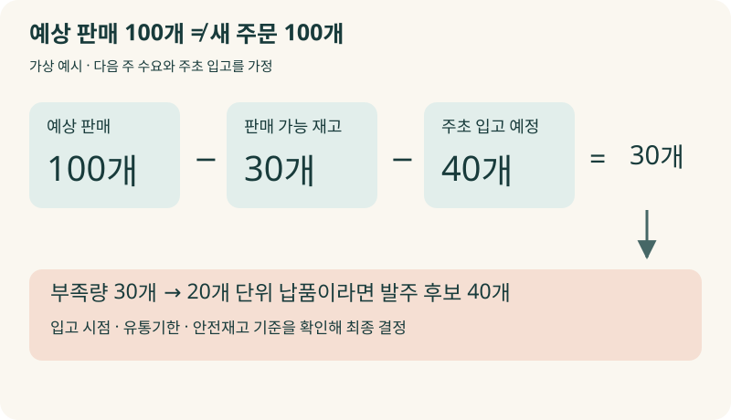
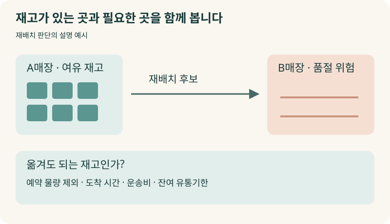
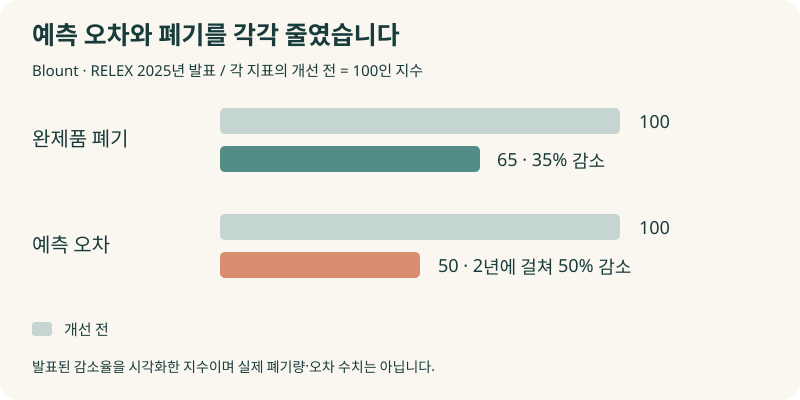
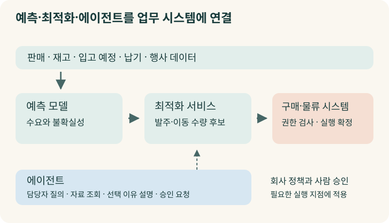
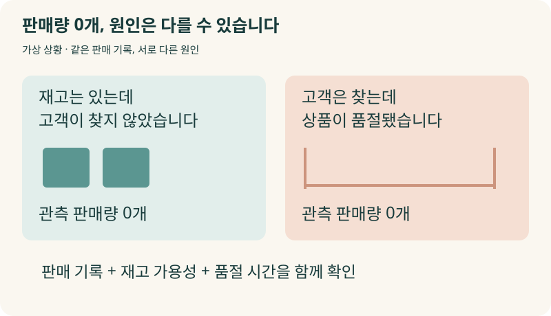
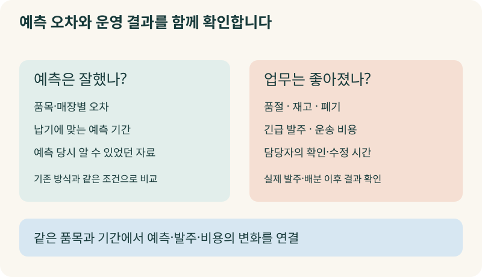

+++
date = '2026-10-03T00:00:00+09:00'
draft = false
title = '창고에는 쌓였는데 매장에는 없습니다. AI는 무엇을 예측한 걸까요?'
description = '수요예측이 맞아도 왜 품절과 과잉 재고가 함께 생길까요? Walmart·Blount·Unifarm 사례로 예측 모델, 재고 최적화, 에이전트가 맡는 일과 우리 회사의 발주 기준을 시스템에 연결하는 방법을 살펴봅니다.'
tags = ['ax', 'ai', 'demand-forecasting', 'inventory', 'supply-chain']
authors = ['geoff']
featured_image = 'thumbnail.webp'
images = ['thumbnail.webp']
slug = 'demand-forecasting-inventory-ax'
audio = []
vedios = []
series = []
toc = true
+++

## 들어가며

어떤 식품 유통회사에서 이런 일이 생겼다고 해보겠습니다. 금요일 오후 한 매장에서는 인기 상품이 떨어져 고객을 돌려보냅니다. 다른 매장에서는 같은 상품을 할인해서 팔고 있습니다. 유통기한이 얼마 남지 않았기 때문입니다. 물류센터에도 재고는 있습니다. 다만 오늘 배송 차량은 이미 출발했습니다.

월요일 회의에서 영업 책임자가 묻습니다.

> 재고가 이렇게 많은데, 왜 주말마다 없어서 못 파는 매장이 나오는 거죠?

데이터팀은 이번 달 전체 판매량이 AI 예측과 크게 다르지 않았다고 설명합니다. 구매팀도 계획한 수량을 확보했습니다. 그런데 매장에서는 물건이 없고 회사는 남은 물건을 버립니다.

가상의 상황이지만 여기에는 서로 다른 문제가 섞여 있습니다. 얼마나 팔릴지 예측하는 일, 물건을 확보하는 일, 고객이 사려는 시간과 장소에 물건을 갖다 놓는 일입니다. 전체 판매량을 잘 맞혔더라도 매장별 수량과 배송 시기를 놓치면 이런 일이 벌어질 수 있습니다.

**수요예측·재고 관리 AX에서는 예측한 숫자로 실제 발주와 배분을 어떻게 바꿀지까지 다뤄야 합니다.** 이번 글에서는 유통·식품 제조·의약품 도매 사례를 살펴보겠습니다. 우리 회사에 필요한 것이 예측 모델의 보강인지, 재고 데이터 정리인지, 발주 기준과 시스템 연결인지 구분하는 데 도움이 될 겁니다.

## 다음 주에 100개 팔린다면, 100개 주문하면 될까요?

수요예측은 상품이 언제 어디에서 얼마나 필요할지 추정하는 일입니다. 과거 판매량에 계절, 행사, 가격 등의 조건을 더해 계산합니다. 그런데 예측 결과를 그대로 발주서에 옮겨 적으면 곤란합니다.

가령 다음 주에 100개를 팔 것으로 예상한다고 해보죠. 현재 판매 가능한 재고는 30개이고 주초에 40개가 더 들어올 예정입니다. 다른 조건이 없다면 부족한 수량은 30개입니다. 예측한 대로 100개를 새로 주문하면 이미 확보한 70개를 무시하는 셈입니다.

그렇다고 30개가 최종 답도 아닙니다. 거래처가 20개 단위로만 납품하면 40개를 주문해야 할 수 있습니다. 주초에 온다던 물건이 금요일로 밀리면 그 전에 팔 물건부터 부족해집니다. 반대로 유통기한이 짧으면 넉넉하게 주문한 물건을 다 팔지 못할 수도 있고요.

회사에서는 이런 조건을 놓고 발주량을 정합니다. AI를 붙일 때도 같은 판단이 필요합니다.

| 결정할 일 | 확인할 내용 |
|---|---|
| 수요예측 | 어느 상품이 어느 매장에서 언제 얼마나 팔릴까? |
| 재고 정책 | 품절에 대비해 얼마나 더 보유할까? |
| 발주·생산 | 입고 예정과 최소 주문량, 생산 능력을 고려하면 얼마나 확보할까? |
| 배분·재배치 | 확보한 물건을 어느 매장에 언제 보낼까? |

예측 모델의 정확도를 올리는 작업은 이 중 첫 번째에 해당합니다. 나머지 결정이 예전 방식 그대로라면 새 예측을 만들어도 발주 담당자는 여전히 엑셀을 열어 수량을 고쳐야 합니다.

## Walmart는 남는 재고의 목적지를 바꿨습니다

처음의 유통회사라면 어떻게 해야 할까요? 부족한 매장의 추가 주문만 받을 게 아니라 남는 재고를 돌려보낼 수 있는지도 살펴봐야 합니다. 필요한 시간 안에 도착하는지, 옮기는 비용보다 얻는 이익이 큰지도 함께 보고요.

Walmart는 2025년 7월 공급망 운영을 소개하면서 멕시코에서 사용하는 Self-Healing Inventory를 설명했습니다. 재고가 지나치게 쌓인 곳을 찾아 필요한 매장으로 공급을 돌리는 시스템입니다. 회사는 해당 시스템으로 5,500만 달러 넘게 절감했다고 발표했습니다. [Walmart의 공급망 운영 사례](https://corporate.walmart.com/news/2025/07/17/walmarts-us-supply-chain-playbook-goes-global-and-its-reinventing-retail-at-scale)

Walmart는 어느 곳에 재고가 얼마나 남는지 확인하고 공급 목적지를 바꿨습니다. 물건이 부족하다는 보고를 받고 다시 사들이는 것 외에도, 이미 확보한 물건으로 대응할 방법을 찾는 겁니다.

우리 회사에 적용한다면 중앙창고 수량만 조회해서는 부족합니다. 매장별 판매 속도와 입고 예정, 이동 시간까지 함께 확인해야 합니다. 재고 화면에는 50개라고 나오지만 이미 고객 주문에 배정한 물건이라면 다른 매장으로 보낼 수 없겠죠. 물건의 위치뿐 아니라 실제로 옮겨도 되는 수량을 알아야 합니다.

## 식품 공장에서는 많이 만드는 것이 손해일 수도 있습니다

유통회사가 물건을 어디로 보낼지 고민한다면 제조사는 얼마나 만들지부터 결정합니다. 특히 신선식품은 생산 효율만 보고 한 번에 많이 만들었다가 남은 제품을 버릴 수 있습니다.

미국의 신선 조리식품 제조사 Blount Fine Foods는 엑셀로 생산계획을 따로 관리했고 제조 네트워크의 상황을 한눈에 파악하기 어려웠습니다. 이를 해결하려고 2023년 RELEX를 도입했습니다. 적용 범위는 제조 운영과 7개 물류센터였습니다.

RELEX가 2025년 공개한 고객 사례에 따르면 Blount는 완제품 폐기를 35% 줄였고 2년에 걸쳐 예측 오차를 50% 줄였습니다. 담당자는 판매 예측이나 생산 능력이 달라질 때 서비스 수준에 어떤 영향이 생길지 미리 살펴보며 대안을 검토한다고 설명합니다. [Blount Fine Foods 사례](https://www.relexsolutions.com/news/blount-fine-foods-achieves-35-percent-waste-reduction-with-relex-solutions/)

공장 입장에서는 같은 제품을 오래 생산하면 설비를 바꾸고 세척하는 횟수를 줄일 수 있습니다. 하지만 판매할 양보다 많이 만들면 창고와 매장에 부담을 넘깁니다. 반대로 조금씩 자주 만들면 생산 비용이 늘 수 있습니다. 생산량을 정할 때 판매 전망과 공장 사정을 함께 계산해야 하는 이유입니다.

경영진은 예측 오차와 폐기량을 별도로 보는 편이 좋습니다. 예측을 잘했는지와 그 예측으로 생산·재고 운영을 잘했는지는 각각 확인할 수 있으니까요.

## 같은 약이라도 약국마다 보충 기준은 다릅니다

모든 거래처에 같은 기준으로 물건을 보내도 될까요? 어떤 곳은 자주 팔리는 상품을 끊기지 않게 확보하는 것이 중요하고 다른 곳은 다양한 품목을 조금씩 갖추는 것이 중요할 수 있습니다.

이탈리아 의약품 도매사 Unifarm은 SARA라는 서비스를 운영합니다. 약국의 재고를 살펴보고 보충 주문을 돕는 방식으로, 공급사가 고객의 재고 보충을 관리하는 VMI에 해당합니다. 하루 두 번 주문 제안을 계산하며 개별 약국의 필요와 영업 방침에 맞춰 보충 기준을 조정합니다.

RELEX의 2021년 발표 당시 200개 넘는 약국이 이 서비스를 사용했습니다. 공개 성과는 재고 최대 30% 감소, 판매 기회 손실 최대 20% 감소, 수동 보충 업무 평균 하루 2시간 절감이었습니다. [Unifarm의 약국 보충 서비스](https://www.relexsolutions.com/news/unifarm-boosts-efficiency-at-customer-pharmacies-with-vmi-service-based-on-relex/)

약국별로 보충 기준을 조정한다는 데 눈길이 갑니다. 재고를 무조건 줄이라는 목표만 주면 주문량을 줄이기는 쉽습니다. 그러나 약사가 당장 필요한 약을 찾는 고객에게 매번 다음에 오라고 할 수는 없겠죠. 어떤 상품을 얼마나 확보할지 고객별 사정을 반영해야 합니다.

우리 회사도 품목이나 거래처에 따라 다르게 운영하는 기준이 있을 겁니다. 평소에는 재고를 적게 두지만 특정 고객의 납품에 필요한 부품은 여유 있게 확보한다거나, 시즌이 끝나가는 상품은 판매가 잠깐 늘어도 추가 주문하지 않는 식입니다. 이런 기준을 담당자의 기억에만 맡겨두면 자동 발주 시스템을 도입한 뒤에도 사람이 계속 수량을 고치게 됩니다.

## 예측 모델, 최적화, 에이전트는 나눠서 맡깁니다

그러면 이 일을 어떤 기술로 구성해야 할까요? AI에게 판매 자료를 주고 주문량을 물어보는 장면만 떠올리면 실제 구성에서 빠지는 부분이 많습니다.

### 예측 모델은 수량과 불확실성을 계산합니다

판매 이력이 충분하고 계절성이 뚜렷한 상품은 작년 같은 시기의 판매량만으로도 비교 기준을 만들 수 있습니다. 행사와 가격의 영향이 크다면 그런 변수를 함께 다루는 머신러닝 모델을 검토합니다. 드물게 팔리는 부품은 매일 꾸준히 팔리는 상품과 다르게 접근해야 하고요.

사전학습한 시계열 모델을 활용하는 방법도 있습니다. Amazon의 Chronos-2는 여러 시계열과 관련 변수를 함께 다루는 모델입니다. 새로운 예측 과제마다 모델을 처음부터 학습하는 부담을 줄이려는 접근입니다. 이런 모델도 우리 상품의 판매 이력에서 기존 방식보다 나은지 비교해서 선택하면 됩니다. [Chronos-2 기술 설명](https://www.amazon.science/blog/introducing-chronos-2-from-univariate-to-universal-forecasting)

숫자 하나뿐 아니라 수요가 얼마나 달라질 수 있는지도 예측합니다. 예를 들어 P90 수요가 140개라면 모델은 수요가 140개 이하일 확률을 90%로 추정한 것입니다. 얼마나 여유 있게 준비할지 판단할 때 이런 정보를 씁니다. 다만 140개를 무조건 주문한다는 의미는 아닙니다. 이미 가진 재고와 납품 조건을 다시 계산해야 합니다.

### 최적화는 실제로 가능한 선택을 비교합니다

수요를 예측한 다음에는 발주·생산·이동 수량을 계산합니다. 창고에 얼마나 들어가는지, 거래처가 최소 몇 개부터 납품하는지, 물건이 도착할 때까지 며칠이 걸리는지를 조건으로 넣습니다. 그 안에서 구매비·보관비·운송비와 품절·폐기 손실을 비교합니다.

상품과 거점이 많으면 한 곳의 판단이 다른 곳에도 영향을 줍니다. A매장의 재고를 B매장으로 옮기면 B매장의 품절을 막는 대신 A매장에서 다시 부족해질 수 있죠. 이런 선택을 함께 계산할 때 정수계획 같은 수학적 최적화나 시뮬레이션을 사용합니다. 담당자가 엑셀에서 하나씩 비교하던 대안을 더 큰 범위에서 검토하는 겁니다.

### 에이전트는 담당자의 질문과 실행을 연결합니다

담당자가 “이번 주에 품절될 상품을 찾아서 대응안을 준비해 주세요”라고 요청하면 에이전트는 재고와 입고 예정, 예측 결과를 조회할 수 있습니다. 공급사 메일에서 납기 변경 내용을 찾고 회사 기준에 맞는 대응안을 설명하는 역할도 맡길 수 있고요.

구성 예를 들면 수요예측 서비스가 수요를 계산하고 최적화 서비스가 발주나 이동 수량을 제안합니다. 에이전트는 담당자가 이해할 수 있도록 선택 이유와 확인할 내용을 정리합니다. 주문을 확정하는 단계에서는 사내 구매 시스템이 권한과 금액 한도를 검사하도록 구성합니다.

**담당자와의 대화, 수량 계산, 실제 주문 확정을 각각 맡겨 연결하는 구성입니다.** 앞선 [MCP 글](https://tech.epsilondelta.ai/posts/mcp-enterprise-integration/)과 [AI 결재선 글](https://tech.epsilondelta.ai/posts/ai-agent-approval-workflows/)에서 다룬 시스템 연결과 승인 설계도 이 과정에 필요합니다.

## AI가 배울 판매 기록부터 살펴봐야 합니다

예측 모델을 고르기 전에 확인할 문제가 하나 있습니다. 판매 기록이 고객의 수요를 제대로 담고 있을까요?

지난 토요일에 어떤 상품을 하나도 못 팔았다고 해보겠습니다. 고객이 찾지 않아서일 수도 있지만 아침부터 품절이었을 수도 있습니다. 둘을 구분하지 않고 판매량 0으로만 학습하면 잘 팔릴 상품의 발주를 오히려 줄일 수 있습니다. Lightspeed의 예측 기능도 품절 때문에 놓친 판매량을 추정해 반영하는 방식을 안내합니다. [품절과 판매 기록을 다루는 방법](https://x-series-support.lightspeedhq.com/hc/en-us/articles/25533686759451-Getting-started-with-demand-forecasting)

재고 기록도 마찬가지입니다. 장부에 100개가 있어도 일부가 파손품이거나 다른 고객의 예약 물량이면 전부 판매할 수는 없습니다. 박스와 낱개의 단위가 섞이거나 반품 입고가 늦게 기록되는 문제도 먼저 확인해야 합니다.

이런 문제를 남겨두면 모델을 바꿀수록 잘못된 자료를 더 정교하게 계산할 수도 있습니다. 판매·품절·입출고 기록을 같은 상품과 장소 기준으로 연결한 뒤 실제 업무와 맞는지 살펴봐야 합니다.

현업이 예측을 수정하는 이유도 함께 남기면 좋겠습니다. 담당자가 주문량을 줄였을 때 결과 수량만 저장하면 다음 사람은 이유를 모릅니다. 행사 종료일 때문인지, 거래처 납기 때문인지, 최근 반품 때문인지 기록해야 어떤 판단이 도움이 됐는지 나중에 확인할 수 있습니다. 앞선 [암묵지 자산화 글](https://tech.epsilondelta.ai/posts/ax-tacit-knowledge-assetization/)에서 이야기한 노하우가 바로 이런 판단 안에 있습니다.

## 정확도 보고서 대신 무엇을 확인할까요?

예측 모델도 제대로 시험해야 합니다. 작년 자료로 지난달을 예측한다면 당시에는 몰랐던 행사 실적이나 실제 날씨를 미리 넣어서는 안 됩니다. 시점을 옮겨가며 그때까지 알 수 있었던 자료로 다음 기간을 예측하는 방식으로 검증합니다. 이를 시계열 교차검증이라고 합니다. [시계열 예측 검증 방법](https://otexts.com/fpp3/tscv.html)

예측할 기간도 발주 업무에 맞춥니다. 해외에서 부품을 들여오는 데 4주가 걸리는데 내일 수요만 잘 맞히는 모델로는 발주량을 정하기 어렵습니다. 전사 판매 합계뿐 아니라 실제 재고를 두는 장소와 품목별로 얼마나 틀리는지도 확인해야 합니다.

경영진이 볼 성과표에는 그다음 결과까지 들어가면 좋겠습니다. 예측 오차가 줄었는지, 품절이 줄었는지, 재고와 폐기 비용은 어떻게 달라졌는지 함께 보는 겁니다. 재고를 줄였는데 긴급 배송비가 늘었다면 비용을 어디서 아꼈고 어디에 더 썼는지 따져봐야 합니다.

처음부터 전 품목의 발주를 자동화할 필요는 없습니다. 문제가 자주 생기는 품목군과 매장을 골라 실제 주문 없이 AI의 제안을 기존 발주와 비교해볼 수 있습니다. 담당자가 제안을 거절한 이유를 확인하고 계산과 기준을 고친 뒤, 검증한 범위부터 실행을 맡기는 방식입니다. 이때 담당자의 확인·수정 시간이 줄었는지도 함께 봅니다.

저는 첫 도입 회의에서 모델의 정확도 목표만 정하기보다, 어느 상품의 어떤 문제를 줄일 것인지부터 합의하는 편이 좋다고 생각합니다. 폐기가 문제인 회사와 품절 때문에 납품 약속을 못 지키는 회사는 같은 숫자를 목표로 삼기 어렵습니다.

## 나가며

처음의 유통회사로 돌아가 보겠습니다. 물류센터에 재고가 있다는 사실만으로 고객에게 팔 수 있는 것은 아닙니다. 필요한 매장에 필요한 시간까지 보내야 합니다. 예측한 수요를 보고 발주와 생산, 배송 계획을 바꾸는 데까지 연결해야 매장에서도 변화를 느낄 수 있습니다.

그 과정에는 우리 회사만의 판단이 들어갑니다. 어떤 거래처의 납기를 더 여유 있게 잡는지, 어느 상품은 품절을 감수하더라도 재고를 줄이는지, 어떤 고객의 주문은 우선 처리하는지 같은 기준입니다. 현업의 경험을 조건과 예외로 정리하고 시스템에서 재사용하도록 만드는 일도 수요예측·재고 관리 AX의 한 부분입니다.

막상 구현하려면 판매와 재고 기록을 맞추는 일부터 예측·최적화 구성, 구매·물류 시스템 연결, 승인과 운영 검증까지 함께 다뤄야 합니다. 현업의 판단을 이해하는 사람과 이를 기술로 옮길 사람이 같이 일해야 하는 영역입니다.

우리 엡실론델타는 현업의 발주·재고 판단 기준을 정리하고 예측과 업무 시스템을 연결하는 과정부터 실제 운영의 검증까지 함께 도와드릴 수 있습니다. AI를 도입했는데도 발주 담당자가 매번 수량을 다시 계산하거나 품절과 과잉 재고가 반복된다면 [contact@epsilondelta.ai](mailto:contact@epsilondelta.ai)로 연락 주세요. 문제가 반복되는 품목과 현재의 발주 과정을 함께 살펴보고 우리 조직에서 무엇부터 바꿔야 할지 찾아보겠습니다.
