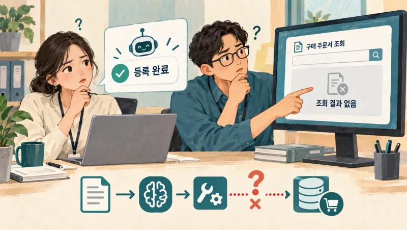
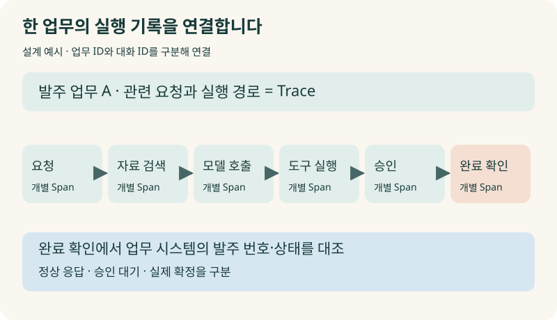
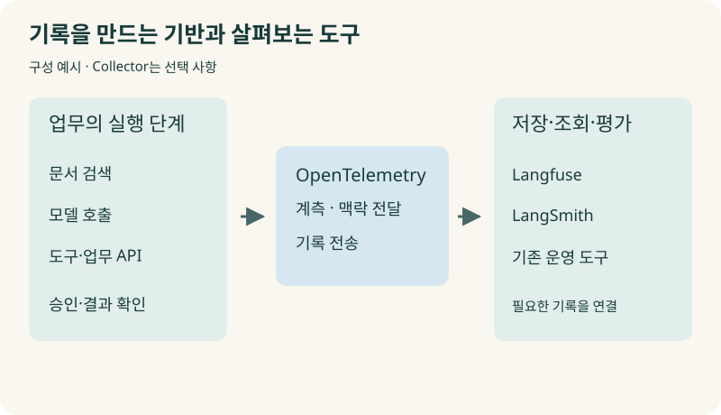
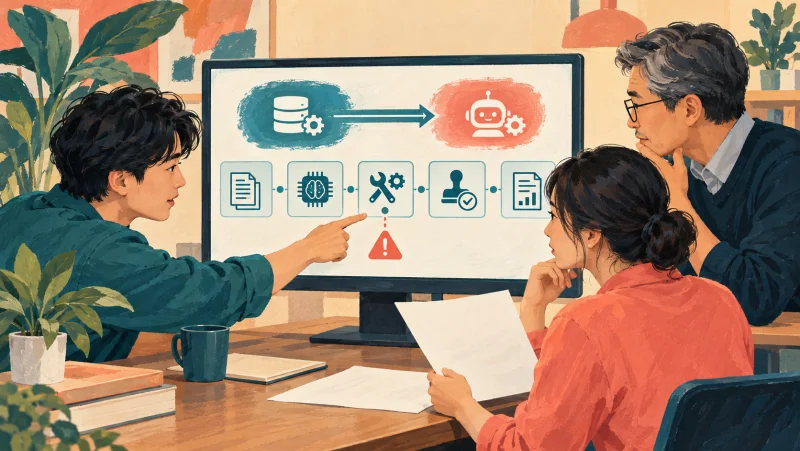
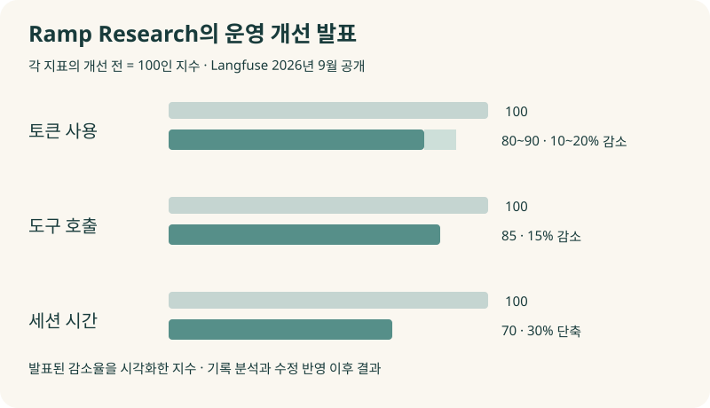
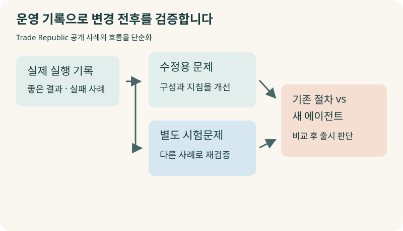
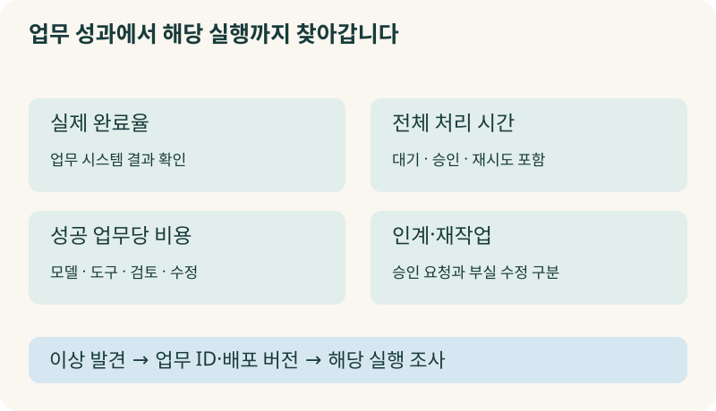
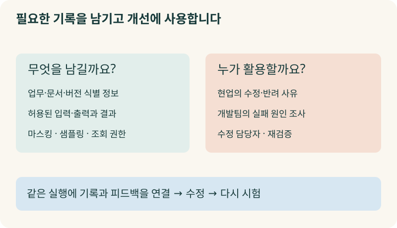

+++
date = '2026-10-09T00:00:00+09:00'
draft = false
title = 'AI는 “처리했습니다”라는데, 왜 아무도 결과를 찾지 못할까요?'
description = '대화 기록만으로는 AI가 어떤 자료를 읽고 무엇을 실행했는지 알기 어렵습니다. OpenTelemetry·Langfuse·LangSmith의 역할, 실제 기업의 개선 사례, 엡실론델타의 MLOps·AgentOps 경험으로 에이전트 관측성을 살펴봅니다.'
tags = ['ax', 'ai', 'agent', 'observability', 'agentops', 'opentelemetry']
authors = ['geoff']
featured_image = 'thumbnail.webp'
images = ['thumbnail.webp']
slug = 'agent-observability'
audio = []
vedios = []
series = []
toc = true
+++

## 들어가며

어떤 회사의 구매 담당자가 AI에게 승인받은 발주를 구매 시스템에 등록해 달라고 했다고 해보겠습니다. AI는 잠시 뒤 답합니다.

> 발주 등록을 완료했습니다.

담당자는 다음 일을 시작합니다. 그런데 물류팀에서 연락이 옵니다.

> 발주 건이 조회되지 않는데요. 어느 번호로 등록하셨나요?

대화 기록에는 요청과 완료 답변이 있습니다. 담당자는 개발팀에 화면을 보내고 개발팀은 같은 요청을 다시 해봅니다. 이번에는 정상적으로 등록됩니다. 처음에는 왜 안 됐을까요?

가상의 장면이지만 에이전트 운영에서 확인할 문제를 잘 드러냅니다. AI가 등록 요청을 아예 보내지 않았을 수도 있고 구매 시스템에서 거절했을 수도 있습니다. 다른 거래처에 등록했거나 등록은 했지만 승인 대기 상태일 수도 있고요. 마지막 답변만 읽어서는 고칠 지점을 찾기 어렵습니다.

**AI가 어떤 자료를 읽고 어떤 도구를 실행했으며 실제 업무가 어디까지 끝났는지 연결해서 확인할 수 있어야 합니다.** 이를 다루는 것이 AI 에이전트 관측성, Agent Observability입니다.

이번 글에서는 관측성이 무엇인지, OpenTelemetry와 Langfuse·LangSmith를 어디에 사용하는지 살펴보겠습니다. 실제 기업이 실행 기록을 개선에 쓰는 방법과 저희 엡실론델타의 경험도 함께 다룹니다. AI가 틀릴 때마다 모델을 바꾸거나 프롬프트를 고치기 전에, 우리 조직에서 무엇을 확인해야 할지 판단하는 데 도움이 될 겁니다.

## 대화 기록에는 빠진 과정이 많습니다

직원에게 거래처 확인을 부탁했다고 해보죠. 직원이 돌아와 “확인했습니다”라고 말합니다. 문제가 생기면 누구에게 연락했는지, 어떤 자료를 봤는지, 무슨 답을 받았는지 물어볼 겁니다. 그래야 다음 조치를 정할 수 있으니까요.

에이전트도 한 번의 요청을 처리하면서 여러 일을 합니다. 사내 문서를 검색하고 모델에 자료를 전달한 뒤 외부 시스템을 조회합니다. 결과를 보고 다시 검색하거나 다른 도구를 부르기도 합니다. 사용자에게는 그 과정을 요약한 답변 하나만 보일 수 있습니다.

보고서의 숫자가 틀렸다면 검색 단계에서 오래된 자료를 가져왔는지부터 확인합니다. 올바른 자료를 전달했는데 모델이 잘못 해석했다면 모델이나 프롬프트를 살펴봅니다. 계산은 맞았지만 저장할 항목을 잘못 지정했다면 도구 입력과 검증 절차를 고칩니다. 원인에 따라 해야 할 일이 달라집니다.

서버가 살아 있고 모델이 정상적으로 답했다고 해서 이 과정이 모두 제대로 끝났다고 판단하기는 어렵습니다. 이미 정한 실패율이나 응답 시간을 지켜보는 일에 더해, 문제가 생긴 요청의 처리 과정을 조사할 수 있어야 합니다.

관측성을 갖추려면 이 조사에 쓸 기록을 연결해둡니다.

## 한 업무의 실행 기록을 묶어봅니다

분산 시스템에서는 요청 하나가 여러 서비스를 거칩니다. 어느 서비스에서 얼마나 걸렸고 어디에서 실패했는지 연결해 보는 기록을 트레이스(Trace)라고 합니다. 그 안의 개별 작업은 스팬(Span)이라고 부릅니다. [OpenTelemetry의 추적 개념](https://opentelemetry.io/docs/concepts/signals/traces/)

발주 업무라면 거래처 조회, 모델 호출, 구매 시스템 등록이 각각의 작업입니다. 이들을 같은 요청의 기록으로 묶으면 등록 전에 조회부터 실패했는지, 모델이 도구를 반복해서 불렀는지, 구매 시스템의 응답을 기다리다 멈췄는지 따라갈 수 있습니다.

본문의 발주 예시에서는 다음 정도를 연결할 수 있습니다.

| 확인할 단계 | 남길 기록의 예 | 알아낼 내용 |
|---|---|---|
| 요청 접수 | 업무 번호, 요청 시각 | 어떤 요청의 문제인가 |
| 자료 검색 | 문서 번호와 버전, 검색 조건 | 필요한 근거를 가져왔나 |
| 모델 호출 | 모델과 프롬프트 버전, 시간·사용량 | 무엇을 바꾼 뒤 문제가 생겼나 |
| 도구 실행 | 대상, 입력, 반환 결과 | 어느 거래처에 무엇을 요청했나 |
| 승인 | 승인 대상과 결과 | 실행할 내용을 승인받았나 |
| 완료 확인 | 구매 시스템의 발주 번호·상태 | 실제로 등록됐나 |

가령 등록 도구가 정상 응답을 돌려줬어도 결과 상태가 승인 대기라면 발주 확정으로 안내해서는 안 됩니다. 완료 상태를 조회하는 단계까지 기록하면, 등록 실패인지 결과 해석의 오류인지 구분할 수 있습니다.

여러 대화에 걸친 업무도 있습니다. 오전에 초안을 만들고 오후에 수정한 뒤 다음 날 임원이 승인할 수 있죠. 이런 경우에는 대화 번호와 업무 번호를 구분해두면 좋습니다. 대화가 바뀌어도 같은 발주 건의 실행과 승인을 찾아볼 수 있도록요.

## OpenTelemetry와 Langfuse는 어디에 쓰일까요?

이 기록을 서비스마다 제각각 남기면 서로 연결하기가 어렵습니다. 검색 서비스에서는 요청을 A라고 부르고 구매 시스템에서는 B라고 부른다면 같은 업무인지 확인하는 데 또 시간이 듭니다.

개발자는 OpenTelemetry의 공통 기반으로 애플리케이션의 작업을 기록하고 다른 서비스로 전달합니다. 개발자는 각 작업이 시작하고 끝나는 시점, 오류와 필요한 속성을 남기도록 코드를 연결합니다. 서비스가 다음 서비스를 부를 때도 추적에 필요한 식별 정보를 전달합니다. 이런 맥락 전달을 해야 비동기 작업이나 다른 서버에서 처리한 일까지 따라갈 수 있습니다. [실행 맥락을 전달하는 방법](https://opentelemetry.io/docs/concepts/context-propagation/)

이렇게 만든 실행 기록을 보내서 저장하고 살펴보는 도구가 Langfuse나 LangSmith입니다.

Langfuse는 OpenTelemetry 기반으로 모델 호출과 도구 실행 등의 기록을 연결하고, 프롬프트 버전이나 평가·사용자 피드백과 함께 다룰 수 있도록 지원합니다. LangSmith도 실행 추적과 평가, 운영 모니터링을 지원하며 OpenTelemetry로 기록을 받을 수 있습니다. [Langfuse의 구성](https://langfuse.com/docs/observability/sdk/overview), [LangSmith의 OpenTelemetry 연결](https://docs.langchain.com/langsmith/trace-with-opentelemetry)

회사에서 기존 서비스 운영 도구를 사용한다면 함께 연결할 수도 있습니다. 모델의 입력과 출력을 조사할 때는 에이전트 관측 화면을 보고, 데이터베이스나 네트워크가 느린 이유는 기존 운영 화면에서 확인하는 식입니다. OpenTelemetry Collector를 두어 기록을 모으고 여러 도구로 나눠 보내는 구성도 가능합니다.

그때 모델 호출만 기록하면 구매 시스템이나 검색 서비스의 지연은 빠집니다. 프레임워크가 자동으로 남겨주는 기록을 확인하고, 실제 업무에서 필요한 조회·승인·결과 확인은 추가로 연결해야 합니다. 어떤 도구를 설치했는지보다 필요한 과정이 기록에 남는지 점검하는 편이 좋습니다.

## 저희는 MLOps에서 시작해 AgentOps로 확장했습니다

저희 엡실론델타의 기술 기반은 원래 MLOps였습니다. 모델을 개발한 뒤 배포하고 운영하는 과정에서 데이터와 모델 버전, 성능과 운영 상태를 관리하는 일을 중요하게 생각해왔습니다. 현재는 에이전트 구축과 운영을 다루는 AgentOps까지 영역을 넓혔습니다.

PE사 에이전트 구축 프로젝트에서는 OpenTelemetry 기반 Langfuse를 사용했습니다. 내부 프로젝트도 과거 LangChain을 주로 사용하던 시기에는 LangSmith를 썼고 현재는 주로 Langfuse와 OpenTelemetry를 사용하고 있습니다.

저희는 운영하면서 고칠 수 있어야 한다고 생각하기 때문에 관측성을 중요하게 봅니다. 에이전트에 문제가 생겼는데 마지막 답변만 남아 있으면, 무엇이 잘못됐는지 확인할 자료부터 부족해집니다. 모델만 바꾸거나 지시를 덧붙여 다시 돌리는 방식으로는 개선됐는지 비교하기도 어렵습니다.

에이전트에서는 모델을 둘러싼 과정도 살펴야 합니다. 같은 모델이라도 다른 문서를 읽거나 다른 메모리를 참고하면 결과가 달라집니다. 도구 권한과 입력, 승인 절차가 달라도 실행할 수 있는 일이 달라지고요. 운영 기록에서 이 조건들을 확인할 수 있도록 구성해야 문제를 좁혀갈 수 있습니다.

물론 기록을 해석할 업무 기준도 필요합니다. 기술팀이 보기에는 정상 호출인데 현업은 잘못된 결과라고 판단할 수 있습니다. 어느 거래처의 자료를 참고해도 되는지, 어떤 상태를 완료로 안내하는지 같은 기준을 현업과 함께 정해야 합니다.

## Ramp는 쌓인 기록에서 반복 문제를 찾습니다

실행 기록을 남긴 뒤에는 어떻게 활용할까요? 한 건씩 열어보고 원인을 찾는 데서 더 나아가, 여러 요청에서 반복되는 문제를 조사할 수 있습니다.

기업의 지출·재무 업무를 지원하는 Ramp는 Langfuse에 실행 기록을 남기고 Reflect라는 에이전트로 이를 분석한다고 설명합니다. Reflect는 기록을 평가하고 비슷한 사례를 묶어 반복되는 문제를 찾습니다. 수정안을 제안하면 담당자가 수락하거나 거절합니다.

Ramp는 이 방식을 12개 에이전트에 적용하고 120개 이상의 수정 제안을 반영했다고 설명합니다. Langfuse가 2026년 9월 공개한 고객 발표 요약에 나온 내용입니다. Ramp Research에서는 토큰 사용량 10~20% 감소, 도구 호출 15% 감소, 세션 시간 30% 단축을 발표했습니다. [Ramp의 운영 개선 사례](https://langfuse.com/users/ramp)

회사에서도 같은 조회를 여러 번 반복하는 에이전트가 있을 수 있습니다. 답변은 맞는데 비용과 시간이 늘어나는 겁니다. 요청 하나만 보면 복잡한 질문이었겠거니 지나치기 쉽지만, 여러 실행을 묶어보면 같은 도구를 되풀이하는 패턴을 찾을 수 있습니다. 그 부분을 고치고 이전 사례로 다시 시험하면 줄인 호출이 업무 품질에 영향을 주는지도 확인할 수 있고요.

Ramp의 사례를 참고할 때는 기록을 모은 다음 무엇을 했는지까지 보면 좋겠습니다. 반복 문제를 찾고 수정안을 검토해 반영하는 운영 과정을 만든 겁니다.

## 잘 돌아가던 업무를 바꿀 때도 기록이 필요합니다

새 에이전트를 만들 때뿐 아니라 기존 구성을 바꿀 때도 관측 기록을 활용합니다. 고정된 순서로 처리하던 업무를 에이전트가 도구를 골라 실행하도록 바꾸면, 예전과 같은 결과를 내는지 확인해야 하니까요.

금융사 Trade Republic의 Ops Tools 팀은 이 전환에 셀프호스팅 Langfuse를 사용한다고 설명합니다. 실제 실행을 관측하고 좋은 결과와 실패 사례를 평가해 데이터셋에 남깁니다. 수정에 사용하는 문제와 별도 시험문제를 나누고 기존 절차와 새 에이전트를 비교합니다. 두 묶음의 시험을 통과한 뒤 출시를 판단하는 방식입니다. [Trade Republic의 전환 사례](https://langfuse.com/users/trade-republic)

우리 조직에서 모델이나 프롬프트를 바꿀 때도 도움이 되는 접근입니다. 지난주 직원이 수정한 결과를 이번 버전에서는 제대로 처리하는지 확인합니다. 동시에 수정 과정에서 계속 사용한 사례 외에 별도의 사례도 시험합니다. 특정 문제만 맞히도록 고친 것은 아닌지 살펴보는 거죠.

Rakuten도 기업 고객과 직원을 위한 AI를 구성하면서 LangSmith로 실행을 확인하고 맞춤 평가 기준으로 모델과 구성을 비교한다고 설명했습니다. 여러 팀이 시도한 접근을 실험 결과로 비교하고 프롬프트를 공유하는 방식입니다. [Rakuten의 기업 AI 사례](https://www.langchain.com/blog/customers-rakuten)

앞선 [AI Evals 글](https://tech.epsilondelta.ai/posts/what-are-ai-evals/)에서 다룬 시험문제는 운영에서 발견한 사례로 계속 보강할 수 있습니다. 관측 기록에 현업의 수정 이유와 평가를 붙이면, 다음 변경을 확인할 근거가 쌓입니다.

## 경영진은 어떤 숫자를 보면 좋을까요?

개발팀의 실행 화면을 매번 직접 읽을 필요는 없습니다. 경영진은 우리가 맡긴 업무가 끝났는지, 직원과 고객이 얼마나 기다리는지, 결과를 쓰기까지 얼마의 비용이 드는지 확인하면 됩니다.

업무 기준에 맞춰 완료율을 정합니다. 발주 등록 요청이라면 구매 시스템에서 등록된 건을 확인한 비율을 봅니다. 모델이 완료라는 문장을 출력한 비율로 계산하면 처음의 문제를 놓치겠죠.

처리 시간에는 대기와 재시도도 넣습니다. 모델의 답변은 빨라도 승인 요청이 담당자에게 전달되지 않아 하루를 기다렸다면 직원에게는 느린 업무입니다. 느린 요청을 따로 찾아서 자료 검색, 도구 실행, 승인 중 어디에서 지체됐는지 조사할 수 있어야 합니다.

비용도 같은 업무 기준으로 봅니다. 한 번의 모델 호출 가격은 싸더라도 같은 자료를 반복해서 읽고 담당자가 다시 수정하면 성공한 업무 한 건의 비용은 높아집니다. 앞선 [AI FinOps 글](https://tech.epsilondelta.ai/posts/ai-finops/)의 비용 관리에 실행 기록을 함께 활용할 수 있습니다.

사람에게 넘긴 건도 이유를 구분해보면 좋겠습니다. 승인권자가 결정해야 하는 일이라서 넘긴 것인지, 필요한 자료를 못 찾거나 잘못 처리해서 넘긴 것인지에 따라 개선할 내용이 다릅니다.

이 숫자에서 이상을 발견했을 때 해당 실행까지 찾아갈 수 있도록 연결합니다. 완료율이 떨어졌다는 보고를 받고 끝내지 않고, 어느 업무와 어느 버전에서 문제가 늘었는지 확인하는 겁니다.

## 기록을 많이 남기면 해결될까요?

기록을 활용하려면 필요한 내용을 남기고 읽을 사람을 정해야 합니다. 투자 자료나 고객정보를 모두 복사해 저장하면 관측 시스템에도 민감한 자료가 쌓입니다. 입력과 출력 중 어떤 내용을 저장할지 정하고, 필요한 식별 정보와 문서 버전으로도 조사할 수 있는지 검토합니다.

자료를 외부 관측 서비스로 보내기 전에는 민감한 내용을 가리는 마스킹을 적용할 수 있습니다. 직접 작성한 코드뿐 아니라 연결한 라이브러리가 남기는 기록에도 같은 처리가 적용되는지 확인합니다. [Langfuse의 마스킹 기능](https://langfuse.com/docs/observability/features/masking)

실행량이 많아지면 일부 요청의 기록을 선택해 남기는 샘플링도 사용합니다. 이때는 어떤 요청을 얼마나 남겼는지 알아야 합니다. 일부 실행만 모은 화면을 전체 업무의 결과처럼 읽으면 판단이 틀어질 수 있습니다. [실행 기록 샘플링](https://langfuse.com/docs/observability/features/sampling)

담당자도 있어야 합니다. 오류 알림은 개발팀이 보지만 잘못된 업무 결과는 현업이 먼저 알아챌 수 있습니다. 직원이 수정하거나 반려한 결과를 해당 실행과 연결하고, 누가 확인해 어떤 조치를 할지 정합니다.

처음에는 중요한 업무 하나의 요청부터 완료까지 연결해보면 좋겠습니다. 반복되는 문제를 찾아 고치고 이전 사례로 다시 시험합니다. 그 과정이 실제로 돌아가면 다른 업무로 넓힐 수 있습니다.

## 나가며

처음의 구매 담당자는 발주를 등록해 달라고 요청했습니다. 완료 답변만 남아 있으면 문제가 생겼을 때 다시 부탁하고 기다리는 것부터 시작해야 합니다. 요청부터 실제 등록 결과까지 기록을 연결해두면 어느 단계에서 고칠지 조사할 수 있습니다.

저희는 에이전트를 운영하고 개선할 때 어떤 조건에서 무엇이 잘못됐는지 확인할 수 있어야 한다고 생각합니다. 그래서 관측성을 운영의 기본으로 봅니다. 현업이 결과를 고친 이유도 해당 실행에 남겨두면 그동안 담당자의 경험에만 있던 판단 기준을 다음 평가와 업무 지침에 활용할 수 있습니다. 앞선 [암묵지 자산화 글](https://tech.epsilondelta.ai/posts/ax-tacit-knowledge-assetization/)에서 이야기한 노하우를 이런 방식으로 축적할 수 있습니다.

막상 구성하려면 에이전트와 업무 시스템을 연결해 기록하고, 민감한 자료의 저장 범위를 정하고, 현업의 완료 기준과 평가를 함께 설계해야 합니다. 기록을 분석해 발견한 문제를 실제 수정과 배포 이후 검증까지 가져가는 운영 경험도 필요합니다.

우리 엡실론델타는 MLOps에서 AgentOps까지 쌓아온 경험과 PE사 에이전트 구축 경험을 바탕으로, 관측 체계 구성부터 현업 평가와 운영 개선까지 함께 도와드릴 수 있습니다. AI를 도입했는데 왜 잘못됐는지 설명하기 어렵거나 같은 수정이 반복된다면 [contact@epsilondelta.ai](mailto:contact@epsilondelta.ai)로 연락 주세요. 현재 에이전트가 맡은 업무와 반복되는 문제를 함께 살펴보고 무엇을 기록하고 어디부터 고쳐야 할지 정리하겠습니다.
