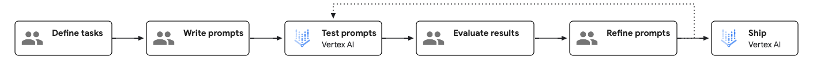
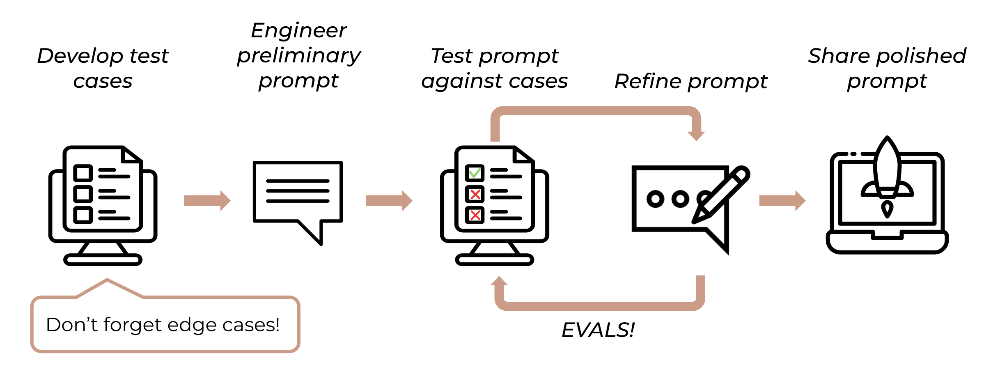
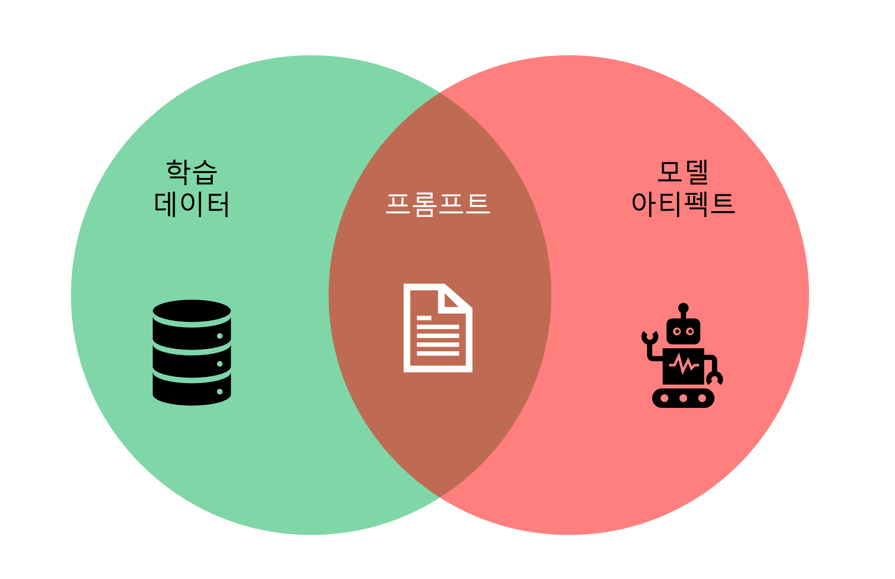
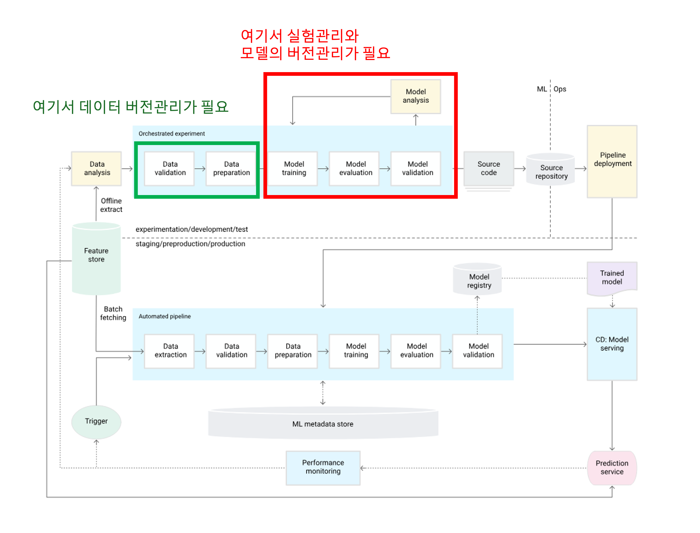

+++
date = '2025-08-17T11:03:24+09:00'
draft = false
title = '그건 프롬프트 엔지니어링이 아닙니다.'
description = 'Chain of Thought, few-shot, 그리고 여러 현란한 프롬프팅 기법을 사용한다고 그게 정말 프롬프트 "엔지니어링"일까요?'
tags = ['prompt', 'prompt-enginnering', 'promptDB']
authors = ['geoff']
featured_image = 'prompt_engineering_fake.jpg'
images = ['prompt_engineering_fake.jpg']
slug = 'that-is-not-prompt-engineering'
audio = []
vedios = []
series = []
toc = true
+++

## 들어가며 : LLM의 시대, 그리고 대 호들갑의 시대
openAI의 GPT-5의 출시와 함께 트만이형도 호들갑의 새 지평을 열게 됩니다.

~이정도 호들갑은 이젠 회시를 위한 행위 예술로 봐줘야 하는게 아닐까...~

사실 2022년 11월 30일 chatGPT가 출시된 이후 LLM의 발전은 호들갑의 역사와 함께한다고 봐도 과언이 아닙니다. 그리고 이 chatGPT와 함께 부상한 개념이 있습니다. 바로 프롬프트 엔지니어링입니다. 프롬프트 엔지니어링이란 개념은 2018년 파편화 되어 있는 모든 NLP task를 Q&A형태의 Task로 통합시키는 시도를 하면서 생겨났습니다. 사실 chatGPT 출시 이전부터 GPT3를 위주로 활발히 논의와 연구가 되고 있던 분야였습니다. 그리고 이 프롬프트 엔지니어링은 chatGPT 출시와 함께 일반 대중에도 소개가 되기 시작합니다. 

하지만 이러한 학게와 업계의 히스토리와 컨텍스트는 전혀 전해지지 않았고, 단순히 "chatGPT한테 일을 시키기 위해 체팅창에 적는게 프롬프트고, 프롬프트를 잘 적어야 된다더라" 정도로 전해지기 시작하면서 문제가 발생합니다. 그렇게 각 커뮤니티와 AI업계 그리고 LLM을 활용하는 여러 분야와 업계에서는 프롬프트 엔지니어링이 무엇인가에 대한 심도 있는 고민과 토론을 충분히 하지 않은 상태에서 각자의 해석을 내놓기 시작했습니다. 

그렇게 프롬프트 엔지니어링은 블록체인, 메타버스를 뒤이은 버즈워드가 된 듯한 느낌이 강하게 들게 됩니다. 그리고는 "미국 어디에서는 프롬프트 엔지니어가 연봉 4억을 받는다더라", "너도 나한테 프롬프트 엔지니어링을 배우면 돈 많이 벌 수 있다.", "프롬프트를 잘 적으면 그게 프롬프트 엔지니어링이야", "우리 모두 프롬프트 엔지니어가 될 수 있어"와 같은 말들이 넘쳐나기 시작합니다. 그리고 "OOO를 위한 프롬프트 100선"과 같은 프롬프트 템플릿이 인기를 끌고 사람들은 그것이 프롬프트 엔지니어링이라고 이해하기 시작합니다. 심지어 일부 마케터들은 그저 ChatGPT를 마케팅에 활용하고 있을 뿐인데 스스로를 프롬프트 엔지니어라고 주장하기에 이르렀습니다. 

이러한 현상을 지켜본 기존 소프트웨어 엔지니어들은 당연한 의문을 품게 됩니다. "저게 어떻게 엔지니어링이야?" 그들의 눈에 비친 '프롬프트 엔지니어링'은 체계적인 방법론이나 과학적 접근과는 거리가 먼, 피상적인 팁 모음에 불과했기 때문입니다.

재미있는 사실은 최근 OpenAI가 공개한 최신 [GPT-5 모델의 공식 프롬프팅 가이드](https://cookbook.openai.com/examples/gpt-5/gpt-5_prompting_guide)에는 다양한 효과적인 '프롬프팅'기법에 대해 소개하고 설명하고 있지만, 가이드 어디에도 '프롬프트 엔지니어링'이란 단어는 등장하지 않습니다. 이것은 OpenAI도 prompting과 prompt engineering을 구분하고 있습니다. 즉, 이러한 프롬프팅 기법을 프롬프트에 적용한다고 해서 그게 곧 prompt engineering이 되는 것은 이니라는 의미입니다.

진짜 LLM 애플리케이션을 개발하는 실무 현장에서는 단순히 이러한 프롬프트를 잘 적는 방법 만을 고민하지 않습니다. 그리고 프롬프트 엔지니어링이 그저 버즈워드에서 끝나지 않습니다. 신뢰할 수 있고 일관적이며 예측가능하면서 확장 가능한 AI 시스템을 구축하기 위해서는 반드시 엔지니어링적, 과학적 접근법이 적용된 진짜 프롬프트 엔지니어링이 필요힙니다. 이번 포스트는 바로 그 지점에서 시작합니다. 과연 단순한 프롬프팅과 과학적/공학적 방법론을 따르는 프롬프트 엔지니어링은 어떻게 다른 것인지에 대해 같이 탐구해보려 합니다. 그리고 근본적인 차이를 명확히 하고자 합니다. 

따라서 이 포스트의 목적은 다음과 같은 핵심 질문에 답하고자 하는 것입니다. "단순히 더 나은 지시어를 작성하는 것만으로 충분하지 않다면, 프롬프트를 진정으로 엔지니어링한다는 것은 무엇을 의미하는가? 전문적이고 확장 가능한 프롬프트 엔지니어링 수명주기와 워크플로우는 어떤 모습인가?"

## 프롬프팅 기법 : 필요하지만 이것이 곧 프롬프트 엔지니어링은 아니다.
현재 '프롬프트 엔지니어링'에 대한 대중적 담론은 일련의 '팁과 요령' 모음집으로 요약될 수 있습니다. "AI에게 팁을 주면 더 나은 답변을 한다"는 식의 흥미로운 조언부터, 명확한 역할을 부여하거나 , 긍정적인 지시문을 사용하고 , 청중을 특정하는 등의 기법들이 마치 프롬프트 엔지니어링의 전부인 것처럼 소개됩니다. 

이 섹션에서는 널리 알려진 프롬프팅 기법들 몇기지를 프롬프팅 원칙을 기준으로 분류하고 검증해보고록 하겠습니다. 프롬프트 엔지니어링을 이해하기 위해서는 기본적인 프롬프팅 기법에 대한 이해는 선행되어야 합니다. 하지만 이것이 프롬프트 엔지니어링의 전체라고 이해하면 안됩니다.

### 원칙 1: 명확성과 구체화
이 원칙은 모호하지 않은 명확한 언어로 모델에 지시하는 것을 포함합니다. 모델이 잘못 해석할 여지를 줄여 원하는 응답을 유도하는 가장 기본적인 접근법입니다.
#### 주요 기법
context와 instruction의 분리, 제약사항의 명시, 작업 순서의 명시, 출력 포멧 등의 명시 등등 
#### 작동 원리
이러한 기법들은 근본적으로 LLM의 탐색 공간을 줄이는 역할을 합니다. LLM은 주어진 텍스트(컨텍스트)를 기반으로 통계적으로 가장 가능성 있는 다음 단어를 예측하는 방식으로 작동합니다. 정확한 지시를 제공함으로써 사용자는 가능한 출력의 범위를 제한하고, 원하는 결과가 나올 확률을 높입니다. 

### 원칙 2: 풍부한 맥락 제공
이는 모델이 작업을 올바르게 수행하는 데 필요한 배경 정보를 제공하는 것에 관한 것입니다. 맥락이 풍부할수록 모델은 사용자의 의도를 더 정확하게 파악할 수 있습니다.
#### 주요 기법
특정 대상 독자를 정의하거나("스마트폰을 사용해 본 적 없는 시니어를 위해 설명해줘") , AI가 채택할 페르소나나 역할을 설정하고("당신은 커리어 코치입니다") , 프롬프트 자체에 관련 사실이나 데이터를 포함하는 기법들이 여기에 해당합니다. CARE, RISE, COSTAN과 같은 프롬프팅 프레임워크들은 모두 '맥락(Context)'을 핵심 구성 요소로 강조합니다.
#### 작동 원리
맥락은 모델을 위한 '프라이머' 역할을 합니다. 응답 생성을 시작하기 전에 모델의 신경망 내 관련 노드를 활성화시키는 것입니다. "당신은 시니어 마케팅 전문가입니다"와 같은 역할을 부여하는 것은 방대한 양의 암묵적인 스타일 및 도메인 특정 지식을 불러오는 강력한 지름길입니다.

### 원칙 3: 예시를 통한 안내
이 접근법은 모델에게 좋은 결과물이 어떤 모습인지 직접 보여주는 것을 포함합니다. 이는 모델이 작업뿐만 아니라 원하는 형식, 스타일, 어조까지 이해하도록 돕습니다.
#### 주요 기법
이 기법은 예시를 제공하지 않는 제로샷(Zero-Shot), 하나의 예시를 제공하는 원샷(One-Shot), 그리고 여러 개의 예시를 제공하는 퓨샷(Few-Shot) 프롬프팅으로 나뉩니다.   

#### 작동 원리
퓨샷 프롬프팅은 일종의 '인-컨텍스트 러닝(in-context learning)'입니다. 모델을 재훈련시키는 것이 아니라, 제공된 예시를 현재 추론 작업을 위한 강력하고 즉각적인 패턴으로 사용하게 하는 것입니다. 따라서 제공되는 예시의 품질과 일관성이 결과물의 품질을 결정하는 데 매우 중요합니다.

### 원칙 4: 모델에게 생각할 시간을 충분히 제공
사람처럼 모델도 복잡한 문제에 대해 성급하게 결론을 내리면 실수를 저지르기 쉽습니다. 모델이 논리적인 추론 과정을 거칠 시간을 주는 것이 중요합니다.

#### 주요 기법
'생각의 사슬(Chain-of-Thought, CoT)' 프롬프팅이 대표적입니다.  "단계별로 생각해봐(Let's think step-by-step)"와 같은 지시어를 추가하여 모델이 문제 해결 과정을 순차적으로 전개하도록 유도합니다. 

#### 작동 원리
이 기법은 모델이 최종 답변을 내놓기 전에 중간 추론 단계를 생성하도록 강제합니다. 모델은 더 많은 연산(computation)을 수행하게 되며, 이 과정을 통해 복잡한 문제에 대한 최종 결론의 논리적 정확성을 높일 수 있습니다.

### 원칙 5: 반복적 개선
첫 번째 프롬프트가 최선인 경우는 거의 없다는 보편적인 이해입니다. 원하는 결과를 얻기 위해서는 지속적인 실험과 개선이 필요합니다. 

#### 주요 기법: 
'생각의 사슬(Chain-of-Thought, CoT)' 프롬프팅이 대표적입니다.  "단계별로 생각해봐(Let's think step-by-step)"와 같은 지시어를 추가하여 모델이 문제 해결 과정을 순차적으로 전개하도록 유도합니다.    

#### 작동 원리: 
이 기법은 모델이 최종 답변을 내놓기 전에 중간 추론 단계를 생성하도록 강제합니다. 모델은 더 많은 연산(computation)을 수행하게 되며, 이 과정을 통해 복잡한 문제에 대한 최종 결론의 논리적 정확성을 높일 수 있습니다.

리 알려진 이 모든 프롬프팅 기법들은 다양해 보이지만, 사실은 **수동 컨텍스트 엔지니어링(manual context engineering)**이라는 단일한 기본 메커니즘을 공유합니다. 이는 원하는 출력을 통계적으로 더 가능성 있게 만들기 위해 입력 벡터(즉, "컨텍스트")를 수동으로, 인간의 직관에 의존해 구성하는 영리한 방법들입니다. 근본적으로 이 기법들은 개별 쿼리에 대해 모델의 모호성을 줄이는 데 초점을 맞춘 장인적(artisanal) 접근 방식입니다. 

하지만 이러한 기법들은 전적으로 프롬프트를 작성하는 개발자의 개인적인 경험과 직관에 의존하며, 그에 따라 결과물의 퀄리티가 좌우됩니다. 이는 사용자와 모델 간의 대화이자 원하는 결과를 얻기 위한 시행착오의 과정입니다. 하지만 정해진 실험 개선 루프에 대한 프레임워크가 없고 정해진 워크플로우가 없는 상태에서 프롬프트를 포함하는 아티펙트들마저 관리되지 않는다면 협업 환경에서는 문제가 될 수 있습니다. 각기 다른 경험과 스타일을 가진 여러 개발자가 함께 작업할 경우, 프롬프트의 일관성이 희석되고 전체적인 품질을 유지하기 어려워집니다. 그래서 장성과 체계성이 요구되는 프로덕션 환경에서는 한계에 부딪힙니다.

## 엔지니어링이 결여된 프롬프팅이 마주할 벽 
개인이 혼자서 프롬프트를 만들고 즐길 때는 아무 문제가 없어 보입니다. 하지만 이 개언적 짬에서 나오는 바이브에 의존하는 '장인적 프롬프팅'을 팀 단위의 실제 제품 개발에 적용하는 순간, 보이지 않던 문제들이 터져 나오기 시작합니다.

### "어제는 잘 됐는데, 오늘은 왜 이러지?"
가장 먼저 부딪히는 벽은 재현성의 위기입니다. 당신이 밤새워 만든 '완벽한 프롬프트'가 다음 주 모델이 업데이트된 후에도 똑같이 작동하리란 보장이 없습니다. 프롬프트는 특정 버전의 모델과 너무나도 긴밀하게 엮여있기 때문이죠. 이런 식으로는 안정적인 서비스를 운영할 수 없습니다. 심지어는 분명 벤치마크 상에서 더 좋은 성능을 보이는 모델로 업데이트를 했는데 우리 프롬프트에 대한 응답은 더 퀄리티가 저하될 수도 있습니다. 

### "그 프롬프트, 누가 마지막으로 왜 수정했더라?"
팀이 커지면 상황은 더 심각해집니다. A 개발자는 슬랙에, B 기획자는 구글 독스에, C 마케터는 자신의 메모장에 프롬프트를 저장합니다. 버전 관리는 엉망이 되고, 누가 무엇을 왜 바꿨는지 아무도 모르는 '조직적 혼란' 상태에 빠집니다. 그리고 그렇게 바꾼 이유가 기록되지 않아서 다른 사람이 프롬프트를 업데이트 할 때, 과거의 응답 퀄리티가 좋지 않았던 방식으로 업데이트를 할 가능성도 있습니다. 가장 최악의 케이스는 간단한 문구 하나 바꾸려다 전체 애플리케이션이 먹통이 되는 끔찍한 경험을 하게 될 수도 있습니다.

### "이거 바꾸려면 개발자님께 부탁해야 해요."

가장 큰 비용은 **'협업의 간극'**에서 발생합니다. 프롬프트는 영어, 한글과 같은 자연어이기 때문에 제품에 대해 가장 잘 아는 기획자나 마케터, 법률 전문가와 같은 소위 도메인 전문가들이 가장 잘 이해하고 가장 잘 작성할 가능성이 높습니다. 하지만 보통 프롬프트가 소스코드와 뒤섞여 있어 비개발자인 도메인 전문가들은 접근성이 매우 떨어집니다. 결국 프롬프트를 직접 수정할 수 없어 개발자에게 매번 요청해야 합니다. 이 과정에서 시간은 지연되고, 원래 의도는 왜곡되기 일쑤입니다. 결국 개발자는 병목 지점이 되고, 팀의 속도는 현저히 느려집니다.

이 모든 문제는 장인적 프롬프팅이 가진 태생적 한계, 즉 체계적인 워크플로우의 부재에서 비롯됩니다.

## 프롬프팅에 엔지니어링을 끼얹나

[google cloud의 프롬프팅 전략 문서](https://cloud.google.com/vertex-ai/generative-ai/docs/learn/prompts/prompt-design-strategies?hl=ko)에 따르면 프롬프트 엔지니어링을 하기 위해서는 다음과 같은 워크플로우를 따릅니다.

1. 작업 정의 (Define tasks): 무엇을 만들 것인가?
2. 프롬프트 작성 (Write prompts): 초기 가설을 세우고 프롬프트를 설계한다.
3. 프롬프트 테스트 (Test prompts): 설계한 프롬프트를 데이터에 기반해 테스트한다.
4. 결과 평가 (Evaluate results): '느낌'이 아니라 정량적인 지표(정확도, 비용, 속도 등)로 평가한다.
5. 프롬프트 개선 (Refine prompts): 평가 결과를 바탕으로 프롬프트를 수정하고 다시 테스트한다.
6. 배포 (Ship): 기준을 통과한 프롬프트를 실제 제품에 배포하고, 사용자 반응을 모니터링하며 다시 1번으로 돌아간다.

[Anthropic의 프롬프트 엔지니어링 문서](https://docs.anthropic.com/ko/docs/build-with-claude/prompt-engineering/overview)와 [테스트 문서](https://docs.anthropic.com/ko/docs/test-and-evaluate/develop-tests)에서도 이와 같은 워크플로우가 보입니다. 

사전 작업
1. 사용 사례에 대한 명확한 성공 기준 정의
2. 해당 기준에 대해 테스트할 수 있는 방법 및 테스트 케이스 정의
3. 개선하고자 하는 초기 프롬프트 초안
프롬프트 엔지니어링 루프
4. 각 테스트 케이스에 대한 프롬프트 테스트
5. 프롬프트 테스트에 대한 평가
6. 프롬프트 개선
7. 배포

이것은 더 좋은 문장'을 쓰는 것과는 완전히 다른 이야기입니다. 이 워크플로우를 정립하고 task를 명확히 정의하고 성공기준과 예상되는 인풋과 그에 따른 답변으로 만든 테스트 케이스를 바탕으로 테스트 방식과 평기기준을 정의한 후 가설에 따른 프롬프트를 작성하고 평가기준에 따라 태스트를 평가하고 데이터에 기반하여 개선하는 프로세스를 진행하는 것과 감과 경험에 의존해서 프롬프트를 체계없이 수정하고 작성하는 것은 전혀 다른 이야기입니다. 

프롬프트 엔지니어링의 목적은 단순히 일시적으로 LLM이 좋은 답변을 만드는데 있는 것이 아닙니다. 이 모든 괴정이 모니터링되어 측정가능하고 예측 가능하며, 데이터에 따른 의사결정이 가능하도록 만들어 결국 모델이 동일한 인풋에 대해 신뢰성 있고 일관적인 생성이 가능하도록 하는 데 있습니다.

| 구분 | 단순 프롬프팅 (개인의 기교) | 프롬프트 엔지니어링 (시스템 정립) |
| :--- | :--- | :--- |
| 목표 | 탐험: 특정 작업에 대한 하나의 좋은 결과물 도출 | 생산: 다양한 조건에서 일관되고 신뢰할 수 있는 결과물을 내는 시스템 구축 |
| 방법론 | 장인적: 직관, 경험, 수동 실험, 시행착오 | 체계적: 가설 수립, 정량적 평가, 재현 가능한 실험, 버전 관리 | 
| 핵심 단위 | 프롬프트 텍스트 (문자열) | 컨텍스트 아티팩트 (프롬프트, 모델, 매개변수, 데이터 등을 포함하는 버전 관리 객체) |
| 성공 지표 | 주관적 만족도 ("결과가 좋아 보인다") | 객관적 지표 ("휴먼 스코어 평균, 모델 스코어, 시멘틱 유사도, 지연 시간 200ms 이하, 비용 $0.01 이하") |
| 결과물 | 일회성 답변 | 확장 및 유지보수 가능한 AI 애플리케이션 |

개인적 경험에 의존하는 장인적 프롬프팅 기법만으로 프로덕션 애플리케이션을 구축하려는 시도는 '엔지니어링의 벽'에 부딪혀 산산조각 날 수밖에 없습니다. 
이 근본적인 차이를 이해하고 프롬프트 엔지니어링적 관점에서 프로젝트를 진행해야 합니다.
개인의 플레이그라운드에서는 문제가 되지 않던 것들이 팀 단위의 협업, 대규모 사용자, 비즈니스 요구사항과 만나면서 시스템적 실패로 이어집니다.

## 프롬프트 엔지니어링을 위해 넘어야 할 벽
### 버전 관리의 악몽

장인적 프롬프팅의 가장 큰 맹점은 '프롬프트'를 단순한 텍스트로 취급한다는 것입니다. Git은 코드를 관리하는 데는 훌륭하지만, 프롬프트를 관리하는 데는 심각하게 부적합합니다. 프롬프트는 코드베이스 전체에 흩어지고, 간단한 문구 수정에도 전체 애플리케이션을 재배포해야 하며, 비기술적 이해관계자는 변경 사항을 파악하기 어렵습니다. 

MLOps를 했던 관점에서 프롬프트라는 데이터는 참 재미있는 데이터입니다. 일반적인 딥러닝의 관점에서 프롬프트는 단순히 모델이 inference하는 일회성 데이터에 불과하지만, LLM 관점에서는 단순히 inference를 하는 데이터에 지나지 않습니다. LLM에서 프롬프트는 학습 데이터와 모델 아티펙트의 교집합에 위치하며 이 둘의 역할을 동시에 대체합니다.

최근 [google의 연구](https://arxiv.org/html/2507.16003v1)에 의하면 대규모 언어 모델(LLM)이 별도의 가중치(weiㄴght) 업데이트나 추가 훈련 없이, 추론 시점(inference time)에 프롬프트에 주어진 예시만으로 어떻게 새로운 패턴을 학습하는지, 즉 **인-컨텍스트 학습(In-Context Learning, ICL)**의 원리를 탐구합니다. 이 연구에서는 셀프 어텐션 레이어와 다층 퍼셉트론 레이어의 조합이 마치 가상적인 가중치를 업데이트 하는 것처럼 동작하고 동일한 효과를 내는 것을 발했습니다. 또한 프롬프트가 경사 하강법(Gradient Descent)을 모방하는 것도 발견합니다. 연구진은 프롬프트의 토큰(token)을 순차적으로 처리하는 과정이, 마치 온라인 경사 하강법(online gradient descent)을 통해 모델의 가중치를 업데이트하는 학습 과정과 유사한 역학을 보인다는 것을 발견했습니다. 그렇다면 프롬프트를 모델 아티펙트로써 다룰 수 있고 관리할 수 있다는 가능성을 보여줍니다.

심지어 프롬프트에 예시가 많아질수록 학습이 수렴하는 것처럼, 암시적인 가중치 업데이트의 폭도 점차 줄어드는 현상을 확인했습니다.이는 google이 이전에 연구했던 [Many-Shot In-Context Learning](https://arxiv.org/html/2404.11018v3)와 궤를 같이 합니다. 해당 연구에서는 프롬프트를 학습 데이터로써 다룰 수 있고 관리할 수 있다는 가능성을 보여줍니다. 

진정한 엔지니어링에서 관리해야 할 대상은 단순한 텍스트가 아닙니다. 그것은 프롬프트 템플릿, 사용된 모델(예: gpt-4o-mini), 모델 매개변수(예: temperature=0.7), RAG 데이터 소스, 에이전트 도구 정의 등을 모두 포함하는 원자적 단위인 **컨텍스트 아티팩트(Context Artifact)**입니다.

MLOps의 관점에서 보면 가설과 검증, 평가, 개선의 루프를 도는 동안 실험관리와 함께 학습된 모델 아티펙트의 버전 관리를 하게 됩니다. 그리고 그 전 단계에서 데이터의 버전관리를 해야 합니다.

이러한 과정은 결국 실험과 검증 그리고 평가를 거치는 파이프라인에서 재현성을 위한 것입니다. 

그렇다면, 이 두가지 속성이 모두 있는 컨텍스트 아티펙트도 버전관리와 실험관리가 모두 되어야 합니다. 특정 LLM의 동작을 재현하려면(실패를 디버깅하거나 성공을 이해하기 위해) 호출 순간의 모든 구성 요소의 정확한 상태를 재구성할 수 있어야 합니다. Git에서 프롬프트 텍스트만 버전 관리하는 것은, 데이터베이스 엔진 버전과 데이터를 무시하고 SQL 쿼리 한 줄만 버전 관리하면서 복잡한 데이터 문제를 디버깅하려는 것과 같습니다. 이러한 원자성의 부재가 바로 비재현성의 근본 원인입니다. 

하지만 현재 git외에 langchain과 시멘틱커널과 같은 오케스트레이션 도구에서 컨텍스트 아티펙트를 관리하는 일부 기능을 지원하지만, 한계가 명확합니다. promptLayer와 같은 도구는 유저 친화적인 ui를 제공하면서 프롬프트의 버전을 관리하지만, 충족시키지 못하는 니즈가 뚜렷합니다. 이러한 문제를 해결하기 위해 엡실론델타에서 현재 개발 중인 promptDB를 사용하면 DB레벨에서 컨텍스트 아티펙트의 버전관리와 실험관리를 지원하여 복잡도를 낮추고 각자 별도의 도구로 별도로 관리하는 것이 아닌 한번에 관리할 수 있게 됩니다. 

### 실험의 추측 : "느낌이 더 좋은가?"에서 "측정 가능하게 더 나은가?"로
플레이그라운드에서의 비공식적이고 주관적인 "시행착오"는 엔지니어링 워크플로우의 요구 사항과 극명하게 대조됩니다. 전문적인 개발에는 구조화되고, 측정 가능하며, 비교 가능한 실험이 필요합니다. 

하지만 일반적인 워크플로우는 망가져 있습니다. 개발자는 PromptLayer 같은 도구에서 프롬프트 v1과 v2를 만듭니다. 그런 다음 A/B 테스트를 실행하고 그 결과(지연 시간, 비용, 품질 점수)를 LangSmith나 W&B와 같은 다른 도구에 기록합니다. "프롬프트 버전 v2.1.0"과 "그것이 더 낫다는 것을 증명한 평가 지표" 사이의 연결은 종종 느슨한 태그나 스프레드시트의 메모에 불과합니다. 버전을 성능 데이터와 영구적으로 결합하는 단일하고 권위 있는 "기록 시스템(system of record)"이 없습니다.

이 포인트에서도 별도의 엔지니어링이 필요합니다. 특정 버전의 컨텍스트 아티팩트를 특정 데이터셋에 대해 실행하고, 그 결과 평가 지표를 버전 자체와 함께 직접 저장하는 **실험 워크벤치(Experiment Workbench)** 가 필요합니다. 이는 새로운 프롬프트 버전이 커밋될 때마다 프로젝트에서 기대하는 지시와 응답 set으로 이루어진 "골든 데이터셋"에 대한 **자동 테스트**와 같은 중요한 기능을 가능하게 합니다.

엡실론델타는 promptDB 개발과정에서 실험 워크벤치를 핵심 feature중에 하나로 생각하고 개발하고 있습니다. promptDB ver. 1이 개발이 되면 프롬프트의 버전관리와 더불이 실험관리를 하는데 편안함을 느끼실 거라 생각이 듭니다.

### 협업의 간극: 네 가지 페르소나
핵심 갈등은 각 역할을 위한 도구가 부족한 것이 아니라, 이러한 역할들이 협업할 수 있는 통합 플랫폼이 없다는 점입니다. 이 마찰이 바로 **협업의 간극(Collaborative Gap)**입니다.   

- 프롬프트/컨텍스트 엔지니어: 프롬프트를 설계하지만 구조화된 환경이 부족합니다. 그들의 작업은 문서와 텍스트 파일에 흩어져 있어 단일 진실 공급원(Single Source of Truth)이 없습니다.   
- LLM 애플리케이션 개발자: 프롬프트를 코드에 통합하지만, 애플리케이션 코드와 올바른 프롬프트 버전 간의 취약한 인터페이스와 의존성 관리에 어려움을 겪습니다.   
- AI/ML 엔지니어 (MLOps): 전체 파이프라인을 책임지지만, 프롬프트, 데이터, 모델이 함께 버전 관리되지 않아 재현성에 어려움을 겪습니다. 실패한 배포를 롤백하는 것은 복잡한 수작업입니다.   
- 비기술적 도메인 전문가 (제품, 법률, 마케팅): 중요한 도메인 지식을 가지고 있지만 기술적 장벽으로 인해 소외됩니다. 엔지니어에게 의존하여 아이디어를 구현하고 테스트해야 하므로 병목 현상이 발생합니다.

promptDB의 핵심 목표 중에 하나는 코드와 프롬프트의 관리차원에서의 완전한 분리 및 시스템 차원에서의 느슨한 결합입니다. 프롬프트가 코드와 분리되는 순간 비개발 도메인 전문가에게 적절한 UI만 제공해준다면 협업에 있어서 어느정도 병목의 해소와 더불어 서로의 전문성을 살려 명확한 업무 분담이 가능할 것입니다. 

버전 관리, 실험, 협업이라는 세 가지 핵심 문제는 별개의 이슈가 아닙니다. 이들은 프롬프트를 일시적인 텍스트 문자열이 아닌, 일급의 구조화된 버전 관리 소프트웨어 아티팩트로 취급하지 않는 단일하고 근본적인 문제의 상호 연결된 증상들입니다. 프롬프트가 텍스트 이상의 것이지만 텍스트만 버전 관리할 수 있는 도구(Git)만 있기 때문에 버전 관리는 악몽이 됩니다. 실험 대상(컨텍스트 아티팩트)이 공식적으로 정의되고 버전 관리되는 객체가 아니기 때문에 성능 데이터를 체계적으로 연결할 수 없어 실험은 추측에 의존하게 됩니다. 그리고 이 아티팩트에 대한 중앙 집중적이고 접근 가능한 표현이 없기 때문에 협업의 간극이 발생합니다. 개발자, 도메인 전문가, MLOps 엔지니어는 모두 공유된 인터페이스 없이 동일한 객체의 다른 측면을 보고 있는 것입니다.

| 페르소나 | 핵심 책임 | 주요 문제점 (간극) | 일반적인 (망가진) 도구 |
|:---|:---|:---|:---|
| 프롬프트/컨텍스트 엔지니어 | 최적의 프롬프트 설계 | 단일 진실 공급원 부재; 성능 변경 추적의 수작업화 |  Google Docs, 텍스트 편집기, 스프레드시트 |
| LLM 앱 개발자 | 프롬프트를 소프트웨어에 통합 | 취약한 의존성 관리; 프롬프트 변경이 앱을 손상시킴 | Git에 하드코딩된 프롬프트, 환경 변수 |
| MLOps 엔지니어 | 재현성 및 거버넌스 보장 | 프롬프트, 데이터, 모델의 원자적 버전 관리 불가; 롤백의 악몽 | 	Git, DVC, 별도의 로깅 플랫폼 (예: LangSmith) |
| 도메인 전문가 | 도메인 지식 기여 | 기술적 장벽으로 인한 소외; 느린 피드백 루프 | Microsoft Word, Slack/Teams, 끝없는 회의 |

## 프롬프트 엔지니어링 워크플로우 규율 확립과 수명주기의 도입
이 섹션에서는 성숙하고 엔지니어링 중심적인 워크플로우의 원칙을 확립합니다. 이는 이어지는 제품 논의를 이러한 필수 원칙의 논리적 구현으로 자리매김하게 합니다.

LLM 애플리케이션 개발의 전문적인 수명주기는 Microsoft이나 Google, Anthropic과 같은 업계 리더들이 제시한 바와 같이 네 가지 반복적인 단계로 이해될 수 있습니다.   

1단계: 초기화 및 설계: 목표를 정의하고, 샘플 데이터를 수집하며, 기본적인 프롬프트 흐름을 구축합니다. 1절에서 다룬 "프롬프팅의 기술"이 창의적인 출발점으로 여기에 해당합니다.

2단계: 실험 및 반복: 가장 집약적인 단계입니다. 데이터에 대해 흐름을 실행하고, 성능을 평가하며, 수많은 수정을 가합니다. 이 단계는 무수한 변형을 추적하고 비교하기 위한 강력한 도구를 요구합니다.

3단계: 평가 및 개선: 주관적인 평가("작동하는가?")에서 객관적이고 지표 기반의 평가로 전환하여, 더 큰 데이터셋에 대한 일반화 성능을 확인합니다.

4. 단계: 프로덕션 및 모니터링: 애플리케이션을 배포하고, 성능, 비용, 지연 시간을 모니터링하며, 사용자 피드백을 다시 개발 루프에 반영합니다.

이러한 수명주기는 핵심 아티팩트가 흩어져 있다면 효과적으로 작동할 수 없습니다. 성숙한 프로세스는 네 단계 모두의 기반이 되는 중앙 집중적이고 권위 있는 **기록 시스템(system of record)**을 필요로 합니다. 이 시스템은 앞서 정의한 "컨텍스트 아티팩트"를 관리해야 합니다.

장인적 프롬프팅에서 프롬프트 엔지니어링으로의 전환은 선형적인 "작성-배포" 사고방식에서 지속적이고 순환적인 "설계-실험-평가-배포-모니터링-반복" 수명주기로의 전환을 의미하며, 이는 현대 DevOps 및 MLOps와 동일합니다. DevOps 루프는 코드의 기록 시스템인 Git에 의해 가능해졌습니다. MLOps 루프는 Git, 데이터 버전 관리 시스템(DVC), 모델 레지스트리에 의해 가능해졌습니다. LLM/프롬프트 엔지니어링 루프에서 빠진 조각은 바로 컨텍스트를 위한 기록 시스템입니다. 따라서 진정한 엔지니어링 규율을 채택하는 것은 더 나은 프롬프트를 작성하는 것에 관한 것이 아니라, 컨텍스트 관리를 위해 설계된 새로운 종류의 기본 인프라에 의해 지원되는 순환적 개발 프로세스를 채택하는 것에 관한 것입니다.

## 엡실론델타의 promptDB개발계획
사실 저는 LLM 앱 개발 프로젝트들을 수행하면서 꽤 반복적으로 위에서 나온 문제들을 마주했었습니다. 그래서 사실 promptDB의 기본적인 개념은 작년부터 머릿속에 생각을 하고 있었습니다. 하지만 여러 먹고사는 문제를 해결하다보니 머릿속에 있던게 구현되기 시작한지는 얼마 되지 않았습니다. 하지만 저는 정말 필요한 제품을 만들고 싶습니다. 

그래서 우리는 현재 분리되어 관리되는 컨텍스트 아티펙트를 통합적으로 잘 관리( 프롬프트 관리, 데이터 버전 관리, 데이터베이스 관리)할 수 있는 컨텍스트용 버전 관리 데이터베이스를 개발하고 있습니다.

### 문제에 대한 솔루션 매핑
#### 버전 관리 지옥 해결(컨텍스트 레지스트리)
promptDB는 "컨텍스트 아티팩트"에 대한 원자적 버전 관리를 구현합니다. 텍스트뿐만 아니라 전체 컨텍스트에 대해 Git과 유사한 의미론(커밋, 브랜치, 태그, diff)을 제공하여 재현성 위기를 직접적으로 해결합니다.   

#### 실험 추측 해결 (실험 워크벤치)
실험은 promptDB에서 일급 객체입니다. 평가 결과는 테스트한 특정 컨텍스트 아티팩트 버전과 함께 저장되어 영구적이고 감사 가능한 기록을 생성합니다. 이는 신뢰할 수 있는 A/B 테스트, 백테스트, 자동 회귀 테스트를 가능하게 합니다.   

#### 협업 간극 해소 (통합 플랫폼)
개발자와 MLOps를 위한 풍부한 API/SDK와 도메인 전문가를 위한 사용자 친화적인 노코드 GUI를 제공합니다. 두 인터페이스 모두 동일한 버전 관리 백엔드에서 작동하여, 수작업을 없애고 모든 페르소나를 위한 단일 진실 공급원 역할을 하는 "협업 허브"를 만듭니다. 

### 다른 관리 도구들에 대해서 
사실 관리 도구라는건 꼭 정답이 있는 건 아닙니다. 상황과 조직 여견에 맞춰서 사용할 수 있습니다. 꼭 promptDB가 아니더라도 promptLayer같은 시중에 좋은 도구들은 많이 있습니다. 하지만 promptDB가 해결하고자 하는 문제를 지속적으로 경험하고 계시다면, contact@epsilondelta.ai로 연락주시면 promptDB를 아직 개발 중이지만 해당 문제 해결을 위해 아주 저렴하게 PoC를 해드릴 수 있습니다. 

## 나가며 : 프롬프트 엔지니어링 
약간의 우리 엡실론델타가 개발중인 제품의 소개가 있었지만 이 포스트는 그저 홍보만을 위해 작성된 것은 아닙니다. 
프롬프트 엔지니어링에 대해 확 떴다가 또 확 가라앉았다가 최근에 카파시가 컨텍스트 엔지니어링 이야기했다고 또 컨텍스트 엔지니어링이 확 뜬 것 같은데(컨텍스트 엔지니어링은 조만간 다른 포스팅에서 말씀드리도록 하겠습니다) 용어에 빠져서 허우적거리지 말고 같이 본절과 목적을 위해 잘 활용했으면 합니다. 

'프롬프트 엔지니어링'이라는 용어를 둘러싼 과장과 오해 속에서 우리는 본질을 놓치고 있었을지 모릅니다. 진짜 가치는 몇 개의 '마법 프롬프트'를 아는 것이 아니라, 신뢰할 수 있는 AI 제품을 지속적으로 만들어낼 수 있는 체계적인 프로세스와 문화를 구축하는 데 있습니다.

이제는 장인의 망치를 잠시 내려놓고, 엔지니어의 설계도를 펼쳐볼 시간입니다. 당신의 팀은 지금 어디에 서 있나요?