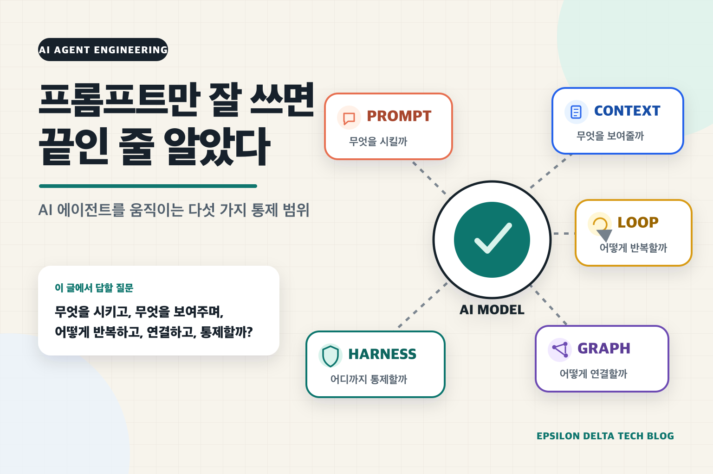
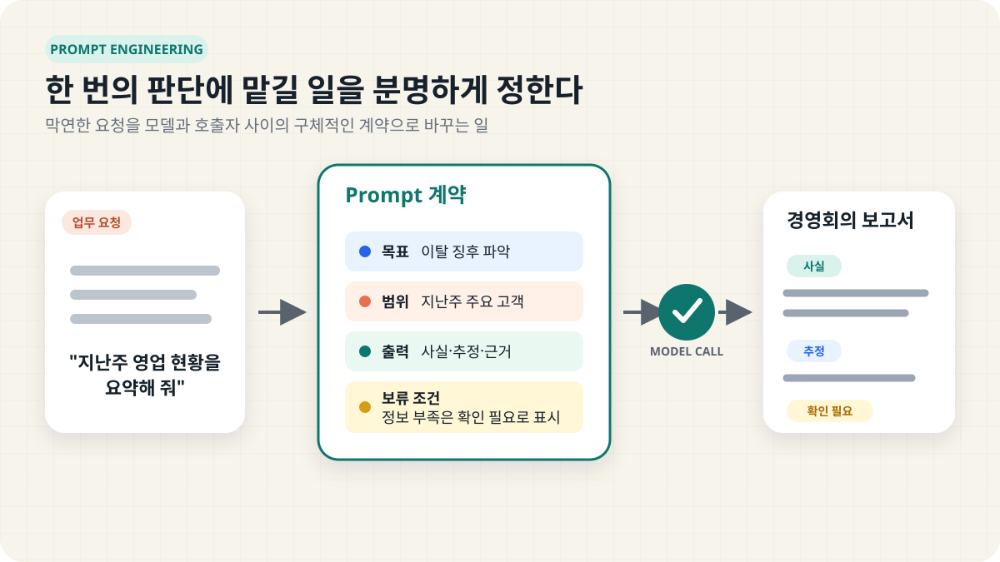
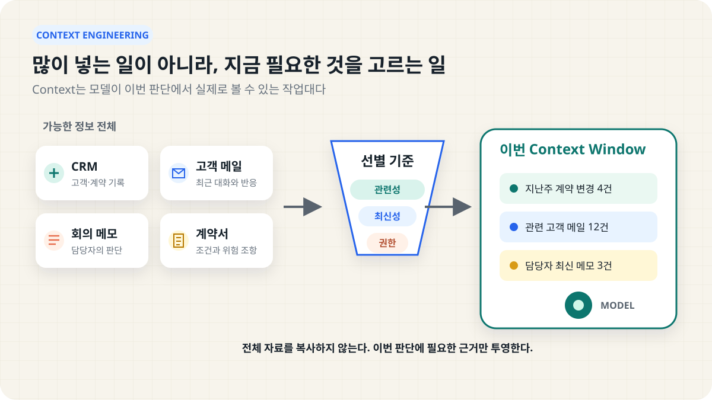
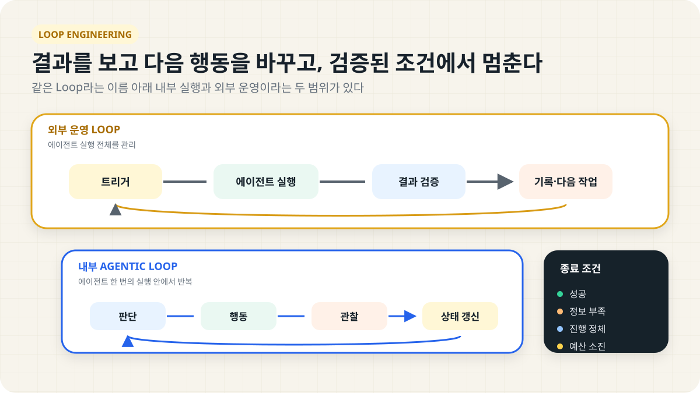
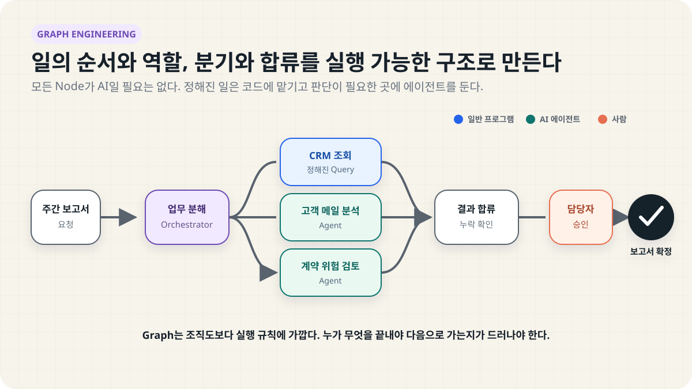
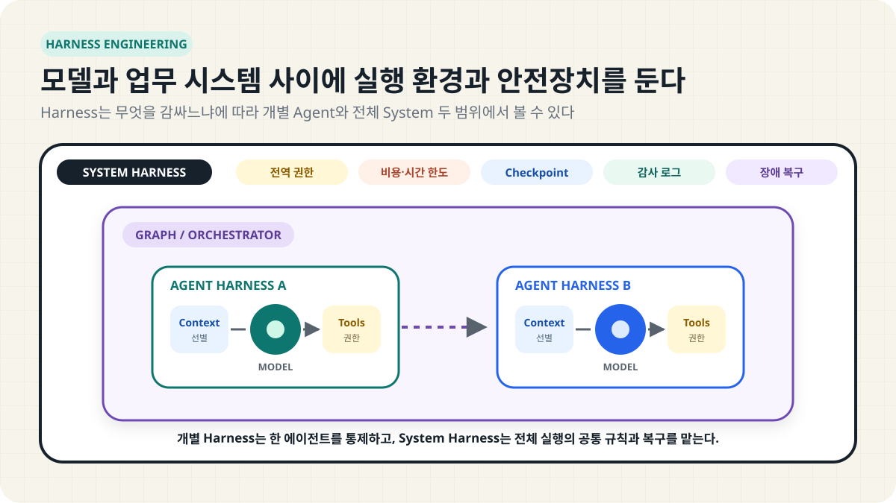

+++
date = '2026-09-04T11:30:22+09:00'
draft = true # Change to false to publish
title = '프롬프트만 잘 쓰면 끝인 줄 알았다: AI 에이전트 엔지니어링 겉핥기'
description = 'Prompt, Context, Loop, Graph, Harness Engineering은 무엇이 다르고 실제 업무에서는 어떻게 함께 쓰일까?'
tags = ['ai', 'agent', 'prompt-engineering', 'context-engineering', 'loop-engineering', 'graph-engineering', 'harness-engineering']
authors = ['geoff']
featured_image = 'thumbnail-v2.png'
images = ['thumbnail-v2.png'] # e.g. ['thumbnail.png']
slug = 'five-scopes-of-agent-engineering' # uri. e.g. 'awesome-post-name'
audio = []
vedios = []
series = []
toc = true
+++



## 들어가며

요즘 AI 관련 글을 읽다 보면 이름부터 숨이 찹니다. Prompt Engineering을 겨우 이해했더니 Context Engineering이 나오고 이제는 Loop, Graph, Harness Engineering까지 알아야 한다고 합니다. 이름만 보면 어제까지 쓰던 기술이 오늘 아침에 폐기된 것 같습니다.

실제로는 그렇지 않습니다. Context Engineering이 나왔다고 Prompt Engineering이 끝난 것도 아니고 Graph Engineering이 Loop Engineering의 상위 호환인 것도 아닙니다. 대부분 이미 소프트웨어를 만들 때 다루던 문제에 새 이름이 붙었습니다. LLM이 한 번 답하는 수준을 넘어 도구를 쓰고 여러 단계의 업무를 수행하며 실제 시스템까지 건드리기 시작하자 예전에는 잘 보이지 않던 경계가 눈에 띄기 시작했습니다.

오늘은 이 다섯 가지를 겉만 훑어보겠습니다. 깊은 구현 방법보다 각각 무엇을 책임지는지, 문제가 생겼을 때 어디부터 봐야 하는지를 살펴보려 합니다.

| 구분 | 가장 먼저 던질 질문 | 담당하는 범위 |
|---|---|---|
| Prompt | 이번에 무엇을 시킬 것인가? | 한 번의 모델 호출에 주는 지시와 출력 형식 |
| Context | 판단에 필요한 무엇을 보여줄 것인가? | 문서, 데이터, 대화 이력, 도구 결과 |
| Loop | 결과를 보고 다음 행동을 어떻게 정할 것인가? | 반복, 검증, 진척, 종료 조건 |
| Graph | 여러 일과 담당자를 어떻게 연결할 것인가? | 순서, 분기, 병렬 작업, 승인, 공유 상태 |
| Harness | 이 일을 어떤 환경과 제한 안에서 실행할 것인가? | 도구, 권한, 예산, 기록, 복구 |

이 표를 성숙도 순서로 볼 필요는 없습니다. 단순한 문서 분류라면 Prompt와 Context만으로 충분합니다. 관찰한 결과에 따라 다음 행동이 바뀌면 Loop가 필요하고 여러 부서나 에이전트가 함께 움직이면 Graph를 고민하게 됩니다. 에이전트가 파일을 바꾸거나 고객에게 메시지를 보내고 운영 시스템을 건드린다면 Harness가 중요해집니다.

더 복잡한 구조를 쓴다고 더 좋은 시스템이 되는 것도 아닙니다. 내가 해결하려는 문제에 필요한 만큼만 쓰는 편이 낫습니다.

## 태초에 Prompt Engineering이 있었다

Prompt Engineering은 한 번의 모델 호출에 맡길 일을 분명하게 정하는 작업입니다. 단순히 말을 예쁘게 쓰는 요령과는 조금 다릅니다. 무엇을 해야 하는지, 무엇을 하면 안 되는지, 어떤 형식으로 답해야 하는지 정하고 실제 사례로 시험하면서 고칩니다.

예를 들어 매주 월요일 아침에 경영회의용 영업 보고서를 만든다고 해보겠습니다.

> 지난주 영업 현황을 요약해 줘.

이 정도로 요청하면 보기 좋은 보고서는 나올 수 있습니다. 하지만 우리가 원하는 보고서인지는 알 수 없습니다. 경영진이 보고 싶은 것이 매출인지, 계약 지연인지, 고객 이탈 조짐인지도 정해지지 않았기 때문입니다.

요청을 다음처럼 좁히면 판단 기준이 생깁니다.

> 지난주 주요 고객의 계약 진행 상황과 이탈 징후를 경영회의용으로 정리해 줘. 확인된 사실과 추정을 구분하고, 판단 근거를 함께 표시해 줘. 정보가 부족한 고객은 임의로 결론 내리지 말고 확인 필요로 표시해 줘.


*그림 1. Prompt Engineering은 막연한 요청을 목표와 제약이 있는 한 번의 판단 계약으로 바꿉니다.*

역할, 관심 대상, 출력 형식, 근거 표시, 판단 보류 조건이 들어갔습니다. 이제 이 Prompt가 실제 고객 사례 30건에서도 제대로 작동하는지 평가하고 수정해야 합니다. [Google Cloud의 Prompt Engineering 문서](https://docs.cloud.google.com/gemini-enterprise-agent-platform/models/prompts/prompt-design-strategies)도 목표와 기대 결과를 먼저 정하고 체계적으로 테스트하는 반복 과정을 강조합니다.

Prompt를 잘 쓰는 것과 Prompt Engineering의 차이는 이전 글인 [그건 프롬프트 엔지니어링이 아닙니다](https://tech.epsilondelta.ai/posts/that-is-not-prompt-engineering/)에서 더 자세히 다뤘습니다.

## Prompt에서 Context로

아무리 지시가 정확해도 모델이 지난주 영업 자료를 보지 못했다면 제대로 된 보고서를 만들 수 없습니다. 더 강한 말투로 "정확하게 작성해"라고 요구해도 없는 사실이 생기지는 않습니다. 이때 필요한 것이 Context Engineering입니다.

Context는 모델이 이번 판단에서 볼 수 있는 정보 전체입니다. Prompt도 Context의 일부입니다. 여기에 CRM 기록, 회의 메모, 계약서, 사내 규정, 이전 대화, 사용할 수 있는 도구의 설명과 도구가 방금 돌려준 결과가 함께 들어갈 수 있습니다.

[Anthropic은 Context Engineering](https://www.anthropic.com/engineering/effective-context-engineering-for-ai-agents)을 제한된 Context Window에 어떤 정보를 넣고 유지할지 정하는 일로 설명합니다. 자료의 양보다 선별이 중요합니다. 지금 판단에 필요한 정보를 골라 최신 상태로 보여줘야 합니다.


*그림 2. Context Engineering은 모든 자료가 아니라 이번 판단에 필요한 근거를 선별합니다.*

영업 보고서 에이전트라면 이런 판단이 필요합니다.

- 지난 1년의 모든 메일 대신 지난주 변경 사항과 관련 대화만 읽힐 것인가
- CRM과 담당자 메모가 충돌하면 어느 쪽을 우선할 것인가
- 퇴사한 담당자의 오래된 메모를 계속 사용할 것인가
- 민감한 계약 금액과 개인정보를 어느 수준까지 보여줄 것인가
- 조회 실패를 "특이사항 없음"으로 처리하지 않고 "확인하지 못함"으로 남길 것인가

Context Engineering은 자료를 한꺼번에 밀어 넣는 일이 아니라 편집에 가깝습니다. 무엇을 넣느냐만큼 무엇을 빼느냐도 중요합니다. 긴 문맥에서는 중요한 정보가 묻히거나 오래된 정보와 충돌할 수 있습니다.

여기서 Context와 State도 구분해야 합니다. Context는 모델이 지금 보는 작업대이고 State는 시스템이 보관하는 업무 기록입니다. 누가 승인했는지, 어떤 고객을 이미 확인했는지, 실제로 메일을 보냈는지는 대화창에만 남겨서는 안 됩니다. 시스템이 따로 기록하고 필요할 때 일부만 Context로 불러와야 합니다.

## 한 번의 답변에서 Loop로

지금까지는 모델이 한 번 답하는 상황이었습니다. 하지만 실제 업무는 한 번에 끝나지 않습니다. 영업 보고서를 만들다가 계약 정보가 비어 있으면 CRM을 다시 조회해야 하고 고객 메일과 담당자 메모가 다르면 추가 자료를 찾아야 합니다. 자료를 확인한 뒤 처음 세운 판단을 바꿀 수도 있습니다.

이 과정을 가장 단순하게 그리면 이렇습니다.

```text
판단한다
→ 행동한다
→ 결과를 확인한다
→ 다음 행동을 다시 판단한다
→ 완료 조건을 만족할 때까지 반복한다
```

이것이 에이전트 안에서 돌아가는 Agentic Loop입니다. [ReAct 논문](https://arxiv.org/abs/2210.03629)은 추론과 행동을 번갈아 수행하고 외부에서 얻은 결과가 다음 판단에 반영되는 형태를 정리했습니다.

그런데 2026년에 자주 언급되는 Loop Engineering은 이보다 범위가 넓습니다. [Addy Osmani가 정리한 Loop Engineering](https://addyosmani.com/blog/loop-engineering/)은 사람이 매 단계마다 에이전트에게 다음 지시를 넣는 대신, 일을 찾아 맡기고 결과를 검사하고 다음 실행을 정하는 시스템을 설계하는 일에 가깝습니다.

두 Loop는 다음처럼 겹쳐 있습니다.

```text
외부 운영 Loop: 언제 일을 시작하고, 검증하고, 다시 맡길 것인가
└── 에이전트 한 번의 실행
    └── 내부 Agentic Loop: 도구를 쓰고 결과를 보며 다음 행동을 결정
```


*그림 3. 외부 운영 Loop가 에이전트 실행을 관리하고, 각 실행 안에서는 Agentic Loop가 돌아갑니다.*

이름은 같지만 보는 범위가 다릅니다. 아직 업계에서 하나의 정의로 합의된 용어도 아닙니다. 그래서 누군가 Loop Engineering을 말한다면 내부의 도구 사용 반복을 뜻하는지, 에이전트 실행 전체를 반복하는 운영 구조를 뜻하는지 먼저 확인하는 편이 좋습니다.

잘 만든 Loop에는 최소한 다음 내용이 있어야 합니다.

- 달성해야 할 목표
- 다음 행동을 바꿀 수 있는 피드백
- 결과가 맞는지 확인할 방법
- 성공, 정보 부족, 진행 정체를 구분하는 종료 조건
- 시간과 비용의 한도
- 다음 실행이 이어받을 업무 기록

모델이 "완료했습니다"라고 말하는 것만으로는 부족합니다. 보고서에 모든 주요 고객이 포함됐는지, 근거 링크가 실제 자료와 맞는지, 최신 CRM 정보가 반영됐는지를 별도로 확인해야 합니다. 확인 방법이 없다면 Loop는 같은 실수를 더 오래 반복할 수 있습니다.

매일 아침 시장 동향을 확인하거나 새로운 계약서가 들어올 때마다 위험 조항을 검토하는 업무는 Loop의 좋은 후보입니다. 반대로 결과와 상관없이 매일 같은 Prompt를 한 번 실행하는 것은 Loop라기보다 예약 작업에 가깝습니다.

## 여러 일을 엮는 Graph Engineering

영업 보고서가 커지면 한 에이전트가 모든 일을 순서대로 처리하는 방식도 답답해집니다. 한쪽에서는 CRM 변화를 확인하고 다른 쪽에서는 고객 메일을 살피며 별도 단계에서는 계약 위험을 검토할 수 있습니다. 결과가 모두 모인 뒤 담당자가 확인하고 경영회의 자료로 확정해야 할 수도 있습니다.

Graph Engineering은 이런 업무 관계를 눈에 보이는 실행 구조로 만드는 일입니다.


*그림 4. Graph에는 에이전트뿐 아니라 일반 프로그램과 사람의 승인도 함께 들어갈 수 있습니다.*

- Node는 에이전트, 일반 프로그램, 데이터 조회, 검증, 사람의 승인처럼 하나의 작업 단위입니다.
- Edge는 어떤 조건에서 다음 작업으로 넘어갈지를 나타냅니다.
- State는 여러 작업이 함께 읽고 갱신하는 업무 기록입니다.

Graph라는 말이 나왔다고 모든 Node를 AI 에이전트로 채울 필요는 없습니다. 매출 합계 계산, 권한 확인, 문서 형식 검사처럼 답이 정해진 작업은 일반 프로그램이 더 빠르고 안정적입니다. 고객별 위험 판단이나 여러 자료의 종합처럼 정답 경로를 미리 고정하기 어려운 부분에 에이전트를 두면 됩니다.

대표적인 구조는 익숙합니다. 작업을 순서대로 잇거나 종류에 따라 담당 경로를 나눕니다. 독립적인 조사는 동시에 진행한 뒤 결과를 합칩니다. 작성자와 검토자를 분리하거나 최종 단계에 사람의 승인을 넣는 것도 Graph로 표현할 수 있습니다. [Anthropic이 2024년에 소개한 Agent Workflow 패턴](https://www.anthropic.com/engineering/building-effective-agents)도 Prompt Chaining, Routing, Parallelization, Orchestrator-Workers, Evaluator-Optimizer와 같은 구조를 다룹니다.

Graph Engineering이라는 이름 자체는 매우 최근에 등장했습니다. [2026년 8월 공개된 관련 논문](https://arxiv.org/html/2608.21156)은 작업 구성, 에이전트 협업, 실행 상태를 Graph로 관리하는 관점을 제안합니다. 이름은 새롭지만 Workflow, 상태 머신, 분기와 병렬 실행은 예전부터 쓰던 소프트웨어 설계 방식입니다.

Graph를 복잡하게 만들수록 비용도 늘어납니다. Anthropic의 다중 에이전트 연구 시스템은 특정 내부 평가에서 단일 에이전트보다 높은 성능을 냈지만 일반 대화보다 약 15배 많은 토큰(AI 사용량)을 썼습니다. 연구처럼 여러 방향을 동시에 탐색할 수 있는 업무라면 이 비용을 감수할 만할 수 있습니다. 모든 업무에 적용할 근거는 아닙니다. [Anthropic의 다중 에이전트 연구 시스템 사례](https://www.anthropic.com/engineering/multi-agent-research-system)도 공유 정보가 많고 작업 의존성이 높은 분야는 다중 에이전트에 잘 맞지 않을 수 있다고 설명합니다.

한 에이전트로 충분한 일을 다섯 에이전트에게 나누면 회의 참석자만 늘린 것과 비슷한 결과가 나옵니다. 역할 중복과 빠진 업무가 생기고 결과를 합치는 일까지 새로 맡아야 합니다.

## 일을 실제로 굴리는 Harness Engineering

이제 영업 보고서 에이전트가 CRM과 메일을 읽고 부족한 정보를 찾아가며 여러 에이전트와 협업할 수 있게 됐다고 해보겠습니다. 기능은 그럴듯하지만 회사에서 바로 사용하기에는 아직 불안합니다.

고객 메일을 읽을 권한은 누구에게 줄까요? 보고서 작성 에이전트가 CRM까지 수정해도 될까요? 같은 작업이 두 번 실행되면 고객에게 메일이 두 번 발송되지는 않을까요? 작업 중간에 서버가 멈추면 처음부터 다시 시작해야 할까요? 한 번의 보고서에 얼마까지 써도 될까요?

Harness Engineering은 이런 실행 환경과 안전장치를 설계합니다. 모델을 더 똑똑하게 만드는 작업이 아닙니다. 모델이 가진 능력을 실제 업무에 연결하면서 어디까지 행동할 수 있는지 정하고 실패해도 피해를 줄인 채 다시 이어갈 수 있게 만듭니다.

Harness에는 보통 다음과 같은 장치가 들어갑니다.

- 사용할 수 있는 도구와 데이터 범위
- 사용자와 에이전트별 권한, 사람의 승인 절차
- 파일과 프로그램을 안전하게 실행할 격리 환경
- 시간, 반복 횟수, 토큰, 비용 한도
- 진행 상태와 작업 결과를 남기는 Checkpoint
- 재시도와 장애 복구, 중복 실행 방지
- 어떤 자료와 판단으로 행동했는지 확인할 기록

"고객에게 보내기 전에는 반드시 승인받아"라고 Prompt에 적는 것만으로는 부족합니다. 실제 발송 도구가 승인 기록을 확인해야 합니다. 위험한 행동을 막는 규칙은 모델이 말을 잘 듣기를 기대하는 대신 프로그램이 실행 시점에 강제해야 합니다.

Harness의 범위는 문서와 제품마다 다릅니다. [Claude Code의 공식 용어집](https://code.claude.com/docs/en/glossary)은 파일 접근, 명령 실행, 권한, 메모리와 행동 Loop를 모두 Harness에 포함합니다. [Anthropic의 Managed Agents 아키텍처](https://www.anthropic.com/engineering/managed-agents)는 Session, Harness, Sandbox를 별도 구성요소로 나눕니다. [OpenAI의 Harness Engineering 사례](https://openai.com/index/harness-engineering/)는 저장소 문서, 테스트, 관찰 도구, 피드백 과정까지 넓게 다룹니다.

그래서 Harness가 가장 안쪽인지 가장 바깥쪽인지를 두고 논쟁하는 것은 큰 도움이 되지 않습니다. 무엇을 감싸는 Harness인지 이름을 붙이면 정리가 쉽습니다.

| 구분 | 담당 범위 |
|---|---|
| 개별 Agent Harness | 한 에이전트의 Context, Tool Loop, 권한, 검증과 실행 제한 |
| 전체 System Harness | 여러 에이전트와 Graph의 공통 예산, 상태, 권한, 기록과 복구 |


*그림 5. 개별 Agent Harness와 전체 System Harness는 서로 다른 범위의 실행을 통제합니다.*

오케스트레이터가 별도로 있다면 개별 Harness는 각 에이전트를 관리할 수 있습니다. 그 오케스트레이터의 병렬 실행 수, 전체 비용, 승인 절차, 복구 정책을 강제하는 바깥 장치도 System Harness라고 부를 수 있습니다. Harness는 절대적인 위치보다 무엇을 실행하고 통제하느냐로 이해하는 편이 낫습니다.

## 문제가 생겼을 때 어디부터 볼까

용어를 외우는 것보다 증상과 연결하면 훨씬 쉽습니다.

| 증상 | 먼저 볼 곳 |
|---|---|
| 요청과 다른 일을 한다 | Prompt의 목표와 출력 조건 |
| 말은 자연스럽지만 사실이 틀리거나 오래됐다 | Context의 출처와 최신성 |
| 같은 실패를 반복하거나 너무 일찍 끝낸다 | Loop의 피드백과 종료 조건 |
| 여러 작업이 겹치거나 결과 일부가 빠진다 | Graph의 역할 분담과 합류 조건 |
| 재시작 후 중복 행동을 하거나 권한 밖의 일을 한다 | Harness의 기록, 권한과 복구 정책 |

좋은 Harness로 나쁜 Prompt를 감싼다고 결과가 좋아지지는 않습니다. 누락된 자료는 더 긴 지시로 만들어 낼 수 없으며 검증이 약한 Loop는 틀린 답을 부지런히 개선할 수도 있습니다. 문제를 발견하면 가장 가까운 범위부터 확인해야 합니다.

## 나가며

Prompt, Context, Loop, Graph, Harness Engineering을 모두 알아야 한다는 말이 거창하게 들릴 수 있습니다. 하지만 실제 질문은 단순합니다. 무엇을 시킬지, 어떤 자료를 보여줄지, 결과를 어떻게 확인할지, 여러 일을 어떤 순서로 맡길지, 어디까지 권한을 줄지를 정하는 일입니다.

이제 이런 구조를 직접 만들 수 있는 범용 도구도 많아졌습니다. [Hermes Agent](https://hermes-agent.nousresearch.com/)는 지속적인 메모리, 예약 실행, Subagent, 여러 통신 채널과 Sandbox 기능을 제공합니다. [Claude Code](https://code.claude.com/docs/en/overview)는 파일과 명령 실행, MCP 연결, Skill, Hook, 병렬 에이전트와 예약 작업을 지원합니다. 예전이라면 처음부터 개발해야 했을 부품을 이미 갖춘 셈입니다.

여기까지 보면 "그럼 하나 설치하고 사내 문서만 연결하면 되겠네"라는 생각이 들 수 있습니다. 실제 일은 그 다음부터 시작됩니다.

어떤 업무부터 맡길지 정하고 그 업무가 끝났다는 기준도 합의해야 합니다. 사내 문서와 시스템마다 접근 권한을 나누며 현업의 머릿속에만 있던 판단 기준을 에이전트가 쓸 수 있는 Context와 Skill로 바꿔야 합니다. 결과를 검증할 사람과 방법, 자동 실행을 멈출 조건, 사고가 났을 때 되돌리는 절차도 필요합니다. 운영을 시작한 뒤에는 실패 기록과 현업의 교정을 다시 시스템에 반영해야 합니다.

범용 에이전트는 일을 잘 배울 수 있는 신입에 가깝습니다. 회사 규정집만 건네고 바로 실무를 맡기지는 않듯 에이전트에도 업무 환경과 판단 기준, 확인 절차가 필요합니다. 그래서 같은 Hermes Agent나 Claude Code를 설치해도 조직마다 결과가 달라집니다.

이 작업에는 현업과 기술 양쪽의 이해가 필요합니다. 업무를 모르면 쓸모없는 자동화를 만들기 쉽고 에이전트의 Context, Loop, Graph와 Harness를 이해하지 못하면 시범 운영 이후에 막히기 쉽습니다. 이를 전담할 인력을 바로 갖추기 어려운 조직도 많습니다.

엡실론델타는 현업 업무를 함께 정리하고 가장 작게 검증할 수 있는 업무부터 에이전트 구조를 설계합니다. 사내 데이터와 도구를 연결하고 조직에 맞는 Context, Loop, Graph와 Harness를 구성한 뒤 실제 운영에서 개선되는 과정까지 돕고 있습니다.

우리 조직에도 에이전트를 적용하고 싶지만 어디서부터 시작해야 할지 막막하다면 `contact@epsilondelta.ai`로 연락해 주세요. 지금 필요한 것이 더 좋은 Prompt인지, 새로운 도구인지, 아니면 업무 구조를 다시 설계하는 일인지부터 함께 찾아보겠습니다.
