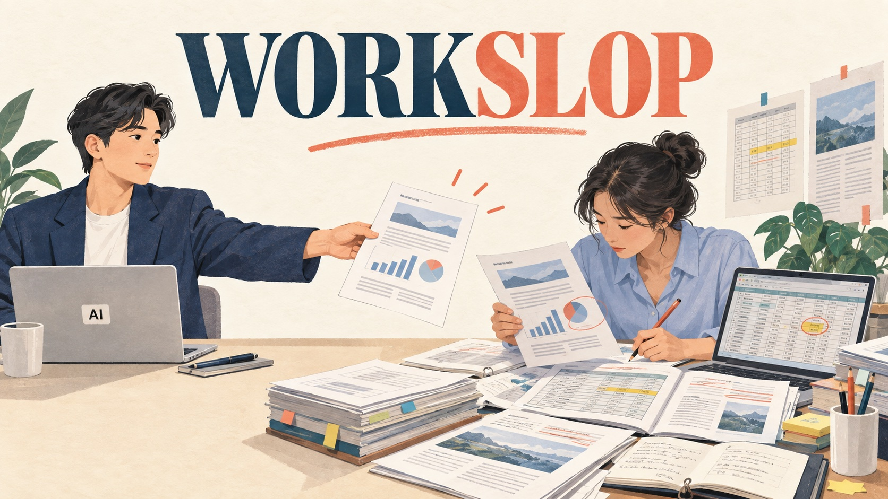
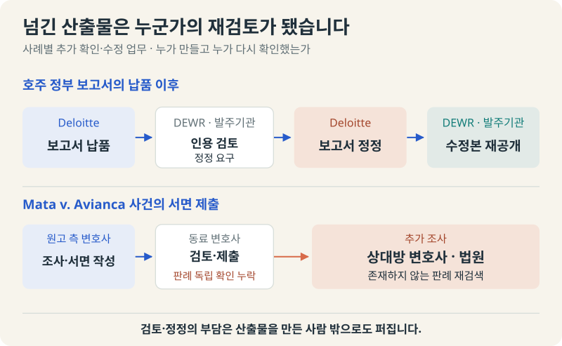
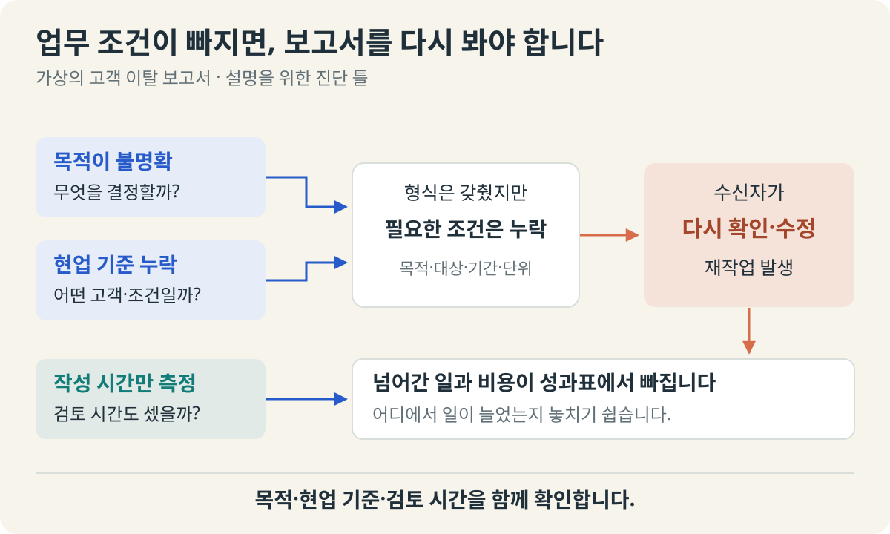
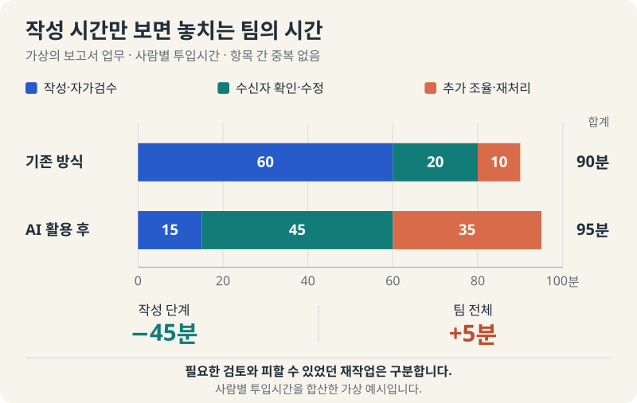
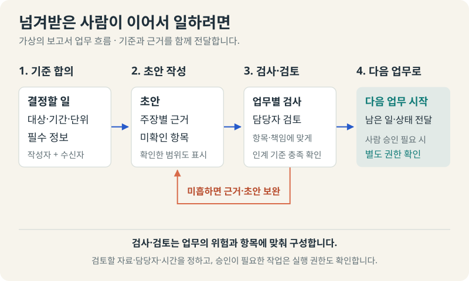
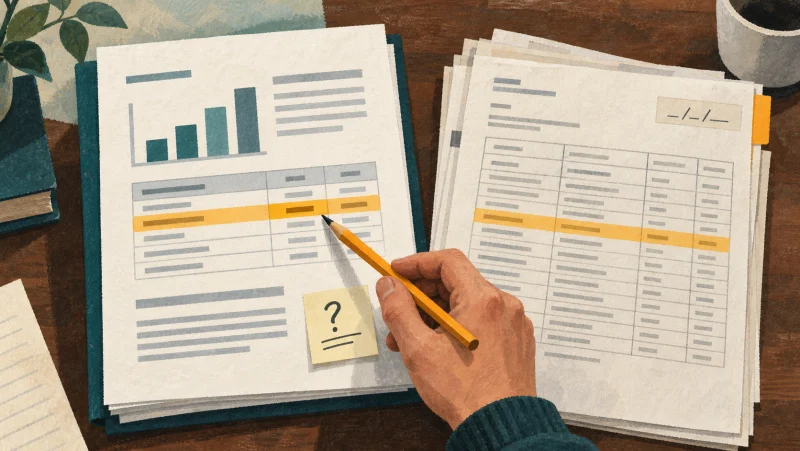
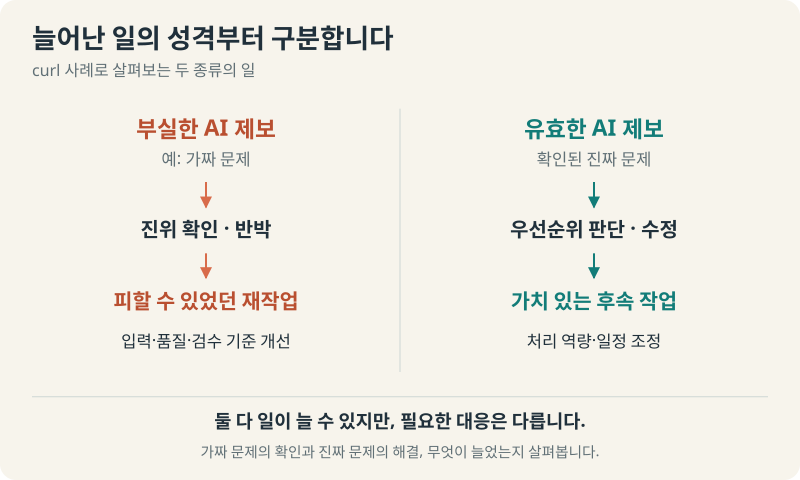
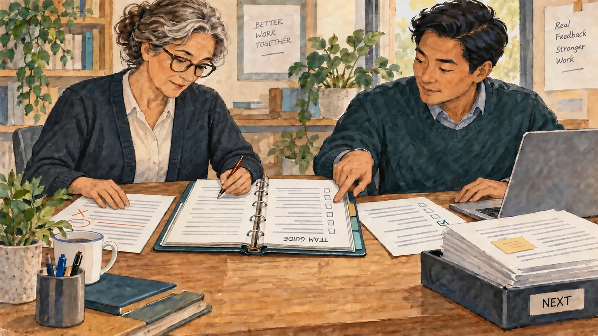

+++
date = '2026-09-09T00:00:00+09:00'
draft = true
title = 'Workslop이란? AI로 시간을 아꼈는데, 왜 팀은 더 바빠졌을까?'
description = 'AI가 빨리 만든 보고서를 동료가 다시 만들고 있다면? 실제 사례로 살펴보는 Workslop의 원인과 해결 방법, 팀 전체의 생산성을 확인하는 기준.'
tags = ['ax', 'ai', 'workslop', 'agent', 'productivity']
authors = ['geoff']
featured_image = 'thumbnail.jpg'
images = ['thumbnail.jpg']
slug = 'what-is-workslop'
audio = []
vedios = []
series = []
toc = true
+++

## 들어가며

*그림 1. 작성 단계가 빨라져도 결과물을 받은 사람에게 확인과 수정이 남을 수 있습니다.*

이런 회의를 상상해보겠습니다. 사업전략팀이 AI로 고객 이탈 분석 보고서를 만들었습니다. 표도 깔끔하고 고객 유형별 대응 전략도 있습니다. 예전보다 훨씬 빨리 작성했다는 설명에 임원도 고개를 끄덕입니다.

그런데 보고서를 읽던 영업팀장이 묻습니다.

> 그래서 이번 주에는 어느 고객부터 연락하면 되죠?

다시 보니 고객을 나눈 기준이 모호합니다. 매출은 어느 기간의 숫자인지 분명하지 않고 이미 계약을 갱신한 고객이 위험 고객에 들어 있습니다. 팀장은 원자료를 열고 기준을 확인합니다. 작성자는 데이터를 다시 넣습니다. 연락할 고객을 정하는 회의는 다음으로 미뤄집니다.

보고서를 만드는 시간은 줄었습니다. 팀의 일이 줄었는지는 아직 모르겠습니다.

이런 상황을 설명하는 말이 Workslop입니다. AI가 그럴듯한 결과물을 빠르게 내놓지만 다음 사람이 그 결과를 쓰려면 해석과 검증, 수정을 다시 해야 하는 문제입니다. AI를 도입한 뒤 작성자는 편해졌는데 검토하는 사람은 더 바빠졌다면 살펴볼 만한 개념입니다.

**AI의 성과를 보려면 작성 시간과 함께, 그 결과를 받아 쓰는 사람의 시간도 봐야 합니다.** 이 글에서는 실제로 재검증 업무가 생긴 사례를 살펴보고 원인과 해결 방법을 짚어보겠습니다. 우리 조직에서 AI가 줄인 일과 다른 사람에게 넘어간 일을 구분하면, 무엇부터 고쳐야 할지도 더 분명해질 겁니다.

## 그럴듯한 결과물에 동료의 할 일이 들어 있습니다

BetterUp Labs와 Stanford Social Media Lab은 Workslop이라는 말로 AI 산출물의 문제를 설명합니다. 겉으로는 업무를 완성한 것처럼 보이는데 실제 과제를 진전시키는 내용은 부족하다는 겁니다. 보고서와 이메일뿐 아니라 발표자료나 코드도 여기에 포함될 수 있습니다. [Workslop 소개](https://www.betterup.com/workslop)

포장을 뜯으면 바로 쓸 줄 알았는데 조립부터 해야 하는 물건을 받은 것과 비슷합니다. 무엇이 덜 끝났는지 미리 알려줬다면 준비라도 할 수 있었겠죠. 완료됐다는 말을 믿고 다음 일을 시작하려다 보니 받는 사람의 일정까지 틀어집니다.

*그림 2. 바로 쓸 것으로 기대한 결과물을 받았는데, 사용하기 위한 작업이 더 필요한 상황을 비유한 그림입니다.*

반드시 거짓 정보가 있어야만 Workslop이라고 하는 것은 아닙니다. 있어야 할 정보가 빠진 경우도 있습니다. 후속 조치를 공유하려고 만든 회의록에서 이미 정한 담당자와 할 일이 빠지면 누군가 다시 녹취를 들어야 합니다. 사업 방안을 결정하려고 받은 동향 보고서에 우리 회사의 선택지와 비교 근거가 빠졌다면 분석을 추가로 해야 합니다. 처음부터 단순 요약이나 동향 수집만 요청했다면 여기까지로 충분합니다. 하지만 의사결정에 필요한 분석까지 요청했다면, 받는 사람이 추가 분석을 해야 하니 일을 두 번 하는 꼴입니다.

그래서 초안에는 검토가 필요합니다. 어디까지 확인했고 무엇을 함께 결정할지 밝힌 초안을 주고받는 것은 정상적인 협업입니다. 확인하지 않은 내용을 표시하지 않고 완성본처럼 넘겨 버리면, 받은 사람은 어떤 내용을 추가로 확인하고 검증해야 하는지부터 찾아야 합니다. 사람이 쓴 것처럼 문체를 다듬어도 빠진 근거와 판단이 저절로 채워지지는 않습니다.

[BetterUp은 2025년 미국 전일제 사무직 1,150명을 대상으로 workslop에 대한 설문 조사](https://www.betterup.com/workslop)를 진행했습니다. 응답자의 약 40%가 지난 한 달 동안 이런 Workslop이 존재하는 산출물을 받았다고 답했고 한 건을 처리하는 데 걸렸다고 추정한 시간은 약 두 시간이었습니다. 이 시간은 직접 측정한 값이 아니라 자기보고 설문에서 응답자가 기억을 바탕으로 추정해 답한 값입니다. 또한 조사 대상과 업무 환경은 회사마다 서로 상이합니다. 따라서 우리 회사에 이 설문과 같은 비율과 시간이 적용되지는 않을 겁니다. 그렇기 때문에 우리 회사에서도 AI 사용으로 인한 생산성과 작업 속도를 판단하려면 작성자가 아낀 시간뿐 아니라, 받은 사람이 확인하고 수정하는 데 쓴 시간도 함께 봐야 합니다.

## 실제 업무에서는 누가 뒤처리를 했을까?

*그림 3. 두 사례에서 결과물을 전달한 뒤 누구에게 추가 확인·수정 업무가 생겼는지 정리했습니다.*

### 검토 보고서를 다시 검토한 호주 정부

호주 고용·노사관계부 DEWR는 Deloitte로부터 보고서를 납품받았습니다. 복지수급자의 의무 이행을 관리하는 TCF의 운영 정책과 업무 규칙, IT 시스템을 검토한 보고서였습니다. 그런데 보고서가 공개된 뒤 참고문헌과 인용에 오류가 있다는 문제가 제기됐습니다.

정부는 Deloitte에 참고문헌과 인용을 전반적으로 다시 확인하고 오류를 바로잡도록 요구했습니다. [검토 과정](https://www.dewr.gov.au/download/17304/correspondence-relating-targeted-compliance-framework-assurance-review/41491/correspondence-relating-targeted-compliance-framework-assurance-review/pdf)에서는 출처를 찾을 수 없는 참고문헌과 잘못된 인용 등 수정하거나 추가로 확인해야 할 항목이 여러 건 드러났습니다.

Deloitte는 이미 납품한 보고서의 출처를 재확인하고 내용을 수정해야 했습니다. 정부도 이미 공개했던 보고서를 수정본으로 교체해 다시 공개했습니다. 현재 [공식 안내 페이지에는 2026년 2월 3일 수정본이 이전 공개본을 대체했다고 명시](https://www.dewr.gov.au/assuring-integrity-targeted-compliance-framework/resources/targeted-compliance-framework-assurance-review-final-report)돼 있습니다. 보고서를 한 번 작성해 전달하는 것으로 끝날 일이 아니었던 겁니다.

*그림 4. 인용과 출처를 대조하며 보고서를 재검토하는 가상 장면입니다. AI로 생성한 이미지입니다.*

다만 모든 오류를 AI가 만들었다고 단정할 수는 없습니다. [2025년 9월 수정본에 관한 서신](https://www.dewr.gov.au/el/download/17410/correspondence-relating-targeted-compliance-framework-assurance-review-final-report/41820/correspondence-relating-targeted-compliance-framework-assurance-review-final-report/pdf)은 기술 분석에 승인된 AI를 사용한 일과 인용을 수작업으로 정리한 일을 구분해 설명합니다.

작성자가 AI로 얼마나 시간을 아꼈는지는 공개된 자료로 알 수 없습니다. 하지만 납품 이후 정부와 Deloitte가 추가 작업을 해야 했다는 것은 확인됩니다. 이 업무의 생산성을 판단하려면 보고서를 처음 작성한 시간뿐 아니라, 오류를 찾고 보고서를 고쳐 다시 공개하는 데 들어간 시간도 함께 계산해야 합니다.

### 동료 변호사가 넘긴 판례를 법원이 다시 찾았습니다

2023년 미국의 Mata v. Avianca 사건에서는 원고 측 로펌의 변호사가 ChatGPT로 조사한 존재하지 않는 판례를 서면에 넣었습니다. 이를 제출한 동료 변호사는 문체와 흐름은 살폈지만 판례를 독립적으로 확인하지 않았다고 설명했습니다. 즉, 이 사례에서는 검토하는 사람이 아예 없었던 상황도 아니었습니다. 하지만 검토자는 이런 문제를 잡아내지 못했습니다.

이후 상대방 변호사와 법원은 그 판례를 찾기 위해 다시 조사했습니다. 법원은 [해당 사건의 결정문](https://docs.justia.com/cases/federal/district-courts/new-york/nysdce/1:2022cv01461/575368/54)을 통해 이로 인한 상대방의 시간·비용 낭비와 법원 자원 소모를 지적합니다. 두 변호사와 로펌에 내려진 공동·연대 책임 제재액은 미화 5,000달러였습니다.

*그림 5. 서면에 적힌 판례를 찾고 확인하는 데 추가 조사가 필요한 상황을 그린 개념 일러스트입니다.*

이 사례에서는 검토 내용을 눈여겨볼 만합니다. 잘 읽히는 서면인지 살피는 일과 인용한 판례가 실제로 존재하는지 확인하는 일은 다릅니다. 기업에서도 검토자를 지정할 때 무엇을 확인할지까지 정해야 합니다. 이름만 검토자로 올려놓으면 확인 업무가 사라지는 것은 아니니까요.

## 왜 AI를 쓰면서 이런 일이 생길까요?

처음의 고객 이탈 보고서로 돌아가 보겠습니다. 고객을 분석해 달라는 요청만 받으면 AI는 그럴듯한 분석 항목을 채울 수 있습니다. 하지만 이번 주에 연락할 고객을 고르려는 것인지, 다음 분기 상품을 개선하려는 것인지에 따라 필요한 자료와 결론은 달라집니다. 보고서의 모양은 합의했는데 그 보고서로 결정할 일을 합의하지 않은 셈입니다.

현업이 당연하게 여기는 조건도 빠지기 쉽습니다. 계약을 갱신한 고객은 제외한다거나 특정 매출에는 일회성 거래를 빼야 한다는 기준 말입니다. 이런 조건이 자료나 지침에 없다면 작성자는 결과가 그럴듯하다고 느껴도 실제 고객을 아는 담당자는 쓸 수 없다고 판단할 수 있습니다. 앞선 [암묵지 자산화 글](https://tech.epsilondelta.ai/posts/ax-tacit-knowledge-assetization/)에서 다룬 문제가 산출물의 품질로 드러나는 경우입니다.

*그림 6. 결과물을 만들기 전에 필요한 목적과 조건을 정하고, 받은 사람의 검토·수정 시간까지 확인해야 합니다.*

AI가 만든 같은 매출 보고서라도, 빈칸이 보이는 경우와 필요한 항목 자체가 없는 경우는 다릅니다. 아래는 그 차이를 보여주기 위한 가상 예시입니다.

**값이 비어 있는 경우**

(단위: 백만원)

| 구분 | 내용 |
|---|---|
| 매출 집계 기간 | |
| 매출액 | 1,450 |
| 매출 구성 | 백색 가전 40%, TV·영상기기 35%, 기타 25% |

이 표에서는 '매출 집계 기간'이라는 항목 옆의 값이 비어 있습니다. 사용자는 누락을 바로 알아보고 AI에게 왜 비어 있는지 묻거나 해당 값을 채워 달라고 요청할 수 있습니다.

**항목과 단위 자체가 빠진 경우**

| 구분 | 내용 |
|---|---|
| 매출액 | 1,450 |
| 매출 구성 | 백색 가전 40%, TV·영상기기 35%, 기타 25% |

두 번째 표는 눈에 보이는 빈칸 없이 모두 채워져 있습니다. 하지만 집계 기간 항목 자체가 없어서 이 숫자가 1분기 매출인지, 작년 전체 매출인지, 반기 매출인지 알 수 없습니다. 금액 단위도 없어 1,450이 천원 단위인지, 백만원 단위인지, 억원 단위인지도 알 수 없습니다.

이 경우에는 사용자가 보고서를 읽으면서 집계 기간과 금액 단위가 빠졌다는 사실부터 찾아내야 합니다. 따라서 표와 설명이 모두 채워져 있더라도 해당 업무에 필요한 정보와 조건이 빠지지 않았는지 확인해야 합니다. AI에게 누락된 내용을 보완해 달라고 요청한 뒤에도, AI가 작성한 내용이 원자료와 업무 기준에 맞는지 검토해야 합니다.

경영진이 보는 성과표에도 빈칸이나 누락된 부분이 있을 수 있습니다. 작성자는 보고서 생성 시간을 줄였다고 보고하지만 팀장이 확인한 시간과 재무팀에 다시 물어본 시간은 기록하지 않습니다. 처리한 문서 수는 늘었는데 그 문서로 끝낸 업무가 얼마나 늘었는지는 모르는 상태입니다. 이 상황에서 AI 사용량만 더 늘리라고 하면 확인해야 할 산출물부터 많아질 수 있습니다.

그렇다고 직원이 게을러졌다고 결론 내리기는 이릅니다. 무엇을 확인해야 하는지 몰랐을 수도 있고 원자료를 볼 권한이 없었을 수도 있습니다. 검토를 맡길 사람은 정했지만 그 사람의 기존 업무는 그대로였을 수도 있습니다. 저희는 누가 AI로 대충 썼는지 찾기 전에, 어디에서 필요한 기준과 검토 여유가 빠졌는지 같이 보는 편이 좋다고 생각합니다.

## 회사의 시간은 어디에서 계산해야 할까?

숫자로 한번 보겠습니다. 아래는 실제 기업의 측정치가 아닌 가상의 보고서 업무입니다. 각 항목의 시간은 서로 겹치지 않는다고 가정합니다.

| 사람의 투입시간 | 기존 방식 | AI 활용 후 |
|---|---:|---:|
| 작성·자가검수 | 60분 | 15분 |
| 수신자 확인·수정 | 20분 | 45분 |
| 추가 조율·재처리 | 10분 | 35분 |
| 합계 | 90분 | 95분 |

작성 단계에서는 45분을 아꼈습니다. 그런데 팀 전체가 쓴 시간은 5분 늘었습니다. 조직 전체의 시간이 늘었음에도 작성자는 시간이 줄었다고 답했습니다. 이는 작성자가 거짓말을 한 것이 아닙니다. 작성 시간만 물었으니 작성 시간만 답한 겁니다.

*그림 7. 위 가상 계산을 같은 척도로 비교했습니다. 작성 단계에서 줄어든 45분만 보면 팀 전체가 추가로 쓴 5분을 놓칩니다.*

이 계산은 사람별로 실제 투입한 시간을 더한 것입니다. 회신을 기다린 시간이나 고객에게 결과를 전달하기까지의 경과시간은 따로 봐야 합니다. 여러 사람이 동시에 검토했다면 각자의 투입시간을 합산한 값과 일정상 걸린 시간도 다릅니다.

반대로 AI가 작성 시간을 크게 줄이고 검토 부담은 조금만 늘렸다면 전체 효과는 긍정적일 수 있습니다. 같은 시간으로 더 가치 있는 분석을 하게 됐을 수도 있습니다. "검토 시간 자체를 없애겠다"는 목표는 실현 불가능에 가깝습니다. 그러니 필요한 검토와 피할 수 있었던 재작업을 나눠보는 것이 좋겠습니다.

월간 AX 보고서에도 이 구분을 넣어볼 수 있습니다. 얼마나 빨리 만들었는지에 더해 큰 수정 없이 다음 업무에 사용한 비율, 반려된 이유, 최종 완료까지 걸린 시간을 봅니다. 평균만 보면 특정 팀장이나 전문가에게 몰린 부담이 가려질 수 있으니 누가 어떤 확인을 반복하는지도 살펴봅니다.

## 해결은 받는 사람의 업무에서 시작합니다

*그림 8. 작성자와 받는 사람이 보고서의 목적과 필요한 정보를 함께 확인하는 가상 장면입니다. AI로 생성한 이미지입니다.*

### 넘겨도 되는 기준을 함께 정합니다

보고서를 만드는 사람에게 잘 써 달라고 요청하기 전에 받는 사람과 기준을 맞춰봅니다. 처음 예시라면 연락할 고객을 고르는 데 필요한 정보가 무엇인지부터 정할 수 있습니다. 단순히 고객 유형을 분류하는 것보다 구체적인 요청이 됩니다.

| 보고서에 담을 것 | 받는 사람이 확인할 수 있는 내용 |
|---|---|
| 이번 보고서의 목적 | 이번 주에 연락할 고객과 우선순위를 결정한다 |
| 대상·제외 조건 | 어떤 고객을 분석했고 갱신 완료 고객은 어떻게 처리했는가 |
| 숫자의 근거 | 매출의 기간·정의·원자료 위치가 무엇인가 |
| 해석과 미확인 사항 | 확인한 사실과 추정, 추가로 물어볼 내용을 구분한다 |
| 요청하는 판단 | 담당자가 어떤 결정을 내리면 다음 작업을 시작할 수 있는가 |

이 표를 모든 보고서에 그대로 붙이자는 뜻은 아닙니다. 받는 사람이 처음부터 다시 조사하지 않으려면 어떤 정보가 필요한지 합의하자는 것입니다. 초안이면 초안이라고 표시하고 확인하지 못한 부분은 남겨둡니다. 빈칸을 숨기지 않으면 검토자도 확인할 곳을 알 수 있습니다.

앞선 [Agent Skills 글](https://tech.epsilondelta.ai/posts/what-are-agent-skills/)에서 소개한 스킬에는 이런 기준도 담을 수 있습니다. 작성 순서와 양식뿐 아니라 어떤 경우에 질문하고 보류할지, 넘길 때 어떤 근거와 미확인 항목을 포함할지 정하는 겁니다. 실제 업무 사례로 [스킬을 쓴 결과와 쓰지 않은 결과를 비교하고 이전에 없던 요청에서도 잘 작동하는지 시험](https://agentskills.io/skill-creation/evaluating-skills)해야 합니다. 파일을 만들었다고 지침이 항상 지켜지는 것은 아닙니다.

*그림 9. 결과물과 함께 근거·미확인 항목을 넘기고, 업무에 맞는 검사와 검토를 거치는 인계 예시입니다.*

### 확인할 근거를 결과물 옆에 둡니다

검토자에게 원자료까지 알아서 찾아보라고 하면 여전히 많은 일이 남습니다. 주요 숫자에 어느 문서의 어떤 표를 썼는지 연결하고 기간과 단위도 표시합니다. 합계나 필수 항목처럼 코드로 검사할 수 있는 부분은 검사 결과를 함께 붙일 수 있습니다. 같은 고객을 분석했는지, 최신 정책을 적용했는지처럼 업무 맥락이 필요한 확인은 현업 담당자가 볼 수 있도록 드러냅니다.

*그림 10. 결과물의 주장이나 숫자를 원자료의 해당 위치와 함께 볼 수 있게 준비하면 검토할 대상을 찾기 쉽습니다.*

사내 문서를 검색해 답변에 쓰는 RAG를 붙여도 검색된 자료가 현재 업무에 맞는지 확인해야 합니다. 오래된 정책을 정확하게 인용한 보고서도 지금의 의사결정에는 틀릴 수 있습니다. [링크가 달려 있는지와 그 링크가 주장을 뒷받침하는지는 각각 확인](https://learn.microsoft.com/en-us/azure/architecture/ai-ml/guide/rag/rag-llm-evaluation-phase)할 문제입니다.

AI가 단순 텍스트 생성뿐 아니라 동작이나 처리까지 맡는다면 해당 동작·처리의 최종 상태도 확인합니다. 고객 연락 대상을 CRM에 등록했다고 답했을 때는 실제로 올바른 고객이 등록됐는지 보는 겁니다. 문장이 자연스러운지, 파일이 만들어졌는지, 업무가 끝났는지는 서로 다른 확인 항목입니다. [Anthropic의 에이전트 평가 가이드](https://www.anthropic.com/engineering/demystifying-evals-for-ai-agents)도 실행 기록과 실제 환경의 결과를 구분합니다.

### 검토를 맡길 사람에게 자료와 시간도 줍니다

[Zapier의 내부 운영 사례](https://zapier.com/blog/how-zapier-uses-ai/)가 참고할 만합니다. 기술지원 담당자가 Typeform에 장애 정보를 넣으면 AI가 팀의 템플릿과 규칙에 맞춰 공지 초안을 작성합니다. 이후 Slack에서 승인을 받고 승인된 문구를 상태 페이지에 게시합니다. 누가 입력하고 무엇을 기준으로 작성하며 어떤 결과를 승인할지 업무 흐름 안에 들어 있습니다.

Zapier는 이 구성만으로 Workslop이 얼마나 줄었는지 공개하지 않고 있습니다. 다만 업무 시스템에서 AI가 만든 문구를 바로 고객에게 보내지 않고 검토와 게시를 나눠 운영하는 사례로 볼 수 있습니다. 검토자는 문구만 읽는 것이 아니라 장애의 범위와 고객에게 알릴 내용을 확인할 수 있어야겠죠.

우리 회사에서도 검토할 항목과 담당자, 처리할 시간을 함께 정해야 합니다. 사람 승인이 필요한 업무라면 지침에 이를 명시하고 승인 없는 발송을 막는 권한 설정도 함께 마련해야 합니다. 이미 바쁜 전문가에게 AI 결과물을 전부 확인하라고 하면 일이 거기에서 막힐 수 있습니다. [오류가 났을 때 되돌리기 어려운 업무는 엄격하게 보고 위험이 낮고 반복적인 항목은 자동 검사로 덜어내는 식](https://code.claude.com/docs/en/permissions)으로 나눌 수 있습니다.

*그림 11. 검토자를 정할 때는 확인할 자료와 처리할 시간도 함께 준비해야 합니다.*

운영하면서 받은 수정 요청은 다음 업무에 남겨야 합니다. 고객의 단순 입력 실수인지, 바뀐 정책을 못 찾았는지, 회사의 기준을 AI에게 알려주지 않았는지 원인을 나눠 봅니다. 매번 답변만 고치면 같은 설명을 계속하게 됩니다. 현업의 교정을 확인한 뒤 지침·자료·검사 방법에 반영하고 다시 시험하는 과정이 필요합니다.

## 바빠졌다고 모두 Workslop은 아닙니다

한 가지는 더 구분하고 싶습니다. AI가 제대로 일을 해도 팀이 바빠질 수 있습니다. curl의 보안 제보 사례를 보면 이 차이가 드러납니다.

curl은 인터넷 통신에 널리 쓰이는 오픈소스 도구입니다. 책임 개발자는 2026년 1월 부실한 AI 제보를 확인하고 반박하는 데 드는 시간과 부담을 설명했습니다. 프로젝트는 부실 제출의 유인을 줄이려 [금전 보상 프로그램을 종료](https://daniel.haxx.se/blog/2026/01/26/the-end-of-the-curl-bug-bounty/)하기로 했습니다. 보안 제보를 전부 받지 않겠다는 조치는 아니었습니다.

그런데 [같은 해 4월의 설명](https://daniel.haxx.se/blog/2026/04/22/high-quality-chaos/)은 달라졌습니다. 제보량이 더 늘었지만 품질도 좋아졌고 유효한 취약점을 찾는 비율도 회복됐다고 합니다. 이제는 가치 있는 발견을 검토하고 수정하는 데 필요한 사람이 부족해질 수 있는 상황이었습니다. 보상을 없앤 효과를 따져보자는 게 아니라, AI가 실수로 만들어낸 **가짜 문제**를 확인하느라 바쁜 것과 AI가 찾아낸 **진짜 문제**를 해결하느라 바쁜 것을 구분해 보자는 얘기입니다.

*그림 12. curl 사례에서 구분하려는 두 종류의 일입니다. 가짜 문제를 확인하는 일과 진짜 문제를 해결하는 일 모두 사람을 바쁘게 할 수 있습니다.*

**쓸 수 없는 결과물을 다시 만드는 일과, 쓸 만한 결과가 늘어서 생긴 일은 구분해야 합니다.** 전자라면 입력과 품질·검수 기준을 고칠 필요가 있습니다. 후자라면 우선순위와 처리 역량을 조정할 문제일 수 있습니다. 팀이 바쁘다는 사실만으로 AI가 실패했다고 판단하면 좋은 변화까지 놓칠 수 있습니다.

## 나가며

Workslop이 발생할 수 있다고 해서 AI가 만든 결과물을 전부 부실하다고 의심하자는 말이 아닙니다. 우리 조직에서 업무가 어디까지 끝났고 누가 남은 일을 하고 있는지 확인하는 질문으로 쓰면 좋겠습니다. 작성자에게는 완료된 일이 받는 사람에게는 시작도 안 된 일일 수 있습니다.

앞서 살펴본 기준과 근거, 검토 절차를 마련하다 보면 숙련자의 노하우도 드러납니다. 평소에는 말로 꺼내지 않았던 내용입니다. 이 고객은 왜 제외해야 하는지, 이 숫자는 어떤 조건에서만 비교할 수 있는지 같은 설명입니다. 그런 교정을 확인하고 스킬과 검사 방법에 남기면 다음 직원과 에이전트가 다시 활용할 수 있습니다. [암묵지를 자산화하는 일](https://tech.epsilondelta.ai/posts/ax-tacit-knowledge-assetization/)이 실제 업무의 재작업을 줄이는 방향으로 연결되는 겁니다.

*그림 13. 현업의 교정을 확인해 공통 지침에 남기고 다음 작업에서 다시 활용하는 모습입니다.*

막상 이런 식으로 구성하려면 고려할 것이 많습니다. 현업이 받아들일 산출물 기준을 정하고 원천 데이터를 연결해야 합니다. 예외·권한·승인 절차를 구현하고 검토자를 포함한 업무 전체가 나아졌는지 평가해야 합니다. 현업의 경험과 에이전트를 만들고 운영하는 기술적인 노하우가 함께 필요한 일입니다.

우리 엡실론델타는 이런 업무 흐름을 진단하고 현업의 판단 기준을 스킬과 도구로 구현하는 일부터 검증·운영까지 함께 도와드릴 수 있습니다. AI를 도입했는데 보고서 확인과 수정 때문에 더 바빠졌다면 [contact@epsilondelta.ai](mailto:contact@epsilondelta.ai)로 연락 주세요. 최근 만든 보고서 하나와 되돌아온 수정 요청부터 함께 살펴보겠습니다. 우리 조직의 시간이 어디에서 다시 쓰이고 있는지 확인하고 다음 사람이 그대로 이어서 일할 수 있는 결과를 만드는 방법을 찾아보겠습니다.
