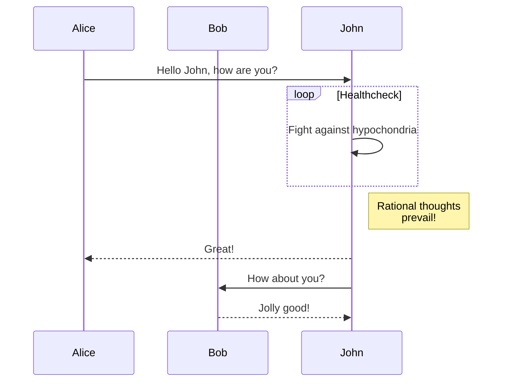

+++
date = '2025-03-15T22:54:35+09:00'
draft = false # Change to false to publish
title = '원래는 기술블로그만 만들려고 했었다'
description = '그런데 마음에 드는 Hugo 테마가 없어서 직접 만들고 배포까지 해버렸다능...'
tags = ['hugo', 'theme']
authors = ['juunini']
featured_image = 'thumbnail.jpg' # e.g. 'thumbnail.png'
slug = 'create-hugo-blog-with-theme' # uri. e.g. 'awesome-post-name'
audio = []
vedios = []
series = []
images = ['thumbnail.jpg']
+++


회사 홈페이지도 당장 없긴 한데, 개발 할 아이템을 내세워 회사 홈페이지를 만들려니 당장 기획이 쉽지 않았습니다.
그러다보니 당장 만들기 어렵지 않은 기술블로그부터 만드는게 쉬울까 싶었구요.

## TL;DR

- Hugo 테마를 만들었다: [Epsilon Delta Hugo Theme](https://github.com/Epsilondelta-ai/hugo-theme)
- 테마를 만드는데 외형 꾸미기만 하는게 아니라 SEO랑, katex, mermaid, giscus등 할게 생각보다 많았다.
- 엡실론델타 테크블로그 출시!

## Hugo를 선택한 이유

그냥 제가 Golang을 좋아해서

### Hugo 테마를 고르긴 했었다

처음엔 [Hugo Themes](https://themes.gohugo.io/) 에 전시되어 있는 무료 테마들 중에 골랐습니다.
무료다보니 [Premium Hugo Themes](https://gethugothemes.com/) 에서 판매하는 유료 테마보다 아무래도 완성도도 떨어지고
자잘한 문제들도 있지만, 적당히 고쳐서 쓰면 괜찮을거라 생각했었죠.
그렇게 생각했었어요. 정말로.

### "고쳐 쓰는거보다 차라리 새로 하나 만드는게 더 빠르겠다" 시전


무료 테마를 받아쓰니 Hugo의 버전업이 적용되지 않은 부분들이 문제를 일으켰습니다.
처음엔 하나씩 고쳐서 쓰면 금방 되겠지 했는데
고치면 고칠 때 마다 새로운 에러를 내뱉거나,
화면에 이상하게 표시가 되거나 아무튼 짜증이 났습니다.

한 시간 정도 에러를 내는 테마와 싸우고 있자니
"그냥 새로 하나 만드는게 더 빠르겠다" 시전하고 진짜 새로 만들었습니다.

여러 기술블로그들을 참고하며 좋아보이는 부분들을 가져다가 조합해서 만들었구요.
~~하나만 베낀게 아니라 이것저것 베껴서 정확하게 "이거 베꼈다!" 라고 말하기 애매하니 뿌듯하다능~~

https://github.com/Epsilondelta-ai/hugo-theme

## 이렇게 만들었습니다

### 테마 생성하기

```bash
hugo new site blog
cd blog

hugo new theme awesome-theme
cd themes/awesome-theme
git init
```

일단 이런식으로 프로젝트와 테마를 만듭니다.
테마를 생성하고 나면 프로젝트 루트경로의 `hugo.toml` 파일에

```toml
theme = 'awesome-theme'
```

을 추가해줘야 하구요.

### Tailwind

[Hugo TailwindCSS Docs](https://gohugo.io/functions/css/tailwindcss/) 문서를 보고 진행했는데,

`npm install ...` 부분과 `hugo.toml`에 `build`와 `module` 추가하는건
테마 내에서 불가능하고 테마를 사용하는 프로젝트의 루트 경로에서 실행해야 하기에
테마를 사용할 유저에게 안내를 해야 합니다.

나머지 부분은 위 문서대로 따라하면 잘 적용 됩니다.

### 외형 꾸미기

theme 폴더의 `layouts` 폴더 내의 파일들을 수정하면 외형을 수정할 수 있습니다.
css와 js는 `assets` 폴더에 있구요.

```
assets/
├── css/
│   └── main.css
└── js/
    └── main.js
layouts/
├── _default/
│   ├── baseof.html
│   ├── home.html     # 메인페이지 (작성된 posts들이 나열되는 메인페이지)
│   ├── list.html
│   └── single.html
└── partials/
    ├── head/
    │   ├── css.html
    │   └── js.html
    ├── footer.html   # <footer>
    ├── head.html     # <head> 내부를 관리
    ├── header.html   # <header>
    ├── menu.html     # header에서 우측에 나타나는 메뉴 관리
    └── terms.html
```

기본적으로는 이런 모양새인데,
저는 `posts` 폴더와 `tags` 폴더를 만들어서

```
layouts/
├── posts/
│   ├── list.html     # 리스트 페이지
│   └── single.html   # 상세 페이지
└── tags/
    ├── list.html     # 리스트 페이지
    └── term.html     # 상세 페이지
```

이렇게 추가를 했습니다.
`tags`의 경우에는

- 태그 전체를 보여주는 페이지
- 태그를 누르면 해당 태그로 쓰여진 포스트들이 보이는 페이지

이렇게 되어있기에 `list.html`과 `term.html`로 구성됐습니다.
일단 여기까지만 해도 다 된거 아닌가 싶을 만큼 다 구성이 끝났을겁니다.

### SEO

처음엔 쌩으로 다 만들었다가
hugo의 internal template으로 제공해준다는 사실을 알고(...)

```html
{{ template "_internal/opengraph.html" . }}
{{ template "_internal/twitter_cards.html" . }}
{{ template "_internal/schema.html" . }}
```

그냥 이렇게 다 처리했습니다.
[Hugo Embedded templates Docs](https://gohugo.io/templates/embedded/) 페이지를 참고해서 설정하면 됩니다.

### katex, mermaid

katex는 마크다운에서 수학기호를 쓸 수 있게 해주는 확장입니다.
아래처럼요.

\[
\begin{aligned}
KL(\hat{y} || y) &= \sum_{c=1}^{M}\hat{y}_c \log{\frac{\hat{y}_c}{y_c}} \\
JS(\hat{y} || y) &= \frac{1}{2}(KL(y||\frac{y+\hat{y}}{2}) + KL(\hat{y}||\frac{y+\hat{y}}{2}))
\end{aligned}
\]

[Hugo Mathematics in Markdown Docs](https://gohugo.io/content-management/mathematics/) 를 참고해서 설치할 수 있습니다.
대표님이 이런거 자주 쓰지 않을까 싶기도 하고...
막 논문에 이런거 있다면서 보여줄 때 저런 기호들 많던데 ㄷㄷ

mermaid는... 다들 아시지 않을까 싶은데...
대충 이런거 가능하게 해주는겁니다.



[Hugo Diagrams Docs](https://gohugo.io/content-management/diagrams/) 여기를 참고해서 세팅하면 됩니다.
언젠가 쓰지 않을까 해서 다 세팅해놨습니다.

### giscus

disqus는 유료다보니 기술블로그는 수익이 나는 페이지가 아닌데
댓글 기능에 돈을 쓰기가 싫었습니다.

찾아보니 GitHub의 Discussion 기능을 이용해서 댓글 기능을 구현해주는
[giscus](https://giscus.app/) 라는걸 발견해 적용했습니다.
아래에 댓글을 달 수 있는건 따로 백엔드를 구축한게 아닌
giscus를 이용한 기능이죠.

## 참 쉽죠?


이렇게만 하시면 여러분도 Hugo로 블로그를 만들 때
여러분의 입맛에 맞는 테마를 직접 만들어서 쓰실 수 있습니다.
~~아니면 적절한 보수와 함께 의뢰를 하셔도~~
