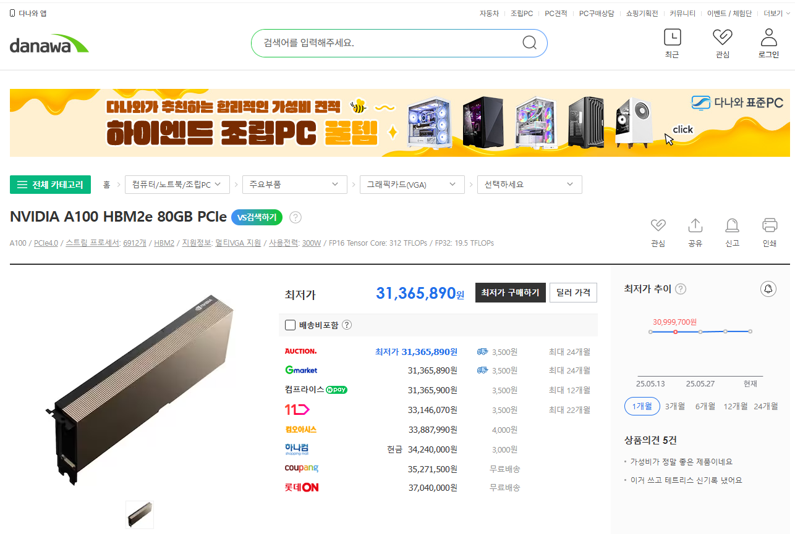
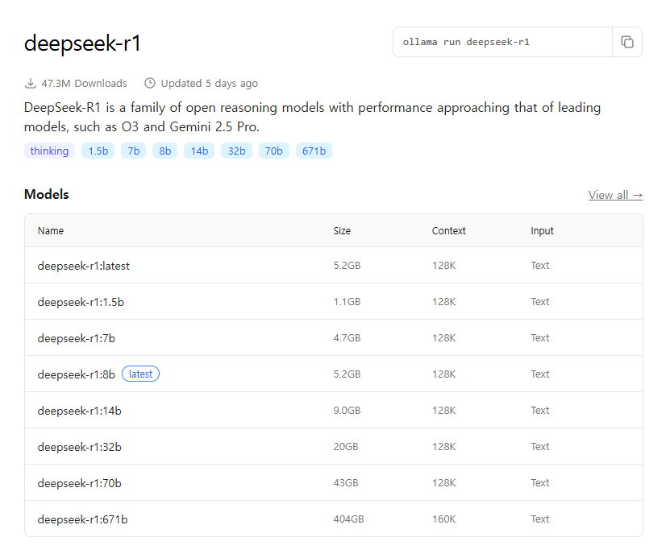
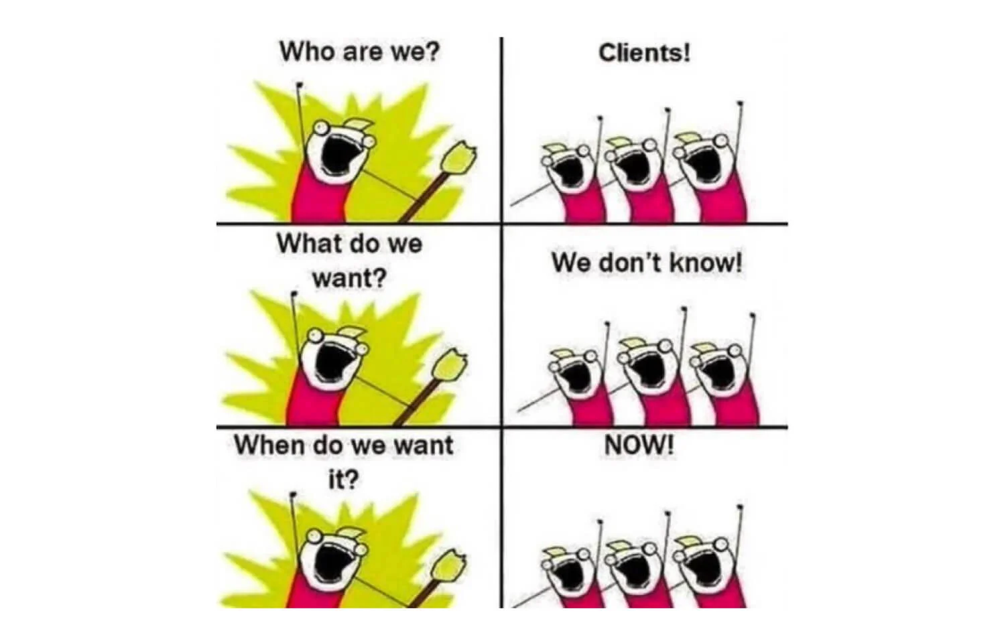
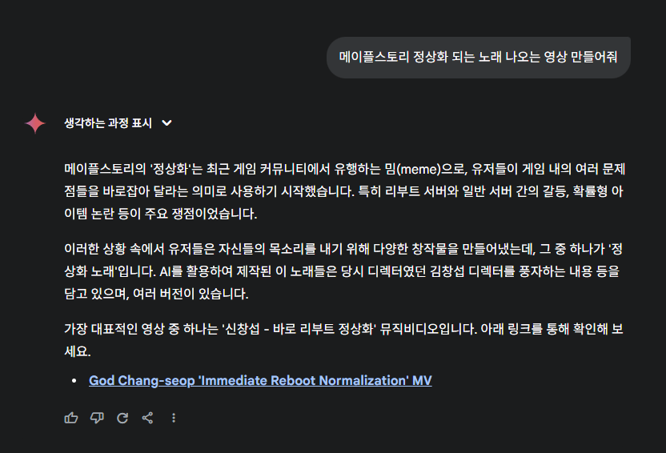

+++
date = '2025-06-07T17:30:00+09:00'
draft = false # Change to false to publish
title = '왜 내가 쓰는 AI는 멍청하지?'
description = '남들은 엄청 잘 쓰고 있다는데 왜 나는 안되는거지?'
tags = ['AI', 'LLM', 'vivecoding']
authors = ['juunini']
featured_image = 'thumbnail.jpg' # e.g. 'thumbnail.png'
slug = 'why-your-ai-is-stupid' # uri. e.g. 'awesome-post-name'
audio = []
vedios = []
series = []
images = ['thumbnail.jpg']
+++

"남들은 다들 AI 좋다 그러는데, 왜 내가 쓰는 AI는 이렇게 멍청한걸까?"
이렇게 생각하시는 분들이 꽤 많으실겁니다.

지금부터 하나씩 그 원인을 알려드리겠습니다.

# 목차

- [AI에 돈을 쓰셨나요?](#ai에-돈을-쓰셨나요)
  - [돈을 줘야 이미지를 만들어주고, 동영상을 만들어주고, 음악을 만들어줍니다.](#돈을-줘야-이미지를-만들어주고-동영상을-만들어주고-음악을-만들어줍니다)
  - [커뮤니티 보면 자기 컴퓨터에서 하던데요?](#커뮤니티-보면-자기-컴퓨터에서-하던데요)
  - [채팅 기능만 있는 AI도 돈을 쓰고 안쓰고에 차이가 있습니다.](#채팅-기능만-있는-ai도-돈을-쓰고-안쓰고에-차이가-있습니다)
  - [Ollama 같은걸로 어찌 내 컴퓨터에서 공짜로 안되나?](#ollama-같은걸로-어찌-내-컴퓨터에서-공짜로-안되나)
- [어떤 결과를 얻고싶은지 알고있나요?](#어떤-결과를-얻고싶은지-알고있나요)
  - [채팅 UI에 쓰는 내용이 무슨 과정을 통해 만들어지는지 알고있나요?](#채팅-ui에-쓰는-내용이-무슨-과정을-통해-만들어지는지-알고있나요)
- [유튜브에 잘 쓰는 사람들 보니까 MCP인가 뭐시긴가 쓰던데...](#유튜브에-잘-쓰는-사람들-보니까-mcp인가-뭐시긴가-쓰던데)

# AI에 돈을 쓰셨나요?

> [바로 리부트 정상화 MV](https://youtu.be/cYRkZmBuDqI?si=KKoxy8TCs9h6fwN5) 같은거 보면서
> 저런거 만드는 사람들은 AI써갖고 딥페이크(...)같은것도 잘 써먹고 음악도 잘 만들고 하던데
> *~~딥페이크 최대 피해자는 넥슨의 김창섭님 아닐지 ㄷㄷ~~*

"나는 해봐도 AI가 이런거 안해주던데?" 라고 하시는 분들이 많습니다.

AI 서비스들을 들어가보면 무료로 쓸 수 있긴 한데
무료로 쓰는 것과 결제 후에 쓸 수 있는 모델은 큰 차이가 있습니다.

## 돈을 줘야 이미지를 만들어주고, 동영상을 만들어주고, 음악을 만들어줍니다.

"돈 안줘도 쓸 수 있던데?" 라고 생각하는 분들이 많을겁니다.
사실 실제로도 그렇긴 한데, 돈을 벌고자 만든 서비스들이기에
결제 여부에 따라 기능에 차별점을 두거나
맛보기 횟수 정도만 제공을 해줍니다.

AI도 각각의 전문 분야가 있기에
ChatGPT 하나만 결제한다고 다 해주진 않습니다.

딥페이크 합성같은건 [Viggle](https://viggle.ai) 같은 곳을 많이 사용하고
동영상 생성의 경우 요즘 핫한 [Veo3](https://gemini.google/overview/video-generation/?utm_medium=paid-media&utm_source=sem&utm_campaign=veo&utm_source=google&utm_medium=cpc&utm_campaign=2024koKR_gemfeb&gad_source=1&gad_campaignid=22522107008&gbraid=0AAAAApk5BhkiS87z7N-uhF3biwHPYpfRY&gclid=Cj0KCQjwgIXCBhDBARIsAELC9ZgMitbQiswm7kYL1P7m1A-Nt1BpZ3DRbFkAN8PZmhk5Z3D405hAiuoaAtDnEALw_wcB&gclsrc=aw.ds)이 있습니다.
음악 생성은 대표적으로 [Suno AI](https://sunoai.ai/)가 있구요.

## 커뮤니티 보면 자기 컴퓨터에서 하던데요?

돈을 안쓰고도 누군가는 이렇게 했다 하고 올릴텐데,
그 사람도 수십 수백번의 시행착오 끝에 그런 세팅을 해냈을겁니다.
*~~아니면 애초에 엄청 전문가 레벨이거나~~*

커뮤니티의 누군가가 그렇게 하더라 하는걸 보면서
나도 돈 안쓰고 우리 집 컴퓨터로 어찌 되지 않을까 생각하고 해보시려거든
당신도 수십 수백번의 시행착오를 겪어야 할겁니다.
아니, 대부분의 사람들은 시행착오 끝에 못할 가능성이 높겠죠.

그래서 기회비용의 관점에서 봤을 땐
오히려 돈을 쓰는게 훨씬 저렴할겁니다.

## 채팅 기능만 있는 AI도 돈을 쓰고 안쓰고에 차이가 있습니다.

**'Model Thinking'** 이라는 개념이 등장했습니다.
한글로는 **'추론 모델'** 이라고들 합니다.

사용자가 한 번 채팅을 입력하면
추론 모델은 사용자가 내린 지시의 의도를 파악하고,
지시를 수행하기 위해선 어떤 과정을 거쳐야 하는지 생각하고,
그렇게 만든 과정을 순서대로 수행해서 나온 결과들을 종합한 뒤
사용자에게 결과를 응답하는 겁니다.

기존의 챗봇들은 질문을 하면 곧장 대답을 했지만,
추론 모델의 경우 저런 여러 과정을 거치기 때문에 대답 속도가 조금 느리기도 하고
여러번의 과정을 거치기에 토큰의 소모량도 많습니다.
대신 **"개떡같이 말해도 찰떡같이 알아듣는"** 장점이 생기죠.

더 쉽게 얘기하자면
기존의 챗봇은 내가 원하는 대답을 얻기 위해서는

- 질문 내용
- 답변을 위해서는 이런 것들을 예시로 참고하라
- 답변을 위해 이런 과정을 거쳐서 생각을 하라
- 질문 답변 세트 예시 등등...

이런 내용들을 '컨텍스트' 라는 것으로 질문에 담아야 했고,
'프롬프트 엔지니어링' 이라는걸 공부해서 열심히 질문을 만들어야 했는데
이제는 저럴 필요 없이 대충 질문만 해도 알아서 검색도 해보고
의도가 무엇일지, 어떤 답을 원하는 것 같은지 생각 한 뒤에 답을 내놓습니다.

앞에도 말했듯이, 많은 토큰을 소모하기에
유료 사용자에게만 제공되는 기능입니다.

돈을 쓰는가 안쓰는가에 따라
**"개떡같이 말해도 찰떡같이 알아듣는"** 기능에 차별점이 생기죠.

## Ollama 같은걸로 어찌 내 컴퓨터에서 공짜로 안되나?

> 돌려말할거 없이 직설적으로 말하자면,
> "나보다 똑똑한 사람들도 굳이 AI를 돈 주고 쓰는 이유가 있겠죠?"
> 라고 할 수 있겠네요.

개인PC에서 좋은 사양이라 해봤자 RTX 5080 정도일겁니다.
사실 그런걸론 택도 없고 A100같은거 하나 있어야 합니다.

가격 보이시죠?
개당 3천만원 좀 넘습니다.

좀 더 충격적인건 이런걸 여러개 갖고있어야 한다는거겠죠.

얼마 전에 화재였던 중국의 Deepseek 모델인데
쓸만한 성능으로 쓰고싶다면 적어도 100b가 넘는걸 써야할겁니다.

스크린샷에 70b가 43GB니까, 대충 140b다 치면 80GB 정도 필요할겁니다.
위의 A100 그래픽카드 메모리 80GB니까...

뭐... 내 돈 아니면 괜찮은데
내 돈 써야되면 그냥 돈 내고 AI 쓰는게 더 싸게 먹힐겁니다.

# 어떤 결과를 얻고싶은지 알고있나요?

> 무언가 일을 시키면서도 자기 머릿속에 무슨 결과를 얻고싶은지
> 뚜렷한 청사진이 없는 경우가 많습니다.

사람 대 사람으로 일을 시킬 때도 종종 일어나는 오류입니다.
AI한테 일을 시킬 땐 더욱 쉽게 일어납니다.

내가 무엇을 얻고싶은지 잘 모르는 상태로
채팅 UI를 통해 무언가 해달라고 쓰는거죠.

뭘 얻고싶은지 모르는 상태로는
어떤 결과물을 받아도 결국은 만족스럽지 않을겁니다.
내가 뭘 원하는지 모르니까요.
~~이거 SI 사업에서 고객이 이러지 않나~~

그리고는 말합니다.
**"AI한테 시켜봤는데 별로더라"**

## 채팅 UI에 쓰는 내용이 무슨 과정을 통해 만들어지는지 알고있나요?

> 무엇을 원하는지 모르는것도 문제인데
> 무엇을 시키고 있는지를 모르는것도 문제입니다.
> 
> 좀 더 정확히는
> **어떤 과정을 통해 내가 얻고자 하는 결과물이 탄생하는지를 모르는 것** 이지요.

예를 들어서 맨 처음 언급한 [바로 리부트 정상화 MV](https://youtu.be/cYRkZmBuDqI?si=KKoxy8TCs9h6fwN5) 같은걸 만들고 싶다고 해봅시다.
어떤 과정을 통해 저런 영상을 만들 수 있는지 전혀 모른다면 이렇게 할 것 같네요.
ChatGPT에, Claude에, Gemini에 채팅으로 이렇게 입력하겠죠.
**"쌀숭이 정상화 되는 노래 나오는 영상 만들어줘"**

Gemini를 돈내고 쓰고 있기에 한번 "메이플스토리 정상화 되는 노래 나오는 영상 만들어줘"
라고 채팅을 입력해보았더니 영상은 커녕 노래도 안만들어주고, 대충 검색해서 나온 영상 링크를 던져주고 끝납니다.
(ChatGPT나 Claude같은걸 써도 비슷할겁니다)

이런 종류의 영상을 만들기 위해서 어떤 과정을 거쳐야 하는지 알고 있다면
아래와 같은 과정을 거쳐서 만들게 될겁니다.

- 컨셉 결정
  - 어떤 내용이나 메시지를 담을지 미리 생각하고 결정합니다
- 노래 만들기
  - 가사는 직접 만들거나, 정확히 어떤 요소가 들어간다는 것을 명시하고 Gemini같은 챗봇에게 만들어보라고 시킨 뒤 수정할겁니다
  - 어떠한 장르의 어떤 리듬에 어떤 스케일을 쓰면서 어떤 악기 구성이 들어가는 세션을 만들라고 Suno AI 같은걸 돌립니다
- 노래에 어울리는 이미지와 영상 만들기
  - 직접 이미지를 수집
  - 어울리는 영상을 수집하여 이미지와 합성을 할 수 있는 Viggle AI같은 서비스를 돌립니다
  - 혹은 Veo3같은 AI에게 특정 가사 부분에 어울릴만한 짧은 영상을 만들도록 지시합니다
  - 그런 과정을 여러 번 거칩니다
- 노래에 이미지와 영상 합성
  - 노래가 나올 때 가사에 어울리는 이미지나 합성된 영상이 나오도록 영상 편집 프로그램을 이용해 합성합니다
  - 준비한 이미지와 영상이 여러개일 것이므로 여러 번 수행합니다
- 자막 추가
  - 영상 편집 프로그램에서 영상 하단이나 어울리는 부분에 자막을 세팅합니다
  - 좀 더 정성을 쏟는다면 장면에 어울리는 이펙트가 담긴 자막이 나오도록 할 수도 있겠죠

대충 시켜도 찰떡같이 해오면 물론 좋겠죠.
~~대충 시켜도 찰떡같이 해오면 지시 받는 사람이 이렇게 하는겁니다. 감사하세요~~

하지만 내 입맛에 맞는 결과물을 얻기 위해서는 이렇게 할 수 밖에 없습니다.
물론 AI한테 시키는게 아니라 사람한테 일을 시키더라도 마찬가지입니다.

언급한 내용을 훑어보면 각각 다른 AI 서비스가 4개나 나오는데,
이렇게 어떤 과정을 통해 영상이 만들어지는지 알고있다면
각 부분에 어울리는 AI에게 각각 다른 일을 시킬 것입니다.

# 유튜브에 잘 쓰는 사람들 보니까 MCP인가 뭐시긴가 쓰던데...

아!... MCP까지 다루기엔 글이 너무 길어지겠군요.
MCP는 다음번에 다루도록 하겠습니다.
~~고급 사용자용 같은 느낌이라 이것만 언급해도 길어서~~

