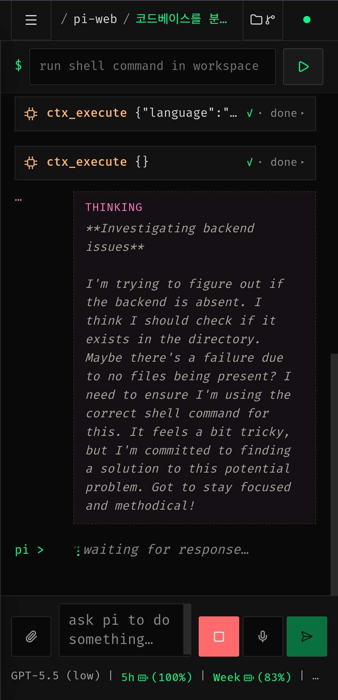
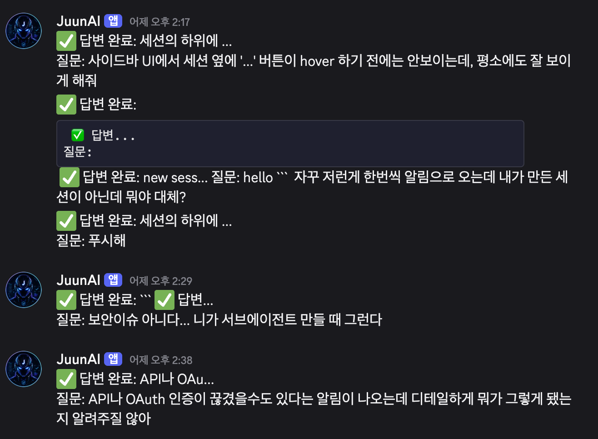
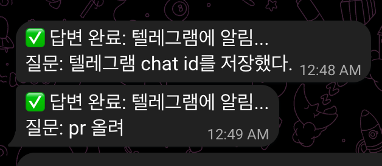
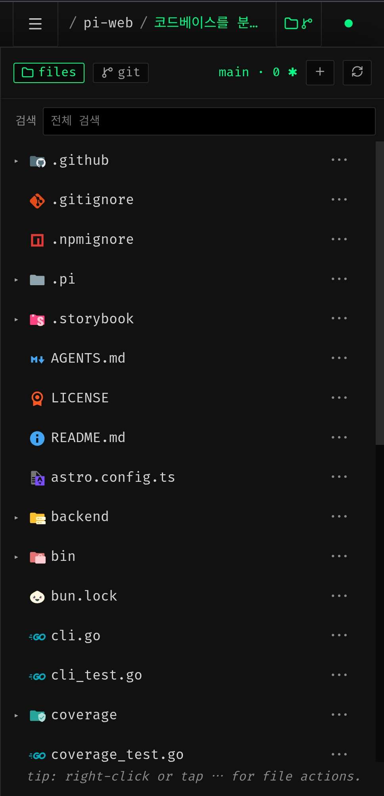
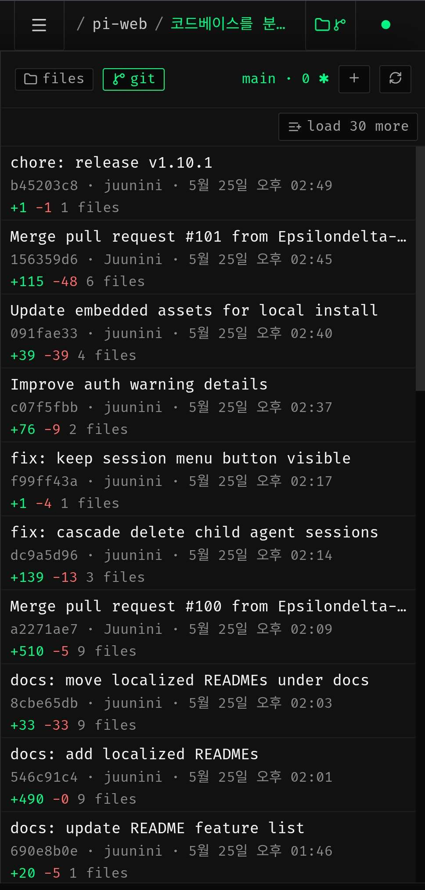
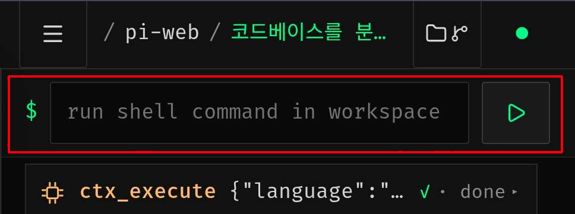
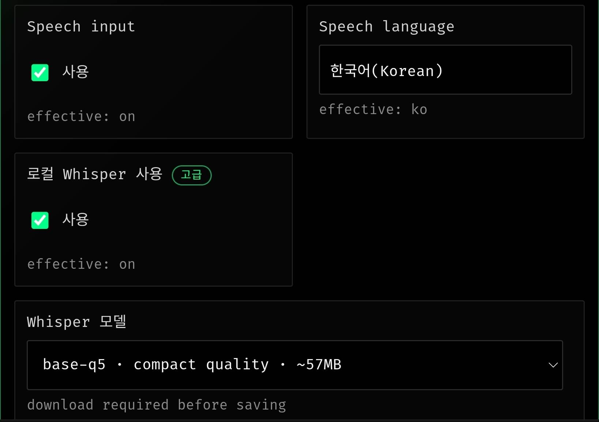

+++
date = '2026-05-25T22:41:05+09:00'
draft = false # Change to false to publish
title = '코딩 에이전트와 단축의 예술. 그리고 Pi Web 자랑'
description = 'Pi coding agent를 웹 브라우저에서 다룰 수 있는 Pi Web 오픈소스를 만들며 느낀 것들' # post's summary or description
tags = ['ai', 'agent', 'opensource']
authors = ['juunini']
images = ['./images/pi-web.png'] # e.g. ['thumbnail.png']
slug = 'pi-web' # uri. e.g. 'awesome-post-name'
audio = []
vedios = []
series = []
+++

## TL;DR

- [Pi Web]을 나의 AI 분신인 [JuunAI]를 이용해서 만들었다.
- `curl -fsSL https://raw.githubusercontent.com/Epsilondelta-ai/pi-web/main/scripts/install.sh | sh`
- 나의 경우엔 [Pi]를 이용해서 엄청난 토큰 효율성을 얻었다.
- [Pi Web]으로 핸드폰으로 코딩하세요.

## 서문

[Pi] coding agent 라는 것을 아십니까?
[니콜라스 센세도 좋다고 추천한](https://www.youtube.com/watch?v=PzqRRYHHpbw)
최소한의 기능만을 담고있는 코딩 에이전트입니다.

## 기능도 없는데 왜 씀?

다들 **Claude Code**가 좋다고 찬양하죠?
저는 좀 다릅니다.

클로드 코드의 작동 방식이 저는 마음에 들지 않아요.
토큰 사용량도 너무 많고, 제 마음에 들게 코드를 작성해주지도 않아요.
기능도 너무 많아서 오히려 내가 원했던 기능을 안쓰기도 하구요.
내가 원하는대로 동작하지 않는 경우도 종종 있습니다.

그럼 **Codex** 라는 선택지도 있지 않냐?
코덱스는 제 입장에서는
"말은 잘 하는데 해놓은걸 보면..." 입니다.
(누군가는 코딩을 잘 해준다는 이야기도 하지만...)

문제가 뭘까 생각해보면
이 녀석들한테는 너무 많은 pre prompt가 준비되어 있다는겁니다.

## 만.단.지.예 (만물의 단축은 지고의 예술)

그런 점에서 Pi는 모든것을 단축했습니다.
그리고 [Pi Web]을 만들기 위해 같이 작업한 [JuunAI]도
단축을 핵심 가치로 만든 하네스죠.
~~*(말이 짧음. 싸가지가 없음)*~~

Codex를 이용해서 GPT-5.5를 쓰는 것 보다
[Pi]와 [JuunAI]를 이용해서 작업하면
제가 원하는대로 작업도 되고 토큰 효율성도 좋았습니다.

### JuunAI

[JuunAI]에는 제 생각과 의도가 온전히 담겨있는데
대부분의 개발자들은 공감하거나 이해하지 못하는 것들도 담겨있어서
누구에게나 좋다고 추천할 순 없습니다.

다만, 저의 스타일에서는 thinking level을 low로 내려도
high 일 때랑 큰 변화를 느끼지 못했습니다.
그래서 100달러짜리 요금제로도 원없이 써도 토큰이 남는 상황입니다.
*(누구에게나 해당되는건 아님)*

## 본론

저는 누워서 핸드폰으로 코딩하는걸 좋아합니다.
코딩을 하기 위해 노트북 앞에 앉아야만 하는 상황을 싫어하죠.
~~밥먹을 때도, 이동중에도, 누워서도 코딩하세요~~

그래서 만든게 [Pi Web]입니다.
노트북에 [Pi Web] 켜놓고 [tailscale](https://tailscale.com/) 같은 VPN을 이용해 접근해서
핸드폰으로 [Pi]를 켜서 코딩을 시키는거죠.

[Pi] 자체는 마음에 들었는데,
Web UI는 아무리 찾아도 좋은게 없었습니다.
Claude Code나 Codex의 경우엔 [Cloud CLI](https://github.com/siteboon/claudecodeui) 라는게 있는데 말이죠.

## Pi Web 자랑타임

이런걸 직접 만들었습니다.
솔직히 여기까지는 굉장히 기초적인거라 자랑거리는 아니지만
진짜 자랑거리는 그 다음입니다.

이런 도구의 가장 큰 문제는 '완료 알림' 이죠.
PWA로 푸시알림을 보내려면 HTTPS 가 필요한데,
로컬 실행 도구인 입장에서 애초에 불가능한 전제라 여겨져서
디스코드와 텔레그램으로 알림을 받을 수 있게 만들었습니다.

그리고 나름 신경써서 꾸며둔 vscode식 파일 트리와
Git 커밋 내역을 볼 수 있는 부분입니다.

파일 트리의 텍스트 기반 파일은 눌러서 직접 수정도 가능한 에디터 기능도 담고있죠.

개인적으로 가장 킥으로 여기는 부분입니다.
쉘 명령어를 직접 입력할 수 있는 부분 말이죠.
사람에 따라 다를 수 있지만 저는 굉장히 유용하게 쓰고있습니다.

핸드폰으로 AI한테 일 시키다보면 가끔 직접 쉘 명령어 넣고싶은 답답한 상황이 옵니다.
AI한테 직접 시키면 뭔가 내가 원하는대로 시원하게 안해줄 때도 있구요.
아니면 귀찮게 되물어보거나.

그럴 때에 그냥 직접 넣어버리는겁니다.
`sudo systemctl restart` 라던가, `sudo reboot` 라던가, `rm -rf` 라던가 `cp -r` 이라던가
그런 것들 말이죠.
~~버벅거리면 시원하게 `sudo reboot` 넣어버릴 수 있음~~

### 개인적인 사용 요령

저는 라즈베리파이에 올려두고 OpenVPN으로 네트워크에 접근한 뒤
Route53에서 도메인 설정해두고 Caddy로 HTTPS 올려서 Unsafe 상태로 브라우저로 접근해서 씁니다.
디스코드 알림을 설정해둬서 다 되고나면 디스코드로 알림이 오죠.

키보드로 입력하기 귀찮으면 마이크 기능을 이용해서 말로 시키기도 하구요.
[Whisper WASM](https://github.com/timur00kh/whisper.wasm) 이라는 라이브러리를 쓰는데
브라우저에서 돌릴 수 있을만한 가벼운 모델로 STT를 수행해줍니다.
(마이크 기능땜에 굳이 도메인 설정하고 HTTPS 해뒀다능)
~~WASM과 WebGPU 이용한 음성 모델인데 핸드폰에선 가벼운거밖에 못돌려서 좀 인식률이 안좋지만~~

아래 명령어로 Pi Web을 설치할 수 있습니다.
Pi가 설치되어있지 않다면 그것도 같이 설치해준다능!

`curl -fsSL https://raw.githubusercontent.com/Epsilondelta-ai/pi-web/main/scripts/install.sh | sh`

여러개 돌려놓고
포켓몬 배틀 한판 하고(?)
디스코드 알림 왔는지 보고
됐으면 확인하고 다음꺼 시키고
또 포켓몬 배틀 한판 하고(?)
그렇게 하면 됩니다 ㅋㅋㅋ

[Pi]: https://pi.dev/
[Pi Web]: https://github.com/Epsilondelta-ai/pi-web
[JuunAI]: https://github.com/Epsilondelta-ai/juun-ai