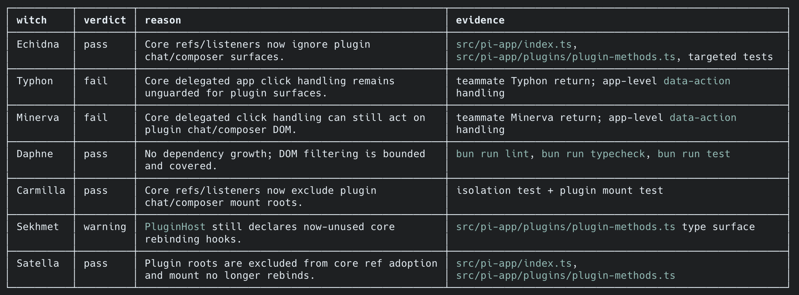

+++
date = '2026-06-07T02:59:57+09:00'
draft = false # Change to false to publish
title = '씹덕요소가 에이전트를 완성했다'
description = '에이전트를 제어하는 하네스의 코드 평가 기준을 판단하는 부분을 씹덕요소로 완성했다.' # post's summary or description
tags = ['rezero', 'harness', 'agent']
authors = ['juunini']
images = ['images/thumbnail.png'] # e.g. ['thumbnail.png']
slug = 'index' # uri. e.g. 'awesome-post-name'
audio = []
vedios = []
series = []
+++

# TL;DR

- 'Re:제로부터 시작하는 이세계 생활' 에 영감을 받아 플러그인(하네스)를 제작함
- 7개의 평가 기준으로 각각 평가하고, 기술부채를 기록한 뒤 해결하게 하는 부분이 들어감
- 지금도 직접 쓰고있는데 매우 만족스러움
- https://github.com/epsilondelta-ai/rezero

# 그게 뭔데 씹덕아

아직 시작도 안했다고 ~~시발롬아~~

# 나도 써볼 수 있나?

네, 당신도 써볼 수 있습니다.

지금 당장 https://github.com/epsilondelta-ai/rezero 로 가서
claude code, codex, pi 용 플러그인 설치 가이드를 읽어보고 설치하십시오.

그리고 `/rezero <내용>` 을 입력해서 rezero 플러그인을 써보십쇼. 만족하실겁니다.
제가 열심히 잘 쓰고 있어서 추천합니다.

## 어떻게 동작하길래?

rezero 플러그인을 이용해 작업을 지시하면

- 우선 내용을 태스크 단위로 나눠서 계획을 세운 뒤
- 각각의 태스크를 수행하고나면 각각의 평가 기준을 가진 일곱개의 서브에이전트의 평가를 받습니다
- 평가에서 fail가 하나라도 있다면 https://youtu.be/N1zGUomd66E 브금이 나옵니다.
  - 이 브금은 `/rezero bgm off` 나 `/rezero bgm false` 로 미리 꺼둘 수 있습니다.
  - fail가 있다면 '사망회귀' 를 합니다.
  - 어떤 작업을 했고, 실패한 이유를 기록한 뒤 `git reset --hard HEAD`, `git clean -fd` 를 합니다.
  - 이 과정을 반복
- fail는 없는데 warning이 있다면 별도로 기록합니다.
  - 곧장 warning을 해결합니다. 이것도 하고나면 앞의 평가와 사망회귀를 똑같이 수행합니다.
  - 이걸 모두 처리했다면 다음 태스크를 진행합니다.

이런 식으로 fail이 있다면 브금이 나옵니다.

# 왜 이런걸 만들었나?

이미 코드가 더러워졌다면 깨끗한 컨텍스트라도 무슨 의미가 있을까 하는데서 시작됐습니다.
이미 더러운데서 수정하고 또 수정하고 해봤자 계속 더러워질 뿐이라는 것이죠.

그래서 고민하다가 그냥 다 없애고 다시 하면 어떨까 하는 말이 나왔고
"그거 완전 리제로네요 ㅋㅋ" 하는 말을 했다가
~~그게 뭔데 씹덕아 소리 듣고~~
거기서 영감을 받고 만들게 되었습니다.

## 리제로가 뭔데 씹덕아

죽으면 체크포인트에서 부활해서 루프하는 그런 애니입니다.
영화 '엣지 오브 투모로우' 를 아신다면 비슷한 컨셉이라 생각하시면 되겠네요.
~~리제로가 더 먼저 나옴~~

주인공이 가진 특별한 능력이라곤
죽으면 특정 시점으로 되돌아가는게 유일한 능력이라
그거 외에는 평범한 인간과 똑같습니다.

그래서 수십, 수백, 수천번씩 죽어가며
어떻게 해야 하는지 조금씩 알아가게 됩니다.

그것을 코딩 에이전트가 그렇게 하도록 만든 것이죠.

## 나 원작 아는 사람인데 좀 이상하지 않냐

~~와! 리제로 아시는구나! 겁.나.재.밌.습.니.다.~~

원작을 아는 사람의 입장에선 충분히 그렇게 느낄 수 있습니다.
그런 설명들을 모두 프로젝트의 README에 설명해두었습니다.

https://github.com/Epsilondelta-ai/rezero/blob/main/docs/README.ko.md#%EC%9D%BC%EA%B3%B1-%EB%A7%88%EB%85%80

# 너무 짧아서 좀 더 이야기 하자면

원래 이 글은 꽤 예전에 쓰려고 했었습니다.
다만 그 당시에는 리제로 플러그인이 썩 쓸만하지 못한 상태였죠.

하네스를 몇개 만들어본 경험이 생기며 어떻게 해야 쓸만해지는가를 알게된 뒤에
다시 리제로 플러그인을 손보고나니 꽤나 쓸만해졌고 저 자신도 애용하기에
이제야 이 글을 다시 파묘해서 쓰게 되었습니다.

~~사실 개인적으로 하네스란 용어 자체를 썩 좋아하진 않지만~~

앞으로도 여러 플러그인을 만들게 될 것 같은데
나중엔 이런 플러그인을 어떻게 해야 잘 만들 수 있을지 요령도 한번 풀도록 하겠습니다.
