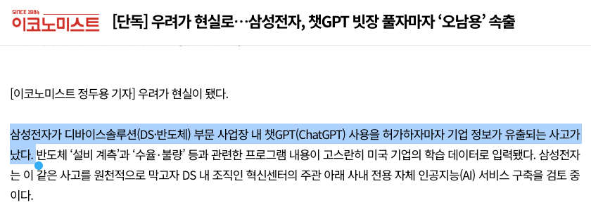
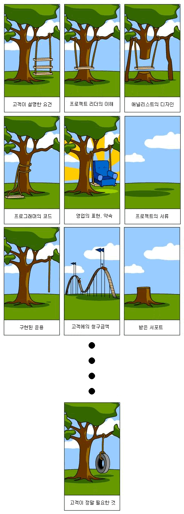

+++
date = '2026-09-09T14:59:57+09:00'
draft = false # Change to false to publish
title = '옆 회사의 AI 시스템을 우리 회사로 긴빠이 칠 수 있나?'
description = '그... AI 같은걸 끼얹으면 되나?' # post's summary or description
tags = []
authors = ['juunini']
images = ['images/thumbnail.webp'] # e.g. ['thumbnail.png']
slug = 'neighbour-company-ai-ginppai' # uri. e.g. 'awesome-post-name'
audio = []
vedios = []
series = []
+++

> 이 글은 비개발자를 대상으로 작성된 글입니다.
> 기술적으로 디테일한 부분들은 모두 생략됐고 알아듣기 쉬운 형식으로 작성되었습니다.

---

옆 회사에서 AI를 도입하고 잘 쓰고있더라 하면 호기심이 생깁니다.
그럼 자연스레 이런 생각이 들 수도 있겠죠?
"쟤네껄 긴빠이(?)쳐서 우리 회사에 도입하면 좋지 않을까?"

# TL;DR

시작하기 전에 전부 읽을 시간이 없는 분들을 위해 액기스만 뽑아놓겠습니다.

- 못하는건 아니지만 쉽지 않다
- 긴빠이 치는게 중요한게 아니라 우리 회사의 방식에 맞는지가 중요하다
- 잘 만들어보고 싶다면 contact@epsilondelta.ai 로 연락주세요!

# 긴빠이 칠 수 있는거였어?!

어... 아뇨, 누구나 이런 생각을 해보지 않을까 해서 해본 얘기고
가능하다곤 해도 그게 그렇게 손쉽게 되는건 아닙니다.

## 안되면 왜 얘기했어!

고객들과 소통할 때도 종종 나오는 이야기이다보니
이런 이야기로 시작하면 많은 사람들이 봐주지 않을까 해서 이렇게 시작하게 됐습니다.

그래서

- 왜 옆 회사껄 그대로 우리 회사에 갖다 붙이기 어려운지
- 그대로 갖다 붙이면 잘 쓰일 수 있는지
- 어떻게 우리 회사에 맞는 AI 시스템을 구축할 수 있는지
- 그냥 ChatGPT나 Claude 쓰면 되는거 아닌지

이런 것들을 얘기해보려 합니다.

# AI는 그냥 ChatGPT나 Claude 쓰면 되는거 아니야?

요즘 AI들 많이 좋아졌죠?
최근에 OpenAI에서 GPT Astra 를 출시했는데 사람들이 좋다고 떠들썩하기도 하구요.
하지만 이걸 그냥 쓴다고 회사에 뭐가 도입된다는 느낌이 들진 않을겁니다.

AI가 아무리 똑똑해진다 해도
우리 회사에 뭐가 어디에 있는지, 누가 뭘 하고 있는지 이런건 모를테니까요.

그.런.데
**모르면 알려주면 되지 하고 알려주면 또 잘 대답하기도 합니다.**

*"그럼 ChatGPT나 Claude한테 우리 회사 정보를 다 알려주고 쓰면 되겠네?"*
라고 생각하면 매우 위험한 발상입니다.

일반적으로 우리가 인터넷을 통해 접근할 수 있는 AI들은 우리와 나눈 대화를 모두 학습하거든요.
**특히나 기밀정보가 학습되어 버린다면 정말 큰일이겠죠.**

실제로 2023년에 삼성전자에서 비슷한 일이 일어난 적도 있었구요.

그래서 여러 회사들이 *굳이굳이* 돈을 써가며 자기 회사용 AI 시스템을 구축하는겁니다.

## 그럼 그런건 어떻게 만드는데?

여러가지 방법이 있지만, 다 설명하면 너무 길어지니
대표적인 방법 한 가지만 소개하겠습니다.

OpenAI(ChatGPT)나 Anthropic(Claude) 같은 AI 회사에서는
사용자의 대화를 통해 모델에 학습되어서 정보가 유출되는 일이 없도록

사용자의 대화가 모델에 학습되지 않는 형태의 서비스를 제공하기도 합니다.
이 방식을 AWS, Google Cloud, Microsoft Azure 같은 곳과도 협업해서 제공하기도 하구요.

이 방식을 이용해서 만든다고 보면 되는데
여기서 끝나는게 아니라 여기서부터 시작입니다.

### 뭐가 더 있어야 되길래?

아까 했던 얘기지만, AI가 아무리 똑똑해져도
우리 회사에 뭐가 어디에 있는지, 누가 뭘 하고 있는지 같은건 알지 못합니다.

그리고 또 아까도 한 얘기지만
알려주면 그 다음부턴 잘 대답해줍니다.

그런데, 여기서 문제가 발생하는데
**대화를 하던 세션이 아닌 다른 세션으로 가면 다시 깡통이 된다는겁니다.**

이걸 해결하기 위해선 여러가지 복잡한 개념이 들어가니
기술을 모르는 분들을 위해서 간단히 설명하자면

- AI를 위해 정보를 저장해두는 저장소
- AI가 알기 좋은 형태로 정보를 저장하는 시스템
- AI가 저장한 정보를 잘 검색할 수 있게 해주는 AI 전용 검색 시스템
- AI에게 우리 회사에서 어떻게 일해줘야 하는지 설명하는 프롬프트
- 질문자가 접근해도 되는 정보인지 판단하는 시스템

중간에 복잡한 과정들이 다소(?) 생략되었지만
이렇게 간추려서 설명할 수 있을 것 같네요.

## 이것만 있으면 옆 회사 AI 시스템 긴빠이 칠 수 있는거야?

어... 그렇...진 않아요.

회사마다 기록을 저장하는 방식이 다르고
저장하고 있는 기록의 형식도 다르거든요.

예를 들면 A 회사는 Wiki 라는 시스템을 만들어서 거기에 저장하고
형식도 동일한 템플릿을 일목요연하게 갖춰서 저장해뒀다고 한다면

B 회사는 docx나 hwp 파일이나 PPT 같은 여러가지 형태로
상황에 맞게 템플릿을 수정해가며 조금씩 다른 형식으로 회사 내의 공유폴더에 저장할 수도 있거든요.

이런걸 업계에서는 '비정형화된 데이터' 라고 좀 어렵게 부르는데
이걸 AI를 위한 저장소에 AI가 검색하기 좋은 형태로 넣어주도록 가공하는데 노력이 많이 들어가기에

남의 회사에 있는 시스템을 그대로 가져다가
우리 회사에다가 긴빠이(?)쳐 놓기 어려운겁니다.

그리고 그것보더 더 중요한게 있어요.

# 그게 정말로 우리에게 맞는 필요한 시스템인가?

AI에게 뭔가 시켰을 때 불만족스러운 경험을 다들 한번씩은 해보셨을겁니다.

그런데 여기서 은근히 많이 발생하는 케이스가 있는데,

대충 AI가 좋다니까 아무거나 시켜보고
*"에이 생각보다 별로네"*
라고 하는 것입니다.

이런 케이스는 뚜렷한 결과가 머릿속에 있는 상태가 아니라서
별로라고 느낄 수 밖에 없는거죠.

그래서 옆 회사의 AI 시스템을 우리 회사에 그대로 끼얹어도
딱히 좋다고 느낄 수 없을 수도 있습니다.

## 그 고민, 저희가 같이 해드립니다

여러건의 AI 서비스 구축 사업을 하며
저희의 노하우랄까... 알게된 것도 많고 느낀 것들도 많습니다.

보통의 사업은 구축하는 서비스의 실사용자는 뒷전인 채
영업사원과 사업담당자끼리 이야기 해서 진행하는 경우가 많은데요,
AI 서비스 구축 사업이라고 그게 크게 다르진 않습니다.

게다가 고객의 머릿속에 *'이런게 필요하다'* 라는게 구체화 되지 않은 상태인 경우가 많기에
만들면서 형태가 조금씩 구체화 되어가면 자꾸 이것도 필요하고 저것도 필요한 것 처럼 느끼게 되죠.
그럼 결국 배가 산으로 가는겁니다.

그래서 저희의 경우엔 이 사업의 실사용자가 누구인지,
실사용자는 뭐가 필요한지,
사업의 방향이 실사용자의 니즈와 일치하는지
그런 것들을 같이 고민하고 진행을 합니다.

굳이 이런 얘기를 하는 이유는
보통의 경우엔 이렇게 꼼꼼하게 챙기기 쉽지 않은데
저희는 저희가 만든 제품이 의미있게 쓰였으면 하는 마음이 있어서
이렇게까지 한다 라는 말씀을 드리고 싶었습니다.

이 글을 보고나서
우리 회사도 AI 서비스 구축을 해보고 싶다 하시는 분들은

contact@epsilondelta.ai
로 메일을 보내주시길 바랍니다.

감사합니다!
