+++
date = '2025-05-07T22:59:08+09:00'
draft = false
title = 'GPT-4o Image Generator의 정체를 추리해보자(뇌피셜주의)'
description = 'GPT-4o의 Image Generator는 도대체 어떻게 만들어진 것인지 추리해봅시다. 진실은 언제나 하나!' 
tags = []
authors = ['geoff']
images = ['thumbnail.jpg'] 
slug = 'sleuthing-gpt-4o-images'
audio = []
vedios = []
series = []
toc = true
+++
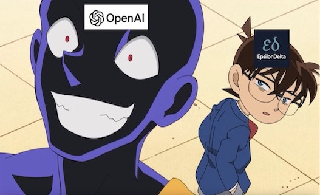

## 들어가며
어느 평화로운 날 자고 일어났더니 여기저기 암세포(?)마냥 퍼져있는 이미지들이 있었습니다.
그것은 트랄라레로...가 아니라 그놈의 지브리 어쩌고 이미지들

*하지만 나도 해봤다능*

누가 우물에 독을 풀었나 했더니 GPT-4o Image Generator가 공개되었던 것입니다.
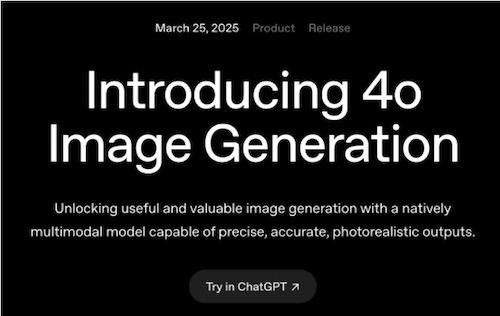
*출처: https://openai.com/index/introducing-4o-image-generation/*

그리고 여기저기 GPT-4o Image Generator를 사용한 후기와 간증회가 열렸습니다.
이때까지만 해도 저는 그냥 또 하나의 호들갑이라 생각했었습니다. 새로운 모델이야 이젠 뭐 늘 나오는 것이고, 이제 호들갑 떠는 거 지겹지 않나 하는 생각을 했습니다.
사실 지금까지도 ChatGPT에서는 DALL-E 시리즈와의 연동을 통해 이미지를 생성할 수 있었습니다.
그래서 이게 뭐 그렇게 특별하다고 그렇게들 유난인가 싶었죠. 그냥 이미지 생성이 좀 더 잘되는 수준인가 싶었습니다.

하지만 GPT-4o의 이미지 생성 결과물들을 보면서 화들짝 놀랄 수밖에 없었습니다.

## 왜 놀랐는가
GPT-4o Image Generator의 결과물들은 기존 DALL-E3의 결과물들과는 확연히 달랐습니다.
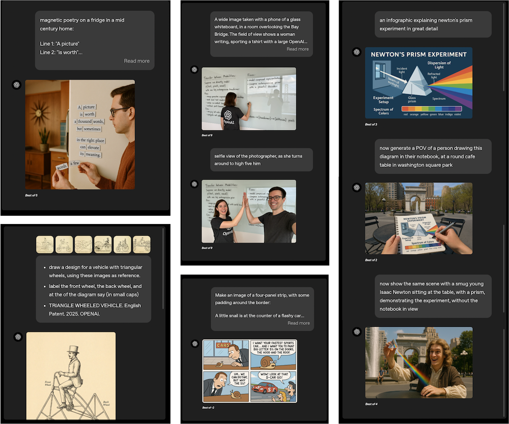
*출처: https://openai.com/index/introducing-4o-image-generation/*

그리고 가장 먼저 든 생각은 전혀 Diffusion스럽지 않다는 생각이 강하게 들었습니다. 어 이건 설마 Diffusion Model이 아닌 건가? 그럼 저는 왜 결과물 이미지만 보고 Diffusion Model이 아닐 것이라고 생각했을까요? 그 이유는 Diffusion에서 보이는 artifacts들이 보이지 않았기 때문입니다.

## Diffusion스럽지 않은 이유

이를 이해하려면 Generative AI artifact에 대한 이해가 필요합니다. 신뢰도가 ~~낮~~높은 출처~~킹무위키~~에 의하면 AI artifact는 다음과 같이 정의됩니다.
> 인공지능 아티팩트(AI Artifact)는 인공지능이 생성한 이미지, 영상, 오디오 등에서 나타나는 의도하지 않은 오류나 이상 현상을 의미한다. 인공지능 모델이 학습 데이터에서 패턴을 학습하여 새로운 데이터를 생성할 때, 논리적으로 말이 안 되거나 비정상적인 결과물이 나올 수 있는데, 이를 인공지능 아티팩트라고 부른다. 한국어로는 공식적인 번역이 존재하지 않으나, 굳이 번역하자면 '허깨비' 현상 정도로 번역할 수 있겠다. '찐빠'라는 은어가 사용되기도 한다.

진짜로 신뢰도가 높은 출처인 &lt;Temporal Score Analysis for Understanding and Correcting Diffusion Artifacts&gt; 논문에서는 Visual artifact를 다음과 같이 표현합니다.
> However, even trained on large-scale datasets, diffusion generative images still exhibit two significant flaws: visual artifacts and hal- lucinations [43, 47].
>
> Visual artifacts appear as local irregularities in texture or structure, while hallucinations involve semantically incoherent content, e.g., extra limbs or misplaced objects

여기서는 두 가지를 알 수 있습니다. 첫 번째는 아무리 데이터를 많이 때려박아도 Diffusion Model은 Visual artifacts 발생을 모델의 구조적 특성상 피할 수 없다는 사실이고, 두 번째는 손가락 7개 같은 의미상의 일관성이 없는 hallucinations와는 다르게 Visual artifacts는 색이나 질감 등에서 나타나는 구조의 국소적 불규칙성을 가리키는 표현이라는 것입니다.

그렇다면 Diffusion Model들은 어떤 Artifacts를 가지는지를 예시들을 보도록 하겠습니다. 한 [레딧](https://www.reddit.com/r/StableDiffusion/comments/16y0037/i_found_that_dalle_3_has_the_same_artifacts_as/)~~참 신빙성도 있는 자료야~~의 게시물을 보도록 하겠습니다.
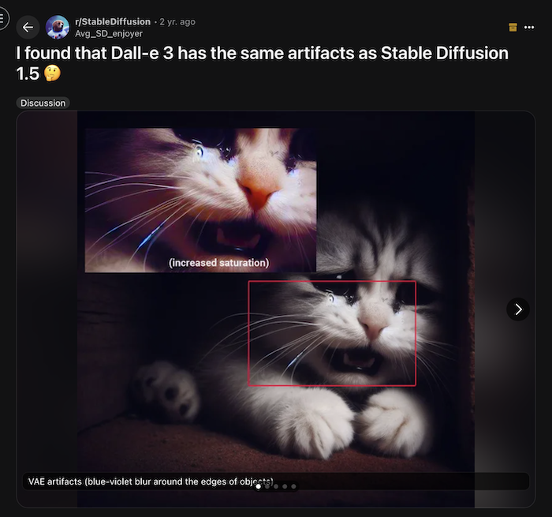
위 이미지를 보면 뭔가 수염 쪽에 퍼렁퍼렁한 픽셀이 보입니다. 이것은 VAE의 연산 과정에서 일어나는 artifact 중 하나입니다. 이러한 blue-violet blur at object edges 문제는 StableDiffusion 1.5(vae-ft-mse-840000 이전 버전)에서도 있었던 문제였으며 DALL-E3 초기 모델에서도 보였습니다.
또 다른 [레딧](https://www.reddit.com/r/dalle2/comments/16xinem/technical_details_of_dalle_3/)의 댓글에서는 DALL-E3가 Diffusion류의 모델이라는 증거로 blue-violet blur at object edges artifact와 gray artifact 등을 지적합니다.

그런데 GPT-4o Image Generator에서는 그런 Diffusion스러운 느낌이 전혀 없었습니다. 그리고 텍스트도 상당히 정확하게 렌더링합니다. 심지어는 상당히 작은 사이즈의 텍스트 또한 말이죠. 그래서 "아 이건 new thing"이구나 하고 생각할 수밖에 없었습니다.

## 그럼 정체가 뭘까
이제 이 친구의 정체를 파악하기 위해 [소개 페이지](https://openai.com/index/introducing-4o-image-generation/)를 자세히 살펴보겠습니다.
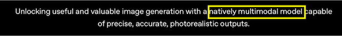
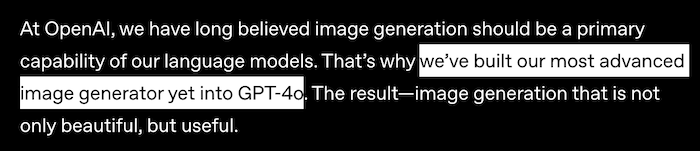
natively multimodal model이라는 표현과 함께 GPT-4o에다가 image generator를 쑤셔박았다고 하고 있습니다.
아직까지는 natively 라는 표현이 어디까지인지 감이 안 옵니다.
여기서 DALL-E3의 소개 페이지를 살펴보도록 하겠습니다.
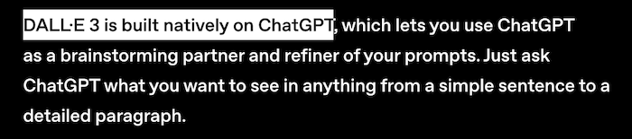
어? 여기서도 natively 라는 표현이 들어갑니다.
그럼 둘 다 native한 multimodal인가? 그건 아닙니다.
`introducing 4o image generation`에서는 GPT-4o에 native하다고 하지만 `DALL-E3`에서는 ChatGPT에 native하다고 하고 있습니다.
뭐 같은 것 아닌가 하겠지만 GPT-4o는 모델 레벨이고 ChatGPT는 서비스 레벨입니다. 이 때문에 DALL-E3 모델은 ChatGPT라는 서비스상의 독자적인 모델로 존재하며, GPT 시리즈의 모델에서 생성 요청을 하면 생성하는 방식입니다. 하지만 이번 4o image generation의 경우에는 GPT-4o가 직접 이미지를 생성하는 능력을 얻게 되었다고 이해하는 게 더 사실에 근접합니다. 그리고 4o image generation의 정체에 대해 한 발짝 더 다가갈 수 있는 문서가 공개됩니다.
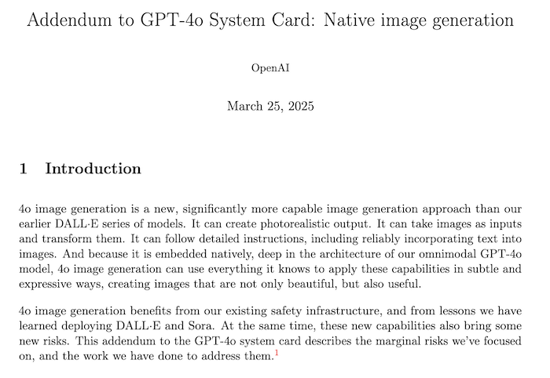
*출처: https://openai.com/index/gpt-4o-image-generation-system-card-addendum/*

이 문서에서 얻은 단서를 정리하면 다음과 같습니다.
1. 이 image generation 기능은 DALL-E4가 아니다.
2. 옴니모달 GPT-4o 모델 아키텍처에 기본적으로 내장되어 있다.
3. Diffusion model로 동작하는 DALL-E와 달리, 4o image generation은 ChatGPT에 **natively**하게 내장되어 있는 autoregressive model이다.

여기서 표현이 좀 헷갈리는 점은 GPT-4o 모델 아키텍처에 embedded되어 있다는 표현과 ChatGPT에 embedded되어 있다는 점인데, GPT-4o에 natively embedded되어 있으면 ChatGPT는 따라오는 것이기 때문에 여기서는 모델에 네이티브하게 built-in 되어 있다고 이해하는 게 자연스럽습니다.

자 그럼 정리를 해보면 딱 두 개의 단서가 보입니다.
1. GPT-4o에 native하다
2. autoregressive하게 이미지를 생성한다.

아... 단서가 너무 없으니 GPT-4o의 정보를 보도록 하겠습니다.
[GPT-4o의 System Card](https://cdn.openai.com/gpt-4o-system-card.pdf)를 읽어보면 다음과 같은 내용이 나옵니다.
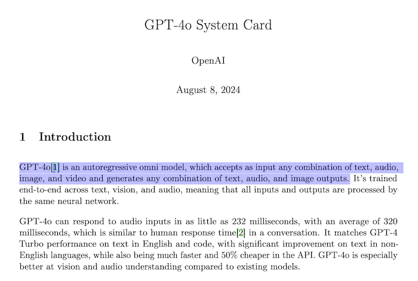
애초에 GPT-4o는 텍스트, 오디오, 이미지, 비디오 등을 입력받아서 텍스트, 오디오, 이미지가 생성되도록 설계되었다는 것입니다.
간단히 이미지로 표현하면 아래와 같습니다.
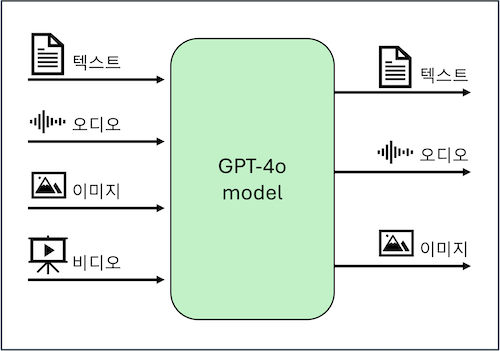

## Native한 multi-modal 생성 모델
[MM-LLMs: Recent Advances in MultiModal Large Language Models](https://arxiv.org/pdf/2401.13601)과 [A Survey on Multimodal Large Language Models](https://arxiv.org/pdf/2306.13549)에 따르면 일반적인 Multimodal model의 구조는 다음과 같습니다.
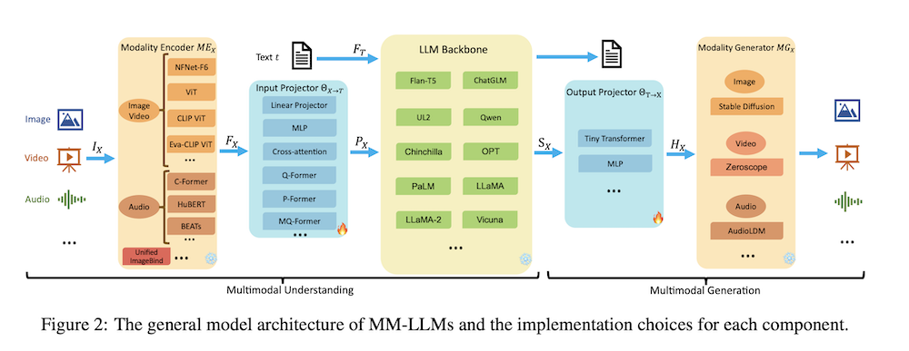
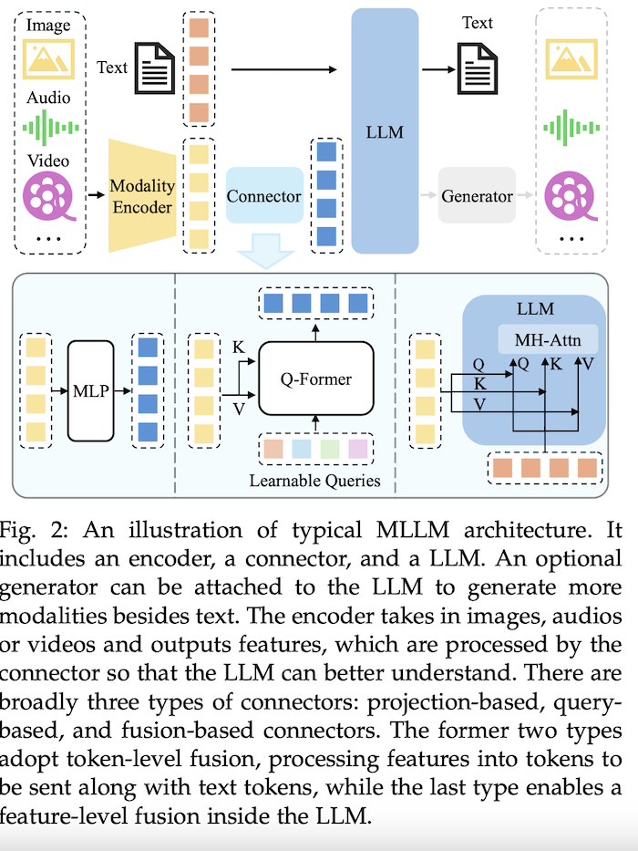
이 중에서 우리는 Multimodal 생성에 대해 집중해보겠습니다.

과거의 일반적인 멀티모달 이미지 생성은 LLM backbone에서 출력된 시그널(이미지)용 special token, 다시 말하면 output 시그널인 $S_x$이고, signal token representation을 위해 이 $S_x$를 output projection 레이어 $\Theta_{T \to X} (S_X)$에서 처리해서 $H_X$를 출력합니다. 그리고 이 $H_X$는 DALL-E3 같은 Modality Generator에 입력이 되고 이를 통해 이미지가 출력되게 됩니다.

이때 $H_X$는 Modality Generator가 가지고 있어야 하는 textual conditional encoder $\tau_X(t)$의 인코딩 결과와 유사하게 만들어집니다. 그 이유는 output projector가 textual conditional encoder를 아래와 같이 흉내 내도록 학습하기 때문입니다.
$$ \underset{\Theta_{T \to X}}{\arg\min} \mathcal{L}_{\text{mse}}(H_X, \tau_X(t)) $$
이 말은 LLM이 직접 image representation을 출력하는 것이 아니라 text representation 정도 출력한 것에 지나지 않습니다.

그래서...
이걸 native하다고 할 수 있느냐에 큰 의문이 있습니다. 결국 이게 GPT-4 같은 LLM에 DALL-E3 같은 이미지 생성 모델을 output projector라는 접착제로 붙인 것에 불과하기 때문입니다.

그렇다면 native한 multimodal 생성은 무엇을 의미하는 것일까요? 저는 이렇게 생각합니다. LLM(transformer)에서 직접 픽셀을 출력하든([Image Transformer](https://arxiv.org/pdf/1802.05751)) 이미지 쪼가리(patch)를 출력하든, 해당 이미지를 직접 출력할 수 있거나 적어도 바로 이미지나 image patch로 decoding될 수 있는 형태의 image representation 토큰이 바로 출력되어야 native라고 볼 수 있지 않겠습니까?

이를테면 [JetFormer](https://arxiv.org/pdf/2411.19722)의 경우 normalizing flow를 통해 image로 변환이 가능한 soft token을 transformer 레벨에서 직접 출력합니다.
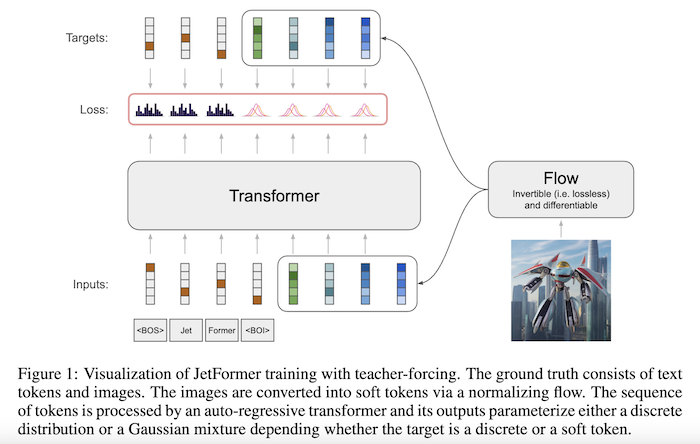

Meta의 [Chameleon](https://arxiv.org/pdf/2405.09818)의 경우 VQ-VAE의 디코더를 이용해서 이미지 patch로 변환 가능한 이미지 토큰을 transformer 레벨에서 직접 출력합니다.
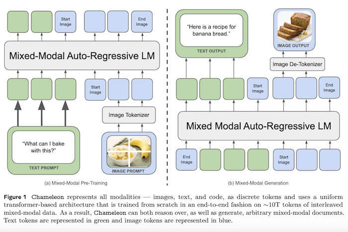

위 두 모델의 아키텍처는 GPT-4o의 아키텍처 구현 방식의 실마리가 될 수 있는 후보군들입니다. 또한, 이 두 모델뿐만 아니라, 여러 후보군들이 있을 수 있습니다.

## Autoregressive 생성 모델
사실 GPT 시리즈의 경우 native 생성이 가능하다면 이 Autoregressive 생성 부분은 따라오는 형태입니다. GPT는 transformer의 디코더만 있는 구조이고 이는 토큰을 Autoregressive하게 생성하여 텍스트를 생성하기 때문입니다.

그러면 Autoregressive하게 생성한다는 말은 어떤 뜻일까요?
autoregressive model을 사전에서 찾아보면 다음과 같이 적혀있습니다.
> 통계, 계량경제학, 신호 처리에서 자기회귀(AR) 모델은 일종의 무작위 과정을 표현한 것입니다. 따라서 자연, 경제, 행동 등에서 특정 시간에 따라 변하는 과정을 설명하는 데 사용할 수 있습니다. 자기회귀 모델은 출력 변수가 이전 값과 확률적 항(완전히 예측할 수 없는 항)에 선형적으로 종속된다는 것을 지정합니다. 따라서 이 모델은 확률적 차분 방정식(또는 재귀 관계)의 형태이며, 미분 방정식과 혼동해서는 안 됩니다.

와...무슨 말인지 하나도 못 알아먹겠습니다. 이걸 간단히 설명하면 과거의 값들로 현재를 예측하는 모델을 총칭하는 표현입니다. 그러니까 기영이 매매법 같은 것들도 어떻게 보면 뇌피셜에 입각한 Autoregressive model입니다.
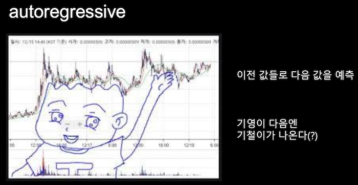
autoregressive model의 재미있는 점은 현재 예측한 이 값도 과거의 값이 되어서 다음 예측값의 input으로 사용된다는 점입니다.

이미지를 autoregressive하게 생성한다는 것은 모델이 내가 지금 뭘 그리고 있는지 보면서 그리는 것과 비슷합니다. 이것이 diffusion 방식의 생성과 가장 차이가 나는 부분입니다.

우리 쮐민이(gemini2.5 pro)가 비교해준 autoregressive model과 Diffusion Model의 주요 차이입니다.

|특징 | 확산 모델 (Diffusion Models) | 자기회귀 모델 (Autoregressive Models) |
|---|---|---|
|기본 메커니즘 | 반복적 노이즈 제거 (Iterative Denoising)  | 순차적 토큰 예측 (Sequential Token Prediction) |
|주요 아키텍처 | U-Net , DiT , LDM  | Transformer (Encoder-Decoder or Decoder-Only) |
|이미지 표현 | 픽셀 공간 또는 연속적 잠재 공간  | 이산적 이미지 토큰 (VQGAN 등)  또는 연속적 토큰 |
|생성 방식 | 병렬적 (전체 이미지 또는 잠재 공간 대상) / 반복적 [User Query Point 1a] | 순차적 (픽셀 또는 토큰 단위) [User Query Point 2a] |
|추론 속도 | 느림 (수백~수천 단계) , 가속화 기법(DDIM, DPM-Solver, Distillation 등)으로 개선 가능  | 매우 느림 (래스터 스캔) [User Query Point 2c], 병렬 디코딩(MaskGIT 등)으로 개선 가능 |
|이미지 품질/사실성 | 최첨단, GAN 능가  | 과거에는 부족했으나, 최근 대규모 모델(Parti 등)은 확산 모델에 필적 |
|다양성/모드 커버리지 | 우수, 모드 붕괴 적음  | 양호 (이론적으로 우수할 수 있으나, 학습/생성 방식에 따라 제한될 수 있음) |
|학습 안정성 | 비교적 안정적  | 안정적 (표준적인 시퀀스 모델 학습) |
|세부 제어 (Native) | 객체 수, 위치 등 제어 어려움  | 잠재적으로 구성성/세부 제어 용이성 (순차 생성) [User Query Point 2b], 전역적 일관성은 어려움 [User Query Point 2c] |
|멀티모달 제어 | ControlNet/T2I-Adapter 등으로 다양한 공간/구조적 제어 용이  | ControlAR 등 연구 중 , 확산 모델만큼 성숙하지 않음 |
|LMM 관점: 아키텍처 | LMM(AR)과 이질적, 통합/공동 학습 어려움 | LMM(AR)과 유사, 통합/공동 학습 용이 |
|LMM 관점: 텍스트 이해 | 강력한 LLM 텍스트 인코더 활용 가능  | LLM 능력(인코더+디코더) 직접 활용 가능성 |
|LMM 관점: 제어 통합 | 다양한 멀티모달 제어 신호 통합 용이 (ControlNet 등)  | 텍스트 외 공간/구조적 제어 통합은 아직 연구 단계 |

아래는 쮐민이(gemini2.5 pro)가 비교해준 autoregressive model과 Diffusion Model의 Artifacts 특성입니다.

|아티팩트 범주 | 확산 모델 | 자기 회귀 모델 |
|---|---|---|
|구조적 무결성 및 전역적 일관성 | 전반적으로 양호하나, "돌연변이" 단계  또는 "모드 보간" 으로 인해 국소적 구조 붕괴 또는 비현실적 병합  발생 가능. | 긴 시퀀스/큰 이미지에서 전역적 구조 유지에 어려움. 래스터 스캔으로 인한 "구조적 저하". |
|텍스처 충실도 및 미세 세부 사항 | 고품질 텍스처 가능하나, 국소적 텍스처 불규칙성  또는 "스타일 아티팩트" (예: 밀랍 피부 ) 발생 가능. | VQ 양자화 오류로 인한 흐림, 블록 현상, 세부 사항 손실. 반복적인 패턴으로 인한 단조로운 텍스처. |
|의미론적 타당성 및 객체 정확성 | "환각" (예: 여분의 팔다리 ), 불가능한 객체 구성, 의미론적 비일관성 에 취약. | 주로 장거리 문맥적 비일관성으로 인해 발생. 객체 자체의 형태보다는 객체 간의 관계나 전역적 의미 파악에 어려움. |
|해부학적/물리적 타당성 | 해부학적 비현실성 (예: 잘못된 손가락 ), 물리 법칙 위반 (예: 일관성 없는 그림자 ) 빈번. | 주로 전역적 구조 문제의 일부로 나타나며, 특정 해부학적 디테일 오류보다는 전체적인 형태나 비율의 어색함으로 표현될 수 있음. |
|반복성 및 단조로움 | 덜 일반적이나, 특정 조건에서 텍스처 패턴 반복 가능성 존재. | 주요 약점 중 하나. 동일 토큰 시퀀스 반복 으로 인한 단조로운 출력. |
|시퀀스/공간에 걸친 문맥적 일관성 | 전역적 문맥은 비교적 잘 유지되나, 국소적 세부 사항이 전역적 맥락과 어긋날 수 있음. | 장거리 의존성 유지에 큰 어려움. 시퀀스/이미지 후반부로 갈수록 초기 문맥과의 일관성 저하. |
|오류 전파 효과 | 직접적인 오류 전파는 적으나, "돌연변이" 단계의 불안정성이 후속 정제에 영향. | 주요 문제점. 초기 오류가 누적되어 연쇄적인 실패 유발. |
|양자화 효과 | 직접적인 VQ 단계 없음. (잠재 공간 확산 모델의 경우 VAE 인코더/디코더의 영향은 있을 수 있음) | VQ-VAE 사용 시 정보 손실로 인한 흐림, 블록 현상, 세부 사항 손실이 주요 아티팩트 원인. 코드북 크기와 예측 복잡성 간의 트레이드오프. |

## 후보군을 추려봅시다
제가 이 후보군 모델들을 일일이 다 서치해서 다 보고 있으면, 블로그 포스팅이 아니라 논문을 써야 할지도 모르기 때문에 다시 한번 우리 쮐민이의 딥서치 모드를 사용해보도록 하겠습니다.

우선 native와 autoregressive라는 두 가지 단서를 이용해서 모델을 추려봅니다.

> 5. LLM 네이티브 자기회귀 이미지 생성 모델 조사
> GPT-4o의 이미지 생성 원리를 추론하기 위해, LLM 네이티브 아키텍처를 가지며 자기회귀적으로 이미지를 생성하는 최근 연구 모델들을 분석하는 것은 매우 중요하다. 이들 모델은 GPT-4o가 채택했을 가능성이 있는 기술적 접근 방식에 대한 통찰력을 제공한다.
>
>> 5.1. 카테고리 1: 고급 토큰화를 사용하는 통합 디코더-온리 아키텍처
>> 이 카테고리의 모델들은 강력한 LLM(주로 디코더-온리 트랜스포머)을 기반으로 하며, 텍스트와 이미지를 통합된 방식으로 처리하고, 특히 이미지 표현을 위한 혁신적인 토큰화 전략을 사용한다.
>>
>>> 5.1.1. JetFormer
>>> 아키텍처: 디코더-온리 트랜스포머.
>>> 토큰화: 사전 학습된 이미지 토큰화기 없이, 정규화 흐름(normalizing flow) 모델을 (공동으로 학습하여) 사용하여 "소프트한" 연속 이미지 토큰을 얻는다. 원시 픽셀과 텍스트에 대해 종단 간 학습을 수행한다.
>>> 텍스트-이미지 융합: 텍스트와 소프트 이미지 토큰이 자기회귀 트랜스포머에 의해 공동으로 처리된다.
>>> 생성: 소프트 이미지 임베딩을 위한 가우시안 혼합 모델(GMM)의 매개변수를 자기회귀적으로 예측한다.
>>> GPT-4o와의 관련성: 높음. "디코더-온리", "자기회귀적", "공동 학습"(네이티브함을 의미)이라는 특징과 연속적/소프트 토큰 사용은 고품질 이미지 생성을 위한 강력한 후보다. "텍스트와 원시 픽셀을 공동으로 모델링하기 위해 처음부터 학습"되었다는 점은 깊은 통합을 시사한다.
>>
>>> 5.1.2. UniFluid
>>> 아키텍처: 사전 학습된 LLM(Gemma) 기반의 통합 자기회귀 프레임워크. 디코더-온리.
>>> 토큰화: 이미지 생성을 위한 연속적인 시각 토큰(Fluid의 연속 VAE 토큰화기와 유사) 및 이산적인 텍스트 토큰을 사용한다. 이미지 이해를 위한 접두사(prefix)로 SigLIP 인코더를 사용한다.
>>> 텍스트-이미지 융합: 텍스트와 연속적인 시각 토큰이 동일한 공간에 임베딩되어 LLM에 의해 처리된다.
>>> 생성: 이산적인 텍스트 토큰과 연속적인 이미지 토큰을 자기회귀적으로 생성한다. 모달리티별 예측 헤드(이미지용 확산 기반 헤드, 텍스트용 교차 엔트로피 헤드)를 사용한다.
>>> GPT-4o와의 관련성: 높음. "통합 자기회귀 아키텍처", "연속적인 시각 토큰", 강력한 LLM 백본 활용. 연속 토큰을 위한 확산 헤드 사용은 GMM의 흥미로운 대안이다.
>>
>>> 5.1.3. UniToken
>>> 아키텍처: 자기회귀 생성 모델, Chameleon(LLM)을 기반으로 한다.
>>> 토큰화: 이산적(Chameleon의 VQ-Tokenizer와 유사) 토큰과 연속적(SigLIP ViT에서 추출) 토큰을 모두 사용하는 통합 시각 인코딩.
>>> 텍스트-이미지 융합: 텍스트 토큰과 통합된(이산적 + 연속적) 시각 토큰이 LLM에 입력된다.
>>> 생성: LLM이 이미지(이산적) 또는 텍스트에 해당하는 출력 토큰을 생성한다.
>>> GPT-4o와의 관련성: 중간-높음. "자기회귀적", LLM 기반, 통합 표현. 하이브리드 토큰화는 새로운 접근 방식이다. GPT-4o가 "토큰"을 사용한다면, 이는 이산적 측면과 연속적 측면을 결합하는 경로를 보여준다.
>>
>>> 5.1.4. SimpleAR
>>> 아키텍처: 디코더-온리 트랜스포머.
>>> 토큰화: 사전 학습된 시각 토큰화기(이산 토큰)와 텍스트 토큰화기를 사용한다.
>>> 텍스트-이미지 융합: 텍스트와 이미지 토큰의 공동 분포를 자기회귀적으로 모델링한다.
>>> 생성: 표준적인 다음 토큰 예측. LLM 초기화의 효과를 조사한다.
>>> GPT-4o와의 관련성: 중간-높음. "디코더-온리", "자기회귀적", "공동 분포". 이산 토큰 사용은 "LLM 네이티브"가 되는 직접적인 방법이다. 단순성이 명시된 목표 중 하나이다.
>>
>>> 5.1.5. CM3Leon
>>> 아키텍처: 디코더-온리 트랜스포머.
>>> 토큰화: 사용자 정의 텍스트 토큰화기와 이미지 토큰화기(256x256 이미지를 1024개의 이산 토큰으로 인코딩)를 사용한다.
>>> 텍스트-이미지 융합: 모달리티 전환을 나타내기 위해 <break> 토큰을 사용한다. 검색 증강 사전 학습(retrieval augmented pretraining)을 활용한다.
>>> 생성: 자기회귀적이며, 텍스트와 이미지를 모두 생성한다.
>>> GPT-4o와의 관련성: 중간. "디코더-온리", "자기회귀적", 공동 텍스트-이미지 생성. 이산 토큰 사용. 검색 증강은 지식 활용에 강력한 추가 기능이다.
>
>> 5.2. 카테고리 2: 새로운 자기회귀 예측 전략을 사용하는 모델
>> 이 카테고리의 모델들은 표준적인 래스터 스캔(raster-scan) 방식의 다음 토큰 예측을 넘어, 이미지의 구조적 특성이나 생성 효율성을 고려한 새로운 자기회귀적 예측 순서나 방식을 제안한다.
>>
>>> 5.2.1. CART (Compositional Auto-Regressive Transformer)
>>> 전략: "다음 디테일 예측(next-detail prediction)". 기본 이미지를 생성한 후 계층적으로 더 미세한 디테일을 반복적으로 추가한다(기본 이미지 요인 다음 디테일 요인).
>>> GPT-4o와의 관련성: 낮음-중간. 자기회귀적이지만, 구성적인 "다음 디테일"은 특정 전략이다. GPT-4o의 설명은 더 일반적이다. 그러나 이러한 구성적 접근 방식은 일관성을 향상시킬 수 있다.
>>
>>> 5.2.2. NFIG / 주파수 점진적 AR (Frequency-Progressive AR)
>>> 전략: "다음 주파수 예측(next-frequency prediction)". 저주파수 구성 요소를 먼저 생성한 다음 점진적으로 고주파수 구성 요소를 생성한다. FR-VAE 토큰화기를 사용한다.
>>> GPT-4o와의 관련성: 낮음-중간. 또 다른 특화된 AR 전략이다. 효율성과 구조적 일관성을 제공할 수 있다. 이 FAR(주파수 점진적 자기회귀) 맥락에서 연속 토큰화기도 논의한다.
>>
>>> 5.2.3. ARPG (Autoregressive Parallel Generation)
>>> 전략: 안내 디코딩 프레임워크(guided decoding framework)를 사용한 무작위 병렬 디코딩. 위치 안내(positional guidance)와 콘텐츠 표현을 분리한다.
>>> GPT-4o와의 관련성: 낮음-중간. 엄격한 래스터 스캔을 깨고 효율성과 제로샷 일반화(인페인팅/아웃페인팅)에 중점을 둔다. GPT-4o는 "업로드된 이미지 변환"을 언급하는데, ARPG가 이를 용이하게 할 수 있다.
>>
>>> 5.2.4. FAR (Fast Autoregressive Models for Continuous Latent Generation)
>>> 전략: MAR의 확산 헤드를 경량의 지름길 헤드(shortcut head)로 대체하여 연속 잠재 토큰의 몇 단계 샘플링을 가능하게 한다. 인과적 트랜스포머와 통합된다.
>>> GPT-4o와의 관련성: 중간. GPT-4o가 연속 토큰을 사용한다면, FAR은 효율적인 생성 메커니즘을 제공한다. "아키텍처 수정 없이 이산 토큰 생성에서 연속 토큰 생성으로 확장"한다는 점은 LLM 네이티브 접근 방식에 매력적이다.
>
>> 5.3. 카테고리 3: 확립된 대규모 자기회귀 모델
>> 이 카테고리는 이미 상당한 규모로 구현되어 성능이 입증된 자기회귀 텍스트-이미지 생성 모델을 포함한다.
>>
>>> 5.3.1. Parti (Pathways Autoregressive Text-to-Image model)
>>> 아키텍처: 인코더-디코더 트랜스포머.
>>> 토큰화: 이산 이미지 토큰을 위한 ViT-VQGAN.
>>> 텍스트-이미지 융합: 텍스트-이미지 변환을 시퀀스-투-시퀀스 문제로 취급한다.
>>> 생성: 텍스트 프롬프트 인코딩으로부터 이미지 토큰을 자기회귀적으로 예측한다.
>>> GPT-4o와의 관련성: 중간. "자기회귀적"이며 입증된 확장성을 가졌다. 그러나 인코더-디코더는 "GPT" 모델에는 덜 적합해 보인다. 이산 토큰을 사용한다. 대규모 자기회귀 T2I의 강력한 기준선 역할을 한다.
>
> 이러한 고급 모델들을 살펴보면, 이산적 시각 토큰과 연속적/소프트 시각 토큰 사이의 근본적인 선택이 여전히 주요 변동 축으로 남아 있음을 알 수 있다. SimpleAR, CM3Leon, Parti는 기존의 VQ-VAE/VQGAN 기술을 활용하여 이산 토큰을 고수하는 반면, JetFormer, UniFluid, FAR은 양자화 손실을 피함으로써 더 높은 충실도를 목표로 연속 토큰 방법을 개척하거나 채택한다. UniToken은 하이브리드를 시도한다. GPT-4o의 "네이티브 임베딩" 특성은 LLM의 기존 아키텍처와 가장 원활하게 통합되는 접근 방식을 선호할 수 있다. 만약 LLM이 근본적으로 이산 토큰 기반이라면 매우 효율적이고 충실도 높은 이산 시각 토큰화기가 필요할 것이다. 만약 LLM이 UniFluid가 특정 헤드를 통해 제안하는 것처럼 이산적인 것과 함께 연속적인 입력/출력을 처리하도록 조정되거나 설계될 수 있다면, 연속 토큰이 더 실행 가능해진다.
>
> JetFormer(완전한 종단 간 학습)와 UniFluid/SimpleAR(사전 학습된 LLM 활용 및 비전 구성 요소 미세 조정/공동 학습)과 같은 모델은 강력한 통합 시스템으로 가는 두 가지 경로를 보여준다. GPT-4의 진화형인 GPT-4o는 방대한 사전 학습된 LLM 기반을 활용하고 이를 네이티브 이미지 생성을 위해 조정/확장하는 경로를 따를 가능성이 높다. 이는 이미지 생성 구성 요소가 매우 초기 단계부터 LLM과 함께 공동으로 학습되거나 LLM의 표현 및 처리 흐름과 극도로 긴밀하게 통합되도록 설계되었음을 시사한다. "온라인 이미지와 텍스트의 공동 분포에 대한 옴니모달 학습"은 이러한 깊은 통합을 뒷받침한다.

이를 테이블로 표현하면 다음과 같습니다.

| 특징                     | GPT-4o (목표 프로파일)                       | JetFormer                  | UniFluid                      | UniToken                      | SimpleAR                     | CM3Leon                        | Parti                         |
| :----------------------- | :------------------------------------------- | :------------------------- | :---------------------------- | :---------------------------- | :---------------------------- | :---------------------------- | :---------------------------- |
| 핵심 LLM 아키텍처          | 디코더-온리 가능성 높음                         | 디코더-온리                | 디코더-온리 (Gemma 기반)      | 디코더-온리 (Chameleon 기반)  | 디코더-온리                   | 디코더-온리                   | 인코더-디코더                 |
| 이미지 토큰화 전략         | 불명확 (토큰 기반)                             | 연속적 (정규화 흐름)         | 연속적 (VAE 기반, Fluid)      | 하이브리드 (이산적 VQ + 연속적 SigLIP) | 이산적 (사전 학습된 시각 토큰화기) | 이산적 (사용자 정의 이미지 토큰화기) | 이산적 (ViT-VQGAN)            |
| 시각 토큰의 본질           | 불명확                                       | 소프트/연속 벡터           | 연속 벡터                     | 이산 ID + 연속 벡터           | 이산 ID                       | 이산 ID                       | 이산 ID                       |
| 텍스트-이미지 데이터 처리    | 통합 시퀀스 또는 긴밀한 융합 예상                | 통합 시퀀스 (텍스트 + 소프트 이미지 토큰) | 통합 시퀀스 (동일 공간 임베딩)    | 통합 시퀀스 (텍스트 + 통합 시각 토큰) | 통합 시퀀스 (공동 분포 모델링)    | 통합 시퀀스 (<break> 토큰 사용) | 시퀀스-투-시퀀스              |
| 자기회귀 생성 위치         | 주 LLM 디코더 내 예상                           | 주 LLM 디코더                | 주 LLM 디코더 (모달리티별 예측 헤드) | 주 LLM 디코더                   | 주 LLM 디코더                   | 주 LLM 디코더                   | 디코더                        |
| 종단 간 학습 (원시 텍스트 & 이미지) | "공동 분포 학습"으로 미루어 보아 가능성 높음 | 예 (처음부터)              | 부분적 (사전 학습된 LLM 활용)   | 부분적 (Chameleon 기반 활용)  | 부분적 (사전 학습된 토큰화기, LLM 초기화) | 부분적 (사전 학습된 토큰화기)   | 아니요 (별도 학습된 ViT-VQGAN) |
| GPT-4o의 "네이티브 & 자기회귀" 부합도 | 해당 (정의에 따름)                             | 높음 (디코더-온리, 자기회귀, 공동 학습, 연속 토큰) | 높음 (통합 자기회귀, 연속 토큰, LLM 백본) | 중간-높음 (자기회귀, LLM 기반, 하이브리드 토큰) | 중간-높음 (디코더-온리, 자기회귀, 이산 토큰) | 중간 (디코더-온리, 자기회귀, 이산 토큰) | 중간 (자기회귀, 대규모, 이산 토큰, 단 인코더-디코더) |
| 사진 현실성 & 복잡한 지시 사항 잠재력 | 높음 (OpenAI 주장)                             | 높음 (연속 토큰, 종단 간 학습)   | 높음 (연속 토큰, 확산 헤드)     | 중간-높음 (하이브리드 접근)     | 중간 (이산 토큰의 한계 가능성)    | 중간 (이산 토큰의 한계 가능성)    | 중간-높음 (대규모 모델, 입증된 성능) |

## GPT-4o와 유사한 핵심 아키텍처 패턴 식별
위의 후보군들에 대한 비교와 이전 섹션들의 논의를 통해 몇 가지 핵심적인 아키텍처 패턴이 GPT-4o의 특성과 부합한다는 것을 어렴풋하게 추측할 수 있습니다.
-   패턴 1: 통합된 디코더-온리 트랜스포머:
    JetFormer, UniFluid, SimpleAR, CM3Leon과 같은 모델이 범인(?)에 가깝다는 강력한 증거입니다. 이는 GPT 계열의 특징 및 "네이티브 임베딩"이라는 설명과도 잘 부합합니다.
-   패턴 2: 고품질 이미지 생성을 위한 고급 토큰화:
    -   만약 "token-based"가 연속적/소프트 토큰을 의미한다면:
        JetFormer(normalizing flow), UniFluid(continuous VAE + diffusion head), FAR(효율적인 continuous token)이 매우 관련성이 높습니다. 이 가설이 photorealistic 달성 및 미세한 디테일 처리에 더 유망해 보이며, 연속 토큰의 이점에 대한 논의와도 일치합니다.
    -   만약 "token-based"가 고도로 최적화된 이산 토큰을 의미한다면:
        SimpleAR이나 CM3Leon의 접근 방식과 유사하되, 표준 VQGAN보다 훨씬 발전된 visual tokenizer(예: 개선된 ViT-VQGAN 또는 TiTok과 같이 더 압축적인 1D 표현이지만 훨씬 높은 Fidelity(충실도)를 가진 새로운 이산 방식)를 사용할 것입니다.
-   패턴 3: 공동 멀티모달 학습:
    GPT-4o는 "온라인 이미지와 텍스트의 공동 분포에 대해 학습"되었다고 명시되어 있습니다. 이 패턴으로 보아 종단 간 학습을 수행하는 모델(JetFormer)이나 초기 학습 단계부터 모달리티를 깊이 통합하는 모델(UniFluid, LLM 기반 SimpleAR)이 GPT-4o의 방향과 더 부합합니다.

## GPT-4o 이미지 생성기의 핵심 원리 가설
image representation Token based 생성에는 두 가지 가능한 방식이 있습니다. 첫째는 연속/소프트 토큰을 사용하는 방식이고, 두 번째는 최적화된 이산 토큰을 사용하는 방식입니다.
-   가설 A. 연속/소프트 토큰 사용 :
    GPT-4o는 매우 큰 디코더-온리 트랜스포머이며, 텍스트 토큰과 함께 (이미지 패치나 특징을 나타내는) 연속적인 시각 토큰 시퀀스를 자기회귀적으로 생성합니다.
-   가설 B. 최적화된 이산 토큰 사용 :
    GPT-4o는 (ViT-VQGAN의 발전된 형태, 아마도 Parti와 유사하거나 TiTok처럼 더 압축적인 1D 표현이지만 훨씬 높은 Fidelity를 가진) 매우 발전된 이산 visual tokenizer를 사용하여 이산적인 시각 토큰 시퀀스를 생성합니다.

## 그래서 범인은?
여기서부터 뇌피셜의 영역인데 GPT-4o가 주장하는 "사진과 같은 결과물(photorealistic output)"과 손, 얼굴과 같은 미세한 디테일을 잘 렌더링하는 것은 사실 이산 토큰보다는 연속 토큰에 좀 더 유리한 태스크이지 않나 싶습니다. 만약 이산 토큰을 사용한다면 현재의 모든 모델을 뛰어넘을 수 있는 압도적인 Fidelity를 가지도록 해야 하는데 사실 이게 가능할까 싶긴 합니다.

사실 리서치를 하기 전까지는 Meta의 Chameleon 형태의 아키텍처가 가장 근접한 구조가 아닐까 생각했는데, 지금은 소프트 토큰 기반의 모델인 JetFormer와 유사한 방식이 아닐까 추측해봅니다.

그런데 UniFluid의 diffusion head 방식을 보며, 갑자기 머릿속을 스쳐 지나가는 생각이 있습니다. 작년 10월에 OpenAI는 단 2단계만으로 고품질 샘플을 생성할 수 있는 새로운 유형의 연속 시간 일관성 모델 ‘sCM’에 대한 논문을 [아카이브에 게재](https://arxiv.org/pdf/2410.11081)합니다. UniFluid의 diffusion head를 sCM으로 대체하면 어떻게 될까라는 생각을 하게 됩니다.
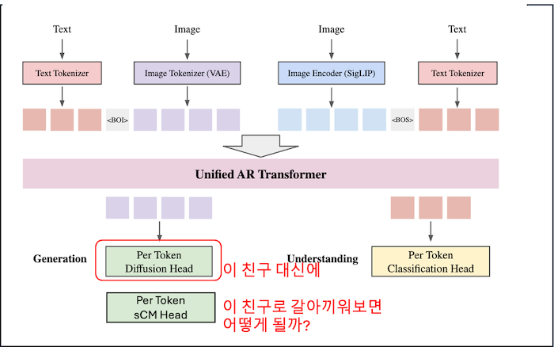
그런데 또 이렇게 하면 natively에서 좀 멀어지긴 하는 것 같습니다.

## 나가며
GPT-4o의 이미지 생성 기능은 네이티브(native)하며 자기회귀적(autoregressive)이라는 점에서, LLM이 시각적 콘텐츠를 인식하고, 추론하며, 창조하는 방식에 있어 중대한 아키텍처적 도약을 나타낼 가능성이 높습니다. 그리고 향후 멀티모달 AI 연구 및 개발에 중요한 방향성을 제시한 것도 맞습니다. 정확한 내부 메커니즘은 공개되지 않았기에 여러 곳에서 이를 추측하는 논의가 이뤄지고 있습니다.
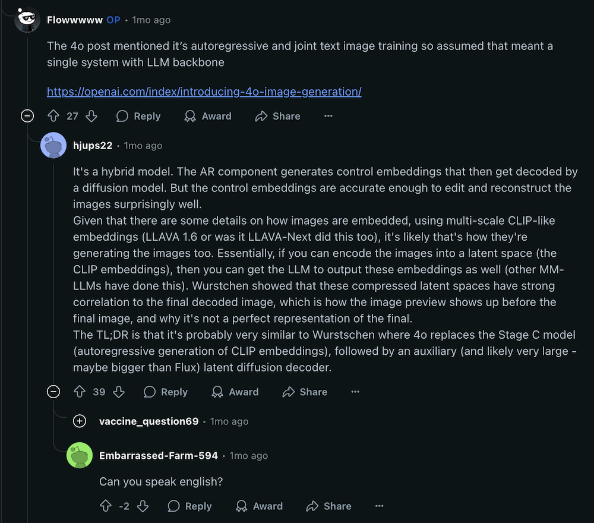
*여러분의 의견도 댓글로 받습니다*

사실 아키텍처에 대한 정확한 정보가 없긴 하지만 몇 가지 단서를 통한 추리와 멀티모달에 대한 깊은 고찰을 모두 한다면 멀티모달 AI 연구와 개발에 중요한 밑거름이 되지 않나 싶습니다.

